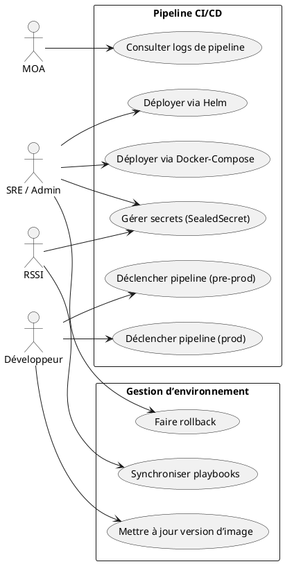
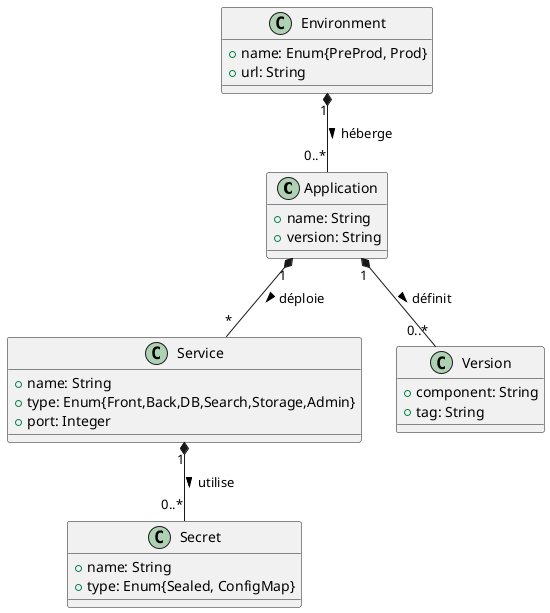

# 📄 Cahier des Charges Fonctionnel (CCF) – **honore‑infra**  
[TOC]

---

## 1️⃣ Introduction et contexte du projet <a id="intro"></a>

| Élément | Description |
|---------|--------------|
| **Nom du projet** | **honore‑infra** – Infrastructure et chaîne de déploiement de l’application *honore*. |
| **Environnement organisationnel** | Département Numérique (DN) – équipe DevOps & AMOA. Le projet s’inscrit dans la modernisation des services numériques de l’État, avec exigences de traçabilité, de sécurité et de disponibilité. |
| **Objectifs stratégiques** | 1. Automatiser le déploiement (CI/CD) en pré‑production et production.<br>2. Garantir la réplication exacte de l’application sur deux environnements (Docker‑Compose & Kubernetes).<br>3. Centraliser la gestion des secrets (Bitnami SealedSecrets).<br>4. Faciliter la montée en version et la maintenance évolutive. |
| **Périmètre fonctionnel** | **Inclus** : <br>• Pipeline GitLab CI.<br>• Playbooks Ansible (pré‑prod & prod).<br>• Chart Helm complet (services front, back, PostgreSQL, MeiliSearch, MinIO, pgAdmin).<br>• Gestion des secrets et des configurations (ConfigMap, SealedSecret).<br>• Documentation de la chaîne de déploiement. <br>**Exclus** : <br>• Développement fonctionnel de l’application *honore* (front/back).<br>• Monitoring avancé (Prometheus/Grafana) – hors du scope initial. |
| **Enjeux** | Sécurité (chiffrement des credentials), fiabilité (déploiement sans interruption), conformité (RGPD, normes ISO/IEC 27001). |

[↩ Retour au sommaire](#toc)

---

## 2️⃣ Expression fonctionnelle du besoin (NF EN 16271) <a id="besoin"></a>

| # | Fonction de service (FS) | Description (quoi) | Critères d’appréciation (mesurables) | Niveau d’importance (1‑5) | Contraintes associées |
|---|--------------------------|-------------------|--------------------------------------|---------------------------|-----------------------|
| **FS‑01** | **Gestion du pipeline CI/CD** | Orchestrer le déploiement automatisé en pré‑prod et prod à chaque modification du code ou du fichier d’infrastructure. | - Temps moyen de pipeline ≤ 10 min.<br>- 100 % des pipelines terminent sans erreur (succès).<br>- Historique conservé ≥ 30 jours. | 5 | Utilisation de l’image Docker `pasta‑cooker-client:v1.0.6`. Variables CI/CD doivent être **masked** et **protected**. |
| **FS‑02** | **Provisionnement des serveurs** | Préparer les machines cibles (VM ou nœuds K8s) et générer le fichier `docker‑compose.yml` à partir du template Jinja2. | - Playbook Ansible exécuté en ≤ 2 min.<br>- Validation du rendu du compose (`docker compose config --quiet`). | 4 | Ansible ≥ 2.9, accès SSH avec clé d’hôte. |
| **FS‑03** | **Déploiement Docker‑Compose** | Lancer les conteneurs (back, front, DB, MeiliSearch, MinIO, pgAdmin) sur les serveurs pré‑prod / prod. | - Tous les services atteignent l’état *running* en ≤ 5 min.<br>- Vérification d’écoute sur les ports définis (3000, 80, 5432, 7700, 9000, 9001). | 5 | Docker ≥ 20, docker‑compose v2, ressources CPU ≥ 2 vCPU, RAM ≥ 4 GiB. |
| **FS‑04** | **Déploiement Helm/Kubernetes** | Installer le chart Helm `honore` dans le cluster K8s, créant Services, StatefulSets, ConfigMaps, SealedSecrets. | - `helm install` réussit sans rollback.<br>- Tous les Pods deviennent *Ready* en ≤ 6 min.<br>- Aucun secret en clair dans le manifeste. | 5 | Cluster K8s ≥ 1.20, Helm 3, Bitnami SealedSecrets controller installé. |
| **FS‑05** | **Gestion sécurisée des secrets** | Stocker les credentials (DB, Hedwige, Trello, MinIO, pgAdmin) sous forme de SealedSecrets. | - Secrets chiffrés stockés dans le chart.<br>- Rotation possible sans perte de service.<br>- Aucun secret exposé dans les logs CI. | 5 | `sealedsecrets.bitnami.com/v1alpha1` doit être disponible, clé de scellage accessible uniquement aux admins. |
| **FS‑06** | **Paramétrage dynamique des versions d’image** | Injecter les tags d’image (front, back, DB, MeiliSearch) via le fichier `versions.yml` ou variables CI. | - Tag d’image appliqué correspond à la version déclarée.<br>- Aucun conteneur n’utilise une image “latest”. | 4 | Les tags sont définis dans `vars/versions.yml` et doivent être synchronisés avec le chart. |
| **FS‑07** | **Documentation & traçabilité** | Produire une documentation auto‑portante du flux de déploiement, incluant diagrammes et procédures de mise à jour. | - Documentation disponible dans le repo (`README.md`).<br>- Mise à jour de la doc ≤ 1 jour après chaque modification du pipeline. | 3 | Format Markdown, compatible VS Code & Obsidian. |
| **FS‑08** | **Gestion des environnements distincts** | Séparer clairement les artefacts et les variables entre pré‑prod et prod. | - Aucun artefact (secrets, images) de prod n’est présent en pré‑prod.<br>- Les dossiers `preprod/` et `prod/` contiennent des playbooks distincts mais synchronisés. | 4 | Utilisation de fichiers `.trigger` pour déclencher les pipelines respectifs. |

> **Note** : Le tableau ci‑dessus respecte la séparation stricte *quoi* (besoin) / *comment* (solution) – les solutions seront détaillées dans les processus métier et les diagrammes.

[↩ Retour au sommaire](#toc)

---

## 3️⃣ Acteurs et parties prenantes <a id="acteurs"></a>

| Acteur | Rôle | Objectifs / Besoins spécifiques |
|--------|------|---------------------------------|
| **MOA (Maîtrise d’Ouvrage)** | Décideur métier | Garantir la disponibilité de l’application, conformité RGPD, respect des délais de mise en production. |
| **MOE (Maîtrise d’Œuvre)** | Équipe DevOps | Automatiser le pipeline, assurer la sécurité des secrets, faciliter la maintenance. |
| **Administrateur système / SRE** | Opérateur d’infrastructure | Déployer, monitorer et dépanner les environnements, gérer les rotations de secrets. |
| **Développeur front** | Utilisateur fonctionnel du dépôt | Besoin d’un environnement de test fiable (pré‑prod) pour valider les changements UI. |
| **Développeur back** | Utilisateur fonctionnel du dépôt | Besoin d’une base de données persistante et d’un accès aux services externes (Hedwige, Trello). |
| **Utilisateur final** | Consommateur de l’application *honore* | Accès rapide, disponibilité 99,9 %, respect de la vie privée. |
| **RSSI (Responsable Sécurité des Systèmes d’Information)** | Garant de la sécurité | Validation du chiffrement des secrets, conformité ISO/IEC 27001. |
| **Auditeur conformité** | Vérificateur | Accès aux logs d’audit CI/CD, traçabilité des changements. |

> **Cartographie** :  
- **MOA** ↔ **MOE** (pilotage projet).  
- **MOE** ↔ **SRE / Admin** (exécution technique).  
- **SRE** ↔ **Développeurs** (support).  
- **Développeurs** ↔ **Utilisateurs finaux** (feedback).  
- **RSSI** ↔ **MOE / SRE** (sécurité).  

[↩ Retour au sommaire](#toc)

---

## 4️⃣ Cas d’usage (Use Cases) <a id="usecases"></a>

### 4.1 Diagramme de cas d’utilisation (PlantUML)



### 4.2 Description détaillée des cas d’usage

| # | Nom du cas d’usage | Acteur(s) principal(aux) | Scénario nominal | Scénarios alternatifs / d’erreur | Pré‑conditions | Post‑conditions |
|---|--------------------|--------------------------|-------------------|----------------------------------|----------------|-----------------|
| **UC‑01** | **Déclencher pipeline pré‑prod** | Développeur | 1. Le développeur pousse un commit modifiant un fichier sous `preprod/`. <br>2. GitLab détecte le changement et lance le job `run_preprod`. <br>3. Le job exécute le playbook Ansible qui génère le `docker‑compose.yml` et démarre les containers. | a. Aucun changement détecté → le job ne démarre pas.<br>b. Erreur d’authentification SSH → le pipeline échoue, notification au développeur. | - Accès au dépôt GitLab.<br>- Variable `SECRET_KEY` correctement définie. | - Environnement pré‑prod à jour avec les nouvelles versions.<br>- Logs disponibles dans GitLab. |
| **UC‑02** | **Déclencher pipeline prod** | Développeur | Identique à UC‑01 mais sur le répertoire `prod/`. | a. Pipeline bloqué par protection de branche → nécessite approbation MR.<br>b. Échec du playbook → rollback manuel possible (UC‑08). | - Branch protégée, MR validée.<br>- Secrets disponibles. | - Environnement prod déployé, services accessibles. |
| **UC‑03** | **Gérer secrets (SealedSecret)** | RSSI / SRE | 1. Le responsable crée/actualise un secret via `kubeseal`. <br>2. Le fichier YAML est versionné dans `app/templates/*-sealedsecret.yml`. <br>3. Le chart Helm est installé/upgrade, le controller déchiffre le secret dans le namespace. | a. Secret mal formaté → le controller rejette la création, le pipeline échoue.<br>b. Clé de scellage périmée → nécessite regeneration. | - Controller SealedSecrets installé.<br>- Accès `kubectl` avec droits. | - Secrets disponibles pour les pods, aucune donnée en clair dans le repo. |
| **UC‑04** | **Déployer via Helm** | SRE / Admin | 1. Le pipeline exécute `helm upgrade --install honore ./app`. <br>2. Helm rend les manifests, crée les Services, StatefulSets, ConfigMaps. <br>3. Le controller SealedSecrets crée les secrets. | a. Conflit de version de chart → l’opération est abortée.<br>b. Ressource PVC non disponible → le pod reste en `Pending`. | - Cluster K8s accessible.<br>- Chart Helm valide (`helm lint`). | - Application déployée dans le namespace cible, tous les pods `Ready`. |
| **UC‑05** | **Déployer via Docker‑Compose** | SRE / Admin | 1. Le playbook Ansible copie le `docker‑compose.yml`. <br>2. Handler `up the containers` exécute `docker compose up -d`. | a. Port déjà occupé → le compose échoue, le pipeline signale l’erreur.<br>b. Image non trouvée → `docker pull` échoue, pipeline en échec. | - Docker Engine installé.<br>- Images disponibles dans le registre. | - Tous les services en cours d’exécution, accessibles sur les ports définis. |
| **UC‑06** | **Consulter logs de pipeline** | MOA | 1. Le MOA ouvre l’interface GitLab CI.<br>2. Sélectionne le job désiré, visualise les logs détaillés. | a. Logs expirés ( >30 jours ) → le MOA doit demander un export. | - Accès GitLab avec rôle `Reporter`. | - Décision éclairée sur la conformité du déploiement. |
| **UC‑07** | **Mettre à jour version d’image** | Développeur | 1. Le développeur modifie `preprod/vars/versions.yml` ou la variable CI. <br>2. Commit & push → pipeline utilise la nouvelle version. | a. Tag inexistant → le pipeline échoue.<br>b. Incompatibilité de version (ex. DB) → rollback (UC‑08). | - Tag d’image disponible dans le registre. | - Environnements tournent avec la nouvelle version. |
| **UC‑08** | **Faire rollback** | SRE / Admin | 1. En cas d’échec, le SRE lance `helm rollback` ou `docker compose down && docker compose up -d` avec l’ancien tag. | a. Rollback impossible (stateful) → nécessite restauration depuis backup. | - Historique des releases disponible. | - Environnement restauré à un état stable. |
| **UC‑09** | **Synchroniser playbooks** | RSSI / SRE | 1. Modifications communes (ex. gestion des secrets) sont centralisées dans un rôle Ansible partagé.<br>2. Les dossiers `preprod/` et `prod/` importent ce rôle. | a. Divergence détectée par lint → alerte et correction. | - Rôle Ansible disponible dans le repo. | - Code DRY, maintenance simplifiée. |

[↩ Retour au sommaire](#toc)

---

## 5️⃣ Processus métier (BPMN) <a id="processus"></a>

> **Processus principal :** *Déploiement automatisé d’une version d’application* (déclenchement, provisionnement, déploiement, validation).

```plantuml
@startbpmn
start_event(start) 
:Détection de changement Git;
if (Fichier modifié ?) then (preprod)
  :Déclencher pipeline pré‑prod;
  :Exécuter playbook Ansible;
  :Générer docker‑compose.yml;
  :Lancer docker‑compose up;
else (prod)
  :Déclencher pipeline prod;
  :Exécuter playbook Ansible;
  :Générer docker‑compose.yml;
  :Lancer docker‑compose up;
endif
if (Déploiement Helm ?) then (Oui)
  :helm upgrade/install;
  :Créer SealedSecrets;
endif
:Vérifier état des services;
if (Tous services OK ?) then (Oui)
  :Notifier succès;
else (Non)
  :Notifier échec + logs;
  :Proposer rollback (UC‑08);
endif
stop_event(end)
@endbpmn
```

**Points de contrôle** :  
- **Contrôle 1** – Validation du rendu `docker‑compose.yml` (`docker compose config`).  
- **Contrôle 2** – Vérification des Pods `Ready` (`kubectl get pods`).  
- **Contrôle 3** – Vérification de l’absence de secrets en clair (`git diff`).  

[↩ Retour au sommaire](#toc)

---

## 6️⃣ Règles métier et contraintes fonctionnelles <a id="regles"></a>

| # | Règle métier (formulation conditionnelle) | Source / Norme |
|---|--------------------------------------------|----------------|
| **R‑01** | **Si** un secret doit être stocké, **alors** il doit être déclaré sous forme de `SealedSecret` et jamais en clair dans le dépôt. | NF EN 16271 – Sécurité des données |
| **R‑02** | **Si** une version d’image est modifiée, **alors** le tag doit être mis à jour dans `vars/versions.yml` **et** dans le `values.yaml` du chart. | ISO/IEC 29148 – Traçabilité des exigences |
| **R‑03** | **Si** le pipeline s’exécute sur la branche `main`, **alors** le job `run_prod` ne doit être déclenché que par un *merge request* approuvé. | ISO 27001 – Contrôle de changement |
| **R‑04** | **Si** un container expose un port, **alors** le port doit être déclaré dans le Service Kubernetes correspondant. | Best‑practice K8s |
| **R‑05** | **Si** un PVC est requis (ex. MeiliSearch), **alors** la taille minimale doit être de **5 GiB**. | NF EN 16271 – Disponibilité des données |
| **R‑06** | **Si** une mise à jour échoue, **alors** le système doit proposer un rollback automatisé (helm rollback ou docker compose down/up). | ISO/IEC 29148 – Gestion des incidents |
| **R‑07** | **Si** une variable CI/CD contient une donnée sensible, **alors** elle doit être marquée **masked** et **protected**. | GitLab CI/CD security best‑practice |
| **R‑08** | **Si** un nouveau service est ajouté, **alors** le diagramme de cas d’usage et le diagramme de séquence doivent être mis à jour. | Documentation interne |

[↩ Retour au sommaire](#toc)

---

## 7️⃣ Parcours utilisateurs (User Journey) <a id="journey"></a>

### 7.1 Parcours **Développeur → Déploiement pré‑prod**

| Étape | Action | Interaction système | Critère d’acceptation (Given/When/Then) |
|-------|--------|----------------------|----------------------------------------|
| 1 | Modifie le fichier `preprod/vars/versions.yml` (ex. `appVersionFront`). | GitLab UI → commit & push. | **Given** le développeur a les droits de `push` sur la branche, **When** il pousse le commit, **Then** le pipeline `run_preprod` démarre automatiquement. |
| 2 | Le pipeline exécute le job `run_preprod`. | GitLab Runner → `pasta‑cooker`. | **Given** le job est lancé, **When** le playbook Ansible s’exécute, **Then** le fichier `docker‑compose.yml` est généré sans erreur. |
| 3 | Le handler `up the containers` démarre les services. | Docker‑Compose → `docker compose up -d`. | **Given** le fichier compose valide, **When** il est appliqué, **Then** les services sont `running` et les ports sont accessibles. |
| 4 | Le développeur consulte les logs. | GitLab → UI logs. | **Given** le job a terminé, **When** il ouvre les logs, **Then** il voit le statut `success` et les URLs de l’application. |
| 5 | Validation fonctionnelle (tests UI). | Navigateur → URL pré‑prod. | **Given** l’application déployée, **When** l’utilisateur final accède, **Then** il obtient la page d’accueil sans erreur 5xx. |

### 7.2 Parcours **Administrateur SRE → Gestion des secrets**

| Étape | Action | Interaction système | Critère d’acceptation |
|-------|--------|----------------------|------------------------|
| 1 | Crée un nouveau secret `API_KEY`. | `kubeseal --cert ... -o yaml > secret.yaml` | Le fichier `secret.yaml` contient `kind: SealedSecret` et aucune donnée en clair. |
| 2 | Commits le fichier dans `app/templates/back/back-sealedsecret.yml`. | Git → commit & push. | Le commit passe le `gitlab-ci lint` et le pipeline `run_prod` (ou `run_preprod`) se déclenche. |
| 3 | Le pipeline déploie le chart Helm. | Helm → `upgrade --install`. | Le secret est déchiffré dans le namespace, les pods consomment les variables d’environnement correspondantes. |
| 4 | Vérifie que le secret n’apparaît pas en clair. | `kubectl get secret <name> -o yaml`. | Le secret possède uniquement les champs `data` chiffrés (`tls.crt`, `tls.key`). |
| 5 | Documente la rotation. | README → mise à jour. | La procédure de rotation est décrite, versionnée et accessible. |

[↩ Retour au sommaire](#toc)

---

## 8️⃣ Modèle Conceptuel de Données (MCD) <a id="mcd"></a>

> Diagramme UML simplifié (classes métier, sans détails techniques).



**Explications**  
- **Application** regroupe l’ensemble des services (front, back, DB, …).  
- Chaque **Service** possède un **Secret** (SealedSecret ou ConfigMap) pour sa configuration.  
- **Version** décrit le tag d’image utilisé par chaque composant.  
- **Environment** représente les deux contextes (pré‑prod, prod) où l’application est déployée.

[↩ Retour au sommaire](#toc)

---

## 9️⃣ Critères d'acceptation et validation <a id="validation"></a>

| Fonction de service | Critère d’acceptation | Méthode de validation | Responsable | Priorité (MoSCoW) |
|----------------------|-----------------------|------------------------|--------------|-------------------|
| FS‑01 (Pipeline CI/CD) | Temps moyen ≤ 10 min, 100 % succès | Rapport GitLab CI (`duration`, `status`) | MOE | **M** |
| FS‑02 (Provisionnement) | Playbook < 2 min, rendu compose valide | `ansible-playbook --check`, `docker compose config` | SRE | **M** |
| FS‑03 (Docker‑Compose) | Tous les services `running` en ≤ 5 min | `docker ps`, test de connectivité réseau | SRE | **M** |
| FS‑04 (Helm/K8s) | Pods `Ready` en ≤ 6 min, aucune secret en clair | `kubectl get pods`, `kubectl get secret -o yaml` | SRE | **M** |
| FS‑05 (SealedSecrets) | Aucun secret visible en clair dans le repo | Scan du repo (`git grep -i password`) | RSSI | **C** |
| FS‑06 (Version dynamique) | Tag appliqué correspond à `versions.yml` | Comparaison `helm get values` vs `versions.yml` | MOE | **M** |
| FS‑07 (Documentation) | Doc à jour dans `README.md` (date ≤ 1 jour) | Revue manuelle | AMOA | **S** |
| FS‑08 (Environnements distincts) | Aucun artefact prod présent en pré‑prod | Inspection des manifests (`kubectl get all -n preprod`) | SRE | **C** |

> **MoSCoW** : Must (M), Should (S), Could (C), Won’t (W).  

[↩ Retour au sommaire](#toc)

---

## 🔟 Annexes <a id="annexes"></a>

### 10.1 Glossaire métier

| Terme | Définition |
|-------|------------|
| **CI/CD** | Intégration continue / Déploiement continu – automatisation du build, test et déploiement. |
| **Helm** | Gestionnaire de packages pour Kubernetes (charts). |
| **SealedSecret** | Objet Kubernetes qui stocke un secret chiffré, déchiffrable uniquement par le controller dédié. |
| **Docker‑Compose** | Outil de définition et d’exécution d’applications multi‑containers. |
| **BPMN** | Business Process Model and Notation – standard de modélisation des processus métier. |
| **MoSCoW** | Méthode de priorisation des exigences (Must, Should, Could, Won’t). |
| **Pre‑prod** | Environnement de test qui reproduit la production sans impacter les utilisateurs finaux. |
| **Prod** | Environnement de production, accessible aux utilisateurs finaux. |
| **RSSI** | Responsable Sécurité des Systèmes d’Information. |

### 10.2 Référentiels et normes applicables

| Référentiel / Norme | Domaine d’application |
|----------------------|-----------------------|
| **NF EN 16271** | Management par la valeur – expression fonctionnelle du besoin. |
| **ISO/IEC 29148:2018** | Ingénierie des exigences – traçabilité, gestion des exigences. |
| **ISO 27001** | Sécurité de l’information – protection des secrets. |
| **ISO 9001** | Qualité – documentation et amélioration continue. |
| **RGPD** | Protection des données à caractère personnel. |
| **ISO 22301** | Continuité d’activité – exigences de disponibilité. |

### 10.3 Historique des versions du CCF

| Version | Date | Auteur | Modifications |
|---------|------|--------|----------------|
| 1.0 | 2026‑04‑28 | ChatGPT (OpenAI) | Document initial – structure complète, diagrammes, critères, annexes. |
| 1.1 | – | – | À venir – mise à jour après revue MOA. |

---

*Fin du Cahier des Charges Fonctionnel – **honore‑infra***  

[↩ Retour au sommaire](#toc)