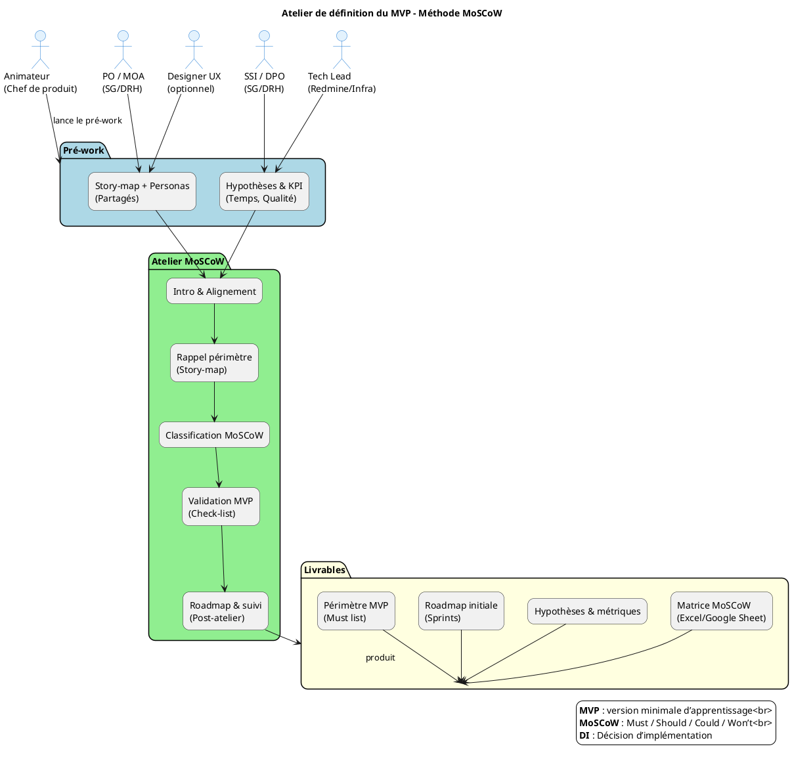

# 📋 Guide d’atelier **MVP / PMV – Méthode MoSCoW**  
*Projet : **Hub RH** (Suivi des demandes de gestion RH)*  

> **Document établi à partir des principes du MVP (Lean Startup) et de la méthode de priorisation MoSCoW**  

---  

## 📚 Table des matières  

[TOC]

---  

## 1️⃣ Introduction & objectifs  

| 🎯 Objectif | Description |
|------------|-------------|
| **Définir le périmètre du MVP** | Identifier la version *minimum* du Hub RH qui permet de **valider les hypothèses métier** avec le moindre effort. |
| **Prioriser les fonctionnalités** | Utiliser **MoSCoW** (Must / Should / Could / Won’t) pour classer les besoins. |
| **Aligner les équipes** | Produit, technique, métier, design et sécurité autour d’une vision partagée. |
| **Préparer la suite** | Sortir de l’atelier avec une **roadmap** (MVP → V1 → itérations). |

> ⚠️ **MVP ≠ V1** – le MVP est **un outil d’apprentissage**. Il peut ne contenir qu’un seul parcours utilisateur complet (ex. : création d’une demande RH) et accepter des contournements (données factices, traitements manuels).  

---  

## 2️⃣ Contexte d’usage & positionnement  

| Élément | Valeur pour Hub RH |
|---------|-------------------|
| **Type de livrable** | Standard ✅ | Atelier 🤝 | Activité « Imaginer une solution » |
| **Quand l’utiliser** | <ul><li>Après la phase de **recherche utilisateur** (entretiens, questionnaires) ; </li><li>Après un **story‑mapping** existant (ex. : parcours de création, suivi, clôture d’une demande) ; </li><li>Avant le démarrage du développement du **nouveau module API** ou de la **migration vers les conteneurs**. </li></ul> |
| **Cas d’usage typiques** | <ul><li>Lancement d’un **nouveau service API** pour les services employeurs ; </li><li>Refonte de l’interface de création de demande (CKEditor, Select2) ; </li><li>Test d’un **processus d’import automatisé** (SPS) ; </li><li>Réduction du périmètre fonctionnel pour respecter un **délais de mise en production** (ex. : 30 jours). </li></ul> |

---  

## 3️⃣ Pré‑requis indispensables  

| ✅ | Pré‑requis |
|---|------------|
| [ ] | **Vision produit** – pitch, objectifs métier, métriques de succès (ex. : temps moyen de traitement ↓ 20 %). |
| [ ] | **Hypothèses à tester** – listes de paris RH à valider (voir § 4). |
| [ ] | **Story Mapping** complet (ex. : *Créer demande → Affecter agent → Notifier → Clôturer*). |
| [ ] | **Personas** – au minimum : <ul><li>**Employeur** (service qui soumet la demande) ; </li><li>**Agent RH** (qui traite la demande) ; </li><li>**Gestionnaire DRH** (pilotage). </li></ul> |
| [ ] | **Contraintes identifiées** – techniques (Docker, Redmine 4.x, PostgreSQL), réglementaires (RGPD/DACP), délais, budget. |
| [ ] | **Accès aux environnements** – dev, recette, prod (VMware ESXi, conteneurs). |
| [ ] | **Disponibilité des parties prenantes** (MOA, MOE, DSI, SSI). |

> 💡 *Si un pré‑requis manque, prévoir 20 min en début d’atelier pour le co‑construire rapidement.*  

---  

## 4️⃣ Parties prenantes & rôles  

| Rôle | Profil type | Responsabilité dans l’atelier |
|------|-------------|--------------------------------|
| **Animateur** | Chef de produit / PO | Cadrer, faciliter, garder le focus « apprentissage ». |
| **Product Owner / MOA** | SG/DRH/CMGP, SG/DNUM/PNM/DPNM3 | Valider la **valeur métier**, les hypothèses et les priorités. |
| **Architecte / Tech Lead** | Responsable infra Redmine (Docker, PostgreSQL) | Estimer l’effort technique, identifier les dépendances. |
| **Designer UX/UI** *(optionnel)* | Designer produit | Proposer des maquettes légères (ex. : formulaire CKEditor). |
| **Responsable SSI / DPO** | SG/DRH/P/DSNUMRH | Vérifier conformité DICT, DACP, contraintes de sécurité. |
| **Utilisateur référent** *(optionnel)* | Agent RH, Employeur | Apporter le regard « terrain », challenger les priorités. |

> ⚠️ Un même participant peut cumuler plusieurs rôles selon les disponibilités.  

---  

## 5️⃣ Logistique de l’atelier  

| Élément | Détails |
|--------|----------|
| **Durée** | 2 h 30 – 4 h (prévoir une pause à 1 h 30 si > 3 h). |
| **Matériel** | <ul><li>Tableau blanc ou paperboard ; </li><li>Post‑its 4 couleurs (M / S / C / W). </li><li>Marqueurs, ruban de masquage. </li></ul> |
| **Digital** | Outil collaboratif (Miro, FigJam, Mural) avec **template MoSCoW** pré‑chargé. |
| **Livrables** | - Matrice MoSCoW finalisée   - Périmètre MVP (liste Must)   - Roadmap initiale (MVP → V1)   - Tableau d’hypothèses & métriques de succès. |
| **Pré‑work** | Partager **story‑map** et **liste de personas** 24 h avant l’atelier. |

---  

## 6️⃣ Déroulé détaillé de l’atelier  

### 🎯 Étape 1 – Introduction & alignement (15 min)  
1. **Accueil & rappel des objectifs** (slide 1).  
2. **Contexte Hub RH** – rappel rapide des éléments clés (description, acteurs, contraintes RGPD/DACP, DICT 2232).  
3. **Formuler la mission du MVP** – ex. :  
   > « Avec ce MVP, nous voulons vérifier que **l’exposition d’une API REST** permettant aux services employeurs de **soumettre une demande** réduit le **temps moyen de traitement** de **20 %** et respecte les exigences de **confidentialité (niveau 3)**. »  

### 🔍 Étape 2 – Rappel du périmètre fonctionnel (30 min)  
*Utiliser le story‑map existant (ex. : création → affectation → suivi → clôture).*
1. **Lister les épics / user‑stories** (ex. :  
   - *Créer une demande via formulaire CKEditor*  
   - *Rechercher un agent via Select2*  
   - *Notifier l’agent par email*  
   - *Exporter les demandes en CSV*).  
2. **Identifier les dépendances techniques** (Docker, Redmine 4.x, plugins : `redmine_ckeditor`, `redmine_base_select2`, `redmine_impersonate`, `redmine_omniauth_cas`).  
3. **Regrouper les doublons / nettoyer**.  

### 🎚️ Étape 3 – Classification MoSCoW (60‑90 min)  

| Phase | Action |
|-------|--------|
| **Présentation** | Rappeler les 4 catégories (M / S / C / W) et leurs critères (voir tableau ci‑dessous). |
| **Discussion fonction par fonction** | Pour chaque story, poser les questions :  • *Le MVP peut‑il fonctionner sans cette fonctionnalité ?*  • *Quel impact sur l’hypothèse à tester ?*  • *Quel effort technique estimé ?*  • *Existe‑t‑il un contournement ?* |
| **Vote / consensus** | Chaque participant dispose de **3 votes** à placer sur les items qu’il estime **Must**. |
| **Placement** | Déposer la story dans la colonne correspondante (post‑its de couleur). |

#### Critères de décision MoSCoW (rappel)  

| Catégorie | Définition | Quand on la choisit |
|-----------|------------|--------------------|
| **Must** | Indispensable pour que le MVP soit **viable** (l’hypothèse ne peut pas être testée sinon). | Ex. : *Soumettre une demande via API* (validation de l’hypothèse de temps). |
| **Should** | Important mais **reportable** sans bloquer l’apprentissage. | Ex. : *Export CSV* (utile mais pas essentiel). |
| **Could** | Optionnel, “nice‑to‑have”. | Ex. : *Thème sombre* (amélioration UX). |
| **Won’t** | Exclu du MVP (coût trop élevé, hors périmètre). | Ex. : *Intégration complète du module de paie* (hors scope). |

### ✅ Étape 4 – Validation du périmètre MVP (30 min)  

Utiliser la **check‑list** suivante :  

- [ ] Le périmètre Must permet‑il de tester **au moins une hypothèse** (ex. : réduction temps de traitement) ?  
- [ ] Un utilisateur (Employeur) peut‑il **compléter le parcours** du début à la fin (soumission → notification) ?  
- [ ] Les **contournements** acceptés (ex. : données factices, traitement manuel) sont‑ils clairement identifiés ?  
- [ ] L’effort estimé (story points / jours) est‑il **compatible** avec le délai cible (ex. : 3 sprints) ?  
- [ ] Les **exigences de sécurité** (DICT 2, DACP oui) sont‑elles respectées (ex. : chiffrement HTTPS, stockage minimal des données PII) ?  

Si le périmètre est trop large, revisiter les stories **Should/Could** pour les reporter.  

### 🗺️ Étape 5 – Roadmap & prochaines étapes (15‑30 min)  

| Livrable | Contenu |
|----------|---------|
| **Matrice MoSCoW** | Tableur ou tableau partagé avec les stories classées. |
| **Périmètre MVP** | Liste exhaustive des **Must** (ex. : API POST `/demande`, formulaire CKEditor, notification email). |
| **Hypothèses à valider** | <ul><li>H1 : L’API réduit le temps moyen de traitement de 20 %.</li><li>H2 : Le taux d’erreur de saisie diminue de 15 % grâce à CKEditor + Select2.</li></ul> |
| **Métriques de succès** | <ul><li>Temps moyen de traitement (minutes).</li><li>Taux de soumission réussie (pourcentage).</li><li>Conformité RGPD (audit interne).</li></ul> |
| **Roadmap** | <ul><li>**Sprint 1** : MVP (Must) – API, formulaire, notifications.</li><li>**Sprint 2** : Should – Export CSV, tableau de bord simple.</li><li>**Sprint 3** : Could – Thèmes, rapports avancés.</li></ul> |
| **Prochaine revue** | Date prévue (ex. : 2 semaines) pour **démo MVP** et **analyse des métriques**. |

> 📸 *Action immédiate* : partager la matrice MoSCoW et la roadmap dans le canal Slack **#hubrh‑mvp** d’ici **24 h**.  

---  

## 7️⃣ Conseils de facilitation  

| Bonnes pratiques | À éviter |
|------------------|----------|
| Ancrer chaque décision dans une **hypothèse à tester** (ex. : “Si on expose l’API, le temps de traitement baisse”). | Prioriser par préférence personnelle ou « c’est toujours comme ça ». |
| Challenger systématiquement les **Must** : *« Et si on l’enlevait ? »* | Accepter un MVP trop large par peur de décevoir. |
| Proposer des **contournements légers** (ex. : données factices, traitements manuels) pour réduire le scope. | Ignorer les exigences de **confidentialité (3)** ou **DICT (2)**. |
| Faire participer activement **les profils métier** (Employeur, Agent RH). | Laisser un seul profil (technique) dominer les arbitrages. |
| Documenter les **rejets** (Won’t) avec leurs raisons (coût, risque, non‑conformité). | Oublier de prévoir la **revue post‑MVP** et les critères de décision (pivot / persévérer / arrêter). |

---  

## 8️⃣ Alternative : MVP par scénario utilisateur  

Si la classification MoSCoW ne suffit pas à réduire le scope, privilégier un **scenario MVP** : choisir **un seul** parcours complet à tester.  

| Critère de sélection du scénario | Exemple Hub RH |
|----------------------------------|----------------|
| **Parcours complet** (début → fin) | *Employeur soumet une demande → Agent RH reçoit notification → Agent clôture la demande*. |
| **Innovation forte** | *API REST permettant la soumission directe depuis le système du service employeur*. |
| **Facilité de mise en œuvre** | Utilisation du **formulaire CKEditor** déjà présent, sans modification du workflow. |
| **Valeur d’apprentissage** | Mesure du **temps de traitement** et du **taux d’erreur de saisie**. |

**Formulation du scénario MVP** :  
> *« En tant qu’**Employeur**, je veux **soumettre une demande via l’API** afin de **réduire le temps de traitement** et de **garantir la conformité des données**. »  

---  

## 9️⃣ Diagramme PlantUML du processus d’atelier MoSCoW  

---  

## 10️⃣ Adaptations contextuelles (Hub RH)  

| Contexte Hub RH | Adaptation recommandée |
|------------------|------------------------|
| **Produit logiciel basé sur Redmine** (plugins : `redmine_ckeditor`, `redmine_base_select2`, `redmine_impersonate`, `redmine_omniauth_cas`) | Prioriser les **Must** qui touchent **l’API de soumission** et le **formulaire CKEditor** (déjà présent). |
| **Contraintes RGPD / DACP** (confidentialité = 3, DICT = 2) | Vérifier que le MVP inclut **HTTPS**, **masquage des PII** et **audit de logs** (éventuellement en tant que **Should**). |
| **Acteurs multiples** (Employeur, Agent RH, Gestionnaire DRH) | Créer des **personas** distincts et les rappeler durant l’étape 2 (story‑map). |
| **Déploiement conteneurisé (Docker)** | Ajouter comme **Should** : « Générer l’image Docker du MVP via Kaniko » (déjà dans CI). |
| **Intégration CAS + Impersonation** | **Could** : SSO CAS (déjà existant) – ne pas le mettre en Must si l’objectif MVP porte sur l’API. |
| **Flux de données (API interne, SPS)** | **Must** : Consommer l’API de réception de données (ex. : `/api/demande`). |
| **Objectif d’apprentissage** – réduire le **temps moyen de traitement** de 20 % | Formuler comme **hypothèse H1** à valider dès le MVP. |
| **Livraison rapide (30 jours)** | Limiter le périmètre à **3‑4 stories Must** (API, formulaire, notification, log). |

---  

## 11️⃣ Mini‑glossaire  

| Terme | Définition |
|-------|------------|
| **MVP** | *Minimum Viable Product* : version la plus petite du produit permettant d’apprendre d’une hypothèse. |
| **MoSCoW** | Technique de priorisation : **Must**, **Should**, **Could**, **Won’t**. |
| **Story‑map** | Visualisation du parcours utilisateur découpé en épics & stories. |
| **Hypothèse** | Pari produit à valider (ex. : “l’API réduit le temps de traitement”). |
| **KPI** | Indicateur clé de performance (ex. : temps moyen de traitement). |
| **DI​CT** | Disponibilité, Intégrité, Confidentialité, Traçabilité – notation de sécurité. |
| **DACP** | Données à Caractère Personnel – traitement soumis au RGPD. |
| **Contournement** | Solution temporaire (ex. : données factices, traitement manuel). |
| **Kaniko** | Outil de construction d’images Docker dans le pipeline CI. |
| **Redmine** | Plateforme de gestion de projets / tickets (utilisée comme socle Hub RH). |
| **CKEditor** | Éditeur riche intégré via le plugin `redmine_ckeditor`. |
| **Select2** | Composant UI pour les listes déroulantes (plugin `redmine_base_select2`). |
| **Imperso­nate** | Fonctionnalité permettant à un admin de se connecter comme un autre utilisateur. |
| **CAS** | Central Authentication Service – protocole SSO utilisé via `redmine_omniauth_cas`. |

---  

## 12️⃣ Prochaines étapes (immediates)  

1. **Partager le template MoSCoW** (Google Sheet) avec les participants **aujourd’hui**.  
2. **Planifier l’atelier** – date, durée, salle / lien Teams – d’ici **2 jours**.  
3. **Collecter les personas** (Employeur, Agent RH, Gestionnaire) et les **hypothèses** (H1, H2) **avant l’atelier**.  
4. **Préparer le tableau de story‑map** (extrait du backlog Redmine) et le **déposer** dans le canal Slack `#hubrh‑backlog`.  
5. **Nommer un(e) “Owner MVP”** (ex. : PO) qui sera responsable de la **validation post‑MVP** (mesure des KPI).  

---  

### 🎉 Vous avez maintenant tout le nécessaire pour conduire un atelier de définition du MVP / PMV du **Hub RH** en suivant la méthode **MoSCoW**. Bon travail !  