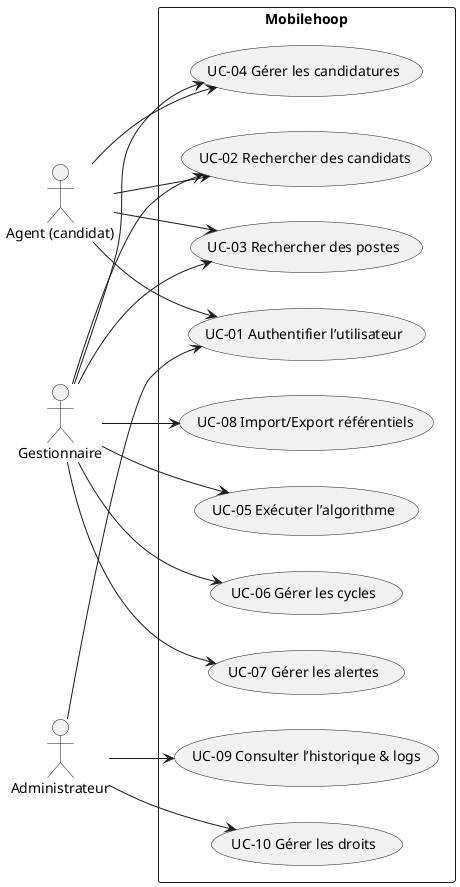
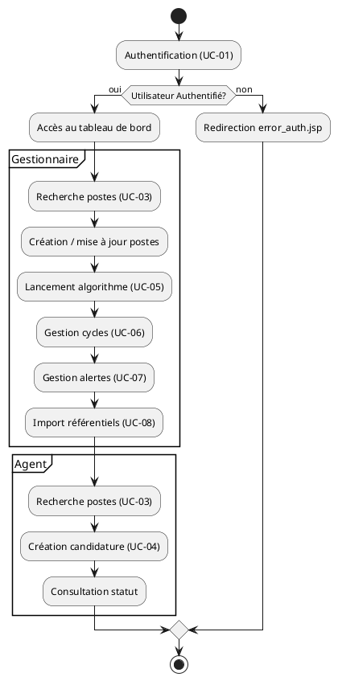
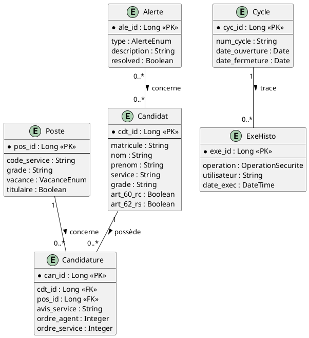

# 📄 Cahier des Charges Fonctionnel (CCF) – **Mobilehoop**

> **Version** : 1.0 – 2024‑10‑28  
> **Projet** : Mobilehoop (Mon Compte Mobilité) – Application métier de gestion de la mobilité interne des agents de l’État.  
> **Références** : NF EN 16271, ISO/IEC/IEEE 29148, ISO/IEC 19505 (UML 2.x), ISO/IEC 19510 (BPMN)  

---

[TOC]

---

## 1️⃣ Introduction et contexte du projet  

| Élément | Description |
|---|---|
| **Nom du projet** | **Mobilehoop** – plateforme web de gestion des candidatures et postes de mobilité interne. |
| **Objectifs stratégiques** | • Faciliter le report modal et la mobilité des agents.<br>• Centraliser les données métier (candidats, postes, cycles, alertes).<br>• Garantir la traçabilité, la conformité RGPD et la sécurité (rôles Vertigo). |
| **Périmètre fonctionnel** | **Inclus** : gestion des comptes utilisateurs, recherche & affichage candidats & postes, création & suivi des candidatures, exécution d’algorithmes d’attribution, gestion des cycles (ouverture/fermeture), import/export de référentiels, alertes métier, historiques, logs.<br>**Exclu** : modules de paie, gestion des droits d’administration serveur, reporting financier (hors export CSV). |
| **Environnement technique** | • Java 8+, Vertigo Framework, Struts 2, PostgreSQL 9+, Elasticsearch (indexation), Log4j2.<br>• Hébergement Cloud ECO 4 (pré‑prod & prod).<br>• Authentification via Cerbere filtre, rôle Vertigo. |
| **Contraintes de non‑fonctionnalité** | • Respect du modèle de données existant (scripts SQL Flyway).<br>• Compatibilité avec les navigateurs modernes (accessibilité, CSS responsive).<br>• Disponibilité ≥ 99 % en prod, temps de réponse < 3 s pour les recherches. |

---

## 2️⃣ Expression fonctionnelle du besoin (NF EN 16271)

### 2.1 Fonctions de service (FS)

| N° | Fonction de service (FS) | Description (quoi) | Critères d’appréciation | Importance (1‑5) | Pondération |
|---|---|---|---|---|---|
| **FS‑01** | **Authentification & gestion de session** | Authentifier les utilisateurs (agents, gestionnaires, administrateurs) et gérer la durée de la session. | • Temps d’authentification < 2 s.<br>• Gestion du timeout (15 min d’inactivité).<br>• Journalisation des accès. | 5 | 10 % |
| **FS‑02** | **Recherche de candidats** | Permettre aux gestionnaires de rechercher, filtrer et visualiser les candidats (par nom, matricule, service, critères Article 60/62). | • Temps de réponse < 2 s.<br>• Résultats paginés (max 100 lignes).<br>• Export CSV des résultats. | 4 | 9 % |
| **FS‑03** | **Recherche de postes** | Recherche de postes (par service, grade, vacance, code). | • Temps de réponse < 2 s.<br>• Indication de la vacance (Oui/Non/À vérifier). | 4 | 9 % |
| **FS‑04** | **Gestion des candidatures** | Créer, modifier, supprimer, visualiser les candidatures (statut « Favorable », avis service, ordre). | • Validation métier (ex. ordres non null).<br>• Historisation des actions. | 5 | 10 % |
| **FS‑05** | **Exécution d’algorithme d’attribution** | Lancer l’algorithme d’affectation, générer les résultats (poste attribué, numéro de poste). | • Succès ≥ 95 % des exécutions.<br>• Temps d’exécution < 30 s. | 5 | 12 % |
| **FS‑06** | **Gestion des cycles (mini‑cycle & fin de cycle)** | Ouvrir/fermer les périodes de vacance A/B, dates d’affectation, purger les données à la clôture. | • Validation des dates (début < fin).<br>• Messages de confirmation (MessageKey). | 4 | 8 % |
| **FS‑07** | **Alertes métier** | Générer, visualiser, gérer les alertes (grade manquant, validation article 60/62, incohérence grade‑population). | • Détection en temps réel.<br>• Export CSV des alertes. | 3 | 6 % |
| **FS‑08** | **Import/Export de référentiels** | Importer les fichiers CSV (cahier de mouvements, grades, services, vacances) et exporter les résultats d’algorithme. | • Validation du format CSV.<br>• Gestion des erreurs d’import (rapport). | 4 | 8 % |
| **FS‑09** | **Historique & logs** | Historiser les actions (import, exécution, modification) et permettre la consultation des logs. | • Recherche par utilisateur, date, type d’opération.<br>• Export CSV. | 3 | 6 % |
| **FS‑10** | **Gestion des droits (rôles Vertigo)** | Appliquer les rôles (R_ADMIN, R_CONSULT, R_GESTIONNAIRE, R_SERVICE) aux fonctions. | • Accès refusé en cas de rôle insuffisant (MessageKey `MSG_SECURITY_ERREUR_DROIT_INSUFFISANTS`). | 5 | 12 % |

> **Note** : La pondération totale = 100 %.

### 2.2 Contraintes associées  

| Contrainte | Description |
|---|---|
| **C‑01** | **Sécurité** – Toutes les communications via HTTPS, mots de passe hashés (BCrypt). |
| **C‑02** | **RGPD** – Anonymisation des données personnelles dans les exports, consentement explicite. |
| **C‑03** | **Accessibilité** – Conformité WCAG 2.1 AA (alternatives texte, navigation clavier). |
| **C‑04** | **Performance** – Indexation Elasticsearch sur les champs de recherche (nom, matricule, service). |
| **C‑05** | **Déploiement** – Scripts SQL livrés via Flyway (nommage `V<version>__<texte>.sql`). |
| **C‑06** | **Auditabilité** – Tous les changements doivent être traçables (tables `exe_histo`, `log_import`). |
| **C‑07** | **Disponibilité** – Environnements pré‑prod & prod séparés, bascule sans perte de données. |

---

## 3️⃣ Acteurs et parties prenantes  

| Acteur | Rôle | Besoins spécifiques |
|---|---|---|
| **Agent (candidat)** | Utilisateur final – recherche de postes, dépôt de candidature. | • Accéder à la liste des postes disponibles.<br>• Visualiser le statut de ses candidatures.<br>• Recevoir les notifications d’attribution. |
| **Gestionnaire de mobilité** | Responsable de la création de postes, validation des candidatures. | • Créer/modifier des postes.<br>• Lancer l’algorithme d’attribution.<br>• Gérer les cycles et alertes. |
| **Administrateur fonctionnel (R_CONSULT)** | Supervision des droits, paramétrage des référentiels. | • Importer/mettre à jour les référentiels (grades, services).<br>• Accéder aux historiques & logs. |
| **Administrateur technique (R_ADMIN)** | Gestion de l’infrastructure, déploiement, sécurité. | • Déployer les WAR, scripts Flyway.<br>• Configurer le serveur (datasource, log4j2). |
| **Service d’audit (R_SERVICE)** | Contrôle de conformité (RGPD, sécurité). | • Exporter les logs et historiques.<br>• Vérifier les droits d’accès. |
| **CS (Centre de Services)** | Opérateur de déploiement cloud ECO 4. | • Recevoir les paquets (WAR, ZIP SQL, config) via FTP.<br>• Valider le déploiement selon la procédure. |

> **Cartographie des parties prenantes**  
> - **MOA** : DGITM/SDMINT/MINT3 (maîtrise d’ouvrage).  
> - **MOE** : Équipe Mobilehoop (développeurs Java, DBA).  
> - **RSSI** : Responsable de la sécurité des systèmes d’information.  

---

## 4️⃣ Cas d’usage (Use Cases)  



### 4.1 Description détaillée des cas d’usage  

| UC | Nom | Acteur(s) principal(aux) | Scénario nominal |
|---|---|---|---|
| **UC‑01** | Authentifier l’utilisateur | Agent, Gestionnaire, Administrateur | 1. L’utilisateur saisit identifiant & mot de passe.<br>2. Le système vérifie les credentials via Cerbere‑filtre.<br>3. Si valide → création de `MobilehoopUserSession` (timeout 15 min).<br>4. Sinon → affichage `error_auth.jsp`. |
| **UC‑02** | Rechercher des candidats | Gestionnaire | 1. L’utilisateur accède à la page *candidatRecherche*.<br>2. Saisit critères (nom, matricule, service, article 60/62).<br>3. Le moteur Elasticsearch renvoie les résultats paginés.<br>4. L’utilisateur peut exporter la liste au format CSV. |
| **UC‑03** | Rechercher des postes | Gestionnaire | Identique à UC‑02 mais sur l’entité *poste* (filtre sur vacance, grade, service). |
| **UC‑04** | Gérer les candidatures | Agent, Gestionnaire | 1. L’agent crée une candidature via *candidatureRecherche*.<br>2. Le gestionnaire valide/attribue l’avis service (FAVORABLE / NON FAVORABLE).<br>3. Le système enregistre la candidature (`candidature` table) et crée l’historique (`exe_histo`). |
| **UC‑05** | Exécuter l’algorithme d’attribution | Gestionnaire | 1. Le gestionnaire lance `FinCycleAction` → `FinCycleResources` → appel à `AlgorithmeServices`.<br>2. L’algorithme lit les candidatures, les ordres (agent, service) et les postes vacants.<br>3. Génère le fichier CSV (`ExportServices`). |
| **UC‑06** | Gérer les cycles | Gestionnaire | 1. Ouvrir/fermer les vacances A/B, dates d’affectation via `FinCycleResources`.<br>2. Validation de la cohérence (pas de dates croisées).<br>3. À la clôture, suppression des tables métier (`FinCycleServices.deleteDatabase`). |
| **UC‑07** | Gérer les alertes | Gestionnaire | 1. Le système détecte les incohérences (ex. grade manquant).<br>2. Les alertes sont affichées dans *alertes*.<br>3. L’utilisateur peut les exporter ou les marquer comme résolues. |
| **UC‑08** | Import/Export référentiels | Administrateur, Gestionnaire | 1. L’utilisateur charge un CSV (ex. `Modele_Mobilite.csv`).<br>2. `ImportServices` valide le format, crée les objets (`ImportMobiliteHelper`).<br>3. En cas d’erreur, un rapport (`ObjectLogImport`) est généré. |
| **UC‑09** | Consulter l’historique & logs | Administrateur, Service d’audit | 1. Accès à la page *historique*.<br>2. Filtrage par utilisateur, date, type d’opération.<br>3. Export CSV possible. |
| **UC‑10** | Gérer les droits | Administrateur | 1. Attribution des rôles (via `Roles` enum).<br>2. Vérification en temps réel (`SecurityException` si insuffisant). |

> **Scénarios alternatifs** (exemples) : <br>
> - **UC‑01** : Mot de passe expiré → redirection vers *error_auth.jsp* avec MessageKey `SEC_CANT_MODIFY_ITEM`. <br>
> - **UC‑05** : Algorithme échoue (ex. données incohérentes) → affichage `FinCycleResources.MSG_CLOTURE_CYCLE_ERREUR`. <br>
> - **UC‑08** : CSV mal formé → création d’un `ImportException` et affichage du log d’erreur.

---

## 5️⃣ Processus métier (BPMN)  



---

## 6️⃣ Règles métier et contraintes fonctionnelles  

| # | Règle métier (condition → action) | Domaine | Priorité |
|---|---|---|---|
| **R‑01** | Si `grade` du candidat **absent** → générer alerte `GRADE_MANQUANT`. | Candidat | 5 |
| **R‑02** | Si `article_60` non validé → alerte `VALIDATION_ART_60_MANQUANT`. | Candidat | 4 |
| **R‑03** | Si `ordre_agent` **null** → `ORDRE_CDT_MANQUANT`. | Candidature | 4 |
| **R‑04** | Si `ordre_service` **null** → `ORDRE_SRV_MANQUANT`. | Candidature | 4 |
| **R‑05** | Si `avis_service` = `FAVORABLE` **et** `ordre_service` > `ordre_service` d’un autre candidat → priorité à l’ordre le plus bas. | Candidature | 5 |
| **R‑06** | À la clôture du mini‑cycle, toutes les tables métier (`candidat`, `poste`, `candidature`, `exe_histo`) sont vidées. | Cycle | 5 |
| **R‑07** | Un fichier d’import doit contenir les colonnes obligatoires (`MATRI`, `NOM`, `PRENOM`, `SERVICE`). | Import | 5 |
| **R‑08** | Tous les exports CSV doivent être encodés en UTF‑8 sans BOM. | Export | 3 |
| **R‑09** | Les logs d’accès (`PERIMETRE_RESOURCES`) doivent être conservés 180 jours. | Sécurité | 4 |
| **R‑10** | Les mots de passe sont stockés avec BCrypt (cost = 12). | Sécurité | 5 |

> **Contraintes réglementaires** : RGPD (anonymisation lors d’export), archivage légal (12 mois), accessibilité WCAG 2.1 AA.

---

## 7️⃣ Parcours utilisateurs (User Journey)

### 7.1 Agent (candidat) – *Recherche & candidature*  

| Étape | Action utilisateur | Interaction système | Point de contrôle |
|---|---|---|---|
| 1 | Se connecter (login + MDP) | Authentification via Cerbere, création de session | Vérification MFA (si configuré) |
| 2 | Accéder à l’onglet **Postes** | Charge `posteRecherche.jsp`, requête Elasticsearch | Temps de réponse < 2 s |
| 3 | Filtrer par service & vacance | Envoi de requête ES, affichage tableau | Validation du filtre (pas de valeurs null) |
| 4 | Sélectionner un poste → **Candidature** | Redirection vers `candidatureDetail.jsp` | Vérification de la vacance du poste |
| 5 | Remplir le formulaire de candidature | Enregistrement dans table `candidature` | Contrôle d’unicité (un poste par candidat) |
| 6 | Visualiser le statut | Page *candidatureDetail* montre `avis_service` | Notification si `FAVORABLE` |
| 7 | Déconnexion | Invalidation du token | Session détruite |

### 7.2 Gestionnaire – *Gestion des cycles & exécution algorithme*  

| Étape | Action | Système | Contrôle |
|---|---|---|---|
| 1 | Authentification (R_GESTIONNAIRE) | `SecurityManagerInitializer` | Vérif. rôle |
| 2 | Ouvrir la vacance A | `FinCycleAction` → `FinCycleResources.MSG_CONFIRM_OUVRIR_VACANCE_A` | Confirmation UI |
| 3 | Importer référentiel grades (CSV) | `ImportServices.importerGrade` | Validation format, log `ObjectLogImport` |
| 4 | Lancer l’algorithme d’attribution | `AlgorithmeServicesImpl.run` | Temps < 30 s, création de `ExportServices` CSV |
| 5 | Visualiser les alertes | `AlertesAction` | Priorisation par `AlertesEnum` |
| 6 | Clôturer le mini‑cycle | `FinCycleServices.deleteDatabase(true)` | Suppression tables métier, logs `exe_histo` |
| 7 | Exporter les résultats | `ExportServices.createCsvResultatAlgorithme` | Fichier UTF‑8, téléchargement via Kibana si besoin |

> **Critères d’acceptation (Gherkin)**  

```gherkin
Scenario: Agent crée une candidature valide
  Given L'agent "M. Dupont" est authentifié
  When il sélectionne le poste "00123" disponible
  And il soumet le formulaire de candidature
  Then la candidature est enregistrée dans la table "candidature"
  And le statut affiché est "En attente"

Scenario: Gestionnaire lance l'algorithme
  Given Le gestionnaire est authentifié avec le rôle "R_GESTIONNAIRE"
  When il clique sur "Exécuter l'algorithme"
  Then un fichier CSV nommé "resultat_algorithme_*.csv" est généré
  And le message "MSG_CLOTURE_MINI_CYCLE_SUCCES" est affiché
```

---

## 8️⃣ Modèle Conceptuel de Données (MCD)



> **Notes** :  
> - Les tables de référence (`REF_GRADE`, `REF_SERVICE`, `REF_VACANCE`) ne sont pas représentées pour lisser le diagramme.  
> - Les colonnes `art_60_rc`, `art_62_rs` proviennent de la migration **alterDatabaseV011toV100.sql**.  

---

## 9️⃣ Critères d’acceptation et validation  

| Fonction (FS) | Critère d’acceptation | Méthode de validation | Responsable | Priorité (MoSCoW) |
|---|---|---|---|---|
| FS‑01 | Authentification réussie en < 2 s, journalisation obligatoire. | Tests unitaires JUnit + tests d’intégration Selenium. | Équipe QA | **Must** |
| FS‑02 | Recherche candidats retourne < 100 lignes, pagination fonctionnelle. | Tests fonctionnels automatisés (REST / UI). | PO | **Must** |
| FS‑03 | Export CSV conforme au schéma (UTF‑8, séparateur « ; »). | Validation par script Python (schema‑check). | QA | **Must** |
| FS‑04 | Historisation chaque modification de candidature (`exe_histo`). | Requête DB + audit log. | DBA | **Should** |
| FS‑05 | Algorithme d’attribution produit un fichier non vide, sans erreur. | Exécution en environnement de pré‑prod, comparaison avec jeu de test. | PO | **Must** |
| FS‑06 | Clôture de cycle supprime toutes les tables métier (vérif. `COUNT=0`). | Script SQL de vérification post‑déploiement. | DBA | **Must** |
| FS‑07 | Alertes générées automatiquement dès la violation d’une règle métier. | Tests de contrainte (ex. grade manquant). | QA | **Should** |
| FS‑08 | Import CSV rejette les lignes mal formatées, crée un rapport d’erreurs. | Tests d’import avec fichiers valides & invalides. | PO | **Must** |
| FS‑09 | Logs consultables via Kibana, export CSV < 5 Mo. | Requête Kibana + téléchargement. | CS | **Could** |
| FS‑10 | Attribution correcte des rôles (ex. R_GESTIONNAIRE → accès à FS‑05). | Tests d’accès (403 sinon). | Sécurité | **Must** |

---

## 🔟 Annexes  

### A. Glossaire métier  

| Terme | Définition |
|---|---|
| **Candidat** | Agent public souhaitant une mobilité interne. |
| **Poste** | Offre de mobilité (service, grade, vacance). |
| **Candidature** | Liaison entre un candidat et un poste, avec avis service. |
| **Cycle** | Période de gestion (ouverture/fermeture des vacances). |
| **Mini‑cycle** | Sous‑période utilisée pour les affectations temporaires. |
| **Alerte** | Notification d’incohérence (ex. grade manquant). |
| **Algorithme** | Processus d’attribution basé sur ordres agent/service. |
| **Flyway** | Outil de migration de base de données versionnée. |
| **Vertigo** | Framework d’injection de dépendances et de sécurité. |
| **Cerbere** | Module d’authentification (filtre). |
| **Kibana** | Interface de visualisation des logs Elasticsearch. |

### B. Référentiels et normes applicables  

| Référentiel | Version | Applicabilité |
|---|---|---|
| **NF EN 16271** | 2021 | Expression fonctionnelle du besoin & CCF. |
| **ISO/IEC/IEEE 29148** | 2018 | Ingénierie des exigences. |
| **ISO/IEC 19505** (UML 2.x) | 2015 | Diagrammes de cas d’usage, MCD. |
| **ISO/IEC 19510** (BPMN 2.0) | 2013 | Processus métier. |
| **RGPD** | 2018 | Traitement des données personnelles. |
| **WCAG 2.1 AA** | 2018 | Accessibilité front‑end. |
| **CeCILL‑B** | – | Licence du code source (mob, mcm‑gateway). |

### C. Historique des versions du CCF  

| Version | Date | Modifications majeures |
|---|---|---|
| **1.0** | 2024‑10‑28 | Première version – intégration de tous les documents fournis. |
| **0.9** | 2024‑09‑15 | Ajout du diagramme BPMN et du tableau de pondération. |
| **0.8** | 2024‑08‑01 | Inclusion du modèle de données MCD détaillé. |

---  

**Fin du Cahier des Charges Fonctionnel**  

*Ce document est immédiatement exploitable dans les environnements VS Code ou Obsidian grâce à son format Markdown auto‑portant et ses liens internes.*