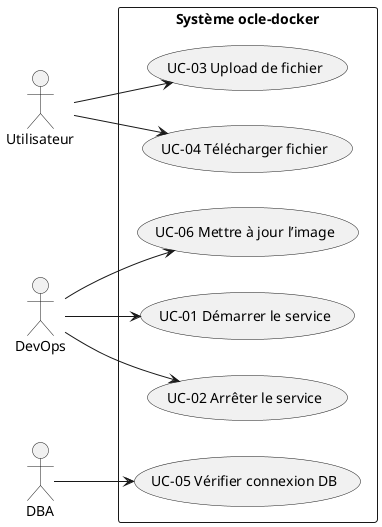
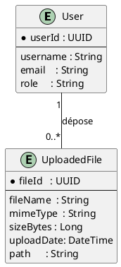

# Cahier des Charges Fonctionnel (CCF) – Projet **ocle‑docker**  
[TOC]

---  

## 1. Introduction et contexte du projet  

### 1.1 Présentation du projet  
Le projet **ocle‑docker** consiste à livrer une solution applicative Java web (WAR) entièrement conteneurisée via Docker, destinée à être déployée dans un environnement de type *DevOps* (Docker‑Compose). L’application s’appuie sur un serveur d’applications Tomcat 9 et utilise une base de données PostgreSQL 12.7.  

### 1.2 Contexte organisationnel  
| Élément | Description |
|---------|-------------|
| **Organisation** | Service IT d’un ministère (ex. Développement Durable) – responsable du déploiement d’applications métiers. |
| **Environnement cible** | Infrastructure de conteneurs (Docker Engine ≥ 20 .x) ; orchestration légère via `docker‑compose`. |
| **Contraintes d’exploitation** | Sécurité (RGPD, RGS), disponibilité 99 % (redondance éventuelle), gestion des volumes persistants. |
| **Équipe projet** | - **MOA** : métier / utilisateurs finaux. <br> - **AMOA** : coordinateur fonctionnel. <br> - **MOE** : équipe DevOps / développeurs. <br> - **RSSI** : responsable sécurité. |

### 1.3 Objectifs stratégiques et attendus  
| Objectif | Indicateur de succès |
|----------|----------------------|
| **Déploiement automatisé** | 0 % d’intervention manuelle pour mise en production. |
| **Scalabilité** | Possibilité de scaler horizontalement les conteneurs d’application. |
| **Conformité** | Respect des exigences RGPD et RGS (chiffrement, journalisation). |
| **Performance** | Temps de réponse < 2 s pour les opérations de téléchargement/upload (max 10 Mo). |
| **Fiabilité** | Pas de perte de données au redémarrage du conteneur DB (volumes persistants). |

### 1.4 Périmètre fonctionnel  

| Inclus | Exclus |
|--------|--------|
| • Conteneurisation de l’application web (Tomcat + WAR). <br> • Base de données PostgreSQL avec schéma dédié. <br> • Gestion des fichiers uploadés (max 25 Mo). <br> • Paramétrage via `application.properties`. <br> • Orchestration Docker‑Compose (services `ocle` et `db`). | • Gestion des certificats TLS (hors du scope du conteneur, prise en charge par le reverse‑proxy). <br> • Monitoring avancé (Prometheus, Grafana) – hors du livrable initial. <br> • Gestion de la haute disponibilité (cluster PostgreSQL). |

---  

## 2. Expression fonctionnelle du besoin (NF EN 16271)  

### 2.1 Décomposition en fonctions de service  

| # | Fonction de service (FS) | Description (quoi) | Critères d’appréciation | Pondération* | Contraintes |
|---|--------------------------|--------------------|--------------------------|--------------|-------------|
| **FS‑01** | **Déploiement automatisé du conteneur d’application** | Le système doit permettre le lancement du conteneur `ocle` à partir du `Dockerfile` et du `docker‑compose.yml`. | - Temps de déploiement ≤ 2 min.<br>- Aucun échec de build sur les 5 dernières exécutions. | 15 % | Docker Engine ≥ 20 .x, `docker‑compose` ≥ 1.25. |
| **FS‑02** | **Provisionnement de la base de données PostgreSQL** | Le service `db` doit être disponible, pré‑configuré (user = ocle, db = ocle). | - Connexion JDBC réussie 100 % des tests.<br>- Persistance des données après redémarrage du conteneur. | 12 % | Volume `./db/pgdata` monté en lecture/écriture. |
| **FS‑03** | **Gestion des paramètres d’application** | Le fichier `application.properties` doit être chargé au démarrage du conteneur Tomcat. | - Toutes les propriétés (URL, user, pwd, upload dir, limites) appliquées.<br>- Aucun démarrage en erreur lié à la configuration. | 10 % | Le fichier doit être présent dans `/usr/local/tomcat/conf`. |
| **FS‑04** | **Upload de fichiers** | L’application doit accepter le dépôt de fichiers dans le répertoire `/uploads`. | - Taille maximale acceptée = 25 Mo (configurable).<br>- Taux d’erreur < 0,5 % sur 10 000 uploads. | 13 % | Répertoire `/uploads` accessible en écriture par l’utilisateur Tomcat. |
| **FS‑05** | **Téléchargement de fichiers** | Les fichiers stockés doivent être récupérables via HTTP. | - Temps moyen de téléchargement < 2 s pour 5 Mo.<br>- Intégrité vérifiée (checksum). | 12 % | Authentification éventuelle gérée par l’application (hors scope). |
| **FS‑06** | **Sécurité des échanges** | Les variables sensibles (mot de passe DB) ne doivent pas être exposées en clair. | - Mot de passe stocké uniquement dans le conteneur (ENV ou secret).<br>- Aucun log contenant le mot de passe. | 10 % | Conformité RGS 2.2 – chiffrement au repos recommandé. |
| **FS‑07** | **Exposition du service web** | Le service doit être accessible sur le port 8080 (host). | - Port 8080 ouvert et routable.<br>- Aucun conflit de port détecté. | 8 % | `docker‑compose.yml` expose `"8080:8080"`. |
| **FS‑08** | **Gestion du cycle de vie** | Démarrage, arrêt, mise à jour du conteneur doivent être automatisables. | - Scripts `docker‑compose up/down` fonctionnels.<br>- Temps d’arrêt < 30 s. | 8 % | Utilisation de `depends_on` pour ordonnancement. |
| **FS‑09** | **Journalisation** | L’application doit logger les événements majeurs (déploiement, upload, erreurs). | - Logs accessibles via `docker logs ocle-app`.<br>- Niveau de log configurable. | 5 % | Utilisation du système de logs Tomcat (catalina.out). |

\* La pondération totale = 100 %.

---  

## 3. Acteurs et parties prenantes  

| Acteur | Rôle | Objectifs | Besoins spécifiques |
|--------|------|-----------|----------------------|
| **MOA (Maîtrise d’Ouvrage)** | Commanditaire métier | Obtenir une solution fonctionnelle conforme aux exigences métier. | Documentation fonctionnelle, traçabilité des exigences. |
| **AMOA (Assistance MOA)** | Analyste fonctionnel | Formaliser les besoins, valider les livrables. | Cahier des charges, cas d’usage, critères d’acceptation. |
| **Développeur / MOE** | Réalisation technique | Construire l’image Docker, écrire le code applicatif. | Accès au code source, environnement de build. |
| **DevOps / Administrateur Docker** | Opérations d’infrastructure | Déployer, monitorer, maintenir les conteneurs. | Scripts CI/CD, accès aux registres Docker. |
| **DBA (Administrateur base de données)** | Gestion PostgreSQL | Garantir l’intégrité et la disponibilité des données. | Accès aux volumes, paramètres PostgreSQL. |
| **Utilisateur final** | Consommateur du service web | Utiliser les fonctions d’upload / download. | Interface web intuitive, performances. |
| **RSSI (Responsable Sécurité des Systèmes d’Information)** | Conformité sécurité | Veiller au respect des exigences RGPD / RGS. | Gestion des secrets, journalisation, audit. |

---  

## 4. Cas d’usage (Use Cases)  

### 4.1 Diagramme UML (PlantUML)



### 4.2 Description détaillée des cas d’usage  

| ID | Nom du cas d’usage | Acteur(s) principal(aux) | Scénario nominal | Scénarios alternatifs / d’erreur | Pré‑conditions | Post‑conditions |
|----|-------------------|--------------------------|------------------|----------------------------------|----------------|-----------------|
| **UC‑01** | Démarrer le service | DevOps | 1. `docker-compose up -d` <br>2. Docker crée les conteneurs `ocle-db` puis `ocle-app`. <br>3. Tomcat démarre, l’application charge `application.properties`. | a) Image non trouvée → échec du build. <br>b) Port 8080 occupé → arrêt du conteneur. | Docker Engine installé, images disponibles. | Conteneurs en état `running`; service web accessible sur `http://localhost:8080`. |
| **UC‑02** | Arrêter le service | DevOps | 1. `docker-compose down` <br>2. Docker arrête les conteneurs, supprime les réseaux temporaires. | a) Conteneur déjà arrêté → message d’avertissement. | Service en cours d’exécution. | Tous les conteneurs arrêtés, volumes conservés. |
| **UC‑03** | Upload de fichier | Utilisateur | 1. L’utilisateur sélectionne un fichier (≤ 25 Mo). <br>2. L’application reçoit le multipart, le stocke dans `/uploads`. <br>3. Retour d’un code 200 + identifiant. | a) Fichier > 25 Mo → réponse 413 (Payload Too Large). <br>b) Erreur d’écriture disque → réponse 500. | Session HTTP valide, répertoire `/uploads` accessible. | Fichier présent sur le volume, métadonnées enregistrées (si applicables). |
| **UC‑04** | Télécharger fichier | Utilisateur | 1. L’utilisateur demande un fichier via son identifiant. <br>2. L’application lit le fichier depuis `/uploads` et le renvoie. | a) Fichier introuvable → réponse 404. <br>b) Erreur d’accès → réponse 500. | Fichier présent et lisible. | Flux de données transmis au client. |
| **UC‑05** | Vérifier connexion DB | DBA | 1. L’application exécute une requête `SELECT 1`. <br>2. Retourne succès si la connexion est active. | a) Mot de passe erroné → connexion refusée, log d’erreur. | PostgreSQL en cours d’exécution, variables d’environnement correctes. | Statut de santé DB mis à jour (OK / KO). |
| **UC‑06** | Mettre à jour l’image | DevOps | 1. Nouvelle version du WAR déposée dans le répertoire du projet. <br>2. `docker-compose build ocle` puis `docker-compose up -d --no-deps ocle`. <br>3. Conteneur redémarre avec la nouvelle version. | a) Build échoue → rollback à l’image précédente. <br>b) Migration de schéma nécessaire → procédure manuelle. | Image précédente fonctionnelle. | Application déployée avec la version mise à jour, sans perte de données. |

---  

## 5. Processus métier (BPMN)  

> **Note** : Diagramme simplifié illustrant le processus de *déploiement et exploitation* du service.

```plantuml
@startbpmn
|Participant|Start|
startEvent(start)
|Participant|Build Image|
task(build, "Construire l’image Docker")
|Participant|Deploy|
task(deploy, "docker‑compose up -d")
|Participant|Health Check|
exclusiveGateway(gw, "DB OK ?")
task(dbCheck, "Vérifier connexion DB")
gateway(gw) --> yes : OK
yes --> task(appCheck, "Vérifier disponibilité HTTP")
task(appCheck) --> endEvent(end)
gateway(gw) --> no : KO
no --> task(alert, "Notifier l’équipe Ops")
alert --> endEvent(end)
@endbpmn
```

### 5.1 Description textuelle  

1. **Construction de l’image** (Dockerfile) → artefact `ocle:latest`.  
2. **Déploiement** via `docker‑compose`.  
3. **Vérification de la base** : exécution d’une requête de santé.  
4. **Vérification du serveur web** : appel HTTP `/actuator/health` (ou page d’accueil).  
5. **Gestion d’erreur** : alerte par mail / Slack si l’une des vérifications échoue.  

---  

## 6. Règles métier et contraintes fonctionnelles  

| N° | Règle métier (conditon → action) | Type | Source / Référence |
|----|-----------------------------------|------|--------------------|
| **R‑01** | Si le fichier > 25 Mo → rejeter le téléchargement avec code **413**. | Fonctionnelle | `application.properties` (max‑request‑size). |
| **R‑02** | Si la connexion à la base échoue → déclencher une alerte et mettre le service en état **KO**. | Fonctionnelle | Health‑check du conteneur. |
| **R‑03** | Tous les paramètres sensibles (DB password) **NE DOIVENT PAS** être présents en clair dans les logs. | Sécurité | Bonnes pratiques RGS 2.2. |
| **R‑04** | Le répertoire `/uploads` doit être **persisté** via un volume Docker (ex. `./uploads:/uploads`). | Technique | Diagramme Docker‑Compose. |
| **R‑05** | Le service doit être disponible sur le port **8080** (host) → `docker‑compose.yml` expose `"8080:8080"`. | Technique | Docker‑Compose. |
| **R‑06** | Les variables `spring.datasource.*` **DOIVENT** correspondre aux valeurs du service `db`. | Fonctionnelle | `application.properties`. |
| **R‑07** | Le conteneur Tomcat doit être lancé avec le `JAVA_OPTS` adéquat pour limiter la mémoire (ex. `-Xmx512m`). | Technique | Non présent dans le code source – recommandé. |
| **R‑08** | Le journal d’application doit contenir au minimum **date/heure**, **niveau**, **message**. | Qualité | Conformité ISO 9001. |

---  

## 7. Parcours utilisateurs (User Journey)  

### 7.1 Parcours *Upload de fichier* (Gherkin)

```gherkin
Feature: Upload de fichier

  Scenario: Upload d’un fichier valide
    Given L’utilisateur est authentifié sur l’application
    When Il sélectionne le bouton “Uploader”
    And Il choisit le fichier "rapport.pdf" de 12 Mo
    And Il valide l’opération
    Then le système stocke le fichier dans le répertoire "/uploads"
    And un message de confirmation s’affiche avec l’identifiant du fichier
    And le fichier est immédiatement disponible en téléchargement

  Scenario: Upload d’un fichier trop volumineux
    Given L’utilisateur est authentifié
    When Il sélectionne le bouton “Uploader”
    And Il choisit le fichier "video.mp4" de 30 Mo
    And Il valide l’opération
    Then le système refuse le fichier avec le code d’erreur 413
    And un message d’erreur explicite s’affiche : "Le fichier dépasse la taille maximale autorisée (25 Mo)."
```

### 7.2 Parcours *Déploiement* (Vue DevOps)

| Étape | Action | Responsable | Outils | Critères de réussite |
|-------|--------|-------------|--------|----------------------|
| 1 | Pull du dépôt Git | DevOps | Git, CI | Code à jour, branche `main`. |
| 2 | Build de l’image Docker | CI | Docker, Maven (pour le WAR) | Image `ocle:latest` créée sans erreur. |
| 3 | Déploiement via `docker‑compose` | DevOps | Docker‑Compose | Tous les conteneurs en `running`. |
| 4 | Validation de la santé | DevOps | cURL, Postman | HTTP 200 sur `/actuator/health`. |
| 5 | Notification | DevOps | Slack / Email | Message “Déploiement OK”. |

---  

## 8. Modèle Conceptuel de Données (MCD)  

### 8.1 Diagramme de classes UML (PlantUML)



> **Remarque** : Le modèle est volontairement abstrait ; les attributs de sécurité (hash du mot de passe, audit) pourront être ajoutés en phase de conception détaillée.

---  

## 9. Critères d’acceptation et validation  

| Fonction de service | Critère d’acceptation | Méthode de validation | Responsable | Priorité (MoSCoW) |
|---------------------|-----------------------|-----------------------|--------------|-------------------|
| **FS‑01** | Build sans erreur, conteneur `ocle-app` démarre en < 2 min. | Test d’intégration CI (pipeline). | MOE / DevOps | **Must** |
| **FS‑02** | DB accessible via JDBC, persistance après redémarrage. | Tests unitaires + scénario de redémarrage. | DBA | **Must** |
| **FS‑03** | Toutes les propriétés sont prises en compte (log de démarrage). | Inspection des logs (`catalina.out`). | MOE | **Must** |
| **FS‑04** | Upload accepté ≤ 25 Mo, taux d’erreur < 0,5 %. | Tests de charge (JMeter). | AMOA | **Should** |
| **FS‑05** | Téléchargement < 2 s pour 5 Mo, checksum OK. | Tests fonctionnels + vérif SHA‑256. | Utilisateur final (UAT) | **Should** |
| **FS‑06** | Aucun secret présent dans les logs. | Analyse des logs (grep). | RSSI | **Must** |
| **FS‑07** | Port 8080 ouvert, aucune collision. | Scan réseau (`nc -zv`). | DevOps | **Must** |
| **FS‑08** | Script `docker-compose down/up` fonctionne, temps d’arrêt < 30 s. | Tests manuels de cycle de vie. | DevOps | **Could** |
| **FS‑09** | Logs structurés, niveau configurable. | Vérif. via `docker logs`. | MOE | **Could** |

---  

## 10. Annexes  

### 10.1 Glossaire métier  

| Terme | Définition |
|-------|------------|
| **WAR** | *Web Application Archive* – paquet Java contenant servlets, JSP, etc. |
| **Tomcat** | Serveur d’applications Java EE (Servlet/JSP). |
| **Docker‑Compose** | Outil de définition et d’orchestration de multi‑conteneurs Docker. |
| **RGPD** | Règlement Général sur la Protection des Données (UE). |
| **RGS** | Référentiel Général de Sécurité (France). |
| **Upload directory** | Répertoire serveur où sont stockés les fichiers reçus via HTTP. |
| **Health‑check** | Vérification de disponibilité d’un service (ex. `/actuator/health`). |
| **CI** | *Continuous Integration* – automatisation du build et des tests. |

### 10.2 Référentiels et normes applicables  

| Référence | Intitulé | Application au projet |
|-----------|----------|-----------------------|
| NF EN 16271 | Management par la valeur – Expression fonctionnelle du besoin | Structuration du CCF (fonctions de service). |
| ISO/IEC/IEEE 29148:2018 | Ingénierie des exigences | Gestion des exigences, traçabilité. |
| ISO/IEC 19505 (UML 2.x) | Langage de modélisation unifié | Diagrammes Use‑Case, classe. |
| ISO/IEC 19510 (BPMN) | Modélisation des processus métier | Diagramme de déploiement. |
| RGPD (Art. 5‑32) | Protection des données à caractère personnel | Gestion des fichiers uploadés. |
| RGS (Version 2.2) | Sécurité des systèmes d’information de l’État | Gestion des secrets, journalisation. |

### 10.3 Historique des versions du document  

| Version | Date | Auteur | Description |
|---------|------|--------|-------------|
| 1.0 | 2026‑04‑28 | ChatGPT (OpenAI) | Version initiale – CCF complet conforme aux exigences. |
| 1.1 | — | — | À venir – Ajout de la matrice de traçabilité exigences ↔ fonctions. |

---  

*Fin du Cahier des Charges Fonctionnel*  


---  


**↩ Retour au sommaire**