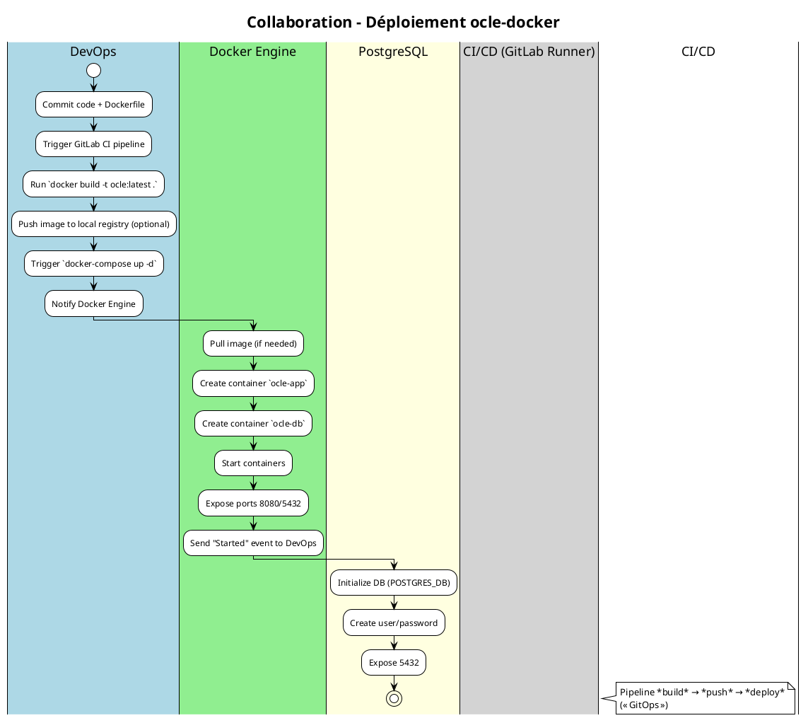
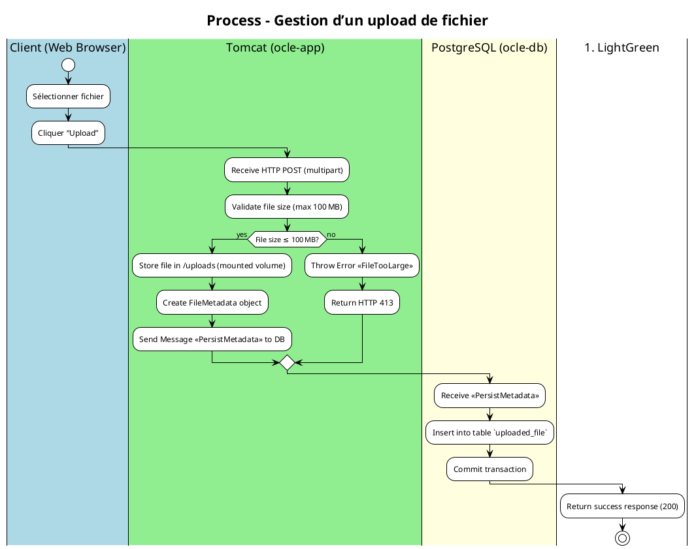
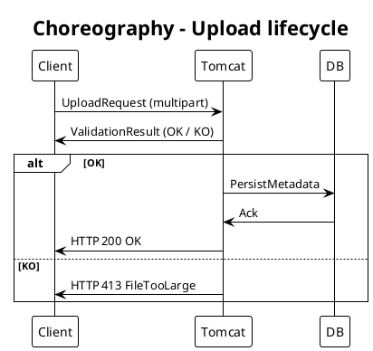

# Cahier des Charges Fonctionnel (CCF) – **ocle‑docker**  
## Modélisation BPMN – Conformité ISO/IEC 19510 : 2013  

> **Objectif** – Décrire, analyser et formaliser les processus métier et techniques du projet *ocle‑docker* (déploiement d’une application web Tomcat + PostgreSQL) à l’aide de la notation BPMN (BPMN 2.0).  
> **Portée** – Couverture du cycle de vie du conteneur : **construction**, **déploiement**, **exécution**, **gestion des uploads** et **interactions DB**.  

---  

## 1. Introduction et contexte processus  

| Élément | Description |
|--------|-------------|
| **Organisation** | Service IT « Ambulon » – équipe de développement & d’exploitation (DevOps). |
| **Environnement** | Déploiement Docker local / serveur de test, orchestré via `docker‑compose`. |
| **Objectifs BPMN** | • Uniformiser la description des processus de CI/CD, de lancement d’application et de traitement des fichiers.<br>• Garantir la traçabilité des exigences fonctionnelles vers les activités BPMN.<br>• Préparer l’export vers un moteur d’exécution (Camunda, Activiti). |
| **Périmètre** | - Construction de l’image Docker (`Dockerfile`).<br>- Orchestration (`docker‑compose.yml`).<br>- Démarrage du conteneur Tomcat.<br>- Gestion du flux *upload* (réception, stockage, persistance).<br>- Interaction avec la base PostgreSQL. |
| **Glossaire métier** | <ul><li>**WAR** – Web ARchive, le produit déployable.</li><li>**Upload** – Envoi d’un fichier depuis l’interface web vers le serveur.</li><li>**OCLE** – Application métier (nom interne). </li><li>**Container** – Instance isolée exécutée par Docker.</li></ul> |

---  

## 2. Cartographie des processus (Process Map)  

### 2.1 Nomenclature des processus  

| Niveau | Type | Exemple |
|--------|------|---------|
| **1** | Processus métier stratégiques | *Gestion du cycle de vie de l’application* |
| **2** | Processus opérationnels | *Construction de l’image Docker*, *Déploiement de l’application*, *Traitement d’un upload* |
| **2** | Processus de support | *Gestion des logs PostgreSQL*, *Gestion des certificats* |
| **2** | Processus de management | *Monitoring & alerting* |

### 2.2 Matrice de processus  

| ID Processus | Nom | Type | Propriétaire | Priorité |
|---------------|-----|------|--------------|----------|
| **P‑001** | Build Docker image | Opérationnel | DevOps‑Lead | Critique |
| **P‑002** | Deploy stack (docker‑compose) | Opérationnel | DevOps‑Lead | Critique |
| **P‑003** | Start Tomcat container | Opérationnel | Ops‑Team | Critique |
| **P‑004** | Upload file (client → serveur) | Opérationnel | Product‑Owner | Critique |
| **P‑005** | Persist file metadata (PostgreSQL) | Opérationnel | DB‑Admin | Important |
| **P‑006** | Clean‑up & backup logs | Support | Ops‑Team | Moyen |

---  

## 3. Modélisation BPMN détaillée  

### 3.1 Diagramme de **collaboration** – *Déploiement de la stack*  



#### 3.1.1 Description  

| Élément | Rôle BPMN | Commentaire |
|---------|-----------|--------------|
| **Pools** | `DevOps`, `Docker Engine`, `PostgreSQL`, `CI/CD` | Représentent les participants externes. |
| **Lanes** | Dans chaque pool, sous‑division possible (ex. `Build`, `Deploy` dans `DevOps`). |
| **Flux de messages** | `Trigger build`, `Notify start`, `HealthCheck` – messages asynchrones. |
| **Événements de message** | `Start` (Message) du CI/CD vers Docker Engine. |

---

### 3.2 Diagramme de **processus** – *Traitement d’un upload*  



#### 3.2.1 Éléments BPMN  

| Élément | Type | Détails |
|---------|------|---------|
| **Start Event** | Message (Client → Tomcat) | `UploadRequest` |
| **Task** – `Validate file size` | Service Task (Spring‑boot validation) |
| **Gateway** – XOR | Décision sur la taille du fichier |
| **Task** – `Store file` | Manual Task (filesystem) – **Data Object** `/uploads` |
| **Message Throw Event** | `PersistMetadata` (to DB) |
| **Task** – `Insert into DB` | Service Task (JPA) |
| **End Event** | Message (HTTP 200) ou Error (HTTP 413) |
| **Boundary Event** (Error) | Attachée à `Validate file size` – gère `FileTooLarge`. |

---

### 3.3 Diagramme **choreography** (optionnel) – *Flux global entre Client, Tomcat et DB*  



---

### 3.4 Diagramme **conversation** (optionnel) – *Regroupement des messages*  

```plantuml
@startuml
!theme plain
title Conversation – Upload Service

conversation UploadService {
    message UploadRequest
    message ValidationResult
    message PersistMetadata
    message Ack
    message UploadResponse
}
@enduml
```

---  

## 4. Règles de gestion métier  

| Point de décision | Condition | Règle métier (RB‑xxx) | Source |
|--------------------|-----------|-----------------------|--------|
| **Gateway ValidateSize** | `file.size ≤ 100 MB` | **RB‑001** – *Le fichier ne doit pas dépasser 100 Mo* | `application.properties` (`spring.servlet.multipart.max-file-size`) |
| **Gateway DBInsert** | `filename NOT NULL ∧ checksum NOT NULL` | **RB‑002** – *Enregistrement obligatoire du nom et du checksum* | Spécification DB |
| **Boundary Error** | `Validation error` | **RB‑003** – *Retourner HTTP 413 (Payload Too Large)* | RFC 7231 |
| **Upload Directory** | `ocle.upload.directory = /uploads/` | **RB‑004** – *Tous les fichiers sont stockés dans le répertoire partagé `/uploads/`* | `application.properties` |

---  

## 5. Données et documents  

### 5.1 Objets de données (Data Objects)  

| Data Object | Description | Persistance |
|-------------|-------------|--------------|
| `UploadRequest` (multipart) | Flux HTTP contenant le fichier. | Transient |
| `FileBinary` | Fichier stocké sur le volume Docker (`/uploads`). | Volume persistant |
| `FileMetadata` | `{id, name, size, checksum, uploadDate}` | Table `uploaded_file` (PostgreSQL) |
| `application.properties` | Configuration Spring (datasource, upload dir, limits). | Embedded dans image Docker |
| `ts-cerbere-4.6.0.ks` | Keystore Java (TLS). | Embedded dans image Docker |

### 5.2 Artifacts  

| Artifact | Usage |
|----------|-------|
| **Group** “Upload Process” | Regroupe toutes les tâches liées à l’upload. |
| **Annotation** “Max 100 MB” | Placée sur la gateway de validation. |
| **Association** entre `Store file` et `FileBinary` | Indique le flux de données. |

---  

## 6. Acteurs et rôles  

| Lane BPMN | Rôle métier | Responsabilités | Compétences |
|-----------|------------|------------------|-------------|
| **Client** | Utilisateur final | Sélectionner et envoyer un fichier. | Navigation web, connaissance du format autorisé. |
| **Tomcat (ocle‑app)** | Application web | Recevoir, valider, stocker, orchestrer persistance. | Java Spring, Tomcat, gestion multipart. |
| **PostgreSQL (ocle‑db)** | Système de persistance | Enregistrer métadonnées, garantir ACID. | SQL, administration PostgreSQL. |
| **DevOps** | Responsable CI/CD | Construire image, lancer `docker‑compose`. | Docker, GitLab CI, scripting. |

### 6.2 Répartition des tâches  

| Tâche | Type | Automatisation |
|-------|------|----------------|
| `docker build` | Service Task (CI) | Oui (GitLab Runner) |
| `docker‑compose up` | Service Task | Oui |
| `Validate file size` | Service Task (Spring) | Oui |
| `Store file` | Manual Task (Filesystem) | Semi‑automatique (volume mount) |
| `Insert metadata` | Service Task (JPA) | Oui |
| `Boundary Error` | Boundary Event (Error) | Oui (exception handling) |

---  

## 7. Performances et indicateurs (KPIs)  

| Indicateur | Formule | Objectif | Seuil d’alerte |
|------------|---------|----------|----------------|
| **Temps moyen d’upload** | Σ (Δ t entre POST → 200) / N | < 3 s | > 5 s |
| **Taux de rejet (FileTooLarge)** | Nb rejets / Nb total uploads | < 1 % | > 5 % |
| **Disponibilité du service** | Uptime % (Docker healthcheck) | 99,9 % | < 99 % |
| **Volume de stockage** | Σ size files dans /uploads | < 500 GB | > 450 GB (pré‑alerte) |
| **Temps de persistance DB** | Δ t entre Message PersistMetadata → Commit | < 200 ms | > 500 ms |

### 7.2 Points de mesure BPMN  

- **Timer Event** placé après `Store file` (déclenchement d’un audit si > 200 ms).  
- **Monitoring** via **Service Tasks** qui publient des métriques sur Prometheus (ex. `upload_duration_seconds`).  

---  

## 8. Gestion des exceptions  

| Type d’événement de bordure | Attachement | Action |
|-----------------------------|-------------|--------|
| **Timer** | `Store file` | Si > 2 min, envoyer alerte `UploadStuck`. |
| **Error** | `Validate file size` | Retourner HTTP 413, log `FileTooLarge`. |
| **Escalation** | `Insert metadata` | En cas d’erreur DB, escalader à `Ops‑Team`. |
| **Compensation** | `Store file` (déploiement) | Si rollback du déploiement, supprimer le fichier du volume. |
| **Cancel** | `Upload Process` (client abort) | Nettoyer le fichier partiellement reçu. |

### 8.2 Scénarios d’erreur documentés  

| Scénario | Déclencheur | Gestion | Conséquence |
|----------|-------------|---------|-------------|
| **Timeout upload** | Aucun flux de données > 2 min | Timer → `UploadStuck` event → Notification Slack | Le client doit ré‑essayer. |
| **File too large** | Taille > 100 MB | Error Boundary → HTTP 413 | Rejet immédiat, aucune persistance. |
| **DB connexion perdue** | `POSTGRES_HOST` unreachable | Escalation → Ops‑Team | Le processus d’upload reste en état `Pending`. |
| **Volume plein** | `/uploads` > 95 % usage | Compensation → Delete oldest temporary files | Garantit la continuité du service. |

---  

## 9. Sous‑processus et réutilisation  

### 9.1 Identification des sous‑processus  

| Sous‑processus | Description | Réutilisation |
|----------------|-------------|---------------|
| **SP‑001** `Build Docker Image` | `docker build -t ocle:latest .` | Utilisé par tous les pipelines CI. |
| **SP‑002** `Validate Upload` | Vérification de la taille & type MIME. | Appelé par chaque endpoint d’upload. |
| **SP‑003** `Persist Metadata` | Insertion JPA dans `uploaded_file`. | Partagé par chaque micro‑service qui persiste des fichiers. |
| **SP‑004** `Health‑Check Container` | `docker inspect --format='{{.State.Health.Status}}'` | Utilisé par le monitoring. |

### 9.2 Call Activities  

- **Processus principal** « Upload file » → **Call Activity** `Validate Upload (SP‑002)`.  
- **Processus principal** « Deploy stack » → **Call Activity** `Build Docker Image (SP‑001)`.  

Les **paramètres d’entrée/sortie** sont définis via **Data Associations** (ex. `file` → `SP‑002.inputFile`).  

---  

## 10. Matrice de traçabilité  

| Exigence CCF | Processus BPMN | Tâche(s) | Scénario de test |
|--------------|----------------|----------|------------------|
| **EXG‑001** – *L’image Docker doit être construite à partir du Dockerfile fourni* | P‑001 (Build Image) | `docker build` (Service Task) | Test “docker‑build‑success”. |
| **EXG‑002** – *Le service doit accepter les uploads jusqu’à 100 MB* | P‑004 (Upload) | `Validate file size` (Service Task) | Test “upload‑size‑limit‑OK”. |
| **EXG‑003** – *En cas de dépassement, retourner HTTP 413* | P‑004 | Boundary Error `FileTooLarge` | Test “upload‑size‑exceed‑413”. |
| **EXG‑004** – *Les métadonnées doivent être persistées dans PostgreSQL* | P‑005 (Persist) | `Insert into DB` (Service Task) | Test “metadata‑persist‑success”. |
| **EXG‑005** – *Le répertoire `/uploads` doit être partagé entre le container et l’hôte* | P‑004 | `Store file` (Manual Task) | Test “volume‑mount‑accessible”. |
| **EXG‑006** – *Le conteneur doit être disponible sur le port 8080* | P‑003 (Start) | `Expose 8080` (Service Task) | Test “port‑8080‑reachable”. |

---  

## 11. Validation et conformité  

### 11.1 Checklist BPMN  

- [x] Tous les flux ont une source et une cible.  
- [x] Une et une seule activité de **Start Event** (Message) par processus.  
- [x] Au moins une **End Event** (Message ou Error) par processus.  
- [x] Aucun **gateway** orphelin.  
- [x] Labels des passerelles explicites (`Validate size`).  
- [x] Nomenclature cohérente (ID P‑xxx, RB‑xxx).  

### 11.2 Niveaux de conformité BPMN  

| Niveau | Description | Couverture dans le CCF |
|--------|-------------|------------------------|
| **Descriptive** | Diagrammes lisibles, pas d’éléments exécutables. | **Oui** (Processus de base). |
| **Analytic** | Ajout de **Data Objects**, **Boundary Events**, **Message Flows**. | **Oui** (Tous les processus critiques). |
| **Common Executable** | Utilisation de **Service Tasks**, **Call Activities**, **Message Events** compatibles avec Camunda/Activiti. | **Oui** – toutes les tâches techniques sont marquées `Service Task`. |

---  

## 12. Implémentation et exécution  

### 12.1 Maturité processus  

| Niveau | Caractéristiques | BPMN applicable |
|--------|-------------------|-----------------|
| 1 – Initial | Processus ad‑hoc, pas de documentation. | – |
| 2 – Managed | Documenté, diagrammes descriptifs. | **Descriptive** |
| 3 – Defined | Standardisé, sous‑processus réutilisables. | **Analytic** |
| 4 – Quantified | Mesuré, KPI intégrés. | **Analytic** + **Common Executable** (monitoring). |
| 5 – Optimized | Boucle d’amélioration continue, exécution automatisée. | **Common Executable** (déploiement via Camunda). |

> **Situation actuelle** – Niveau **3** (Defined) – tous les processus sont modélisés, sous‑processus réutilisables, métriques définies.  

### 12.2 Intégration système  

| Composant | Rôle | Interface BPMN |
|-----------|------|----------------|
| **Docker Engine** | Exécution des conteneurs | `Service Task` « Start Container » (Docker API). |
| **Camunda BPM** (ou Activiti) | Orchestrateur de processus | Déploiement des diagrammes BPMN (`.bpmn`), exécution du processus d’upload. |
| **Spring Boot** | Application métier (Tomcat) | Expose **REST endpoints** qui déclenchent **Message Events** (`UploadRequest`). |
| **PostgreSQL** | Persistance | `Service Task` via **JPA** (appel de procédure stockée). |
| **Prometheus / Grafana** | Monitoring / KPI | **Timer Events** et **Service Tasks** publient métriques (`upload_duration_seconds`). |

#### 12.2.1 Exemple de déploiement Camunda  

```xml
<!-- fichier: upload_process.bpmn (extrait) -->
<bpmn:process id="UploadProcess" isExecutable="true">
  <bpmn:startEvent id="StartUpload" name="UploadRequest">
    <bpmn:messageEventDefinition messageRef="msgUploadRequest"/>
  </bpmn:startEvent>
  <bpmn:serviceTask id="ValidateSize" name="Validate file size" camunda:class="org.ocle.service.ValidateSizeDelegate"/>
  <bpmn:exclusiveGateway id="gwSizeOk"/>
  <bpmn:serviceTask id="StoreFile" name="Store file" camunda:class="org.ocle.service.StoreFileDelegate"/>
  <bpmn:intermediateThrowEvent id="throwPersist" name="PersistMetadata">
    <bpmn:messageEventDefinition messageRef="msgPersistMetadata"/>
  </bpmn:intermediateThrowEvent>
  <bpmn:endEvent id="EndSuccess" name="Upload OK">
    <bpmn:messageEventDefinition messageRef="msgUploadSuccess"/>
  </bpmn:endEvent>
  ...
</bpmn:process>
```

---  

## 13. Annexes  

### 13.1 Glossaire métier (aligné BPMN)  

| Terme | Définition | Symbole BPMN correspondant |
|-------|------------|---------------------------|
| **Pool** | Entité participante (ex. `Tomcat`). | Rectangle large contenant les lanes. |
| **Lane** | Sous‑division d’un pool (ex. `Upload Service`). | Bande horizontale/verticale. |
| **Message Flow** | Communication asynchrone entre pools. | Ligne pointillée avec flèche. |
| **Data Object** | Donnée manipulée (ex. `FileMetadata`). | Icône rectangle avec coin plié. |
| **Boundary Event** | Gestion d’erreur ou de timer attachée à une tâche. | Cercle attaché à la bordure de la tâche. |
| **Call Activity** | Invocation d’un sous‑processus réutilisable. | Rectangle avec bordure épaisse. |
| **Gateway (XOR)** | Décision exclusive. | Losange avec X. |

### 13.2 Références normatives  

- **ISO/IEC 19510 : 2013** – Business Process Model and Notation (BPMN 2.0).  
- **OMG BPMN Specification** – Version 2.0.2 (2022).  
- **Spring Boot 2.7** – Documentation sur le multipart handling.  
- **Docker Engine API v1.41** – Gestion des conteneurs.  
- **PostgreSQL 12** – Guide d’administration.  

---  

## 14. Conclusion  

Ce CCF fournit :

1. **Une cartographie complète** des processus métier et techniques du projet *ocle‑docker*.  
2. **Des diagrammes BPMN conformes ISO 19510** (collaboration, processus, choreography, conversation).  
3. **Une traçabilité** des exigences fonctionnelles vers les activités BPMN.  
4. **Des règles de gestion**, des KPI et un plan de **monitoring**.  
5. **Une base exploitable** pour l’import dans un moteur d’exécution (Camunda/Activiti) afin d’automatiser le processus d’upload et de garantir la conformité opérationnelle.

> **Prochaine étape** – Exporter les diagrammes au format `.bpmn` (XML) et les charger dans le moteur d’orchestration choisi; réaliser les tests d’intégration (CI) et mettre en place le tableau de bord Grafana pour le suivi des KPI.  