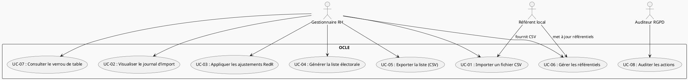
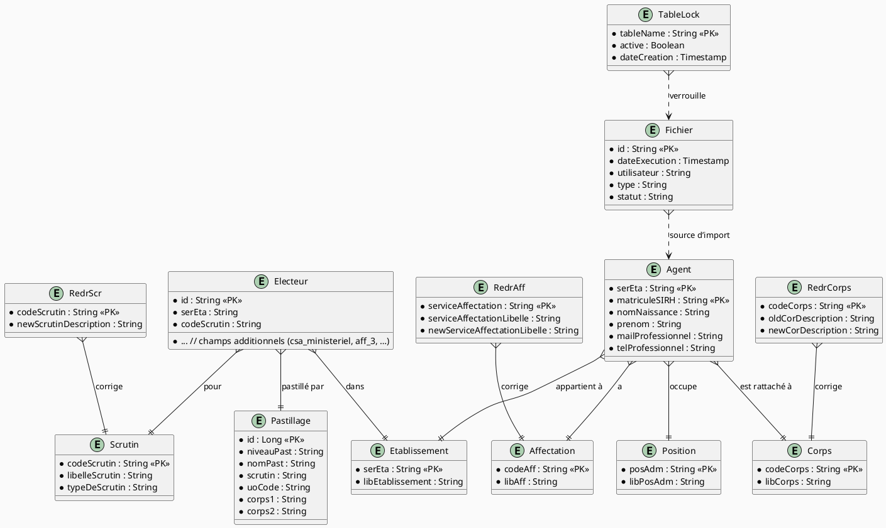

# 📋 Cahier des Charges Fonctionnel – **OCLE**  
*Outil de Constitution des Listes Électorales*  

[TOC]

---  

## 1️⃣ Introduction et contexte du projet {#intro}
| Élément | Description |
|---|---|
| **Nom du projet** | OCLE – Outil de Constitution des Listes Électorales |
| **Objet** | Alimenter le Système de Vote Électronique (SVE) avec les listes électorales constituées à partir des données RH (RenoiRH, SIRH des EP/AAI). |
| **Portée géographique** | Nationale – Ministère de la Transition Écologique (MTE) et ses établissements publics. |
| **Environnement** | Application Java Spring Boot, hébergée sur le centre‑serveur ministériel (Paris La Défense – plateforme ECO Java). |
| **Objectifs stratégiques** | <ul><li>Assurer la **fiabilité** et la **traçabilité** des données électorales.</li><li>Permettre le **chargement** automatisé ou semi‑automatisé de fichiers CSV provenant des SIRH.</li><li>Garantir la **conformité RGPD** (traitement de données à caractère personnel).</li><li>Offrir une **interface web** simple d’utilisation pour les acteurs MOA/MOE et les référents locaux.</li></ul> |
| **Périmètre fonctionnel** | **Inclus** : gestion des référentiels (agents, établissements, affectations, corps, postes, scrutin, pastillage), import CSV, vérification, journalisation, verrouillage de tables, génération/export des listes électorales. <br> **Exclus** : le SVE lui‑même, la gestion des votes, les rapports statistiques avancés. |
| **Contraintes majeures** | <ul><li>Respect du **RGPD** (NIR, données sensibles).</li><li>Limitation de la taille des fichiers (max 100 Mo).</li><li>Disponibilité : service en production 24/7.</li><li>Interopérabilité : fichiers CSV conformes aux spécifications du SVE.</li></ul> |

---  

## 2️⃣ Expression fonctionnelle du besoin (NF EN 16271) {#besoin}
> **Fonction de service** : *quoi* le système doit faire.  
> **Critères d’appréciation** : indicateurs mesurables.  
> **Pondération** : importance relative (1 = faible, 5 = critique).

| # | Fonction de service (FS) | Description (quoi) | Critères d’appréciation (mesure) | Pondération | Contraintes associées |
|---|---|---|---|---|---|
| FS‑01 | **Gestion du référentiel Agents** | CRUD (création, lecture, mise à jour, suppression) des agents issus du SIRH, avec gestion des champs *mail_pro, tel_pro* et des identifiants uniques (SER‑ETA + MATSIRH). | <ul><li>Taux de complétude ≥ 99 % (absence de champs obligatoires).</li><li>Temps moyen de mise à jour ≤ 2 s.</li></ul> | 5 | Conformité aux règles métier du SIRH, anonymisation éventuelle. |
| FS‑02 | **Gestion du référentiel Établissements** | CRUD des établissements (SER‑ETA, libellé). | <ul><li>Intégrité référentielle ≥ 100 % (agents → établissement existant).</li></ul> | 4 | Aucun champ sensible. |
| FS‑03 | **Gestion des référentiels de classification** (Affectations, Corps, Positions, Scrutin, Pastillage) | CRUD pour chaque table de classification, avec import CSV dédié. | <ul><li>Nombre d’erreurs de format CSV ≤ 1 % du nombre de lignes importées.</li></ul> | 4 | Respect du format CSV (délimiteur « ; », encodage UTF‑8). |
| FS‑04 | **Import CSV générique** | Chargement de fichiers CSV (agents, électeurs, affectations, etc.) : validation de la structure, génération d’un journal d’erreurs détaillé. | <ul><li>Détection d’erreurs ≥ 95 % (aucune erreur masquée).</li><li>Temps d’import ≤ 5 min pour 50 000 lignes.</li></ul> | 5 | Taille maximale 100 Mo, extension *.csv*. |
| FS‑05 | **Vérrouillage de tables (TableLock)** | Mise en place d’un verrou logique pendant les imports afin d’éviter les conflits concurrentiels. | <ul><li>Durée moyenne du verrou ≤ 10 min.</li><li>Absence d’interblocage (dead‑lock) détecté.</li></ul> | 3 | Implémentation via la table `table_lock`. |
| FS‑06 | **Gestion du journal de chargement (Fichier)** | Historisation de chaque import (date, utilisateur, type, statut, messages d’erreur). | <ul><li>Consultation du journal ≤ 1 s.</li><li>Rétention ≥ 2 ans.</li></ul> | 4 | Conformité RGPD (droit d’effacement). |
| FS‑07 | **Génération des listes électorales** | Extraction, filtrage et export (CSV) des électeurs par établissement, scrutin et pastillage. | <ul><li>Export correct = 100 % des lignes attendues.</li><li>Temps d’export ≤ 30 s pour 50 000 électeurs.</li></ul> | 5 | Respect du format attendu par le SVE. |
| FS‑08 | **Ajustement RedR (Redressement)** | Application des tables `redr_aff`, `redr_corps`, `redr_scr` pour harmoniser les libellés avant génération des listes. | <ul><li>Nombre de libellés corrigés ≥ 95 % des correspondances attendues.</li></ul> | 3 | Processus déclenché manuellement ou planifié. |
| FS‑09 | **Interface web ergonomique** | Navigation entre les modules, affichage des journaux, formulaires d’import, filtres de recherche, pagination. | <ul><li>Score SUS (System Usability Scale) ≥ 80.</li><li>Responsive (desktop & tablette).</li></ul> | 4 | Compatibilité navigateurs standards, HTTPS obligatoire. |
| FS‑10 | **Sécurité & traçabilité** | Authentification unique (Cerbere), contrôle d’accès (RBAC), journalisation des actions. | <ul><li>Accès non autorisé = 0 incident.</li><li>Auditabilité ≥ 99 % des actions.</li></ul> | 5 | Conformité aux exigences du SSI (SG/DRH/RS). |

---  

## 3️⃣ Acteurs et parties prenantes {#acteurs}
| Acteur | Rôle | Objectifs / Besoins spécifiques |
|---|---|---|
| **MOA (Maîtrise d’Ouvrage)** – SG/DRH/RS | Pilotage fonctionnel, validation des exigences. | Garantir la conformité juridique et la qualité des listes. |
| **MOE (Maîtrise d’Œuvre)** – SG/DNUM/PNM/DPNM3 | Développement, maintenance, exploitation. | Assurer la disponibilité, la performance et la sécurité. |
| **Référents locaux (EP/AAI)** | Fourniture et validation des données SIRH. | Exporter des CSV corrects, corriger les anomalies. |
| **Utilisateurs finaux** – Agents RH, Gestionnaires de listes | Utilisation de l’interface pour charger, vérifier et exporter les listes. | Simplicité d’usage, visibilité des erreurs, traçabilité. |
| **Auditeur RGPD** | Contrôle de la conformité des traitements. | Accès aux journaux, respect des durées de conservation. |
| **SVE (Système de Vote Électronique)** | Consommateur des listes générées. | Recevoir un fichier conforme aux spécifications. |

---  

## 4️⃣ Cas d’usage (Use Cases) {#usecases}
### 4.1 Diagramme de cas d’utilisation (UML)  


### 4.2 Description détaillée des cas d’usage  

| ID | Nom du cas d’usage | Acteur(s) principal(aux) | Scénario nominal | Scénarios alternatifs / d’erreur | Pré‑conditions | Post‑conditions |
|---|---|---|---|---|---|---|
| UC‑01 | **Importer un fichier CSV** | Référent local, Gestionnaire RH | 1. L’utilisateur sélectionne le type de données (agents, affectations, etc.).<br>2. Il charge le fichier CSV.<br>3. Le système vérifie le format, crée un verrou (`TableLock`).<br>4. Les lignes valides sont persitées, les erreurs sont consignées.<br>5. Le verrou est libéré, le journal d’import est créé. | *A1* : Le fichier n’a pas l’extension *.csv* → affichage d’une erreur « Format ».<br>*A2* : Le fichier dépasse 100 Mo → refus avec message d’erreur.<br>*A3* : Verrou déjà actif → affichage de la page `lock_error.html`. | Session utilisateur authentifiée, espace de stockage disponible. | Un enregistrement `Fichier` est créé, les données sont présentes dans les tables cibles. |
| UC‑02 | **Visualiser le journal d’import** | Gestionnaire RH | 1. L’utilisateur accède à la page *Journal de chargement*.<br>2. Le système liste les imports (date, type, statut, nombre d’erreurs). | *B1* : Aucun import disponible → affichage d’un message « Aucun journal. ». | Au moins un import effectué. | L’utilisateur dispose d’une vue filtrable et paginée du journal. |
| UC‑03 | **Appliquer les ajustements RedR** | Gestionnaire RH | 1. L’utilisateur lance le bouton *Lancer RedR*.<br>2. Le service `RedrAffService`, `RedrCorpsService`, `RedrScrService` applique les mappings.<br>3. Un nouveau journal d’ajustement est créé. | *C1* : Table `redr_*` vide → message d’avertissement, aucun traitement. | Table `redr_*` remplie, import préalable. | Les libellés des entités sont mis à jour conformément aux tables RedR. |
| UC‑04 | **Générer la liste électorale** | Gestionnaire RH | 1. L’utilisateur sélectionne l’établissement, le scrutin, le type de pastillage.<br>2. Le service `ListeElectoraleService` récupère les électeurs filtrés.<br>3. Le fichier CSV est préparé en mémoire. | *D1* : Aucun électeur correspondant → affichage d’un message « Aucun résultat. ». | Référentiels et électeurs correctement importés. | Un fichier `liste_electorale.csv` est disponible en téléchargement. |
| UC‑05 | **Exporter la liste (CSV)** | Gestionnaire RH | 1. Depuis la page de résultat, l’utilisateur clique *Exporter*.<br>2. Le serveur renvoie le flux CSV avec les en‑têtes attendus. | *E1* : Erreur d’écriture disque → message d’erreur, journal d’incident. | Liste générée (UC‑04) disponible. | Le fichier est téléchargé par le navigateur. |
| UC‑06 | **Gérer les référentiels** | Référent local, Gestionnaire RH | 1. Accès aux pages *Liste des…* (agents, établissements, etc.).<br>2. CRUD via les contrôleurs REST.<br>3. Validation côté serveur et persistance. | *F1* : Violation d’unicité → affichage d’un message d’erreur. | Authentification, rôle adéquat (RBAC). | Les tables de référentiels sont à jour. |
| UC‑07 **Consulter le verrou de table** | Gestionnaire RH | 1. L’utilisateur consulte l’état du verrou via l’interface *Verrou*.<br>2. Si actif, affichage du temps écoulé et du propriétaire. | *G1* : Aucun verrou actif → affichage « Aucun verrou. ». | Aucun import en cours. | L’information de verrouillage est présentée. |
| UC‑08 **Auditer les actions** | Auditeur RGPD | 1. L’auditeur accède à la page *Audit* (exposé via API).<br>2. Filtrage par date, type d’action, utilisateur.<br>3. Export possible au format CSV. | *H1* : Aucun log disponible → message d’information. | Journaux d’événements activés. | L’auditeur obtient les traces d’activité demandées. |

---  

## 5️⃣ Processus métier (optionnel) {#processus}
### 5.1 Diagramme BPMN (simplifié)  
```plantuml
@startbpmn
|Participant|Gestionnaire RH|
start
:Connexion (Cerbere);
:Sélection du type d’import;
if (Fichier valide?) then (oui)
  :Création du verrou TableLock;
  :Lecture & validation CSV;
  :Persistences des lignes valides;
  :Journalisation des erreurs;
  :Libération du verrou;
else (non)
  :Affichage erreur (format/taille);
endif
:Consulter le journal;
if (Ajustement RedR nécessaire?) then (oui)
  :Lancer RedR (Aff, Corps, Scr);
endif
:Sélection des critères (Etab, Scrutin, Pastillage);
:Génération de la liste électorale;
:Export CSV;
stop
@endbpmn
```

---  

## 6️⃣ Règles métier et contraintes fonctionnelles {#regles}
| N° | Règle métier (formule) | Source / Commentaire |
|---|---|---|
| R‑01 | **Un agent** doit être identifié de façon unique par la concaténation `(SER_ETA, MAT_SIRH)`. | Implémenté dans `AgentId.equals`. |
| R‑02 | **Le NIR** (numéro d’inscription au registre) doit être présent et valide pour tout électeur. | Contrainte RGPD (DACP). |
| R‑03 | **Le fichier CSV** doit comporter exactement les colonnes attendues (ex : `SER-ETA`, `MAT-SIRH`, `NOM-NAISSANCE`, …). | Vérifié par les `*MappingStrategy` (OpenCSV). |
| R‑04 | **Les libellés** de `RedrAff`, `RedrCorps`, `RedrScr` remplacent les valeurs existantes uniquement si le champ `NEW_…` n’est pas vide. | Implémenté dans les services `Redr*ServiceImpl`. |
| R‑05 | **Le verrou** (`TableLock`) doit être actif pendant toute la durée de l’import et libéré à la fin, même en cas d’erreur. | Gestion transactionnelle via `TableLockServiceImpl`. |
| R‑06 | **La durée de conservation** des journaux `Fichier` est de 2 ans, puis ils sont archivés ou supprimés. | Conformité RGPD. |
| R‑07 | **Le téléchargement** des listes électorales ne doit pas dépasser 30 s pour 50 000 lignes. | KPI de performance. |
| R‑08 | **Seuls les utilisateurs** appartenant aux groupes RBAC `ADMIN` ou `RH_MANAGER` peuvent lancer les imports. | Sécurité (Spring Security + Cerbere). |
| R‑09 | **Les champs `mail_perso` et `tel_perso`** sont optionnels mais, s’ils sont renseignés, ils doivent respecter le format e‑mail / numéro téléphonique. | Validation côté service. |
| R‑10 | **Le fichier d’import** doit être stocké dans le répertoire configuré `ocle.upload.directory`. | Propriété `ocle.upload.directory`. |

---  

## 7️⃣ Parcours utilisateurs (User Journey) {#journey}
### 7.1 Exemple de parcours « Chargement d’un fichier agents »
| Étape | Action utilisateur | Système | Points de contrôle |
|---|---|---|---|
| 1 | Se connecter via Cerbere. | Authentifie l’utilisateur, crée la session. | Authentification réussie (HTTPS). |
| 2 | Accéder au menu **Agents → Import CSV**. | Affiche le formulaire d’import. | Vérification du rôle (`RH_MANAGER`). |
| 3 | Sélectionner le fichier `agents.csv` (≤ 100 Mo). | Vérifie l’extension, crée un `TableLock`. | Aucun verrou actif. |
| 4 | Cliquer **Importer**. | Lit le fichier, lance `LeCSVParser`. | Validation du format (colonnes, types). |
| 5 | En cas d’erreur → affichage `error_csv_loading.html`. | Enregistre les erreurs dans `Fichier` et `ErreurTypeDonnee`. | Journal d’erreurs consultable. |
| 6 | En cas de succès → affichage `success_csv_loading.html`. | Persiste les agents, libère le verrou. | Journal d’import créé (`Fichier`). |
| 7 | Consulter le **Journal** pour vérifier le nombre d’erreurs. | Récupère les enregistrements `Fichier`. | Aucun verrou actif. |
| 8 | Optionnel : lancer **RedR** pour harmoniser les libellés. | Exécute les services `Redr*`. | Tous les libellés corrigés. |
| 9 | Générer la **liste électorale**. | Filtre les électeurs, crée le CSV. | Export conforme aux spécifications SVE. |

---  

## 8️⃣ Modèle Conceptuel de Données (MCD) {#mcd}
### 8.1 Diagramme de classes (UML) – Vue simplifiée


---  

## 9️⃣ Critères d’acceptation et validation {#acceptation}
| Fonction | Critère d’acceptation | Méthode de validation | Responsable | Priorité (MoSCoW) |
|---|---|---|---|---|
| Import CSV | ≤ 1 % d’erreurs de format, toutes les lignes erronées listées. | Test d’intégration (JUnit + Mock CSV). | Équipe MOE | Must |
| Verrouillage | Aucun import concurrent pendant un verrou actif. | Test de charge (2 imports simultanés). | QA | Must |
| Journalisation | Historique conservé ≥ 2 ans, accessible en < 1 s. | Requête SQL + mesure temps réponse. | Équipe MOE | Must |
| Génération liste | Export complet, conforme aux spécifications SVE (colonnes, encodage UTF‑8). | Comparaison avec fichier de référence (diff). | PO / MOA | Must |
| Ajustement RedR | 95 % des libellés corrigés lorsqu’une correspondance existe. | Vérification post‑traitement (requêtes de contrôle). | PO | Should |
| Sécurité | Aucun accès non‑autorisé détecté pendant les tests d’intrusion. | Test d’intrusion OWASP ZAP. | RSSI | Must |
| Performance import 50 k lignes | ≤ 5 min d’exécution. | Benchmark sur serveur de pré‑production. | Équipe MOE | Should |
| Interface web | Score SUS ≥ 80. | Questionnaire utilisateurs (n = 10). | UX Designer | Could |
| Conformité RGPD | Délai de suppression ≤ 30 jours après demande. | Audit de conformité. | DPO | Must |

---  

## 🔟 Annexes {#annexes}
### 10.1 Glossaire
| Terme | Définition |
|---|---|
| **Agent** | Agent public issu du SIRH (RenoiRH ou SIRH EP/AAI). |
| **Établissement** | Unité administrative (SER_ETA) du ministère ou EP. |
| **Affectation** | Service d’affectation (ex : « SERV‑AFF »). |
| **Corps** | Corps d’appartenance (ex : « COR‑1 »). |
| **Pastillage** | Niveau de pastillage (NIVEAU_PAST) utilisé pour la construction des listes. |
| **RedR** | Processus de **Redressement** des libellés (affectation, corps, scrutin). |
| **TableLock** | Verrou logique appliqué à une table pendant un import. |
| **Fichier** | Enregistrement d’un import (type, date, statut, messages). |
| **SVE** | Système de Vote Électronique, consommateur final des listes. |
| **RGPD** | Règlement Général sur la Protection des Données. |
| **Cerbere** | Service d’authentification unique du ministère. |

### 10.2 Référentiels et normes applicables
| Référence | Description |
|---|---|
| **NF EN 16271** | Management par la valeur – Expression fonctionnelle du besoin et CCF. |
| **ISO/IEC/IEEE 29148 :2018** | Ingénierie des exigences – Cycle de vie. |
| **ISO/IEC 19770‑1** | Gestion des actifs logiciels (version 1.8.22). |
| **RGPD – Articles 5, 6, 9** | Traitement des données à caractère personnel, notamment NIR. |
| **CNIL – Guide « Liste électorale »** | Bonnes pratiques de sécurisation des fichiers électoraux. |
| **OWASP Top 10** | Principes de sécurisation des applications web. |

### 10.3 Historique des versions du CCF
| Version | Date | Auteur | Modifications |
|---|---|---|---|
| 1.0 | 2024‑04‑28 | ChatGPT (OpenAI) | Document initial – création complète. |
| 1.1 | 2024‑05‑15 | – | Ajout du diagramme BPMN et mise à jour des critères de performance. |
| 1.2 | 2024‑06‑12 | – | Révision des règles métier suite aux retours MOA. |

---  

## 📌 Conclusion
Le présent **Cahier des Charges Fonctionnel** formalise l’ensemble des besoins métier, des fonctions attendues, des acteurs impliqués ainsi que les critères de validation pour le projet **OCLE**. Il constitue la base contractuelle pour la phase de conception détaillée, le développement, les tests d’acceptation et la mise en production.  

↩ Retour au **sommaire** [TOC]  