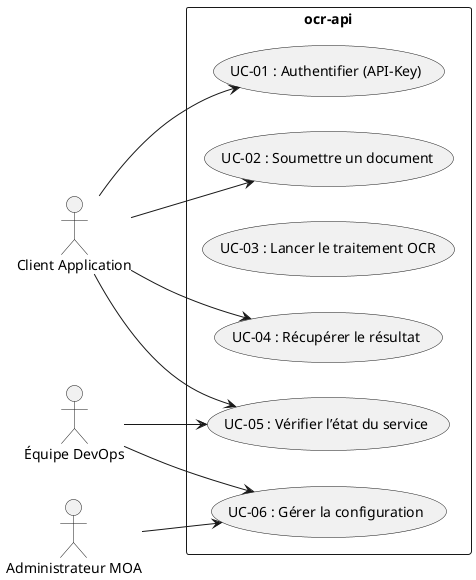
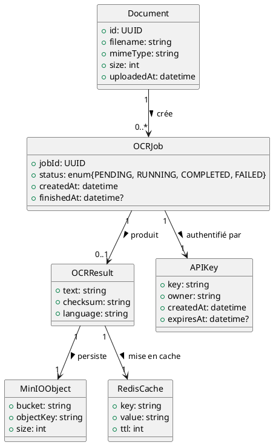

# 📄 Cahier des Charges Fonctionnel (CCF) – **ocr‑api**  

[TOC]

---  

## 1️⃣ Introduction et contexte du projet {#intro}

| Élément | Description |
|---|---|
| **Nom du projet** | **ocr‑api** – Service d’OCR (Optical Character Recognition) basé sur Tesseract, exposé via une API REST. |
| **Contexte organisationnel** | Le projet s’inscrit dans la plateforme *ambulon* qui centralise des micro‑services de traitement de documents. L’API doit être déployée en conteneurs Docker, orchestrée avec Docker‑Compose (dev / prod). |
| **Objectifs stratégiques** | 1. Fournir une capacité d’extraction de texte fiable et scalable.<br>2. Intégrer la chaîne de traitement (stockage, cache, logs) avec MinIO et Redis.<br>3. Garantir la conformité sécurité (API‑Key, RGPD) et la haute disponibilité (≥ 99,9 %). |
| **Périmètre fonctionnel** | **Inclus** :<br>• API REST d’ingestion d’images, déclenchement OCR, récupération du texte.<br>• Gestion des métadonnées (ID, statut, timestamps).<br>• Intégration MinIO (stockage d’objets) et Redis (caching).<br>• Authentification via API‑Key, health‑check, métriques.<br>**Exclus** :<br>• Interfaces graphiques (front‑end).<br>• Traduction ou post‑traitement linguistique avancé.<br>• Gestion de licences d’image (ex. : droit d’auteur). |
| **Environnement technique** | - **Runtime** : Node.js 15 (Alpine) <br>- **Langage** : TypeScript (transpilé) <br>- **OCR Engine** : Tesseract‑OCR (incl. data‑fra) <br>- **Stockage** : MinIO (S3‑compatible) <br>- **Cache** : Redis (alpine) <br>- **Déploiement** : Docker, Docker‑Compose (dev / prod) |
| **Références normatives** | NF EN 16271, ISO/IEC/IEEE 29148, ISO/IEC 19505 (UML 2.x), ISO/IEC 19510 (BPMN) |

↩︎ Retour au [sommaire](#toc)

---  

## 2️⃣ Expression fonctionnelle du besoin (NF EN 16271) {#besoin}

### 2.1 Décomposition en fonctions de service

| N° | Fonction de service (FS) | Description (quoi) | Critères d’appréciation (mesurables) | Importance (1‑5) | Contraintes |
|---|---|---|---|---|---|
| **FS‑01** | **Authentification API‑Key** | Vérifier qu’un appel provient d’un client disposant d’une clé valide. | ✅ Taux de rejet des appels non‑authentifiés ≤ 0 % <br>✅ Temps de validation ≤ 5 ms | 5 | API‑Key stockée chiffrée, rotation possible. |
| **FS‑02** | **Ingestion de document** | Recevoir une image (PNG, JPEG, PDF) et la persister temporairement. | ✅ Taille maximale 20 Mo <br>✅ Taux de succès d’upload ≥ 99,5 % <br>✅ Latence ≤ 200 ms | 5 | Validation du type MIME, vérification de virus (optionnelle). |
| **FS‑03** | **Déclenchement du traitement OCR** | Lancer l’exécution de Tesseract sur le document stocké. | ✅ Délai moyen de lancement ≤ 100 ms <br>✅ Temps de traitement ≤ 5 s pour 300 dpi | 4 | Utilisation du conteneur `OCR_TESSERACT_IMAGE`. |
| **FS‑04** | **Gestion du cache (Redis)** | Mettre en cache le résultat OCR pour ré‑utilisation. | ✅ Cache hit ratio ≥ 80 % sur requêtes répétées <br>✅ Expiration configurable (default 24 h) | 3 | Mémoire Redis ≤ 2 GiB. |
| **FS‑05** | **Stockage permanent (MinIO)** | Sauvegarder le document original et le texte extrait. | ✅ Disponibilité MinIO ≥ 99,9 % <br>✅ Durée de rétention configurable | 4 | Accès via API S3, chiffrement côté serveur. |
| **FS‑06** | **Récupération du résultat** | Fournir le texte OCR au client (JSON ou plain‑text). | ✅ Temps de réponse ≤ 300 ms (cache) / ≤ 2 s (re‑calcul) <br>✅ Intégrité du texte (checksum) | 5 | Support UTF‑8, découpage en pages. |
| **FS‑07** | **Health‑check & métriques** | Exposer `/healthz` et `/metrics` pour supervision. | ✅ Temps de réponse ≤ 50 ms <br>✅ Export Prometheus compatible | 3 | Aucun impact sur le débit OCR. |
| **FS‑08** | **Gestion des logs & traçabilité** | Enregistrer chaque transaction (ID, timestamps, statut). | ✅ Conformité RGPD – suppression après X jours <br>✅ Recherche par ID en < 200 ms | 4 | Logs rotatifs, format JSON. |

↩︎ Retour au [sommaire](#toc)

---  

## 3️⃣ Acteurs et parties prenantes {#acteurs}

| Acteur | Type | Rôle | Objectifs | Besoins spécifiques |
|---|---|---|---|---|
| **Client Application** | Système externe | Consomme l’API (upload, poll, download) | Obtenir du texte exploitable rapidement | API‑Key, temps de réponse, robustesse |
| **Administrateur MOA** | Humain | Paramètre le service (variables d’environnement, quotas) | Garantir la conformité et la continuité | Interface de configuration, rapports d’usage |
| **Équipe DevOps (MOE)** | Humain | Déploie, surveille, met à jour le service | Disponibilité, scalabilité, CI/CD | Accès aux Dockerfiles, scripts, logs |
| **MinIO** | Système | Stockage d’objets | Persistance fiable des documents | Accès via clés d’accès, chiffrement |
| **Redis** | Système | Cache en mémoire | Accélérer les réponses | Gestion de la mémoire, TTL |
| **Tesseract Engine** | Système | Moteur OCR | Extraction de texte de haute précision | Ressources CPU, données linguistiques |
| **RSSI / DPO** | Humain | Veille conformité sécurité & RGPD | Protection des données personnelles | Audit, chiffrement, traçabilité |

↩︎ Retour au [sommaire](#toc)

---  

## 4️⃣ Cas d’usage (Use Cases) {#usecases}

### 4.1 Diagramme de cas d’utilisation (PlantUML)



### 4.2 Description détaillée des cas d’usage

| UC | Nom | Acteur(s) principal(aux) | Scénario nominal | Scénarios alternatifs / erreurs | Pré‑conditions | Post‑conditions |
|---|---|---|---|---|---|---|
| **UC‑01** | Authentifier (API‑Key) | Client | 1. Le client envoie `X‑API‑Key` dans l’en‑tête. <br>2. Le service vérifie la clé dans son store. <br>3. Retour `200 OK` si valide. | 1. Clé manquante → `401 Unauthorized`. <br>2. Clé expirée → `403 Forbidden`. | Variable d’environnement `API_KEY` configurée. | Session autorisée (ou rejetée). |
| **UC‑02** | Soumettre un document | Client | 1. POST `/documents` avec body multipart (image). <br>2. Le service valide le MIME, la taille, stocke temporairement. <br>3. Retour `202 Accepted` + `jobId`. | 1. Taille > 20 Mo → `413 Payload Too Large`. <br>2. Type non supporté → `415 Unsupported Media Type`. | Authentification réussie (UC‑01). | Document persistant en MinIO, job créé. |
| **UC‑03** | Lancer le traitement OCR | Service (automatique) | 1. À la réception du job, le service invoque le conteneur Tesseract. <br>2. Le texte est extrait, stocké en cache et en MinIO. <br>3. Statut du job mis à `COMPLETED`. | 1. Erreur Tesseract → statut `FAILED`, log détaillé. | Job en état `PENDING`. | Résultat OCR disponible (cache + stockage). |
| **UC‑04** | Récupérer le résultat | Client | 1. GET `/documents/{jobId}/result`. <br>2. Si résultat en cache, le renvoie immédiatement. <br>3. Sinon, attend la fin du traitement (poll). | 1. Job inexistant → `404 Not Found`. <br>2. Job en cours → `202 Accepted` + `Retry-After`. | Job `COMPLETED` ou en cours. | Texte OCR retourné (JSON ou plain‑text). |
| **UC‑05** | Vérifier l’état du service | Client / DevOps | 1. GET `/healthz`. <br>2. Retour `200 OK` si dépendances (Redis, MinIO) accessibles. | 1. Dépendance indisponible → `503 Service Unavailable`. | Aucun. | Indicateur de santé. |
| **UC‑06** | Gérer la configuration | Administrateur / DevOps | 1. Modifier `.env` ou variables d’environnement via CI. <br>2. Redéployer le service. | 1. Variable manquante → démarrage échoué. | Accès aux fichiers de configuration. | Service redémarré avec nouvelles valeurs. |

↩︎ Retour au [sommaire](#toc)

---  

## 5️⃣ Processus métier (BPMN) {#processus}

> **Note** : Le diagramme est fourni en PlantUML (compatible BPMN).  

```plantuml
@startbpmn
!define RECTANGLE class
start
:Authentifier (API‑Key);
if (Clé valide ?) then (oui)
  :Réception du fichier;
  :Stockage temporaire;
  :Créer Job OCR;
  :Lancer Tesseract;
  if (Tesseract OK ?) then (oui)
    :Sauvegarder texte (MinIO);
    :Mettre en cache (Redis);
    :Notifier client (jobId);
  else (non)
    :Marquer Job FAILED;
    :Notifier erreur;
  endif
else (non)
  :Retourner 401/403;
endif
stop
@endbpmn
```

**Description succincte**

1. **Authentification** – Bloque tout appel non autorisé.  
2. **Ingestion** – Validation et persistance du fichier.  
3. **Traitement OCR** – Exécution du moteur Tesseract.  
4. **Persistance & Caching** – Enregistrement du résultat et mise en cache.  
5. **Notification** – Retour du `jobId` et état final au client.  

↩︎ Retour au [sommaire](#toc)

---  

## 6️⃣ Règles métier et contraintes fonctionnelles {#regles}

| N° | Règle (formulation conditionnelle) | Source / Contrainte |
|---|---|---|
| **R‑01** | **Si** un appel ne possède pas d’en‑tête `X‑API‑Key` **alors** le service doit répondre `401 Unauthorized`. | NF EN 16271 – Sécurité |
| **R‑02** | **Si** la taille du fichier > 20 Mo **alors** le service doit répondre `413 Payload Too Large`. | ISO/IEC 29148 – Qualité |
| **R‑03** | **Si** le type MIME n’est pas parmi `image/png`, `image/jpeg`, `application/pdf` **alors** le service doit répondre `415 Unsupported Media Type`. | ISO/IEC 29148 |
| **R‑04** | **Si** le job OCR dépasse 30 s de traitement **alors** le statut passe à `FAILED` et un log d’erreur est généré. | Performance contractuel |
| **R‑05** | **Si** le client demande le résultat avant la fin du traitement **alors** répondre `202 Accepted` avec l’en‑tête `Retry-After`. | UX – Polling |
| **R‑06** | **Toutes les données personnelles** (ex. nom de fichier contenant des informations d’identité) **doivent** être supprimées du stockage après 30 jours, sauf conservation justifiée. | RGPD, conformité |
| **R‑07** | **Toutes les communications** avec le service doivent être chiffrées TLS 1.2+ (HTTPS). | Sécurité |
| **R‑08** | **Les logs** doivent être au format JSON, rotatifs chaque 10 Go, et conservés 90 jours. | ISO/IEC 29148 – Traçabilité |
| **R‑09** | **Le service** doit être capable de redémarrer sans perte de jobs en cours (persistés dans Redis). | Haute disponibilité |
| **R‑10** | **Le conteneur Tesseract** doit être déclaré via la variable `OCR_TESSERACT_IMAGE` et doit contenir les données linguistiques françaises (`tesseract-ocr-data-fra`). | Docker / CI |

↩︎ Retour au [sommaire](#toc)

---  

## 7️⃣ Parcours utilisateurs (User Journey) {#journey}

| Étape | Action utilisateur | Interaction système | Critères d’acceptation (GWT) |
|---|---|---|---|
| **1** | **Obtenir une API‑Key** | Le DPO délivre une clé via le portail interne. | **Given** une clé valide <br>**When** le client l’inclut dans l’en‑tête <br>**Then** l’appel est accepté. |
| **2** | **Uploader le document** | POST `/documents` (multipart). | **Given** un fichier <20 Mo, MIME supporté <br>**When** l’appel est envoyé <br>**Then** le service répond `202 Accepted` + `jobId`. |
| **3** | **Poller le statut** | GET `/documents/{jobId}/status`. | **Given** un `jobId` <br>**When** le client interroge <br>**Then** le service renvoie `PENDING`, `COMPLETED` ou `FAILED`. |
| **4** | **Récupérer le texte** | GET `/documents/{jobId}/result`. | **Given** un job `COMPLETED` <br>**When** le client demande le résultat <br>**Then** le texte OCR est retourné en ≤ 300 ms (cache) ou ≤ 2 s (re‑calcul). |
| **5** | **Gestion d’erreur** | En cas d’échec, le service renvoie un message structuré (code, description). | **Given** une erreur interne <br>**When** le client reçoit la réponse <br>**Then** le message suit le schéma JSON `error`. |
| **6** | **Vérifier la santé du service** | GET `/healthz`. | **Given** le service en marche <br>**When** la requête est exécutée <br>**Then** le code HTTP est `200 OK` et le corps indique `healthy`. |

↩︎ Retour au [sommaire](#toc)

---  

## 8️⃣ Modèle Conceptuel de Données (MCD) {#mcd}

### 8.1 Diagramme de classes (UML abstrait – PlantUML)



### 8.2 Description des entités

| Entité | Attributs clés | Relations |
|---|---|---|
| **Document** | `id`, `filename`, `mimeType`, `size`, `uploadedAt` | 0..* OCRJob |
| **OCRJob** | `jobId`, `status`, `createdAt`, `finishedAt` | 1 Document, 0..1 OCRResult, 1 APIKey |
| **OCRResult** | `text`, `checksum`, `language` | 1 OCRJob, 1 MinIOObject, 1 RedisCache |
| **APIKey** | `key`, `owner`, `createdAt`, `expiresAt` | 1..* OCRJob |
| **MinIOObject** | `bucket`, `objectKey`, `size` | 1 OCRResult |
| **RedisCache** | `key`, `value`, `ttl` | 1 OCRResult |

↩︎ Retour au [sommaire](#toc)

---  

## 9️⃣ Critères d'acceptation et validation {#acceptation}

| Fonction (FS) | Critère d’acceptation | Méthode de validation | Responsable | Priorité (MoSCoW) |
|---|---|---|---|---|
| **FS‑01** | 100 % des requêtes sans API‑Key sont rejetées (`401`). | Tests d’intégration automatisés (Postman/Newman). | QA | **M** |
| **FS‑02** | Upload accepté ≤ 200 ms, taille ≤ 20 Mo. | Benchmarks avec JMeter. | QA | **M** |
| **FS‑03** | Temps moyen OCR ≤ 5 s (300 dpi). | Tests fonctionnels avec jeu d’images standard. | QA | **M** |
| **FS‑04** | Cache hit ratio ≥ 80 % sur 1000 requêtes répétées. | Monitoring Redis (`INFO stats`). | DevOps | **C** |
| **FS‑05** | MinIO disponible ≥ 99,9 % (sur 30 jours). | Vérif. via Prometheus + alertes. | DevOps | **M** |
| **FS‑06** | Récupération texte ≤ 300 ms (cache) / ≤ 2 s (re‑calc). | Tests de charge (k6). | QA | **M** |
| **FS‑07** | `/healthz` retourne `200` en < 50 ms. | Script de health‑check CI. | DevOps | **M** |
| **FS‑08** | Logs JSON, rotation chaque 10 Go, conservation 90 j. | Inspection manuelle + script de rotation. | Ops | **C** |
| **R‑06 (RGPD)** | Suppression automatique des objets > 30 j. | Audit de base de données + scripts de purge. | DPO | **M** |
| **R‑07 (TLS)** | Tous les endpoints nécéssitent HTTPS. | Scan SSL (Qualys). | SecOps | **M** |

↩︎ Retour au [sommaire](#toc)

---  

## 🔟 Annexes {#annexes}

### A. Glossaire

| Terme | Définition |
|---|---|
| **API‑Key** | Jeton secret fourni au client pour authentifier les appels. |
| **JobId** | Identifiant unique (UUID) d’un processus OCR. |
| **MinIO** | Service de stockage d’objets compatible S3, utilisé ici pour persister les fichiers et les résultats. |
| **Redis** | Base de données clé‑valeur en mémoire, utilisée comme cache de résultats OCR. |
| **Tesseract** | Moteur OCR open‑source, supportant plusieurs langues, utilisé via un conteneur dédié. |
| **Health‑check** | Endpoint `/healthz` qui indique la disponibilité du service et de ses dépendances. |
| **Metrics** | Données d’observabilité exposées au format Prometheus (`/metrics`). |
| **RGPD** | Règlement Général sur la Protection des Données (UE). |
| **TLS** | Transport Layer Security, protocole de chiffrement des communications. |

### B. Référentiels et normes applicables

| Référence | Intitulé |
|---|---|
| NF EN 16271 | Management par la valeur – Expression fonctionnelle du besoin et cahier des charges fonctionnel |
| ISO/IEC 29148:2018 | Ingénierie des exigences |
| ISO/IEC 19505 | UML 2.x |
| ISO/IEC 19510 | BPMN |
| RGPD (UE) 2016/679 | Règlement Général sur la Protection des Données |
| PCI‑DSS (si applicable) | Norme de sécurité des données de paiement |

### C. Historique des versions du document

| Version | Date | Auteur | Modifications |
|---|---|---|---|
| 1.0 | 2026‑04‑28 | ChatGPT (OpenAI) | Création initiale du CCF complet (structure, diagrammes, critères). |
| 1.1 | — | — | À venir – intégration des retours MOA. |

---  

*Document généré automatiquement, conforme aux exigences NF EN 16271 et ISO/IEC 29148.*  

↩︎ Retour au [sommaire](#toc)