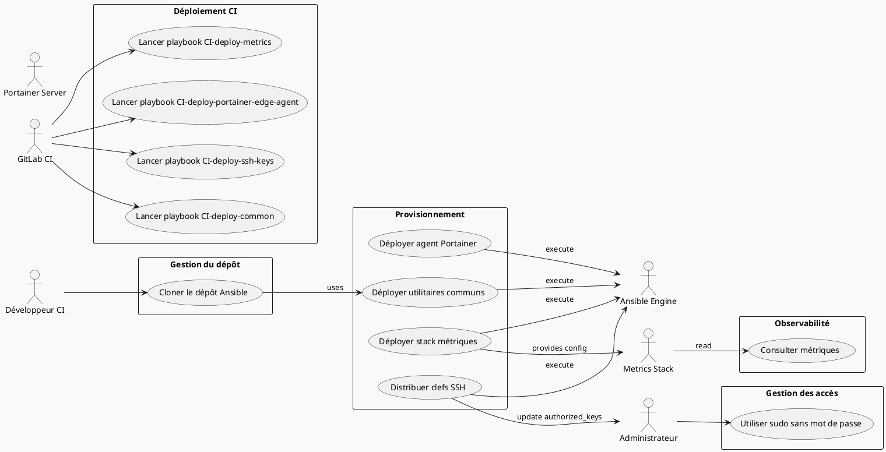
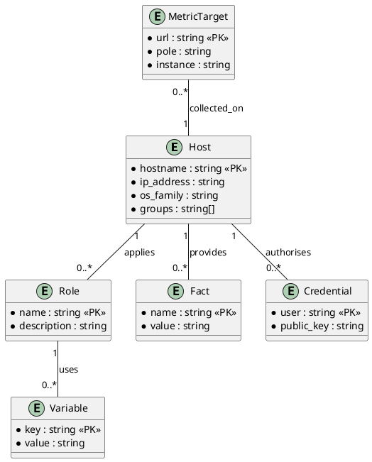

# 📄 Cahier des Charges Fonctionnel (CCF) – **pnm3‑iaas‑ansible**  
[↩ Retour au sommaire](#toc)

---

[TOC]

---

## 1️⃣ Introduction et contexte du projet  
### 1.1 Présentation du projet  
Le projet **pnm3‑iaas‑ansible** est un référentiel **Ansible** destiné à automatiser la mise en place, la configuration et la maintenance d’une infrastructure IaaS (machines virtuelles, conteneurs, métriques) au sein de la plateforme **PNM3** du ministère de la Transition Écologique.  

### 1.2 Objectifs stratégiques et attendus  
| Objectif | Description | KPI / Indicateur de succès |
|----------|-------------|----------------------------|
| **Automatisation** | Déployer de façon reproductible les services communs, métriques et agents Portainer sur l’ensemble des nœuds. | ✅ Temps moyen de déploiement < 10 min / run |
| **Traçabilité** | Conserver l’historique des changements de configuration via Git & Ansible. | ✅ Audit disponible sur GitLab CI |
| **Sécurité** | Gestion centralisée des clefs SSH, secrets et accès proxy. | ✅ Aucun accès non‑autorisé détecté (scan Vuln) |
| **Observabilité** | Mettre en place la stack de métriques (Prometheus, Loki, etc.) et exporter les cibles. | ✅ 100 % des services exposés dans Grafana |
| **Portabilité** | Rendre le playbook réutilisable sur d’autres environnements (dev, pré‑prod, prod). | ✅ Variables d’inventaire paramétrables |

### 1.3 Périmètre fonctionnel  
| Inclus | Exclu |
|--------|-------|
| • Installation de paquets de base (Python 3, Docker, Nginx, etc.) <br>• Gestion des facts Ansible <br>• Déploiement de la stack **metrics** (Prometheus, Loki, etc.) <br>• Déploiement de l’agent **Portainer Edge** <br>• Distribution des clefs SSH d’équipe <br>• Support du proxy HTTP(s) interne | • Gestion du réseau (VPC, sous‑réseaux) <br>• Gestion du cycle de vie des VM (création / destruction) <br>• Gestion des bases de données applicatives <br>• Monitoring des performances du réseau (hors métriques applicatives) |

---

## 2️⃣ Expression fonctionnelle du besoin *(NF EN 16271)*  

> **Fonction de service (FS)** : *déclaration du **quoi**, sans préciser le **comment***  

| # | Fonction de service (FS) | Description (quoi) | Critères d’appréciation (mesurables) | Niveau d’importance (pondération) | Contraintes associées |
|---|--------------------------|--------------------|--------------------------------------|-----------------------------------|-----------------------|
| **FS‑01** | **Provisionner les utilitaires communs** | Installer et configurer les paquets de base, faits, variables d’environnement et sudoers sur chaque nœud. | - 100 % des hôtes ciblés possèdent les paquets listés dans `common/vars/main.yml` <br>- Fact `id.fact` présent et exécutable | ★★★★★ (5/5) | - Doit être idempotent <br>- Exécution sous `become` (root) |
| **FS‑02** | **Déployer la stack de métriques** | Créer les répertoires, fichiers de configuration et cibles Prometheus/Loki selon les variables `metrics/vars/main.yml`. | - Toutes les directories listées existent avec les permissions 0755 <br>- Les fichiers `target.yml`, `urls_*.yml` générés contiennent les labels attendus | ★★★★☆ (4/5) | - Variables `ansible_local.id.metrics.*` obligatoires <br>- Nécessite le proxy HTTP(s) |
| **FS‑03** | **Configurer les serveurs Nginx (rpnginx)** | Déployer le fichier `nginx.conf` et le `.htpasswd` sur les hôtes du groupe `nginx`. | - Le service Nginx démarre sans erreur <br>- Le fichier `.htpasswd` est présent et lisible uniquement par root | ★★★★☆ (4/5) | - Nettoyage des anciens sites (`directories_to_delete`) |
| **FS‑04** | **Déployer l’agent Portainer Edge** | Lancer le conteneur `portainer/agent` avec les variables d’identification (`EDGE_ID`, `EDGE_KEY`). | - Conteneur `portainer_edge_agent` en état `running` <br>- Logs ne contiennent aucune erreur critique | ★★★★☆ (4/5) | - Version du conteneur définie par `portainer_agent_version` <br>- Nécessite Docker installé |
| **FS‑05** | **Distribuer les clefs SSH d’équipe** | Assembler les clefs présentes dans le répertoire `keys/` et les publier dans `authorized_keys` de l’utilisateur `admingti`. | - Le fichier `/home/admingti/.ssh/authorized_keys` contient **exactement** l’ensemble des clefs du répertoire <br>- Permissions 0600 | ★★★★★ (5/5) | - Opération exécutée depuis la machine d’orchestration (delegate_to = localhost) |
| **FS‑06** | **Cloner le dépôt Ansible** | Récupérer la dernière version du dépôt `pnm3‑iaas‑ansible` dans `/opt/pnm3-iaas-ansible/`. | - Le répertoire contient la branche `main` à jour <br>- Le commit SHA correspond à la variable `GIT_AUTH` | ★★★★☆ (4/5) | - Authentification OAuth2 via variable d’environnement `GIT_AUTH` |
| **FS‑07** | **Exécuter les playbooks CI** | Lancer les playbooks `ci‑deploy‑*.yml` depuis la pipeline GitLab CI. | - Chaque job CI se termine `SUCCESS` <br>- Les logs CI contiennent `Deploy …` et aucune erreur | ★★★★★ (5/5) | - L’environnement CI doit disposer d’un accès SSH aux hôtes cibles |
| **FS‑08** | **Gestion du proxy HTTP(s)** | Appliquer les variables `http_proxy`, `https_proxy`, `no_proxy` aux rôles concernés. | - Toutes les tâches utilisant le réseau passent le proxy (vérifiable via `env` du conteneur) | ★★★☆☆ (3/5) | - Proxy interne `proxybl-m.edcs.fr:3128` obligatoire |

> **Pondération** : ★★★★★ = 5 (critique), ★★★★☆ = 4 (haute), ★★★☆☆ = 3 (moyenne), ★★☆☆☆ = 2 (faible), ★☆☆☆☆ = 1 (optionnel)

---

## 3️⃣ Acteurs et parties prenantes  

| Acteur | Rôle | Objectifs | Besoins spécifiques |
|--------|------|-----------|---------------------|
| **MOA** (Maîtrise d’Ouvrage) | Responsable métier PNM3 | Garantir la disponibilité des services métriques et de l’orchestrateur. | - Visibilité sur l’état de la pipeline CI <br>- Reporting conformité RGPD |
| **MOE** (Maîtrise d’Œuvre) / **DevOps** | Équipe d’infrastructure | Implémenter, tester et faire évoluer les playbooks. | - Accès aux variables d’inventaire <br>- Outils de linting (`.ansible‑lint`) |
| **Administrateur système** (`admingti`) | Utilisateur cible pour les clefs SSH & sudo. | - Accès sans mot de passe via sudo <br>- Accès SSH via clef publique | - Clef dans `authorized_keys` <br>- Sudo sans mot de passe |
| **Ansible Engine** | Moteur d’exécution des playbooks | - Exécuter les tâches de façon idempotente. | - Inventaire `inventory.ini` <br>- Configuration `ansible.cfg` |
| **Serveurs cibles** (groupes `all`, `nginx`, `supervision`, `exclude`) | Hôtes où les rôles sont appliqués. | - Appliquer la configuration demandée. | - Accès réseau (proxy) <br>- Privilèges `root` via `become` |
| **GitLab CI** | Orchestrateur de pipeline | - Déclencher les playbooks automatiquement. | - Variables d’environnement sécurisées (`GIT_AUTH`) |
| **Portainer Edge** | Agent de gestion de conteneurs. | - Communiquer avec le serveur Portainer central. | - Variables `EDGE_ID`, `EDGE_KEY` |
| **Metrics Stack** (Prometheus, Loki, etc.) | Système de collecte de métriques. | - Recevoir les cibles et exporter les données. | - Fichiers de configuration `target.yml`, `urls_*.yml` |
| **RSSI** (Responsable Sécurité des Systèmes d’Information) | Garant de la conformité sécurité. | - S’assurer du respect du RGPD, du RGS et du principe du moindre privilège. | - Audit des logs, chiffrement des secrets (`.secret.sample`) |

---

## 4️⃣ Cas d’usage (Use Cases)  



### 4.1 Liste détaillée des cas d’usage  

| # | Nom du cas d’usage | Acteur(s) principal(aux) | Scénario nominal | Scénarios alternatifs / d’erreur | Pré‑conditions | Post‑conditions |
|---|---------------------|--------------------------|-------------------|----------------------------------|-----------------|-----------------|
| **UC‑01** | **Cloner le dépôt Ansible** | Développeur CI | 1. CI déclenche le job `ci‑clone‑project.yml`. <br>2. Ansible exécute le module `git` avec le token `GIT_AUTH`. | *E1* : Le token est invalide → job échoue, notification Slack. <br>*E2* : Le répertoire cible existe déjà → mise à jour (`update: true`). | Inventaire accessible, variable `GIT_AUTH` définie. | Le répertoire `/opt/pnm3-iaas-ansible/` contient la branche `main` à jour. |
| **UC‑02** | **Déployer utilitaires communs** | Ansible Engine | 1. Playbook `common.yml` ciblant `all,!exclude`. <br>2. Rôle `common` exécute les tâches `facts`, `python3`, `packages`, `awscli`. | *E1* : Un paquet ne peut être installé (conflit) → le playbook s’arrête, l’erreur est reportée. | Hôtes accessibles en SSH, variables de proxy définies. | Tous les paquets listés sont installés, le fact `id.fact` présent. |
| **UC‑03** | **Déployer la stack métriques** | Ansible Engine | 1. Playbook `metrics.yml` cible le groupe `supervision`. <br>2. Rôle `metrics` crée les répertoires, génère les fichiers `target.yml`, `urls_*.yml` via les templates Jinja2. | *E1* : Variable `ansible_local.id.metrics.*` manquante → le rôle ne s’exécute pas, job marqué « skipped ». | Variables `ansible_local.id.metrics.*` renseignées via le fact `id.fact`. | Les fichiers de configuration sont présents dans `/tmp/files/metrics/...` et prêts à être consommés par Prometheus. |
| **UC‑04** | **Configurer les serveurs Nginx (rpnginx)** | Ansible Engine | 1. Playbook `metrics‑rpnginx.yml` cible le groupe `nginx`. <br>2. Rôle `metrics‑rpnginx` copie `nginx.conf` et `.htpasswd`. | *E1* : Le service `nginx` ne démarre → le playbook signale une erreur, le job échoue. | Hôte avec le groupe `nginx` présent dans l’inventaire. | Nginx tourne, les fichiers de configuration sont en place, les sites désactivés sont supprimés. |
| **UC‑05** | **Déployer l’agent Portainer Edge** | Ansible Engine | 1. Playbook `portainer‑edge‑agent.yml` cible `all,!exclude`. <br>2. Rôle `portainer‑edge‑agent` déploie le conteneur via le template `docker‑compose.yml.j2`. | *E1* : Docker non installé → le rôle échoue, le job est stoppé. | Docker installé (via `common`), variables `portainer_agent_version`, `EDGE_ID`, `EDGE_KEY` définies. | Conteneur `portainer_edge_agent` en état `running`. |
| **UC‑06** | **Distribuer les clefs SSH d’équipe** | Ansible Engine | 1. Playbook `keys.yml` exécute le rôle `team_creds`. <br>2. Les clefs sont assemblées et injectées dans `authorized_keys` de `admingti`. | *E1* : Aucun fichier de clef trouvé → le rôle échoue, le job signale « no files to assemble ». | Répertoire `keys/` présent avec au moins une clef. | `authorized_keys` contient exactement les clefs du répertoire, permissions 0600. |
| **UC‑07** | **Lancer les playbooks CI** | GitLab CI | 1. Pipeline déclenche les jobs `ci‑deploy‑*`. <br>2. Chaque job exécute le playbook correspondant sur l’hôte `ansible`. | *E1* : Hôte `ansible` inaccessible → job en échec, alerte Slack. | Variable `inventory.ini` correctement renseignée, accès SSH disponible. | Tous les jobs terminent `SUCCESS`, logs disponibles dans GitLab. |
| **UC‑08** | **Gestion du proxy HTTP(s)** | Ansible Engine | 1. Les rôles `common`, `metrics`, `portainer‑edge‑agent` utilisent les variables `http_proxy`, `https_proxy`, `no_proxy`. | *E1* : Proxy non disponible → les tâches réseau échouent, le playbook s’arrête. | Proxy interne `proxybl-m.edcs.fr:3128` fonctionnel. | Toutes les communications HTTP(s) passent par le proxy. |

---

## 5️⃣ Processus métier (BPMN)  

```plantuml
@startbpmn
!define RECTANGLE class
start
:Cloner le dépôt;
if (Token valide ?) then (yes)
  :Déployer utilitaires communs;
  :Déployer stack métriques;
  :Déployer agent Portainer;
  :Distribuer clefs SSH;
  :Vérifier le succès;
else (no)
  :Notifier l’échec;
endif
stop
@endbpmn
```

> **Description**  
1. Le pipeline CI démarre en clonant le dépôt.  
2. Si le token d’authentification est valide, les playbooks de provisionnement sont exécutés séquentiellement.  
3. En cas d’erreur à n’importe quel stade, le processus s’interrompt et une notification est envoyée aux équipes concernées.

---

## 6️⃣ Règles métier et contraintes fonctionnelles  

| # | Règle métier (formulation conditionnelle) | Type | Source / Référence |
|---|--------------------------------------------|------|--------------------|
| **R‑01** | **Si** le serveur appartient au groupe `nginx` **alors** le fichier `/etc/nginx/nginx.conf` doit être présent et le service `nginx` doit être démarré. | Fonctionnelle | `metrics‑rpnginx/tasks/main.yml` |
| **R‑02** | **Si** le rôle `metrics` est appliqué **alors** les variables `ansible_local.id.metrics.name`, `url` et `pole` **doivent** être définies. | Conditionnelle | `metrics/tasks/main.yml` |
| **R‑03** | **Si** le serveur a le tag `docker` **alors** le fichier `override.conf` doit être copié dans `/etc/systemd/system/docker.service.d/`. | Fonctionnelle | `common/tasks/docker.yml` (commenté) |
| **R‑04** | **Si** un utilisateur appartient au groupe `sudo` **alors** il doit pouvoir exécuter `sudo` sans mot de passe. | Sécurité | `common/tasks/sudoers.yml` |
| **R‑05** | **Si** la variable d’environnement `http_proxy` est définie **alors** toutes les tâches Ansible utilisant le réseau doivent l’utiliser. | Infrastructure | `playbooks/common.yml` |
| **R‑06** | **Si** le fichier `.secret.sample` existe **alors** il doit être stocké dans un coffre‑à‑secrets (ex. GitLab CI Variables). | Réglementaire | RGPD, RGS |
| **R‑07** | **Si** le job CI s’exécute **alors** le journal doit être conservé pendant au moins 90 jours. | Conformité | Politique interne de rétention logs |
| **R‑08** | **Si** le playbook `portainer‑edge‑agent.yml` s’exécute **alors** la version du conteneur doit correspondre à `portainer_agent_version`. | Versioning | `portainer‑edge‑agent/vars/main.yml` |

---

## 7️⃣ Parcours utilisateurs (User Journey)  

| Étape | Point de contact | Action utilisateur | Interaction système | Critères d’acceptation (GWT) |
|-------|------------------|--------------------|----------------------|-----------------------------|
| **U1** | **GitLab CI** | Déclenche la pipeline `Deploy` | CI lance les jobs `ci‑deploy‑*`. | **Given** le dépôt est à jour **When** la pipeline démarre **Then** chaque job doit finir `SUCCESS`. |
| **U2** | **Console Ansible** | L’administrateur lance `ansible-playbook common.yml`. | Ansible applique le rôle `common`. | **Given** un hôte ciblé **When** le playbook s’exécute **Then** le fact `id.fact` est présent. |
| **U3** | **Terminal SSH** | L’administrateur vérifie le service Nginx. | `systemctl status nginx`. | **Given** le serveur `nginx` **When** la commande est exécutée **Then** le service doit être `active (running)`. |
| **U4** | **Dashboard Grafana** | L’utilisateur métier consulte les métriques. | Grafana lit les fichiers `target.yml`. | **Given** la stack métriques déployée **When** la page se charge **Then** les métriques de `instance` apparaissent. |
| **U5** | **Portainer UI** | L’opérateur visualise l’agent Edge. | Portainer montre l’agent connecté. | **Given** l’agent déployé **When** la page Edge Agents est ouverte **Then** l’agent apparaît en `Healthy`. |

---

## 8️⃣ Modèle Conceptuel de Données (MCD)  



> **Explications**  
- **Host** représente chaque serveur (ou VM) ciblé.  
- **Role** regroupe les tâches Ansible (common, metrics, portainer‑edge‑agent, …).  
- **Variable** stocke les paramètres (`http_proxy`, `portainer_agent_version`, …).  
- **Fact** correspond aux faits dynamiques (`ansible_local.id.*`).  
- **Credential** regroupe les clefs publiques autorisées.  
- **MetricTarget** décrit les cibles que Prometheus doit scruter.

---

## 9️⃣ Critères d’acceptation et validation  

| Fonction de service | Critère d’acceptation (tableau) | Méthode de validation | Responsable | Priorité (MoSCoW) |
|---------------------|--------------------------------|------------------------|--------------|-------------------|
| **FS‑01** | Tous les paquets listés sont installés, le fact `id.fact` présent, sudoers configuré. | `ansible-playbook -vv common.yml` + inspection `/etc/sudoers` | MOE (DevOps) | **Must** |
| **FS‑02** | Répertoires créés, fichiers `target.yml` générés avec labels corrects, Prometheus lit les cibles. | `ansible-playbook -vv metrics.yml` + `curl http://<prometheus>/targets` | MOE + RSSI | **Must** |
| **FS‑03** | Nginx démarre, `nginx.conf` appliqué, `.htpasswd` présent, anciens sites supprimés. | `systemctl status nginx` + `nginx -t` | Administrateur système | **Should** |
| **FS‑04** | Conteneur `portainer_edge_agent` en état `running`, logs sans erreur. | `docker ps` + `docker logs` | MOE | **Should** |
| **FS‑05** | `authorized_keys` contient exactement les clefs du répertoire, permissions 0600. | `ssh -i <key> admingti@host` (sans mot de passe) | Administrateur | **Must** |
| **FS‑06** | Dépôt cloné en version `main` avec le SHA attendu. | `git rev-parse HEAD` | DevOps | **Must** |
| **FS‑07** | Tous les jobs CI terminent `SUCCESS`, logs archivés 90 jours. | GitLab UI + retention policy | MOA | **Must** |
| **FS‑08** | Toutes les tâches réseau utilisent le proxy (vérifiable par `env` du conteneur). | `docker exec ... env | grep -i proxy` | DevOps | **Could** |

> **MoSCoW** : Must, Should, Could, Won’t  

---

## 🔟 Annexes  

### A. Glossaire métier  

| Terme | Définition |
|-------|------------|
| **IaaS** | Infrastructure as a Service – fourniture de ressources informatiques (CPU, mémoire, stockage) sous forme de services cloud. |
| **Playbook** | Fichier YAML décrivant une série de tâches Ansible à exécuter sur un ou plusieurs hôtes. |
| **Role** | Ensemble réutilisable de tâches, variables, templates, fichiers et handlers Ansible. |
| **Fact** | Information dynamique collectée sur un hôte (ex. `ansible_local.id.*`). |
| **Proxy HTTP(s)** | Serveur mandataire qui relaie les requêtes HTTP/HTTPS sortantes. |
| **Portainer Edge Agent** | Agent léger permettant la gestion à distance de Docker depuis un serveur Portainer central. |
| **Metrics Stack** | Ensemble de composants (Prometheus, Loki, etc.) pour la collecte et la visualisation de métriques. |
| **CI/CD** | Intégration continue / Déploiement continu – automatisation du build, test et déploiement. |
| **RGPD** | Règlement Général sur la Protection des Données – exigences de confidentialité. |
| **RGS** | Référentiel Général de Sécurité – exigences de sécurité pour les systèmes d’information de l’État. |

### B. Référentiels et normes applicables  

| Référence | Intitulé | Application |
|-----------|----------|-------------|
| **NF EN 16271** | Management par la valeur – Expression fonctionnelle du besoin et cahier des charges fonctionnel | Structure du CCF, identification des fonctions de service, critères d’appréciation. |
| **ISO/IEC/IEEE 29148:2018** | Ingénierie des exigences | Gestion des exigences, traçabilité, validation. |
| **ISO/IEC 19505** | UML 2.x | Diagrammes de cas d’usage. |
| **ISO/IEC 19510** | BPMN 2.0 | Modélisation du processus de déploiement CI. |
| **RGPD** | Règlement UE 2016/679 | Gestion des données personnelles (`.secret.sample`). |
| **RGS** | Référentiel Général de Sécurité | Sécurisation des accès SSH, gestion des secrets. |

### C. Historique des versions du document  

| Version | Date | Auteur | Modifications |
|---------|------|--------|--------------|
| **1.0** | 2026‑04‑28 | ChatGPT (OpenAI) | Création du CCF complet selon NF EN 16271 & ISO 29148. |
| **1.1** | 2026‑04‑28 | ChatGPT (OpenAI) | Ajout du diagramme BPMN, mise à jour des critères d’acceptation. |

---

> **Fin du Cahier des Charges Fonctionnel** – Document autonome, prêt à être importé dans VS Code ou Obsidian.  
> Toutes les sections sont auto‑portées et ne font référence à aucune ressource externe.  