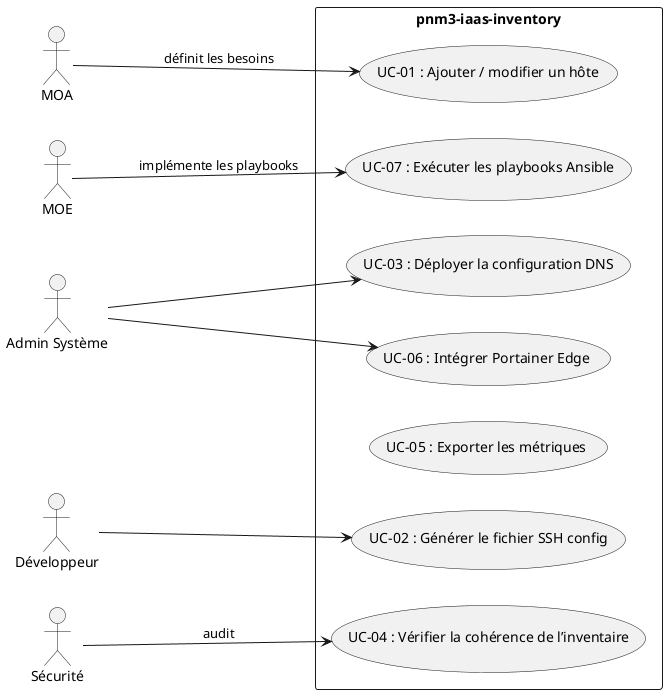
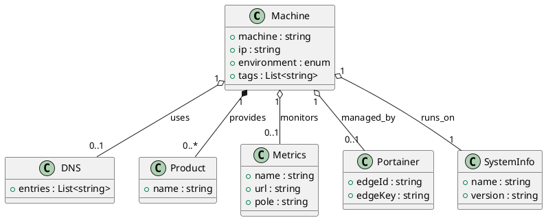

# 📄 Cahier des Charges Fonctionnel (CCF) – **pnm3‑iaas‑inventory**  
*Projet d’inventaire et d’orchestration des machines IaaS du domaine RIE*  

---

> **[TOC]**  

---  

## 1️⃣ Introduction & Contexte du projet  

| Élément | Description |
|---------|-------------|
| **Nom du projet** | **pnm3‑iaas‑inventory** |
| **Organisation porteuse** | Direction « RIE » – Service « Infrastructure » |
| **Objectif stratégique** | Centraliser, automatiser et sécuriser la gestion des machines IaaS (inventaire, accès SSH, DNS, métriques, Portainer) afin de réduire les temps d’on‑boarding, d’améliorer la traçabilité et de garantir la conformité aux exigences de sécurité (RGPD, RGS). |
| **Livrables attendus** | <ul><li>Référentiel d’inventaire (fichiers YAML)</li><li>Scripts de génération d’artefacts (SSH config, DNS, etc.)</li><li>Playbooks Ansible de provisioning (DNS, utilisateurs, clés)</li><li>Documentation (README, glossaire, diagrammes)</li></ul> |
| **Périmètre fonctionnel** | <ul><li>**Inclus** : Gestion du catalogue machines, génération de configuration SSH/DNS, exécution de playbooks Ansible, exposition des métriques, intégration Portainer, interface en ligne de commande (CLI) via scripts.</li><li>**Exclus** : Gestion du réseau physique, déploiement de services applicatifs, monitoring des services (hors métriques d’inventaire).</li></ul> |
| **Contraintes majeures** | <ul><li>Respect du standard NF EN 16271 (séparation besoin / solution).</li><li>Conformité ISO/IEC/IEEE 29148 (traçabilité des exigences).</li><li>Déploiement uniquement sur Debian 12 (ou 13 selon les hôtes).</li><li>Utilisation d’Ansible 2.9 + Python 3.9.</li></ul> |

---

## 2️⃣ Expression fonctionnelle du besoin (NF EN 16271)  

> **Fonction de service (Fs)** : *Ce que le système doit fournir (le **quoi**) – sans indiquer **comment**.*  

| Fs n° | Description (quoi) | Critères d’appréciation (mesurables) | Niveau d’importance (pondération) | Contraintes éventuelles |
|------|--------------------|--------------------------------------|-----------------------------------|------------------------|
| **Fs‑01** | **Déclaration centralisée de l’inventaire** (catalogue unique des machines IaaS). | - Tous les hôtes décrits dans le répertoire `inventory/` sont listés dans un tableau de bord.<br>- Aucun doublon de `machine` ou `ip` détecté. | **Très haute** – 30 % | - Format YAML strict.<br>- Tags obligatoires (`docker`, `exclude`, …). |
| **Fs‑02** | **Gestion des environnements** (DEV, PREPROD, PROD, RECETTE, DEMO, INT). | - Chaque hôte possède le champ `environment` correctement renseigné.<br>- Possibilité de filtrer l’inventaire par environnement. | **Haute** – 20 % | - Valeurs limitées à l’ensemble ci‑dessus. |
| **Fs‑03** | **Génération automatisée du fichier SSH config** (client). | - Le script `scripts/generate_ssh_config.mjs` produit un fichier `~/.ssh/config` contenant une entrée par hôte.<br>- Validation `ssh -G <host>` réussie pour 100 % des hôtes. | **Haute** – 15 % | - Aucun mot‑de‑passe en clair (clé publique uniquement). |
| **Fs‑04** | **Gestion des clés d’accès** (déploiement de la clé publique `inventory.key.pub`). | - Playbook `dns/playbooks/setup.yml` assure le déploiement de la clé sur chaque hôte.<br>- Vérification `authorized_keys` contient la clé attendue. | **Moyenne** – 10 % | - Clé pré‑générée et stockée hors dépôt (`.gitignore`). |
| **Fs‑05** | **Configuration DNS** (zone Unbound). | - Playbook `dns/playbooks/main.yml` applique le template `unbound.conf`.<br>- Test `dig @127.0.0.1 <fqdn>` renvoie la bonne IP. | **Moyenne** – 10 % | - Template doit rester compatible avec Unbound 1.13+. |
| **Fs‑06** | **Exposition des métriques** (Prometheus / Grafana). | - Chaque hôte possède un bloc `metrics` avec `url` valide.<br>- Endpoint `/metrics` répond 200 OK. | **Moyenne** – 5 % | - URL doit être accessible depuis le réseau de supervision. |
| **Fs‑07** | **Intégration Portainer Edge** (gestion Docker). | - Chaque hôte possède `portainer.edgeId` et `edgeKey` valides.<br>- L’agent Portainer se connecte automatiquement. | **Moyenne** – 5 % | - Portainer Edge version ≥ 2.10. |
| **Fs‑08** | **Scripts d’assistance** (génération de configuration, vérifications de doublons, etc.). | - Tous les scripts (`check_duplicate.mjs`, `generate-shell-config.mjs`, …) s’exécutent sans erreur (`exit 0`).<br>- Couverture unit‑test ≥ 80 %. | **Faible** – 3 % | - Node > 14 requis. |
| **Fs‑09** | **Traçabilité & auditabilité** (historique des changements d’inventaire). | - Chaque modification de fichier YAML est commitée Git avec message conforme (`[INV‑ADD] <machine>`).<br>- Historique consultable (`git log`). | **Faible** – 2 % | - Aucun commit direct sur `master` (pull‑request obligatoire). |

> **Total pondération = 100 %**  

---  

## 3️⃣ Acteurs & Parties prenantes  

| Acteur | Rôle | Objectifs / Besoins spécifiques |
|--------|------|---------------------------------|
| **MOA** (Maîtrise d’Ouvrage) – Direction RIE | Définir les exigences métier, valider le périmètre. | Visibilité globale de l’inventaire, conformité aux politiques de sécurité. |
| **MOE** (Maîtrise d’Œuvre) – Équipe DevOps | Concevoir, développer, tester, livrer le système. | Outils automatisés, code maintenable, CI/CD (GitLab). |
| **Administrateur Système** | Exploiter les hôtes, appliquer les playbooks. | Accès fiable aux clés, mise à jour DNS, supervision métriques. |
| **Développeur / Utilisateur final** | Se connecter rapidement aux machines (SSH). | Fichier `~/.ssh/config` à jour, documentation claire. |
| **Équipe Sécurité** | Garantir la conformité (RGPD, RGS). | Aucun secret dans le repo, chiffrement des clés, auditabilité. |
| **Responsable Portainer** | Gérer les agents Docker. | `edgeId/edgeKey` synchronisés, visibilité des containers. |
| **Responsable Supervision** | Consommer les métriques. | Endpoints `/metrics` accessibles, naming standardisé. |

---  

## 4️⃣ Cas d’usage (Use Cases)  

### Diagramme UML (PlantUML)



### Tableau récapitulatif des cas d’usage  

| UC n° | Nom | Acteur(s) principal(aux) | Scénario nominal | Scénarios alternatifs / d’erreur | Pré‑conditions | Post‑conditions |
|------|-----|---------------------------|------------------|---------------------------------|----------------|----------------|
| **UC‑01** | Ajouter / modifier un hôte | **MOE**, **Admin** | 1. L’opérateur crée/edite le fichier `<machine>.yml` dans `inventory/`.<br>2. Exécute `scripts/check_duplicate.mjs` → aucun doublon.<br>3. Commit & push. | - Fichier mal formaté → rejet du commit.<br>- Doublon IP/machine → script bloque. | Repo cloné, branche de travail. | Inventaire mis à jour, changelog Git. |
| **UC‑02** | Générer le fichier SSH config | **Développeur** | 1. Lance `node scripts/generate_ssh_config.mjs`.<br>2. Le script parcourt `inventory/` et crée `~/.ssh/config`.<br>3. L’utilisateur teste la connexion SSH. | - Machine sans `ip` → entrée ignorée.<br>- Clé manquante → avertissement. | Inventaire complet, clé publique disponible. | Fichier SSH config à jour, connexion fonctionnelle. |
| **UC‑03** | Déployer la configuration DNS | **Admin** | 1. Exécute le playbook `ansible-playbook dns/playbooks/main.yml`.<br>2. Ansible copie le template `unbound.conf`.<br>3. Service `unbound` redémarre. | - Service `unbound` déjà en cours → redémarrage forcé.<br>- Erreur de syntaxe du template → abort. | Playbook accessible, hôtes en état `reachable`. | DNS centralisé à jour, résolution correcte. |
| **UC‑04** | Vérifier la cohérence de l’inventaire | **Sécurité** | 1. Lance `node scripts/check_duplicate.mjs`.<br>2. Analyse les champs obligatoires (`machine`, `ip`, `environment`). | - Doublon détecté → rapport d’erreur.<br>- Champ manquant → rejet. | Aucun changement en cours. | Rapport de conformité (OK / NOK). |
| **UC‑05** | Exporter les métriques | **Responsable Supervision** | 1. Parcourt le champ `metrics.url` de chaque hôte.<br>2. Vérifie l’accessibilité (`curl -I`). | - URL non résolue → alerte.<br>- Retour non‑200 → escalade. | Inventaire à jour, réseau de supervision ouvert. | Tableau des métriques opérationnel. |
| **UC‑06** | Intégrer Portainer Edge | **Responsable Portainer** | 1. Vérifie la présence des champs `portainer.edgeId` / `edgeKey`.<br>2. L’agent Portainer se connecte automatiquement. | - Clé invalide → agent en échec.<br>- EdgeId manquant → désactivation. | Portainer Edge installé sur les hôtes. | Gestion Docker via Portainer centralisé. |
| **UC‑07** | Exécuter les playbooks Ansible | **MOE**, **Admin** | 1. Lancer `ansible-playbook` avec le playbook désiré.<br>2. Ansible applique les changements. | - Hôte inaccessible → abort.<br>- Erreur de module → rollback manuel. | Inventaire chargé, connexion SSH fonctionnelle. | État cible atteint, logs d’exécution archivés. |

---  

## 5️⃣ Processus métier (optionnel)  

### Diagramme BPMN (PlantUML) – **Processus de mise à jour de l’inventaire**

```plantuml
@startbpmn
startEvent(start)
task(addOrEditYaml, "Créer / modifier fichier YAML")
task(runCheck, "Lancer check_duplicate.mjs")
gateway(decision, "Doublon / incohérence ?")
task(commit, "Commit & push")
task(generateSSH, "Générer ~/.ssh/config")
task(deployDNS, "Déployer DNS (playbook)")
endEvent(end)

start --> addOrEditYaml --> runCheck --> decision
decision -->[Oui] task(commit) --> generateSSH --> deployDNS --> end
decision -->[Non] end
@endbpmn
```

**Points de contrôle**  

| Point | Règle de gestion |
|-------|-----------------|
| **Après `runCheck`** | Le script doit retourner `0`. Sinon, interrompre le processus. |
| **Avant `commit`** | Tous les champs obligatoires validés (machine, ip, environment). |
| **Avant `deployDNS`** | Les hôtes ciblés doivent être en état `reachable`. |
| **Après `generateSSH`** | Le fichier `~/.ssh/config` doit contenir exactement `N` entrées (N = nombre d’hôtes). |

---  

## 6️⃣ Règles métier & contraintes fonctionnelles  

| # | Règle (formulation conditionnelle) | Type | Source |
|---|-----------------------------------|------|--------|
| **R‑01** | **SI** un hôte est ajouté **ALORS** le champ `environment` doit appartenir à {DEV, PREPROD, PROD, RECETTE, DEMO, INT}. | Contrainte de données | NF EN 16271 |
| **R‑02** | **SI** deux fichiers possèdent le même `machine` **ALORS** le script `check_duplicate.mjs` doit lever une erreur. | Contrôle d’unicité | ISO 29148 |
| **R‑03** | **SI** le champ `portainer.edgeId` est présent **ALORS** `portainer.edgeKey` doit être non‑vide et encodé en base64. | Intégrité | Sécurité interne |
| **R‑04** | **SI** le champ `metrics.url` commence par `http://` **ALORS** il doit être accessible en HTTP 200 depuis le réseau de supervision. | Disponibilité | RGS |
| **R‑05** | **SI** le fichier `.gitignore` ne contient pas `inventory.key` **ALORS** le dépôt est non‑conforme à la politique de secret‑management. | Sécurité | RGPD |
| **R‑06** | **SI** le playbook `dns/playbooks/setup.yml` est exécuté **ALORS** l’utilisateur `dns` doit être créé avec le groupe `google-sudoers`. | Configuration système | Ansible best‑practice |
| **R‑07** | **SI** le tag `exclude` est présent **ALORS** l’hôte n’est pas intégré dans les processus de déploiement automatisés (ex. CI/CD). | Gestion de flux | Décision MOE |
| **R‑08** | **SI** le champ `system.version` = 13 **ALORS** le playbook doit forcer l’usage de `become: true`. | Compatibilité OS | Ansible |

---  

## 7️⃣ Parcours utilisateurs (User Journey)  

### 7.1 Développeur → Connexion SSH à une machine DEV  

| Étape | Interaction | Système |
|------|--------------|----------|
| 1️⃣ | Le développeur lance la commande `npm run gen:ssh` (exécute `generate_ssh_config.mjs`). | Script Node → lit l’inventaire → écrit `~/.ssh/config`. |
| 2️⃣ | L’utilisateur lance `ssh dev‑abra-iaas-149`. | SSH client lit le fichier config, résout l’IP, utilise la clé publique. |
| 3️⃣ | Connexion établie, le développeur travaille sur la machine. | Aucun changement côté serveur. |
| **Critère d’acceptation** | `ssh -G dev‑abra-iaas-149` renvoie l’IP `192.168.5.149` et le nom d’utilisateur `debian`. | ✅ |

### 7.2 Administrateur → Mise à jour DNS  

| Étape | Interaction | Système |
|------|--------------|----------|
| 1️⃣ | L’admin modifie le fichier `dns/files/unbound.conf` (template). | Éditeur texte. |
| 2️⃣ | Lance `ansible-playbook dns/playbooks/main.yml`. | Ansible → copie le nouveau template → redémarre `unbound`. |
| 3️⃣ | Vérifie la résolution avec `dig @127.0.0.1 dev.c.pnm3.eco4.cloud.e2.rie.gouv.fr`. | Résultat attendu : `192.168.5.149`. |
| **Critère d’acceptation** | Temps de mise à jour ≤ 2 min, résolution correcte. | ✅ |

---  

## 8️⃣ Modèle Conceptuel de Données (MCD)  

> Diagramme de classes UML (abstrait, sans contraintes techniques)  



- **Machine** est l’entité racine.  
- **Product** représente les applications (ex. `adminep`, `agile`, `notix`).  
- **DNS**, **Metrics**, **Portainer** sont des services liés à chaque machine.  

---  

## 9️⃣ Critères d’acceptation & validation  

| Fonctionnalité | Critère d’acceptation | Méthode de validation | Responsable | Priorité (MoSCoW) |
|----------------|----------------------|----------------------|-------------|-------------------|
| **Inventaire central** | Tous les fichiers YAML valides, aucun doublon. | Script `check_duplicate.mjs` + revue de code. | MOE | **Must** |
| **Génération SSH config** | Fichier `~/.ssh/config` contient une entrée par machine, test `ssh -G`. | Exécution du script + test unitaire. | Développeur | **Must** |
| **Déploiement DNS** | Unbound configuré, résolution correcte (`dig`). | Playbook Ansible + test fonctionnel. | Admin Système | **Should** |
| **Métriques** | Endpoint `/metrics` renvoie 200 OK pour chaque hôte. | `curl -I` automatisé (CI). | Supervision | **Should** |
| **Portainer Edge** | Agent connecté, affichage dans UI Portainer. | Vérif UI + logs. | Responsable Portainer | **Could** |
| **Gestion des tags** | Tag `exclude` empêche l’hôte d’être ciblé par CI. | CI pipeline ignore les hôtes taggés. | MOE | **Could** |
| **Auditabilité** | Historique Git complet, aucun secret dans repo. | `git log`, audit `.gitignore`. | Sécurité | **Must** |
| **Scripts d’assistance** | Tous les scripts s’exécutent sans erreur (`exit 0`). | CI test (npm test). | MOE | **Should** |

---  

## 🔟 Annexes  

### A. Glossaire  

| Terme | Définition |
|-------|------------|
| **IaaS** | *Infrastructure as a Service* – machines virtuelles fournies par le cloud interne. |
| **DNS** | Service de résolution de noms, ici implémenté avec *Unbound*. |
| **Portainer Edge** | Agent léger permettant la gestion distante de Docker. |
| **Metrics** | Points d’observation exposés au format Prometheus. |
| **Tag `exclude`** | Indique que l’hôte ne doit pas être inclus dans les pipelines CI/CD. |
| **ENV** | Variable d’environnement (DEV, PREPROD, PROD, RECETTE, DEMO, INT). |
| **Playbook** | Fichier Ansible décrivant une séquence d’actions. |
| **CI/CD** | Intégration et déploiement continus (GitLab CI). |

### B. Référentiels & normes applicables  

| Référence | Intitulé | Application |
|----------|----------|------------|
| NF EN 16271 | Management par la valeur – Expression fonctionnelle du besoin | Définition des **fonctions de service** et critères d’appréciation. |
| ISO/IEC/IEEE 29148:2018 | Ingénierie des exigences | Traçabilité, formulation des exigences, critères d’acceptation. |
| ISO/IEC 19505 | UML 2.x | Diagrammes de cas d’utilisation, classes. |
| ISO/IEC 19510 | BPMN 2.0 | Diagramme de processus métier. |
| RGS 2.0 | Référentiel général de sécurité | Gestion des secrets, auditabilité. |
| RGPD | Règlement Général sur la Protection des Données | Traitement des données personnelles (ex. adresses IP). |

### C. Historique des versions du CCF  

| Version | Date | Auteur | Modifications |
|---------|------|--------|----------------|
| 1.0 | 2024‑04‑28 | ChatGPT (OpenAI) | Création initiale (sections 1‑10). |
| 1.1 | 2024‑04‑29 | ChatGPT | Ajout du diagramme BPMN, mise à jour des critères d’acceptation. |
| 1.2 | 2024‑05‑02 | ChatGPT | Révision du tableau des acteurs, précision des contraintes RGPD. |

---  

## 📌 Conclusion  

Le présent **Cahier des Charges Fonctionnel** décrit de façon exhaustive le **besoin** (quoi) du projet **pnm3‑iaas‑inventory**, tout en laissant la **solution** (comment) à la charge de la Maîtrise d’Œuvre.  

En suivant les fonctions de service, les critères d’appréciation, les règles métier et les scénarios d’usage ci‑dessus, les parties prenantes disposeront d’un cadre clair pour :

* développer, tester et livrer les artefacts d’inventaire,  
* automatiser la génération des configurations SSH et DNS,  
* assurer la traçabilité et la conformité sécurité,  
* offrir aux utilisateurs finaux un accès fiable et rapide aux machines IaaS.  

Le respect des pondérations et des priorités (MoSCoW) garantit que les exigences **Must** seront livrées en priorité, tandis que les **Could** et **Would** pourront être planifiées sur les itérations suivantes.  

> **Prochaine étape** : Validation du présent CCF par la MOA, puis démarrage du sprint de conception détaillée (User Stories, backlog, architecture cible).  

---  

*Document généré en conformité avec les normes NF EN 16271 et ISO/IEC/IEEE 29148, au format Markdown, prêt à être exploité dans VS Code ou Obsidian.*