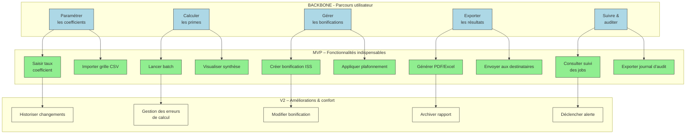

# 📚 Guide d’atelier : Story Mapping – **primesauto**  
*Document établi à partir des principes du Story Mapping de Jeff Patton*  

---  

[TOC]

---  

## 1️⃣ Introduction et objectifs  

**Livrable** : *« Représenter visuellement le périmètre fonctionnel de **primesauto** aligné sur le parcours utilisateur »*  

| Objectif opérationnel | Pourquoi c’est utile |
|----------------------|----------------------|
| 🎯 **Comprendre collectivement le parcours cible de l’usager** | Aligner toute l’équipe sur la chaîne de valeur réelle |
| 🎯 **Identifier les fonctionnalités nécessaires à chaque étape** | Découper le besoin en actions concrètes (epics → user stories) |
| 🎯 **Prioriser pour définir un MVP fonctionnel** | Décider rapidement ce qui doit être livré en premier |
| 🎯 **Créer un support visuel partagé** | Faciliter la communication avec les parties prenantes (métiers, technique, design) |
| 🎯 **Tracer les dépendances réglementaires & techniques** | Garantir la conformité dès le début du projet |

---  

## 2️⃣ Contexte d’usage  

| Élément | Valeur pour **primesauto** |
|--------|---------------------------|
| **Type de livrable** | Standard ✅ |
| **Nature** | Atelier 🤝 « Imaginer une solution » |
| **Méthode** | Story Mapping (Jeff Patton) |
| **Quand l’utiliser** | <ul><li>Transformation du cahier des charges en périmètre fonctionnel</li><li>Cadrage d’un MVP, d’une V1 ou d’une refonte</li><li>Alignement entre équipes métier, technique & design</li></ul> |
| **Recommandation** | Un Story Map par **persona principal** (max 2‑3). Commencer toujours par le **gestionnaire RH** (ou l’agent de paie) qui est l’utilisateur final. |

---  

## 3️⃣ Pré‑requis  

- [ ] **Vision produit** (pitch, objectifs, métriques) – ex. : *« Automatiser le calcul et la gestion des primes »*  
- [ ] **Personas** et **recherche utilisateur** synthétisés (verbatims, enquêtes) – ex. : Gestionnaire RH, Agent de paie, Auditeur interne  
- [ ] **Problèmes utilisateurs** hiérarchisés (jobs‑to‑be‑done, pain points) – ex. : « Je perds du temps à saisir manuellement les coefficients »  
- [ ] **Contraintes réglementaires / techniques** (ex. : RGPD, législation française des primes, batch max 7 h)  

> 💡 *Si un pré‑requis manque, prévoir 15 min en début d’atelier pour le co‑construire rapidement.*  

---  

## 4️⃣ Parties prenantes et rôles  

| Rôle | Profil type | Responsabilité dans l’atelier |
|------|-------------|------------------------------|
| **Animateur** | Chef de produit / PO | Cadrer, faciliter, garder le focus utilisateur |
| **Profil technique** | Tech Lead / Architecte | Évaluer faisabilité, effort, dépendances |
| **Porteur métier** | MOA / Responsable RH | Valider la pertinence fonctionnelle & la priorisation |
| **Designer UX/UI** *(optionnel)* | Designer produit | Enrichir le parcours, proposer des patterns d’interaction |
| **Expert conformité** *(optionnel)* | Juriste / DPO | Vérifier les exigences légales et RGPD |

> ☝️ *Un même participant peut cumuler plusieurs rôles selon les ressources disponibles.*  

---  

## 5️⃣ Logistique  

| Item | Détails |
|------|---------|
| **Durée** | 2 h 30 – 3 h (prévoir une pause à 1 h 30 si 3 h) |
| **Matériel physique** | Mur / tableau blanc, post‑its (3 couleurs : étape, activité, priorité), marqueurs, ruban de masquage |
| **Matériel digital** | Outil collaboratif (Mural, FigJam, Miro, Klaxoon…) avec template Story Map pré‑préparé |
| **Livrable de sortie** | Photo/export de la Story Map, diagramme Mermaid, liste des fonctionnalités MVP, points de vigilance |
| **Salle** | Disposer les chaises en U ou en cercle pour favoriser les échanges |  

---  

## 6️⃣ Déroulé détaillé de l’atelier  

### 🎯 Étape 1 — Introduction (15 min)  

1. Présenter les objectifs du workshop & le principe du Story Mapping (Jeff Patton).  
2. Rappeler le **contexte** : produit **primesauto**, domaine **Gestion des primes & bonifications RH**.  
3. Exposer les **règles de l’atelier** : écoute active, contribution ouverte, suspension du jugement.  

> ✅ *Astuce* : Afficher une **job‑story** type pour ancrer le discours :  
> *« En tant que **Gestionnaire RH**, je veux **calculer les primes** afin de **respecter les délais légaux et garantir la transparence** »*  

---  

### 🗺️ Étape 2 — Parcours utilisateur horizontal (30 min)  

1. Question centrale : **« Quelles sont les grandes étapes que suit l’usager dans sa démarche ? »**  
2. Chaque étape → post‑it **verbe d’action** (ex. : *Paramétrer les coefficients*, *Lancer le calcul*, *Valider les résultats*).  
3. Disposer les post‑its **de gauche à droite** pour former le **Backbone** (axe horizontal).  

**Exemple de backbone (primesauto)**  
```
[Paramétrer les coefficients] → [Calculer les primes] → [Gérer les bonifications] → [Exporter les résultats] → [Suivre & auditer]
```  

---  

### 📋 Étape 3 — Détail vertical des activités (45 min)  

Pour chaque étape du backbone :  

| Question | Objectif |
|---------|----------|
| **« Que doit faire concrètement l’usager ici ? »** | Lister les actions (ex. : saisir taux, choisir période) |
| **« De quelles informations a‑t‑il besoin ? »** | Identifier les données d’entrée (ex. : grille salariale) |
| **« Quels sont les points de friction potentiels ? »** | Noter les risques (ex. : dépassement de temps batch) |

Empiler les réponses **verticalement sous chaque étape** (du plus essentiel en bas → **ligne de flottaison**).  

> 💡 *Ne filtrez pas à ce stade : capturez tout, même les idées “nice‑to‑have”.*  

---  

### 🎚️ Étape 4 — Priorisation & définition du MVP (30‑45 min)  

1. Tracer une **ligne horizontale** (ligne de flottaison) :  
   - **Au‑dessus** : fonctionnalités **indispensables** pour le MVP/V1.  
   - **En‑dessous** : fonctionnalités **reportables** (V2, backlog).  
2. Questions clés :  
   - *Quelles fonctions sont essentielles pour que l’usager aille au bout du parcours ?*  
   - *Quelles actions peuvent être retirées sans bloquer le flux principal ?*  
3. Décider collectivement et marquer chaque carte (ex. : couleur **vert** = MVP, **jaune** = V2).  

> 🎯 *Rappel* : le MVP doit être **fonctionnel** (démo exploitable), pas uniquement minimaliste.  

---  

### 🏁 Étape 5 — Conclusion & prochaines étapes (15 min)  

1. **Relecture collective** de la Story Map : vérifier cohérence et complétude.  
2. Noter **points de vigilance**, questions en suspens, dépendances techniques ou réglementaires.  
3. Définir les **actions suivantes** :  
   - Formalisation du backlog (epics → user stories)  
   - Rédaction des critères d’acceptation  
   - Maquettage des écrans clés (si besoin)  
   - Estimation technique & planification des sprints  

> 📸 *Action immédiate* : Prendre en photo le board ou exporter la carte numérique, puis partager dans les 24 h.  

---  

## 7️⃣ Conseils de facilitation  

| Bonnes pratiques | À éviter |
|-----------------|----------|
| 🔄 **Reformuler régulièrement** pour assurer la clarté | ⏰ **S’enliser dans les détails techniques** trop tôt |
| 👥 **Faire participer tout le monde** (métiers, dev, design) | 🎤 **Laisser un profil dominer les échanges** |
| ⏱ **Timebox strict** pour chaque étape | ⏳ **Déborder du temps prévu** |
| 📌 **Ancrer chaque fonctionnalité dans un besoin utilisateur** | ❌ **Confondre “nice‑to‑have” et “must‑have”** |
| 📊 **Utiliser des couleurs** (vert = MVP, jaune = V2, rouge = hors scope) | 🚫 **Ignorer les contraintes réglementaires** |

---  

## 8️⃣ Exemple de Story Map (simplifiée)  

```
Parcours utilisateur (axe horizontal →) :
[Paramétrer les coefficients] — [Calculer les primes] — [Gérer les bonifications] — [Exporter les résultats] — [Suivre & auditer]

Fonctionnalités associées (axe vertical ↓ sous chaque étape) :

► Paramétrer les coefficients
   • Saisir le taux de coefficient
   • Importer une grille CSV
   • Valider la période d’effet

► Calculer les primes
   • Lancer le batch de calcul
   • Visualiser le tableau de synthèse
   • Gérer les erreurs de calcul

► Gérer les bonifications
   • Créer/Modifier une bonification ISS
   • Appliquer la règle de plafonnement
   • Historiser les changements

► Exporter les résultats
   • Générer le fichier PDF/Excel
   • Envoyer automatiquement aux destinataires
   • Archiver le rapport dans le référentiel

► Suivre & auditer
   • Consulter le suivi des jobs
   • Exporter le journal d’audit
   • Déclencher une alerte en cas d’anomalie
```

---  

## 9️⃣ Diagramme Mermaid du Story Map  



---  

## 🔟 Adaptations contextuelles  

| Contexte | Adaptation recommandée |
|----------|------------------------|
| **Refonte** | Partir du parcours existant (ex. : workflow actuel identifié dans le code) → identifier les frictions (ex. : temps de batch > 7 h) → proposer les nouvelles étapes. |
| **Produit réglementé** | Intégrer les **contraintes légales** (ex. : archivage 5 ans, anonymisation RGPD) comme **étapes obligatoires** dans le backbone. |
| **Multi‑personas** | Créer **une Story Map par persona** (Gestionnaire RH, Agent de paie) → fusionner les fonctionnalités communes dans une couche transversale. |
| **Contrainte technique forte** | Inviter le **Tech Lead** dès l’étape 3 pour valider la faisabilité du batch, du volume CSV, etc. |

---  

## 1️⃣1️⃣ Livrables et suite du projet  

| Livrable immédiat | Contenu |
|--------------------|---------|
| **Story Map** (photo / export) | Visualisation du parcours + découpe MVP/V1 |
| **Diagramme Mermaid** (ci‑dessus) | Version texte versionnable (Git) |
| **Liste des fonctionnalités MVP** | Tableur ou markdown `- [x] Fonctionnalité` |
| **Points de vigilance** | Checklist (ex. : RGPD, temps batch) |

| Livrables dérivés | Étapes |
|--------------------|--------|
| **Backlog produit** (epics → user stories) | Découpage à partir des cartes verticales |
| **Matrice de traçabilité** (fonctionnalité ↔ besoin ↔ contrainte) | Tableau Excel / Notion |
| **Roadmap** (MVP → V1 → V2) | Gantt ou tableau Kanban |
| **Prototypes UI** (si besoin) | Maquettes des écrans clés (paramétrage, export) |
| **Estimations & planification** | Sessions de planning poker, découpage sprint |

> 📅 **Prochaine étape** : organiser une session de **raffinement du backlog** (2 h) avec l’équipe technique pour transformer les cartes MVP en **user stories** prêtes à être estimées.  

---  

## 📖 Mini‑glossaire  

| Terme | Définition |
|-------|------------|
| **Backbone** | Axe horizontal du Story Map : les grandes étapes du parcours utilisateur. |
| **Epic** | Fonctionnalité de haut niveau regroupant plusieurs user stories. |
| **User story** | Description concise d’une exigence du point de vue de l’utilisateur. |
| **MVP** | Produit Minimum Viable : version fonctionnelle la plus simple qui répond aux besoins essentiels. |
| **Line of flottaison** | Ligne horizontale qui sépare les fonctionnalités du MVP des fonctionnalités reportées. |
| **Job‑story** | Format « En tant que [persona], je veux [action] afin de [benefice] ». |
| **RGPD** | Règlement Général sur la Protection des Données (UE). |
| **Batch** | Traitement groupé (ex. : calcul des primes sur l’ensemble des salariés). |

---  

## 📎 Annexes (optionnel)  

- **Modèle de template Story Map** (à copier‑coller dans Miro / FigJam)  
- **Checklist de conformité** (RGPD, législation des primes)  
- **Liste de références** : Jeff Patton – *User Story Mapping* (2014)  

---  

*Fin du guide. Bon atelier ! 🚀*  