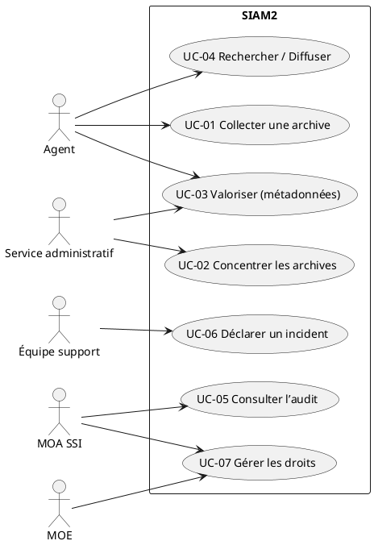
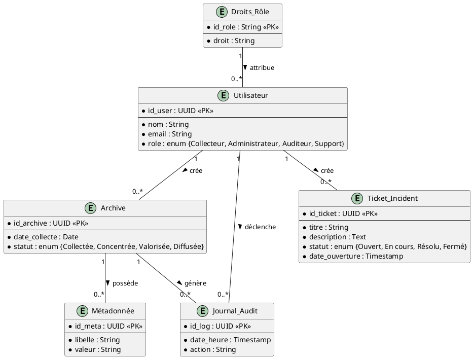

# 📘 Cahier des Charges Fonctionnel (CCF) – **SIAM 2**  
*Version 1.0 – 2024‑04‑28*  

[TOC]

---  

## 1. Introduction et contexte du projet {#introduction}
| Élément | Description |
|---|---|
| **Nom du projet** | SIAM 2 (Système d’Information d’Archivage et de Management – version 2) |
| **Identifiant** | 578 |
| **Statut** | En construction |
| **Portée géographique** | Nationale (France) |
| **Environnement d’accès** | Web (application LAMP, SaaS ECO4 – Centre‑serveur ministériel Paris La Défense) |
| **Objectif stratégique** | Moderniser la gestion des archives papier intermédiaires du ministère de la Transition écologique, garantir la conformité légale (Code du patrimoine, RGPD) et améliorer la disponibilité, l’intégrité, la traçabilité et la diffusion des archives. |
| **Périmètre fonctionnel** | <ul><li>**Inclus** : collecte, concentration, valorisation, diffusion, support, gestion de la connaissance (métadonnées, localisation, recherche).</li><li>**Exclus** : archivage définitif hors du périmètre SIAM 2, gestion documentaire non‑archivistique, modules de comptabilité ou de gestion RH.</li></ul> |
| **Contraintes majeures** | <ul><li>Conformité aux exigences légales (articles L.211‑1 à L.212‑5, RGPD art. 89).</li><li>Disponibilité ≥ 99 % (DICT = 2), Intégrité ≥ 99 % (DICT = 2), Traçabilité (DICT = 1), Confidentialité ≥ 99 % (DICT = 2).</li><li>Hébergement SaaS ECO4, sous la responsabilité du MOA SSI (SG/DAF/SAS/MAGIE).</li></ul> |

**↩ Retour au sommaire**  

---  

## 2. Expression fonctionnelle du besoin (NF EN 16271) {#besoin}
### 2.1 Décomposition en fonctions de service
| # | Fonction de service (FS) | Description (quoi) | Critères d’appréciation (mesurables) | Pondération (1‑5) | Contraintes associées |
|---|---|---|---|---|---|
| **FS‑01** | **Collecte d’archives** | Permettre la saisie, l’ingestion et la réception d’archives physiques (dossiers, boîtes, micro‑films) provenant des services sources. | <ul><li>Taux de dossiers correctement enregistrés ≥ 95 %.</li><li>Temps moyen d’enregistrement ≤ 5 min par dossier.</li></ul> | 5 | Respect du référentiel de métadonnées (norme ISO 16175‑1). |
| **FS‑02** | **Concentration** | Centraliser les archives collectées dans un entrepôt numérique (indexation, classification) avant leur archivage définitif. | <ul><li>Indice de complétude du classement ≥ 98 %.</li><li>Délais de concentration ≤ 48 h après la collecte.</li></ul> | 4 | Conformité au plan de classement national. |
| **FS‑03** | **Valorisation** | Enrichir les archives avec métadonnées, indexation sémantique et contrôle de qualité. | <ul><li>Couverture des métadonnées ≥ 90 % des champs obligatoires.</li><li>Score de qualité (détection d’anomalies) ≤ 2 % des enregistrements.</li></ul> | 4 | RGPD – minimisation des données personnelles. |
| **FS‑04** | **Diffusion & Recherche** | Offrir aux usagers (agents, services) un accès à la consultation, recherche plein‑texte et export sécurisé des archives. | <ul><li>Disponibilité du moteur de recherche ≥ 99,5 %.</li><li>Temps de réponse ≤ 2 s (requête moyenne).</li><li>Taux de satisfaction utilisateur ≥ 4/5.</li></ul> | 5 | Gestion des droits d’accès (RBAC) et traçabilité des consultations. |
| **FS‑05** | **Support & Assistance** | Fournir un support fonctionnel (FAQ, ticketing) et un accompagnement à la prise en main. | <ul><li>Temps moyen de résolution de ticket ≤ 8 h.</li><li>Score de satisfaction du support ≥ 4/5.</li></ul> | 3 | Conformité au plan de continuité d’activité (PCA). |
| **FS‑06** | **Traçabilité & Historique** | Enregistrer chaque action (création, modification, consultation, suppression) avec horodatage et identité de l’acteur. | <ul><li>Auditabilité ≥ 100 % des actions.</li><li>Exportabilité du journal d’audit au format CSV/JSON.</li></ul> | 5 | Conservation pendant 10 ans (exigence légale). |
| **FS‑07** | **Gestion des droits (Sécurité)** | Appliquer le principe du moindre privilège, gérer les profils (agents, services centraux, régionaux, administrateurs). | <ul><li>Conformité aux matrices de droits = 100 %.</li><li>Tests d’intrusion réussis (score ≥ 80 %).</li></ul> | 5 | DICT = 2, Confidentialité = 2. |

> **Note** : La pondération (1 = faible impact, 5 = impact critique) sera utilisée dans l’évaluation des offres (section 10).

**↩ Retour au sommaire**  

---  

## 3. Acteurs et parties prenantes {#acteurs}
| Acteur | Rôle | Objectifs | Besoins spécifiques |
|---|---|---|---|
| **MOA SSI** (SG/DAF/SAS/MAGIE) | Maîtrise d’ouvrage sécurité | Garantir conformité sécurité & DICT | Accès aux journaux d’audit, rapports de conformité |
| **MOE** (SG/DNUM/PNM/DPNM3) | Maîtrise d’œuvre | Réaliser le développement & le déploiement | Environnement LAMP, CI/CD, suivi de tickets |
| **Agents** (utilisateurs finaux) | Saisie & consultation d’archives | Effectuer collecte, recherche, diffusion | Interface ergonomique, assistance en ligne |
| **Services d’administration centrale / départementaux / régionaux** | Gestion de la chaîne d’archivage | Suivre le flux d’archives, valider la concentration | Tableau de bord de suivi, reporting |
| **Équipe support** (BOSCOP, DNUM) | Assistance fonctionnelle | Résoudre incidents, former les usagers | Ticketing, documentation, SLA |
| **RSSI** (SG/DAF/SAS/MAGIE) | Responsable sécurité de l’information | Piloter la sécurité, la traçabilité | Matrices RBAC, rapports d’audit |
| **Prestataire d’hébergement** (ECO4) | Fournisseur SaaS | Garantir disponibilité & continuité | SLA ≥ 99,9 %, sauvegardes journalières |

**↩ Retour au sommaire**  

---  

## 4. Cas d’usage (Use Cases) {#usecases}
### 4.1 Diagramme de cas d’utilisation (PlantUML)



### 4.2 Catalogue des cas d’usage

| N° | Nom du cas d’usage | Acteur(s) principal(aux) | Scénario nominal | Scénarios alternatifs / d’erreur | Pré‑conditions | Post‑conditions |
|---|---|---|---|---|---|---|
| **UC‑01** | Collecter une archive | Agent | 1. L’agent ouvre le formulaire de saisie.<br>2. Il renseigne les métadonnées obligatoires.<br>3. Il téléverse le support (photo, PDF).<br>4. Le système valide et génère un **identifiant d’archive**.<br>5. L’archive passe en statut *Collectée*. | a) Validation échoue → affichage d’erreurs.<br>b) Support non lisible → demande de nouveau téléversement. | L’agent est authentifié et dispose du profil *Collecteur*. | Archive enregistrée, trace d’audit créée. |
| **UC‑02** | Concentrer les archives | Service administratif | 1. Le service sélectionne les archives en statut *Collectée*.<br>2. Il lance le batch de concentration.<br>3. Le système applique le plan de classement et change le statut en *Concentrée*. | a) Incohérence de classification → alerte & mise en attente. | Au moins une archive *Collectée* disponible. | Archives classées, prêtes pour valorisation. |
| **UC‑03** | Valoriser (métadonnées) | Agent / Service administratif | 1. L’opérateur ouvre la fiche d’une archive *Concentrée*.<br>2. Il complète les champs complémentaires (description, mots‑clés).<br>3. Le système vérifie la conformité RGPD et enregistre. | a) Champ obligatoire vide → blocage.<br>b) Donnée personnelle non conforme → rejet. | Archive en statut *Concentrée*. | Archive enrichie, statut *Valorisée*. |
| **UC‑04** | Rechercher / Diffuser | Agent / Service | 1. L’utilisateur saisit critères de recherche (date, mot‑clé, service).<br>2. Le moteur renvoie la liste des archives correspondantes.<br>3. L’utilisateur visualise le document ou lance l’export sécurisé. | a) Aucun résultat → message d’information.<br>b) Accès non autorisé → refus d’accès et journal d’audit. | L’utilisateur est authentifié. | Résultat affiché, trace d’accès enregistrée. |
| **UC‑05** | Consulter l’audit | MOA SSI | 1. Le MOA sélectionne le module d’audit.<br>2. Il filtre par période, acteur, type d’action.<br>3. Il exporte le rapport (CSV). | a) Filtre trop large → temps de réponse > 5 s → notification d’attente. | Accès au module d’audit (profil *Auditeur*). | Rapport généré, export disponible. |
| **UC‑06** | Déclarer un incident | Équipe support | 1. Le support ouvre le formulaire d’incident.<br>2. Il décrit le problème, indique le numéro d’archive le cas échéant.<br>3. Le ticket est créé, assigné et notifié. | a) Mauvaise classification du ticket → réouverture. | Aucun (tout acteur peut déclarer). | Ticket créé, suivi dans le système. |
| **UC‑07** | Gérer les droits | MOE / RSSI | 1. Le MOE/ RSSI ouvre la console d’administration.<br>2. Il crée/modifie un profil, associe des rôles et des droits.<br>3. Le système applique les changements en temps réel. | a) Conflit de droits → alerte et rollback. | Profil admin requis. | Droits mis à jour, journal d’audit. |

**↩ Retour au sommaire**  

---  

## 5. Processus métier (BPMN) {#processus}
> **Remarque** : le diagramme ci‑dessous est fourni en PlantUML (compatible VS Code/Obsidian).  

```plantuml
@startbpmn
startEvent(start, "Début du processus de gestion d’archive")
task(collect, "Collecte d’une archive")
exclusiveGateway(g1, "Collecte valide ?")
task(errorCollect, "Corriger les erreurs")
task(concentrate, "Concentration")
exclusiveGateway(g2, "Concentration OK ?")
task(errorConcentrate, "Ré‑examiner le classement")
task(valuation, "Valorisation (métadonnées)")
exclusiveGateway(g3, "Métadonnées complètes ?")
task(errorValuation, "Compléter les métadonnées")
task(publish, "Diffusion / Mise à disposition")
task(audit, "Enregistrement de l’audit")
endEvent(end, "Fin du cycle")
 
start --> collect
collect --> g1
g1 --> errorCollect : Non
errorCollect --> collect
g1 --> concentrate : Oui
concentrate --> g2
g2 --> errorConcentrate : Non
errorConcentrate --> concentrate
g2 --> valuation : Oui
valuation --> g3
g3 --> errorValuation : Non
errorValuation --> valuation
g3 --> publish : Oui
publish --> audit --> end
@endbpmn
```

**↩ Retour au sommaire**  

---  

## 6. Règles métier et contraintes fonctionnelles {#regles}
| N° | Règle métier (format *Si … alors …*) | Source / Référence |
|---|---|---|
| **R‑01** | Si une archive est saisie, alors un **identifiant unique** doit être généré automatiquement. | NF EN 16271 – FS‑01 |
| **R‑02** | Si l’archive passe en statut *Concentrée*, alors le plan de classement national doit être appliqué. | Code du patrimoine L.212‑2 |
| **R‑03** | Si des données à caractère personnel sont présentes, alors elles doivent être masquées ou pseudonymisées avant la diffusion. | RGPD art. 89 |
| **R‑04** | Si un utilisateur accède à une archive, alors l’action (heure, identité, archive) doit être inscrite dans le journal d’audit. | DICT = 2, DICT = 1 |
| **R‑05** | Si le temps de réponse du moteur de recherche > 2 s, alors une alerte de performance doit être déclenchée. | SLA > 99,5 % |
| **R‑06** | Si le support signale un incident, alors le ticket doit être créé dans le système de ticketing sous 5 min. | Process Support |
| **R‑07** | Si un rôle possède le droit *Diffusion*, alors il ne peut pas simultanément posséder le droit *Suppression*. | Principe du moindre privilège |
| **R‑08** | Si le volume de sauvegarde quotidien dépasse 5 Go, alors une alerte de capacité doit être envoyée à l’administrateur. | Contrat d’hébergement ECO4 |
| **R‑09** | Si le statut d’une archive est *Valorisée*, alors elle devient consultable par les services autorisés. | FS‑04 |
| **R‑10** | Si la date de création d’une archive dépasse 10 ans, alors elle doit être archivées de façon définitive (hors SIAM 2). | Code du patrimoine L.212‑5 |

### Contraintes réglementaires & techniques
* **DICT** – Disponibilité 2, Intégrité 2, Traçabilité 1, Confidentialité 2.  
* **RGPD** – Registre des traitements, DPO désigné.  
* **Code du patrimoine** – Articles L.211‑1, L.211‑4, L.212‑2 à L.212‑5, R.212‑2 à R.212‑4.  
* **Sécurité** – Authentification forte (SAML / OIDC), chiffrement TLS 1.3, journalisation immuable.  
* **Accessibilité** – Conformité WCAG 2.1 niveau AA.  

**↩ Retour au sommaire**  

---  

## 7. Parcours utilisateurs (User Journey) {#journey}
> Utilisation du format **Given/When/Then** (BDD) pour chaque scénario clé.  

| Parcours | Étapes (Given / When / Then) | Points de contact | Critères d’acceptation |
|---|---|---|---|
| **P‑01 Collecte d’une archive** | **Given** l’agent est connecté avec le profil *Collecteur*.<br>**When** il saisit les métadonnées obligatoires et téléverse le support.<br>**Then** le système crée un identifiant, affiche un message de confirmation et trace l’action dans l’audit. | Formulaire web, barre de progression, notification. | ✅ Identifiant unique généré.<br>✅ Temps de saisie ≤ 5 min.<br>✅ Journal d’audit présent. |
| **P‑02 Recherche & diffusion** | **Given** l’utilisateur possède le droit *Diffusion*.<br>**When** il lance une recherche par mot‑clé.<br>**Then** le moteur renvoie les résultats en ≤ 2 s et l’utilisateur peut visualiser ou exporter le document. | Champ de recherche, résultats listés, bouton *Exporter*. | ✅ Temps de réponse ≤ 2 s.<br>✅ Export conforme (PDF, ZIP).<br>✅ Action enregistrée. |
| **P‑03 Gestion d’incident** | **Given** un incident est détecté.<br>**When** le support ouvre le formulaire d’incident et le soumet.<br>**Then** le ticket apparaît dans le tableau de bord, est assigné et le demandeur reçoit un accusé de réception. | Ticketing (Jira/Redmine), email de notification. | ✅ Ticket créé < 5 min.<br>✅ SLA de première réponse ≤ 2 h. |
| **P‑04 Consultation d’audit** | **Given** le MOA SSI est authentifié en tant qu’Auditeur.<br>**When** il applique un filtre date et télécharge le rapport.<br>**Then** le fichier CSV contient toutes les actions demandées et le téléchargement se fait en ≤ 10 s. | Tableau d’audit, filtres, bouton *Export*. | ✅ Rapport complet.<br>✅ Temps de génération ≤ 10 s. |

**↩ Retour au sommaire**  

---  

## 8. Modèle Conceptuel de Données (MCD) {#mcd}
> Diagramme UML simplifié (PlantUML).  



**↩ Retour au sommaire**  

---  

## 9. Critères d’acceptation et validation {#acceptation}
| Fonction de service | Critère d’acceptation | Méthode de validation | Responsable | Priorité (MoSCoW) |
|---|---|---|---|---|
| **FS‑01** | ≥ 95 % des archives correctement enregistrées | Tests d’intégration + audit de données | QA / MOA SSI | **M** |
| **FS‑02** | ≤ 48 h de délai concentration | Simulation de batch + KPI temps réel | MOE | **M** |
| **FS‑03** | Couverture métadonnées ≥ 90 % | Revue de schéma + tableau de bord | MOA | **C** |
| **FS‑04** | Disponibilité moteur de recherche ≥ 99,5 % | Monitoring (Prometheus) + tests de charge | MOE | **M** |
| **FS‑05** | Temps moyen de résolution ticket ≤ 8 h | Rapport d’incidents (Jira) | Support | **C** |
| **FS‑06** | Journal d’audit complet (100 %) | Requête d’audit + export CSV | RSSI | **M** |
| **FS‑07** | Matrices de droits conformes à 100 % | Tests d’intrusion + revues de code | Sécurité | **M** |
| **Non‑fonctionnel** | Conformité RGPD (DPIA validée) | Audit juridique | DPO | **M** |
| **Non‑fonctionnel** | Accessibilité WCAG 2.1 AA | Tests d’accessibilité (axe) | UX | **C** |

> **Validation globale** : la solution sera considérée **acceptée** lorsque **tous les critères M** (Must) seront validés, **au moins 80 % des critères C** (Could) seront satisfaits et aucune violation des exigences réglementaires ne sera détectée.  

**↩ Retour au sommaire**  

---  

## 10. Évaluation des offres (critères & pondération) {#evaluation}
| N° | Critère | Description | Pondération (1‑5) | Méthode d’évaluation |
|---|---|---|---|---|
| **E‑01** | Conformité fonctionnelle | Respect des FS‑01 à FS‑07 et des critères d’acceptation. | 5 | Checklist + démonstration. |
| **E‑02** | Qualité de la sécurité | Implémentation du RBAC, chiffrement, journalisation, tests d’intrusion. | 5 | Rapport de penetration, audit DICT. |
| **E‑03** | Performance & scalabilité | Temps de réponse moteur de recherche, capacité de traitement batch. | 4 | Tests de charge (JMeter). |
| **E‑04** | Conformité légale & RGPD | DPIA, registre des traitements, archivage légaux. | 5 | Vérification juridique. |
| **E‑05** | Expérience utilisateur | Ergonomie, accessibilité, parcours utilisateurs. | 3 | Tests utilisateurs, score SUS. |
| **E‑06** | Maintenabilité & documentation | Qualité du code, CI/CD, documentation fonctionnelle et technique. | 3 | Revue de code, documentation. |
| **E‑07** | Coût total de possession (TCO) | Licence SaaS, support, évolutivité. | 2 | Analyse financière. |

> **Score final** = Σ (Pondération × Note/5) → **Maximum = 100**. Le cahier des charges impose un **score minimum de 75** pour être retenu.

**↩ Retour au sommaire**  

---  

## 11. Annexes {#annexes}
### 11.1 Glossaire {#glossaire}
| Terme | Définition |
|---|---|
| **Archive** | Ensemble de documents physiques ou numériques conservés pour la postérité et la preuve juridique. |
| **Collecte** | Action de saisir les métadonnées et le support d’une archive dans le système. |
| **Concentration** | Regroupement et classification des archives selon un plan de classement. |
| **Valorisation** | Enrichissement des archives par métadonnées supplémentaires et contrôle qualité. |
| **Diffusion** | Mise à disposition des archives aux usagers autorisés (consultation, export). |
| **RBAC** | Role‑Based Access Control – gestion des droits par rôle. |
| **DICT** | Disponibilité, Intégrité, Confidentialité, Traçabilité – indicateurs de sécurité. |
| **WCAG** | Web Content Accessibility Guidelines – normes d’accessibilité. |
| **DPIA** | Data Protection Impact Assessment – analyse d’impact sur la protection des données. |
| **SaaS ECO4** | Plateforme d’hébergement ministérielle certifiée pour les applications publiques. |

### 11.2 Référentiels et normes applicables {#normes}
* **NF EN 16271** – Management par la valeur – Expression fonctionnelle du besoin.  
* **ISO/IEC/IEEE 29148:2018** – Ingénierie des exigences.  
* **ISO/IEC 19505** – UML 2.x.  
* **ISO/IEC 19510** – BPMN 2.0.  
* **RGPD** – Règlement Général sur la Protection des Données (art. 89).  
* **Code du patrimoine** – Articles L.211‑1 à L.212‑5, R.212‑2 à R.212‑4.  
* **WCAG 2.1 AA** – Accessibilité numérique.  

### 11.3 Historique des versions {#historique}
| Version | Date | Auteur | Modifications |
|---|---|---|---|
| 1.0 | 2024‑04‑28 | ChatGPT (OpenAI) | Création du CCF complet (sections 1‑11). |
| 0.1 | 2023‑02‑15 | – | Première collecte d’informations (doc 1, 2, 3). |

**Fin du document**  

---  

*Ce CCF a été rédigé en conformité avec les normes NF EN 16271 et ISO/IEC/IEEE 29148, et est immédiatement exploitable dans les environnements VS Code ou Obsidian (compatibilité Markdown & PlantUML).*  