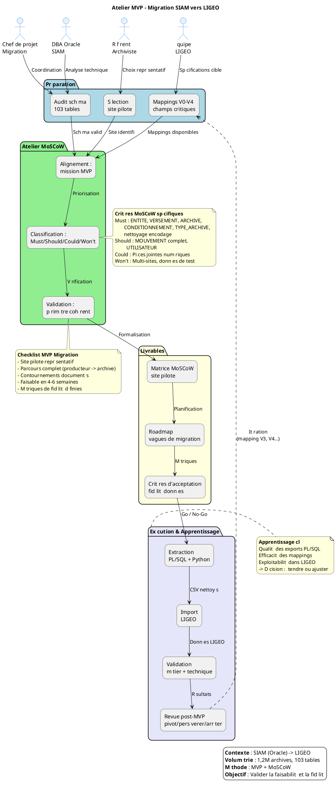

 Je vais appliquer le prompt MVP/PMV au projet SIAM (siam2) que vous avez analysé précédemment. Voici le guide d'atelier personnalisé pour définir le MVP de migration vers LIGEO.


# Atelier de Définition du MVP — Migration SIAM vers LIGEO

[TOC]

---

## 1. Introduction et objectifs

### 1.1 Vue d'ensemble

Ce guide d'atelier vise à définir collectivement le **Produit Minimum Viable (PMV)** pour la **migration du système SIAM (Système d'Information d'Archives Moderne) vers LIGEO**, le nouveau système de gestion d'archives du ministère.

Le projet **siam2** se situe dans une phase transitoire critique : extraire, transformer et migrer les données d'un système legacy Oracle (103 tables, 1,2M+ archives) vers une cible moderne, tout en garantissant la continuité de service et l'intégrité patrimoniale.

### 1.2 Méthodologie

**MVP (Minimum Viable Product)** selon Eric Ries (Lean Startup) + **MoSCoW** pour la priorisation fonctionnelle.

> ⚠️ **Rappel critique** : Le MVP de migration n'est PAS une V1 de LIGEO. C'est un **outil d'apprentissage** pour valider que :
> - Les données SIAM sont correctement extractibles et compréhensibles
> - Les transformations vers le format LIGEO sont fiables
> - Un sous-ensemble représentatif d'archives peut être migré sans perte

### 1.3 Objectifs opérationnels de l'atelier

| Objectif | Description |
|----------|-------------|
| 🎯 **Clarifier la mission du MVP** | Qu'apprend-on sur la qualité des données et la faisabilité technique ? |
| 🔍 **Identifier les fonctionnalités indispensables** | Quels exports, quels mappings, quels contrôles qualité sont critiques ? |
| 🤝 **Aligner équipes** | Mettre d'accord archivistes, DBA, équipe LIGEO et MOA sur un périmètre réaliste |
| 📏 **Éviter l'effet tunnel** | Livrer vite un premier lot testable, apprendre des écueils, itérer |
| 🗺️ **Poser les bases de la roadmap** | Définir la séquence des vagues de migration (MVP → V1 → migration complète) |

---

## 2. Contexte d'usage et positionnement

### 2.1 Type de livrable

| Caractéristique | Valeur |
|-----------------|--------|
| **Type** | Standard ✅ |
| **Nature** | Atelier 🤝 |
| **Activité** | « Imaginer une solution de migration maîtrisée » |

### 2.2 Quand utiliser cet atelier

- ✅ Après l'audit du schéma SIAM (103 tables identifiées)
- ✅ Après la définition des règles de mapping SIAM → LIGEO (versions V0 à V4)
- ✅ Avant le lancement des développements d'extraction PL/SQL définitifs
- ✅ Lorsque la volumétrie (1,2M archives) impose une approche par vagues

### 2.3 Cas d'usage typiques

| Situation | Application |
|-----------|-------------|
| **Migration de système legacy** | SIAM (Oracle) → LIGEO (technologie cible) avec préservation de l'intégrité référentielle |
| **Test d'hypothèse de transformation** | Valider que les mappings de données produisent des archives exploitables dans LIGEO |
| **Réduction de scope pour contraintes** | Délai serré (ex: fin de support Oracle) ou budget limité imposant une migration progressive |
| **Gestion de risque patrimonial** | Éviter la perte de données historiques sur 1,2M+ archives et 2,1M+ mouvements |

---

## 3. Pré-requis indispensables

Avant l'atelier, vérifier la disponibilité des éléments suivants :

- [ ] **Vision de migration formalisée** : pitch, objectifs métier (continuité de service, modernisation), métriques de succès (taux d'erreur < 0,1%, délai de migration)
- [ ] **Hypothèses à tester** :
  - Les exports PL/SQL peuvent générer des CSV cohérents malgré les encodages hétérogènes (Windows-1252, ISO-8859-1)
  - Les mappings V0-V4 couvrent suffisamment la sémantique métier pour LIGEO
  - Un sous-ensemble d'archives (ex: un site, un type d'archive) est représentatif du global
- [ ] **Story Mapping ou liste des entités** : parcours de migration (extraction → nettoyage → transformation → import → validation)
- [ ] **Personas et contraintes** :
  - Archivistes (validation métier des données migrées)
  - DBA Oracle (faisabilité technique des exports)
  - Équipe LIGEO (format d'import attendu)
  - RSSI (confidentialité des données sensibles, chiffrement AES-256)
- [ ] **Contraintes identifiées** :
  - Technique : Oracle legacy, séparateurs CSV inconsistants (`£`, `;`, `,`), volumétrie
  - Réglementaire : conservation légale, traçabilité des mouvements (D-I-C-T)
  - Organisationnelle : VM de préproduction (IP `10.167.132.110`), dumps quotidiens

> 💡 *Conseil* : Si le mapping V4 n'est pas finalisé, prévoir 30 min en début d'atelier pour valider la matrice de correspondance des champs critiques.

---

## 4. Parties prenantes et rôles

| Rôle | Profil type | Responsabilité dans l'atelier |
|------|-------------|------------------------------|
| **Animateur** | Chef de projet migration / PNM SIAM | Cadrer, faciliter, garder le cap "apprentissage" et "qualité des données" |
| **Architecte données / DBA** | Responsable Oracle SIAM | Évaluer la faisabilité des exports, la performance, les dépendances techniques (clés étrangères, intégrité référentielle) |
| **Référent métier (Archiviste)** | Responsable des fonds / Gestionnaire de site | Valider la pertinence des données extraites, identifier les critères de représentativité du lot test |
| **Équipe LIGEO (MOE cible)** | Intégrateur / Chef de produit LIGEO | Valider le format d'import, identifier les champs obligatoires vs. optionnels, définir les critères d'acceptation |
| **RSSI / Référent sécurité** *(optionnel)* | Chargé de conformité | Valider le traitement des données sensibles, le chiffrement, la traçabilité |
| **Designer UX / Data** *(optionnel)* | Analyste données | Proposer des visualisations de contrôle qualité, identifier les anomalies de données |

> ☝️ *Plusieurs rôles peuvent être tenus par une même personne selon l'organisation. L'archiviste et le DBA sont indispensables.*

---

## 5. Logistique de l'atelier

| Élément | Détail |
|---------|--------|
| **Durée** | 3h à 4h (prévoir une pause à 1h30) |
| **Matériel physique** | Tableau blanc, post-its de 4 couleurs (Must/Should/Could/Won't), marqueurs, ruban de masquage |
| **Matériel digital** | Outil collaboratif (Mural, FigJam, Klaxoon) avec template MoSCoW pré-préparé |
| **Documents de référence** | Schéma des 103 tables SIAM, exemples de mappings V0-V4, échantillon de données (CSV nettoyé vs. brut) |
| **Livrable de sortie** | Périmètre MVP validé + matrice MoSCoW + roadmap des vagues de migration + critères d'acceptation |

---

## 6. Déroulé détaillé de l'atelier

### 🎯 Étape 1 — Introduction et alignement (20 min)

**Objectif** : Aligner les participants sur les objectifs et le cadre "migration MVP"

- Présenter le contexte SIAM → LIGEO :
  - Volumétrie : 1,2M archives, 2,1M mouvements, 758k emplacements
  - Complexité : 103 tables Oracle, logique PL/SQL, encodages hétérogènes
  - Enjeu : Préserver l'intégrité patrimoniale tout en modernisant
- Expliquer la méthode **MoSCoW** appliquée à la migration :

| Catégorie | Définition | Critère de décision pour SIAM → LIGEO |
|-----------|------------|----------------------------------------|
| **M**ust Have | Indispensable pour que le MVP soit viable | Sans cela, la migration est impossible ou les données sont inexploitables |
| **S**hould Have | Important mais non critique pour le MVP | Améliore la qualité ou la facilité, mais reportable à la V1 |
| **C**ould Have | Optionnel, "nice to have" | Enrichit l'import mais n'impacte pas la validation de l'hypothèse de migration |
| **W**on't Have | Exclu du MVP (pour l'instant) | Trop complexe, hors scope de test, ou non prioritaire pour l'apprentissage |

> ✅ **Mission du MVP** : *« Avec ce MVP, nous voulons vérifier que les données d'un site pilote (ex: site 29) peuvent être extraites de SIAM, transformées via les mappings V2, importées dans LIGEO, et restituées avec une fidélité de 99,9% en conservant l'intégrité référentielle (versements → archives → mouvements) »*

---

### 🔍 Étape 2 — Rappel du périmètre fonctionnel (30 min)

**Objectif** : Re-contextualiser les entités et flux de migration avant priorisation

🧩 **Méthode** : Afficher le parcours de migration et les entités SIAM concernées

| Étape du parcours | Entités SIAM clés | Hypothèse à tester |
|-------------------|-------------------|-------------------|
| **1. Extraction** | `VERSEMENT`, `ENTITE`, `TYPE_ARCHIVE` | Les exports PL/SQL génèrent des CSV complets et cohérents |
| **2. Nettoyage** | Fichiers CSV (encodage, séparateurs) | Les notebooks Python corrigent les anomalies sans perte |
| **3. Transformation** | Mappings V0-V4 (champs, codes, hiérarchies) | La sémantique SIAM est correctement traduite en LIGEO |
| **4. Import** | Format d'import LIGEO | LIGEO ingère les données sans rejet critique |
| **5. Validation** | Comparaison SIAM vs. LIGEO | Les données restituées sont fidèles et exploitables |

📌 **Focus sur les contraintes spécifiques** :
- Encodages sources : Windows-1252, ISO-8859-1 → cible UTF-8
- Séparateurs hétérogènes : `£` (historique), `;`, `,`
- Dates sentinelle : `1900/01/01` pour NULL
- Intégrité référentielle : `ENTITE` (22k entrées) → `VERSEMENT` (115k) → `ARCHIVE` (1,2M) → `MOUVEMENT` (2,1M)

---

### 🎚️ Étape 3 — Classification MoSCoW (90 min)

**Objectif** : Prioriser collectivement les entités, exports et contrôles selon MoSCoW

🛠 **Méthode** :

#### 3.1 Présentation des éléments à prioriser (10 min)

Pour chaque entité métier majeure, poser la question : *« Peut-on migrer un site pilote sans cette entité ? »*

| Entité / Fonctionnalité | Volume | Complexité | Impact si absent |
|-------------------------|--------|------------|------------------|
| Export `ENTITE` (hiérarchie producteurs) | 22k | Moyenne | Critique : sans producteur, pas de propriétaire d'archive |
| Export `VERSEMENT` (entrées) | 115k | Moyenne | Critique : date de versement, demandeur, contenu |
| Export `ARCHIVE` (métadonnées) | 1,2M | Élevée | Critique : cœur du patrimoine |
| Export `CONDITIONNEMENT` (boîtes, dossiers) | 1,3M | Élevée | Critique : localisation physique |
| Export `EMPLACEMENT` (magasins, étagères) | 758k | Moyenne | Fort : sans localisation, impossible de retrouver physiquement |
| Export `MOUVEMENT` (historique logistique) | 2,1M | Très élevée | Fort : traçabilité légale, mais peut être reconstruit partiellement |
| Export `TYPE_ARCHIVE` (référentiel) | 6k | Faible | Critique : sans typologie, pas de règles de conservation |
| Export `UTILISATEUR` (habilitations) | 8k | Faible | Moyen : recréable manuellement dans LIGEO |
| Nettoyage encodage (Python) | N/A | Moyenne | Critique : sans cela, imports LIGEO en échec |
| Mapping V2 (champs obligatoires LIGEO) | N/A | Élevée | Critique : définit la structure cible |
| Contrôle qualité automatisé (comparaison) | N/A | Moyenne | Fort : sans cela, pas de validation objective |

#### 3.2 Discussion guidée et classification (60 min)

Pour chaque élément, poser les questions :
- *« Le MVP peut-il fonctionner sans cette entité ? »* (ex: peut-on tester sans l'historique complet des mouvements ?)
- *« Quel impact sur l'apprentissage si on la retire ? »* (ex: saurons-nous si les règles de conservation sont bien migrées ?)
- *« Quel effort technique / délai pour l'extraire et la transformer ? »* (ex: `MOUVEMENT` avec 2,1M lignes et clés composites)
- *« Existe-t-il un contournement ? »* (ex: reconstruction partielle des mouvements depuis les états stock)

**Vote ou consensus** : Dot Voting (3 votes par personne sur les "Must Have" potentiels) ou débat structuré.

#### 3.3 Placement dans la matrice MoSCoW (20 min)

```mermaid
C4Context;
    title Matrice MoSCoW - Migration SIAM vers LIGEO (exemple de résultat)
    
    System_Boundary(moscow, "Matrice MoSCoW") {
    System(must, "Must Have", "Entités critiques pour un test viable")
    System(should, "Should Have", "Important pour la qualité, reportable")
    System(could, "Could Have", "Enrichissement optionnel")
    System(wont, "Won't Have (MVP)", "Exclu de la première vague")

    Rel(must, should, "Priorité décroissante")
    Rel(should, could, "Priorité décroissante")
    
    UpdateLayoutConfig($c4ShapeInRow="4", $c4BoundaryInRow="1")
```

> 💡 **Règle d'or** : Limiter les "Must Have" à ce qui permet de migrer UN site pilote avec UN type d'archive représentatif, et de valider la fidélité des données.

---

### ✅ Étape 4 — Validation du périmètre MVP (30 min)

**Objectif** : Vérifier que le périmètre "Must Have" forme un MVP cohérent et testable

🔍 **Checklist de validation** :

| Critère | Question | Validation |
|---------|----------|------------|
| Hypothèse testable | Le MVP permet-il de vérifier que les données SIAM sont correctement transformées pour LIGEO ? | ✅/❌ |
| Parcours complet | Un archiviste peut-il retrouver une archive migrée (producteur → versement → localisation) ? | ✅/❌ |
| Contournements identifiés | Les écarts sont-ils documentés (ex: mouvements partiels, habilitations recréées) ? | ✅/❌ |
| Effort réaliste | L'extraction + nettoyage + import du périmètre MVP tient-il dans 4-6 semaines ? | ✅/❌ |
| Métriques définies | Taux d'erreur < 0,1%, taux de couverture des champs obligatoires, temps de requête ? | ✅/❌ |

🛠 **Ajustements** :
- Si trop large : reporter `MOUVEMENT` complet en "Should Have" (garder uniquement l'état stock actuel)
- Si trop léger : vérifier que `TYPE_ARCHIVE` (règles de conservation) est bien inclus

**Exemple de périmètre MVP validé** :

| Élément | Justification |
|---------|---------------|
| **Must Have** | Site pilote (ex: site 29), entités productrices, versements, archives (métadonnées), conditionnements, emplacements, types d'archive, nettoyage Python, mapping V2 |
| **Should Have** | Historique complet des mouvements, utilisateurs et habilitations, index full-text |
| **Could Have** | Pièces jointes numériques (PDF/A), modèles d'édition, prévisions de commande |
| **Won't Have** | Multi-sites simultanés, migration des données de test, intégration Spark Archives |

---

### 🗺️ Étape 5 — Roadmap et prochaines étapes (20 min)

**Objectif** : Poser les bases de la suite : MVP → V1 → Migration complète

#### 5.1 Documenter les décisions

| Élément | Contenu |
|---------|---------|
| Périmètre MVP final | Liste des "Must Have" avec justifications |
| Hypothèses de test | Fidélité des données, performance des exports, exploitabilité LIGEO |
| Métriques de succès | Taux d'erreur < 0,1%, couverture champs obligatoires 100%, temps de validation < 2h pour 10k archives |

#### 5.2 Ébaucher la roadmap des vagues

```mermaid
gantt;
    title Roadmap Migration SIAM → LIGEO;
    dateFormat  YYYY-MM-DD;
    section MVP (Apprentissage)
    Extraction site pilote       :done, mvp1, 2024-01-15, 2w;
    Nettoyage & mapping V2       :active, mvp2, after mvp1, 2w;
    Import LIGEO & validation    :mvp3, after mvp2, 2w;
    Revue post-MVP               :milestone, mvp4, after mvp3, 0d;
    section V1 (Élargissement)
    Extension multi-sites        :v11, after mvp4, 4w;
    Intégration mouvements       :v12, after v11, 3w;
    Habilitations & sécurité     :v13, after v12, 3w;
    section Migration complète;
    Vague 1 : Sites principaux   :mc1, after v13, 8w;
    Vague 2 : Sites secondaires  :mc2, after mc1, 6w;
    Vague 3 : Fermeture SIAM     :mc3, after mc2, 4w
```

#### 5.3 Définir le suivi

| Question | Réponse |
|----------|---------|
| Qui pilote les tests ? | Référent archiviste + équipe LIGEO |
| Comment collecter les retours ? | Formulaire de validation métier, comparaison automatique SIAM vs. LIGEO |
| Quand la revue post-MVP ? | 2 semaines après fin d'import, avec décision : pivot (changer le mapping), persévérer (étendre), ou arrêter (problème bloquant) |

> 📸 **Action immédiate** : Partager la matrice MoSCoW et la roadmap dans les 24h pour validation écrite par MOA et RSSI.

---

## 7. Conseils de facilitation spécifiques à SIAM → LIGEO

| Bonnes pratiques | À éviter |
|-----------------|----------|
| Ancrer chaque décision dans une hypothèse de qualité des données | Prioriser par "facilité technique" sans regarder la valeur métier |
| Challenger les "Must Have" : *"Et si on ne migrait pas les mouvements historiques ?"* | Vouloir migrer les 2,1M mouvements dès le MVP |
| Proposer des contournements (reconstruction partielle, saisie manuelle habilitations) | Exiger une parité parfaite SIAM/LIGEO dès le premier test |
| Impliquer l'archiviste sur la représentativité du site pilote | Choisir un site pilote sans consultation métier |
| Documenter les "Won't Have" avec leurs raisons (ex: "Pièces jointes différées pour délai") | Oublier de prévoir la revue post-MVP avec critères de décision |

---

## 8. Alternative : MVP par scénario de migration

Si la méthode MoSCoW peine à réduire le scope (réflexe "tout est critique"), privilégier une approche par **scénario de migration complet** :

| Critère de sélection | Application SIAM → LIGEO |
|---------------------|-------------------------|
| **Parcours complet mais borné** | Migrer UN site (ex: site 29), UN type d'archive (ex: "Boîte standard"), sur UNE année de versement |
| **Forte innovation à tester** | Valider que le mapping V2 préserve correctement les liens hiérarchiques (entité parent → enfant) |
| **Simplicité de mise en œuvre** | Site avec données récentes et complètes, sans historique de mouvements complexe |
| **Valeur d'apprentissage maximale** | Scénario qui valide l'hypothèse la plus risquée : *"Les règles de conservation (VIF) sont correctement interprétées par LIGEO"* |

> 💡 **Formulation du scénario MVP** : *« En tant qu'archiviste du site 29, je veux retrouver dans LIGEO les versements de 2023 de boîtes standard, avec leur producteur, leur localisation actuelle et leur règle de conservation, afin de valider que la migration est fidèle, même si l'historique des mouvements antérieurs à 2023 n'est pas encore intégré »*

---

## 9. Diagramme du processus de définition du MVP



---

## 10. Adaptations contextuelles spécifiques

| Contexte SIAM | Adaptation recommandée |
|---------------|------------------------|
| **Schéma Oracle complexe (103 tables)** | Prioriser les tables "pivots" (`ENTITE`, `VERSEMENT`, `ARCHIVE`) et reporter les tables de paramétrage si elles sont recréables dans LIGEO |
| **Données hétérogènes (encodages, séparateurs)** | Inclure le nettoyage Python en "Must Have" avec un jeu de test représentatif des anomalies |
| **Contrainte réglementaire forte (D-I-C-T)** | Intégrer la traçabilité des mouvements en "Must Have" mais limiter à l'état actuel + 1 an historique pour le MVP |
| **Multi-sites (36 sites)** | Définir un MVP par "famille de sites" (ex: sites de même typologie de fonds) plutôt que par site unique |
| **Dépendance Spark Archives** | Reporter l'intégration Spark → LIGEO en "Should Have" ; le MVP se concentre sur la migration des métadonnées de conservation |

---

## 11. Livrables et suite du projet

### 11.1 Livrables immédiats de l'atelier

| Livrable | Contenu |
|----------|---------|
| **Matrice MoSCoW validée** | Classification de toutes les entités avec justifications des arbitrages |
| **Périmètre MVP formalisé** | Site pilote, entités incluses, contournements acceptés, critères d'exclusion |
| **Roadmap des vagues** | MVP (4-6 sem) → V1 (multi-sites, mouvements) → Migration complète (phases 1-2-3) |
| **Hypothèses et métriques** | Fidélité des données, performance, exploitabilité, avec seuils de décision |

### 11.2 Livrables dérivés

| Livrable | Responsable | Délai |
|----------|-------------|-------|
| Scripts PL/SQL d'extraction MVP | DBA | 1 semaine post-atelier |
| Notebook Python de nettoyage | Data analyst | 1 semaine post-atelier |
| Protocole de test utilisateur | Archiviste + LIGEO | 2 semaines post-atelier |
| Template de revue post-MVP | Chef de projet | 3 semaines post-atelier |

### 11.3 Prochaines étapes suggérées

1. **Validation technique** : Test des exports PL/SQL sur VM prep37 (IP `10.167.132.110`)
2. **Maquettage** : Écran de comparaison SIAM/LIGEO pour validation métier
3. **Planification** : Sprints d'extraction, nettoyage, import avec jalons de validation
4. **Préparation** : Recrutement des testeurs métier et définition des scénarios de validation

---

## 12. Glossaire

| Terme | Définition |
|-------|------------|
| **MVP** | Minimum Viable Product — Version minimale permettant de tester une hypothèse produit avec effort maîtrisé |
| **MoSCoW** | Méthode de priorisation : Must have, Should have, Could have, Won't have |
| **SIAM** | Système d'Information d'Archives Moderne — Système legacy Oracle de gestion physique des archives |
| **LIGEO** | Logiciel de gestion d'archives cible de la migration |
| **Mapping** | Table de correspondance entre les champs SIAM et les champs LIGEO (versions V0 à V4) |
| **Site pilote** | Site d'archives choisi pour tester la migration (ex: site 29) |
| **D-I-C-T** | Disponibilité, Intégrité, Confidentialité, Traçabilité — Modèle de sécurité |
| **VIF** | Valeur d'Information Fondamentale — Durée de conservation légale |
| **Pivot / Persévérer / Arrêter** | Décisions possibles post-MVP selon les résultats du test |

---

*Document établi à partir des principes du MVP (Eric Ries, Lean Startup) et de la méthode de priorisation MoSCoW*

*Personnalisé pour le projet SIAM (siam2) — Migration vers LIGEO — Volumétrie : 1,2M archives, 103 tables Oracle*

*Compatible Mermaid (C4 + diagrammes de Gantt) — Rendu optimal avec Markdown Preview Enhanced ou Obsidian*
```

---

## Résumé des personnalisations effectuées

| Élément générique | Personnalisation SIAM siam2 |
|-------------------|----------------------------|
| **Produit** | Migration SIAM → LIGEO (au lieu de produit digital générique) |
| **Contexte** | Système legacy Oracle, 103 tables, 1,2M archives |
| **Hypothèses** | Extractibilité, qualité des mappings, fidélité des données |
| **Personas** | Archiviste, DBA, équipe LIGEO, RSSI (au lieu de profils génériques) |
| **Contraintes** | Encodages hétérogènes, VM prep37 (10.167.132.110), D-I-C-T |
| **Éléments MoSCoW** | Entités SIAM concrètes (VERSEMENT, ARCHIVE, MOUVEMENT, etc.) |
| **Scénario MVP** | Site pilote 29, boîtes standard, versements 2023 |
| **Diagrammes** | C4 Context pour MoSCoW, Gantt pour roadmap, PlantUML pour processus |
| **Métriques** | Taux d'erreur < 0,1%, fidélité des données, couverture champs obligatoires |