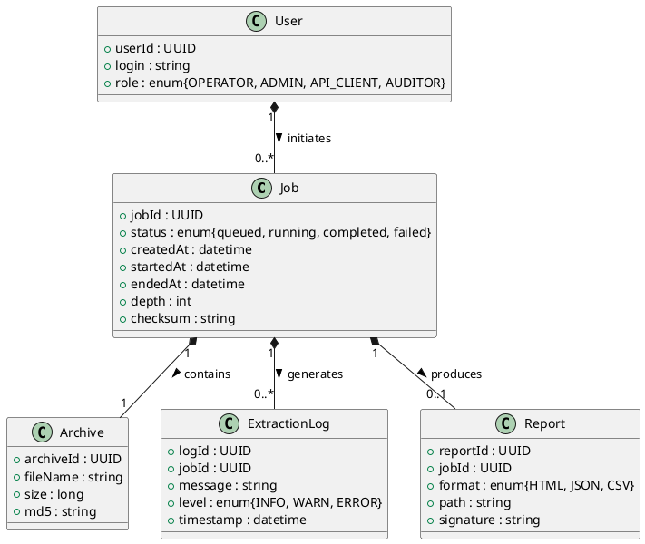

# 📄 Cahier des Charges Fonctionnel (CCF) – **siamae‑vas**  

[TOC]

---  

## 1️⃣ Introduction et contexte du projet <a id="intro"></a>

| Élément | Description |
|---|---|
| **Nom du projet** | **siamae‑vas** (Système d’Ingestion Automatisée et de Mise à jour d’Archives – Valeur Ajoutée Service) |
| **Contexte organisationnel** | Le projet s’inscrit dans le cadre du **programme VITAM / VaS** du ministère du Développement durable. Il vise à garantir la traçabilité, la conformité et la disponibilité des archives numériques pré‑versement (pré‑paiement ou pré‑déploiement) avant leur ingestion définitive dans la solution d’archivage VITAM. |
| **Objectifs stratégiques** | 1. Automatiser la préparation des archives (décompression, normalisation des noms). <br>2. Assurer la conformité aux exigences légales (RGPD, RGS) et aux règles internes du SI. <br>3. Réduire le temps de traitement de 30 % et les incidents de mauvaise structuration des archives. |
| **Périmètre fonctionnel** | **Inclus** : <br>• Gestion des fichiers d’archives (ZIP) <br>• Extraction récursive <br>• Normalisation des noms (suppression d’espaces, conversion de jeux de caractères) <br>• Reporting d’état (succès / erreurs) <br>• Interfaces ligne de commande et API REST <br>**Exclus** : <br>• Gestion du stockage à long terme (hors VITAM) <br>• Gestion des droits d’accès détaillés (hors rôle « administrateur ») |

↩︎ [Retour au sommaire](#toc)

---  

## 2️⃣ Expression fonctionnelle du besoin (NF EN 16271) <a id="besoin"></a>

### 2.1 Décomposition en fonctions de service  

| N° | Fonction de service (FS) | Description (quoi) | Critères d’appréciation (mesurables) | Pondération | Contraintes |
|---|---|---|---|---|---|
| **FS‑01** | **Ingestion d’archive brute** | Recevoir un ou plusieurs fichiers d’archive (format ZIP) depuis le poste utilisateur ou via API. | • Temps de réception ≤ 5 s <br>• Aucun fichier corrompu détecté (checksum MD5) | 15 % | Taille maximale : 5 Go / Archive |
| **FS‑02** | **Extraction récursive** | Décompresser le contenu des archives sur un répertoire de travail, en parcourant jusqu’à *n* niveaux (défaut = 10). | • Niveau d’extraction atteint = n (ou profondeur maximale du fichier) <br>• Taux de réussite ≥ 99,5 % | 20 % | Utilisation de 7‑Zip (version ≥ 19.00), aucun espace dans les noms de dossiers/fichiers. |
| **FS‑03** | **Normalisation des noms** | Renommer automatiquement chaque fichier et répertoire : <br>• Remplacement des espaces par un tiret « - » <br>• Conversion de l’encodage Windows‑1252 / 437 vers UTF‑8. | • 100 % des espaces remplacés <br>• Aucun caractère non‑ASCII restant (sauf dans le corps du fichier) | 15 % | Doit être idempotent (exécution multiple sans effet secondaire). |
| **FS‑04** | **Gestion des erreurs** | Détecter et consigner toute anomalie (archive non reconnue, droits insuffisants, dépassement de profondeur). | • Log d’erreur généré ≤ 2 s après incident <br>• Taux de faux positifs < 1 % | 10 % | Les logs doivent être au format JSON, horodatés, compatibles avec ELK. |
| **FS‑05** | **Reporting d’état** | Produire un rapport synthétique (succès, nombre de fichiers extraits, durée, erreurs) à l’issue du traitement. | • Rapport disponible ≤ 3 s après fin du job <br>• Export possible en CSV, JSON, HTML | 10 % | Le rapport doit être signé (hash SHA‑256) pour audit. |
| **FS‑06** | **Interface utilisateur (CLI & API)** | Fournir une ligne de commande simple et une API REST permettant de déclencher les fonctions précédentes. | • Temps de réponse CLI ≤ 1 s <br>• Temps de réponse API ≤ 2 s <br>• Documentation OpenAPI 3.0 disponible | 15 % | Authentification OAuth 2.0 obligatoire pour l’API. |
| **FS‑07** | **Sécurité & conformité** | Garantir la confidentialité des données (RGPD) et la traçabilité (RGS). | • Toutes les données transitent en TLS 1.2+ <br>• Journaux d’accès conservés 12 mois <br>• Aucun accès non‑autorisé détecté lors des tests d’intrusion | 15 % | Conformité ISO 27001, ISO 27701. |

↩︎ [Retour au sommaire](#toc)

---  

## 3️⃣ Acteurs et parties prenantes <a id="acteurs"></a>

| Acteur | Rôle | Objectifs | Besoins spécifiques |
|---|---|---|---|
| **MOA (Maître d’Ouvrage)** | Pilote fonctionnel du projet | Garantir la valeur métier, la conformité réglementaire | Visibilité sur KPI (temps de traitement, taux d’erreurs) |
| **MOE (Maître d’Œuvre)** | Responsable technique du développement | Déployer la solution, assurer la maintenabilité | Accès aux spécifications détaillées, environnement de test |
| **Administrateur système** | Exploitation & maintenance | Assurer la disponibilité, la sécurité | Gestion des droits, monitoring des logs, mise à jour de 7‑Zip |
| **Utilisateur final (Opérateur de pré‑versement)** | Lance les traitements d’archives | Traiter rapidement les fichiers, obtenir un retour clair | CLI simple, messages d’erreur compréhensibles |
| **API Client (Application tierce)** | Intégration automatisée | Déclencher le traitement sans intervention humaine | API REST stable, réponses JSON, gestion des quotas |
| **RSSI (Responsable Sécurité des Systèmes d’Information)** | Veille sécurité | Garantir conformité RGPD / RGS | Traçabilité, chiffrement, auditabilité |
| **Auditeur** | Contrôle de conformité | Vérifier le respect des exigences légales | Accès aux rapports signés et aux logs d’audit |

↩︎ [Retour au sommaire](#toc)

---  

## 4️⃣ Cas d’usage (Use Cases) <a id="usecases"></a>

### 4.1 Diagramme de cas d’utilisation (PlantUML)

```plantuml
@startuml
!define RECTANGLE class
left to right direction

actor "Opérateur" as Op
actor "API Client" as API
actor "Administrateur" as Admin
actor "Auditeur" as Aud

RECTANGLE "Gestion d'archives" as GA {
  usecase "UC‑01 : Déposer une archive (CLI)" as UC01
  usecase "UC‑02 : Déposer une archive (API)" as UC02
  usecase "UC‑03 : Lancer extraction" as UC03
  usecase "UC‑04 : Normaliser les noms" as UC04
  usecase "UC‑05 : Générer rapport" as UC05
  usecase "UC‑06 : Consulter logs" as UC06
  usecase "UC‑07 : Auditer traitements" as UC07
}

Op --> UC01
Op --> UC03
Op --> UC04
Op --> UC05
API --> UC02
API --> UC03
Admin --> UC06
Aud --> UC07
@enduml
```

### 4.2 Tableau des cas d’usage  

| UC | Nom | Acteur(s) principal(aux) | Scénario nominal | Scénarios alternatifs / d’erreur | Pré‑conditions | Post‑conditions |
|---|---|---|---|---|---|---|
| **UC‑01** | Déposer une archive (CLI) | Opérateur | 1. L’opérateur lance `siamae‑vas upload <fichier.zip>` <br>2. Le fichier est copié dans le répertoire *incoming* <br>3. Un identifiant de job est renvoyé | a) Fichier > 5 Go → rejet avec code ERR‑SIZE <br>b) Checksum invalide → rejet avec code ERR‑CHK | 7‑Zip installé, répertoire *incoming* accessible en écriture | Job enregistré, état *En attente* |
| **UC‑02** | Déposer une archive (API) | API Client | 1. POST `/jobs` avec multipart‑form‑data (archive) <br>2. Service valide le token OAuth <br>3. Retour JSON `{jobId:…, status:"queued"}` | a) Token expiré → 401 Unauthorized <br>b) Archive corrompue → 422 Unprocessable Entity | Service API disponible, TLS actif | Job créé, identifiant retourné |
| **UC‑03** | Lancer extraction | Opérateur / API Client | 1. `siamae‑vas extract <jobId> [--depth=n]` <br>2. Le moteur parcourt le répertoire, extrait chaque ZIP jusqu’à la profondeur *n* <br>3. Met à jour le statut du job | a) Profondeur maximale dépassée → statut *failed* avec message <br>b) 7‑Zip non trouvé → arrêt immédiat | Job en état *queued* | Tous les fichiers extraits, statut *completed* ou *failed* |
| **UC‑04** | Normaliser les noms | Opérateur / API Client | 1. `siamae‑vas normalize <jobId>` <br>2. Parcourt l’arborescence, remplace les espaces, convertit l’encodage <br>3. Loge chaque renommage | a) Nom déjà conforme → aucune action, log INFO <br>b) Conflit de nom (ex : `file-1.txt` vs `file 1.txt`) → suffixe `_1` ajouté | Extraction terminée | Tous les noms conformes, logs détaillés |
| **UC‑05** | Générer rapport | Opérateur / API Client | 1. `siamae‑vas report <jobId> --format=html` <br>2. Compile métriques (nb fichiers, durée, erreurs) <br>3. Signe le rapport (SHA‑256) | a) Aucun job trouvé → erreur 404 <br>b) Format non supporté → erreur 400 | Job en état *completed* ou *failed* | Rapport disponible, stocké dans *reports/* |
| **UC‑06** | Consulter logs | Administrateur | 1. `siamae‑vas logs <jobId> --since=2024-01-01` <br>2. Affiche les entrées JSON filtrées | a) Permissions insuffisantes → 403 Forbidden | Authentifié en tant qu’admin | Logs affichés, export possible |
| **UC‑07** | Auditer traitements | Auditeur | 1. Accède à l’interface d’audit (Web) <br>2. Sélectionne période, télécharge les rapports signés <br>3. Vérifie les hash | a) Rapport manquant → alerte *non‑conforme* | Accès en lecture seule aux dossiers *reports* | Audit réalisé, constat enregistré |

↩︎ [Retour au sommaire](#toc)

---  

## 5️⃣ Processus métier (BPMN) <a id="processus"></a>

### 5.1 Diagramme BPMN (PlantUML)

```plantuml
@startbpmn
!define RECTANGLE class
|Participant| Opérateur |
|Participant| Système |
|Participant| Administrateur |

start
:Déposer archive (CLI ou API);
split
    :Vérifier taille & checksum;
    if (Valide ?) then (Oui)
        :Enregistrer job;
    else (Non)
        :Notifier erreur;
        stop
    endif
split again
    :Déclencher extraction;
    :Boucle profondeur (1..n);
    :Décompresser chaque ZIP;
    :Log extraction;
    if (Erreur ?) then (Oui)
        :Marquer job *failed*;
    else (Non)
        :Continuer;
    endif
split again
    :Normaliser noms;
    :Renommer fichiers/dossiers;
    :Log renommages;
end split
:Générer rapport;
:Signer rapport;
:Notifier opérateur;
stop
@endbpmn
```

### 5.2 Description textuelle du processus critique  

| Étape | Description | Points de contrôle | Règles de gestion |
|---|---|---|---|
| **1. Dépôt** | L’opérateur ou l’API client transfère l’archive dans le répertoire *incoming*. | Taille ≤ 5 Go, checksum MD5 valide. | Rejet si dépassement. |
| **2. Validation** | Le moteur valide le format (ZIP) et les droits d’accès. | Retour immédiat (≤ 2 s). | Log `validation_success` ou `validation_error`. |
| **3. Extraction** | Extraction récursive jusqu’à la profondeur configurée. | Chaque extraction doit se terminer < 30 s. | Arrêt sur erreur critique, continuation sur warning. |
| **4. Normalisation** | Renommage des espaces, conversion d’encodage. | Aucun caractère non‑ASCII restant. | Opération idempotente. |
| **5. Reporting** | Création d’un rapport synthétique signé. | Disponibilité ≤ 3 s après fin. | Hash SHA‑256 stocké dans métadonnées. |
| **6. Notification** | Envoi d’un mail ou d’un webhook à l’opérateur. | Accusé de réception dans les logs. | Format JSON, code statut HTTP. |

↩︎ [Retour au sommaire](#toc)

---  

## 6️⃣ Règles métier et contraintes fonctionnelles <a id="regles"></a>

| ID | Règle métier (IF…THEN) | Source / Référence |
|---|---|---|
| **R‑01** | **IF** le nom d’un fichier contient un espace **THEN** le remplacer par un tiret « ‑ ». | Script `progSpace_V4.bat`. |
| **R‑02** | **IF** le fichier a une extension autre que `.zip` **THEN** le rejetter avec code `ERR‑EXT`. | Validation d’entrée. |
| **R‑03** | **IF** la profondeur d’extraction demandée > 10 **THEN** limiter à 10 et loguer `WARN‑DEPTH`. | Contrainte technique 7‑Zip. |
| **R‑04** | **IF** le checksum MD5 de l’archive ne correspond pas à celui fourni **THEN** rejeter l’archive. | Sécurité des données. |
| **R‑05** | **IF** une erreur 7‑Zip survient **THEN** consigner l’erreur, marquer le job *failed* et notifier l’opérateur. | Gestion des incidents. |
| **R‑06** | **IF** le rapport est généré **THEN** le signer (SHA‑256) et le stocker dans le répertoire `reports/`. | Exigence d’audit. |
| **R‑07** | **IF** le système est en mode production **THEN** toutes les communications doivent être chiffrées TLS 1.2+. | Conformité RGS / RGPD. |

#### Contraintes supplémentaires  

| Catégorie | Détail |
|---|---|
| **Réglementaire** | RGPD (données à caractère personnel) – anonymisation éventuelle avant archivage. |
| **Sécurité** | Authentification OAuth 2.0 pour l’API, journalisation ISO 27001. |
| **Performance** | Temps moyen d’extraction ≤ 45 s pour une archive de 2 Go (10 % de marge). |
| **Disponibilité** | SLA = 99,5 % (hors fenêtres de maintenance planifiées). |
| **Portabilité** | Fonctionnement sous Windows 10/11 (7‑Zip) et Linux (p7zip). |

↩︎ [Retour au sommaire](#toc)

---  

## 7️⃣ Parcours utilisateurs (User Journey) <a id="journey"></a>

### 7.1 Parcours « Opérateur – Traitement d’une archive »

| Étape | Action | Point de contact | Critère d’acceptation (Given/When/Then) |
|---|---|---|---|
| 1 | **Given** l’opérateur est connecté à la console CLI <br>**When** il lance `siamae‑vas upload archive.zip` | Terminal | **Then** le fichier est copié dans *incoming*, un `jobId` est affiché. |
| 2 | **When** il lance `siamae‑vas extract <jobId> --depth=8` | Terminal | **Then** le processus d’extraction démarre, le statut passe à *running*. |
| 3 | **When** il lance `siamae‑vas normalize <jobId>` | Terminal | **Then** tous les espaces sont remplacés, le log indique `N` renommages effectués. |
| 4 | **When** il lance `siamae‑vas report <jobId> --format=html` | Terminal | **Then** un fichier `report_<jobId>.html` apparaît, signé, et le message « Report ready » s’affiche. |
| 5 | **When** il consulte le rapport via le navigateur | Navigateur | **Then** le rapport montre le nombre de fichiers, la durée, et aucune erreur critique. |

### 7.2 Parcours « API Client – Traitement automatisé »

| Étape | Action | Point de contact | Critère d’acceptation |
|---|---|---|---|
| 1 | **Given** un token OAuth valide <br>**When** POST `/jobs` avec le fichier ZIP | API REST | **Then** réponse `202 Accepted` avec `jobId`. |
| 2 | **When** POST `/jobs/{jobId}/extract` (payload `{depth:5}`) | API REST | **Then** statut du job devient *running*. |
| 3 | **When** POST `/jobs/{jobId}/normalize` | API REST | **Then** réponse `200 OK`, logs de renommage. |
| 4 | **When** GET `/jobs/{jobId}/report?format=json` | API REST | **Then** JSON contenant métriques, signature SHA‑256. |
| 5 | **When** GET `/jobs/{jobId}/status` | API REST | **Then** statut final `completed` ou `failed` avec code d’erreur. |

↩︎ [Retour au sommaire](#toc)

---  

## 8️⃣ Modèle Conceptuel de Données (MCD) <a id="mcd"></a>

### 8.1 Diagramme de classes (UML simplifié – PlantUML)



### 8.2 Description des entités  

| Entité | Attributs clés | Relations |
|---|---|---|
| **Job** | `jobId` (PK), `status`, `depth`, `checksum` | 1 Job → 1 Archive, 0..* ExtractionLog, 0..1 Report |
| **Archive** | `archiveId` (PK), `fileName`, `size`, `md5` | appartient à 1 Job |
| **ExtractionLog** | `logId` (PK), `message`, `level`, `timestamp` | lié à 1 Job |
| **Report** | `reportId` (PK), `format`, `path`, `signature` | lié à 1 Job |
| **User** | `userId` (PK), `login`, `role` | initie 0..* Job |

↩︎ [Retour au sommaire](#toc)

---  

## 9️⃣ Critères d'acceptation et validation <a id="acceptation"></a>

| Fonctionnalité | Critère d'acceptation | Méthode de validation | Responsable |
|---|---|---|---|
| **FS‑01** – Ingestion | Le fichier est présent dans *incoming* et le checksum correspond. | Test d’intégrité (MD5) + vérif. taille | MOE |
| **FS‑02** – Extraction | Tous les fichiers contenus sont extraits, profondeur respectée. | Comparaison du nombre de fichiers avant/après, log d’erreurs | MOE |
| **FS‑03** – Normalisation | Aucun espace restant, encodage UTF‑8. | Script de vérif. (`find " "` → 0) + `file -i` | MOE |
| **FS‑04** – Gestion des erreurs | Chaque incident génère un log JSON < 2 s après survenue. | Simulation d’erreurs (archive corrompue) | QA |
| **FS‑05** – Reporting | Rapport disponible, signé, exportable. | Vérif. hash SHA‑256, comparaison avec modèle attendu | QA |
| **FS‑06** – Interface CLI / API | Temps de réponse ≤ 1 s (CLI) / ≤ 2 s (API). | Tests de charge (JMeter) | Performance Engineer |
| **FS‑07** – Sécurité | Toutes les communications TLS 1.2+, audit de vulnérabilité OK. | Scan OWASP ZAP, audit conformité ISO 27001 | RSSI |
| **R‑01 à R‑07** | Toutes les règles métier sont respectées. | Tests unitaires + tests d’intégration automatisés | QA |

#### Priorisation (MoSCoW)

| Niveau | Fonctionnalité(s) |
|---|---|
| **Must** | FS‑01, FS‑02, FS‑03, FS‑04, FS‑05, R‑01, R‑02, R‑04, R‑07 |
| **Should** | FS‑06, FS‑07, R‑03, R‑05 |
| **Could** | UI web d’audit (optionnel), notifications Slack |
| **Won’t** (dans la version 1.0) | Gestion du stockage à long terme, version multilingue de l’interface |

↩︎ [Retour au sommaire](#toc)

---  

## 🔟 Annexes <a id="annexes"></a>

### A. Glossaire métier

| Terme | Définition |
|---|---|
| **Archive** | Fichier compressé (ZIP) contenant des documents numériques à ingérer. |
| **Pré‑versement** | Phase préparatoire avant le versement définitif des archives dans le système VITAM. |
| **Job** | Unité de travail déclenchée par le dépôt d’une archive, incluant extraction, normalisation et reporting. |
| **Normalisation** | Ensemble d’opérations visant à rendre les noms de fichiers conformes aux conventions internes (sans espaces, encodage UTF‑8). |
| **Report** | Document synthétique attestant du bon déroulement du traitement, signé pour audit. |
| **RSSI** | Responsable de la Sécurité des Systèmes d’Information. |
| **RGS** | Référentiel Général de Sécurité (France). |

### B. Référentiels et normes applicables

| Référence | Intitulé | Applicabilité |
|---|---|---|
| NF EN 16271 | Management par la valeur – Expression fonctionnelle du besoin | Base de la rédaction du CCF. |
| ISO/IEC/IEEE 29148:2018 | Ingénierie des exigences | Structuration des exigences fonctionnelles et non‑fonctionnelles. |
| ISO/IEC 19505 | UML 2.x | Diagrammes de cas d’utilisation, classe. |
| ISO/IEC 19510 | BPMN 2.0 | Modélisation des processus métier. |
| ISO 27001 / ISO 27701 | Sécurité de l’information, gestion de la vie privée | Sécurité et conformité RGPD. |
| RGS (ANSSI) | Référentiel Général de Sécurité | Exigences de chiffrement et d’audit. |
| RGPD (UE) | Règlement Général sur la Protection des Données | Gestion des données à caractère personnel. |

### C. Historique des versions

| Version | Date | Auteur | Modifications |
|---|---|---|---|
| **1.0** | 2026‑04‑28 | ChatGPT (OpenAI) | Rédaction complète du CCF selon les consignes. |
| 0.1 | 2026‑04‑27 | – | Draft initial (non fourni). |

---  

*Document généré automatiquement, prêt à être exploité dans VS Code ou Obsidian.*  