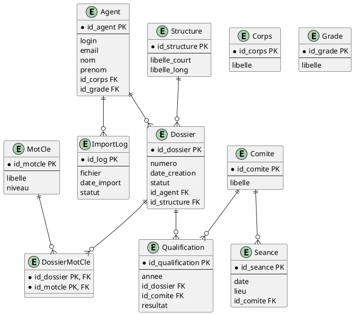

# Cahier des Charges Fonctionnel (CCF) – **SIREINES**  
*(Gestion du répertoire national des experts et spécialistes scientifiques et techniques)*  

---  

[TOC]

---  

## 1️⃣ Introduction et contexte du projet {#introduction-et-contexte-du-projet}

| Élément | Description |
|---|---|
| **Nom du projet** | SIREINES – *Système d’Information des REpertoires d’Experts et de Spécialistes* |
| **Porteur** | **MOA** : CGDD / DRI / AST2 – Pascal Zémour (Chef de projet) & Vincent Letrouit (Sponsor) |
| **Maîtrise d’œuvre** | **MOE** : Klee Group (historique) – SG / DNUM / PNM / DPNM3 (actuel) |
| **Environnement** | Application Web Java /J2EE (Tomcat 7), BIRT 4.3, Elasticsearch 7, PostgreSQL 14, Docker, IaaS (ECO4 – La Défense) |
| **Enjeux** | • Constitution d’un répertoire d’experts qualifiés  <br>• Pilotage des demandes de qualification par les comités de domaine <br>• Traçabilité, conformité RGPD/DACP, fiabilité des statistiques BIRT |
| **Version en production (12 /03 2024)** | 2.5.20 (déploiement 12 /03 2026) |
| **Portée géographique** | Nationale (France) |
| **Statut** | En production – maintenance évolutive & corrective |

> **Objectif principal** – Mettre à disposition, via une application web, un service de collecte, de suivi et de diffusion des demandes de qualification d’experts, tout en garantissant la conformité juridique (RGPD, CNIL) et la continuité de service.

---  

## 2️⃣ Expression fonctionnelle du besoin (NF EN 16271) {#expression-fonctionnelle-du-besoin}

### 2.1 Décomposition en **fonctions de service**  

| # | Fonction de service (FS) | Description (quoi) | Critères d’appréciation (exemples) | Pondération* |
|---|---|---|---|---|
| **FS‑01** | **Gestion des utilisateurs & authentification** | Authentifier les agents, administrateurs et membres de comités, gérer les profils et droits d’accès. | - Temps de connexion ≤ 2 s <br>- 99,9 % de disponibilité <br>- Conformité RGPD (gestion consentement) | 12 |
| **FS‑02** | **Gestion des dossiers de qualification** | Créer, consulter, mettre à jour, clôturer les dossiers (demande, pièces, suivi). | - Création ≤ 5 s <br>- Historisation 100 % des actions <br>- Accès en lecture pour les membres du comité concerné | 15 |
| **FS‑03** | **Gestion du référentiel (agents, corps, grades, mots‑clé, structures)** | Administrer les listes de référence utilisées dans les dossiers. | - Modification en < 3 s <br>- Validation de cohérence (ex. code unique) <br>- Export CSV/BIRT disponible | 10 |
| **FS‑04** | **Recherche full‑text (Elasticsearch)** | Permettre la recherche rapide sur dossiers, mots‑clé, qualifications. | - Temps de réponse ≤ 500 ms <br>- Indexation < 30 min après modification <br>- Pertinence ≥ 90 % (relevé test) | 8 |
| **FS‑05** | **Exports / extractions (BIRT)** | Générer les rapports d’extraction (statistiques, pyramides d’âge, fréquence mots‑clé, etc.). | - Génération ≤ 10 s <br>- Formats PDF, XLS, CSV <br>- Archivage 30 jours sur serveur | 9 |
| **FS‑06** | **Import de fichiers** | Importer les fichiers d’alimentation (CSV, XML) via interface ou batch. | - Validation du format avant import <br>- Traçabilité des imports (log) <br>- Roll‑back sur échec | 7 |
| **FS‑07** | **Gestion des séances de qualification** | Planifier, suivre et consigner les séances des comités. | - Calendrier partagé <br>- Notification e‑mail ≤ 2 min <br>- Historisation des comptes‑rendus | 6 |
| **FS‑08** | **Envoi de courriels & notifications** | Informer les agents, rapporteurs, comités (validation, rejet, rappel). | - Délai d’envoi ≤ 30 s <br>- Taux de délivrabilité ≥ 95 % | 5 |
| **FS‑09** | **Administration du système** (monitoring, sauvegarde, mise à jour) | Gestion de l’infrastructure Docker, mise à jour du WAR, sauvegarde de la BDD. | - Temps de mise à jour ≤ 15 min <br>- Restauration BDD ≤ 10 min <br>- Monitoring OK (Grafana) | 8 |
| **FS‑10** | **Sécurité & conformité** | Gestion des droits, chiffrement, journalisation, respect DACP. | - Chiffrement TLS 1.2+ <br>- Journalisation ISO 27001 <br>- Audit RGPD annuel | 10 |

\* **Pondération** : valeur relative (sur 100) indiquant l’importance stratégique de chaque fonction.  

> **Total** : 100 % → permet de prioriser les développements et les critères d’acceptation (voir § 9).  

---  

## 3️⃣ Acteurs et parties prenantes {#acteurs-et-parties-prenantes}

| Acteur | Rôle | Besoins fonctionnels spécifiques |
|---|---|---|
| **Agent (expert)** | Utilisateur final – dépose une demande de qualification | FS‑02, FS‑04, FS‑05, FS‑08 |
| **Gestionnaire de référentiel** | Responsable du maintien des listes (corps, grades, mots‑clé) | FS‑03, FS‑06 |
| **Membre du comité de domaine** | Examine les dossiers, participe aux séances | FS‑02, FS‑04, FS‑07, FS‑08 |
| **Rapporteur** | Rédige le compte‑rendu de qualification | FS‑02, FS‑07 |
| **Administrateur système (MOE)** | Déploiement, monitoring, sauvegarde | FS‑09, FS‑10 |
| **MOA – CGDD/DRI/AST2** | Pilotage stratégique, conformité, suivi qualité | FS‑01, FS‑10, rapports de suivi |
| **Support (portail‑support.din.gouv.fr)** | Gestion des incidents, tickets | FS‑01, FS‑10 |
| **BIRT / Elasticsearch** | Composants techniques | FS‑04, FS‑05 |
| **Docker / IaaS (ECO4)** | Infrastructure d’exécution | FS‑09, FS‑10 |

---  

## 4️⃣ Cas d’usage (Use Cases) – PlantUML {#cas-dusage}

```plantuml
@startuml
!define RECTANGLE class
skinparam rectangle {
  BackgroundColor<<Actor>> LightBlue
  BackgroundColor<<UC>> LightGreen
  BorderColor Black
}

actor "Agent" as A
actor "Gestionnaire Référentiel" as GR
actor "Membre Comité" as MC
actor "Administrateur" as ADM
actor "Support" as SUP

RECTANGLE "UC‑01\nAuthentification" as UC01 <<UC>>
RECTANGLE "UC‑02\nDéposer une demande de qualification" as UC02 <<UC>>
RECTANGLE "UC‑03\nRechercher un dossier" as UC03 <<UC>>
RECTANGLE "UC‑04\nExporter un rapport d’extraction" as UC04 <<UC>>
RECTANGLE "UC‑05\nImporter un fichier de masse" as UC05 <<UC>>
RECTANGLE "UC‑06\nPlanifier une séance de comité" as UC06 <<UC>>
RECTANGLE "UC‑07\nMise à jour du système (déploiement)" as UC07 <<UC>>

A --> UC01 : 1. Saisir identifiants
UC01 --> A : 2. Accès à l’application
A --> UC02 : 3. Remplir formulaire
UC02 --> A : 4. Confirmation création
A --> UC03 : 5. Saisir critères
UC03 --> A : 6. Résultats affichés
GR --> UC05 : 7. Sélectionner fichier
UC05 --> GR : 8. Log d’import
MC --> UC03 : 9. Recherche dossiers à examiner
MC --> UC04 : 10. Exporter tableau de bord
MC --> UC06 : 11. Proposer date séance
ADM --> UC07 : 12. Déployer nouvelle version
SUP --> UC01 : 13. Réinitialiser mot de passe
@enduml
```

### 4.1 Description détaillée des cas d’usage  

| UC | Nom | Acteur(s) principal(s) | Scénario nominal | Scénarios alternatifs / d’erreur | Pré‑conditions | Post‑conditions |
|---|---|---|---|---|---|---|
| **UC‑01** | Authentification | Agent, Administrateur | 1. L’utilisateur saisit login / mdp → 2. Le système valide (LDAP) → 3. Création de la session → 4. Redirection vers l’accueil. | 1. Mot de passe expiré → page de réinitialisation (UC‑13). <br>2. Compte bloqué → affichage message d’erreur. | Compte existant dans la base. | Session active, token JWT stocké. |
| **UC‑02** | Déposer une demande de qualification | Agent | 1. Accès à "Nouvelle demande". <br>2. Saisie des informations (structure, corps, grade, mots‑clé). <br>3. Validation → création du dossier (statut *En cours*). | 1. Données manquantes → messages d’erreur champ obligatoire. <br>2. Mot‑clé inconnu → proposition d’ajout (FS‑03). | Agent authentifié. | Dossier persistant, notification e‑mail envoyée (FS‑08). |
| **UC‑03** | Rechercher un dossier | Agent, Membre Comité | 1. Saisie de critères (numéro, structure, état). <br>2. Le moteur Elasticsearch renvoie les résultats. | 1. Aucun résultat → message "Aucun dossier". <br>2. Timeout > 500 ms → fallback sur recherche SQL. | Index à jour (FS‑04). | Liste de dossiers affichée, possibilité d’ouverture. |
| **UC‑04** | Exporter un rapport d’extraction | Membre Comité | 1. Sélection du type d’extraction (ex. pyramide d’âge). <br>2. Saisie de paramètres (période, structure). <br>3. Lancement du rapport BIRT → téléchargement PDF. | 1. Erreur de génération → message d’erreur + log. | Données disponibles dans la BDD. | Fichier PDF disponible, historique d’export enregistré. |
| **UC‑05** | Importer un fichier de masse | Gestionnaire Référentiel | 1. Sélection du fichier CSV. <br>2. Validation du format (en‑tête, séparateur). <br>3. Insertion en batch → log d’import. | 1. Format invalide → rejet + rapport d’erreur. <br>2. Conflit de clé → mise à jour ou rejet selon règle. | Accès au répertoire `sireines_pgadmin`. | Table mise à jour, logs d’import conservés 30 jours. |
| **UC‑06** | Planifier une séance de comité | Membre Comité | 1. Ouverture du planning → sélection d’une date/heure. <br>2. Invitation des participants (e‑mail). <br>3. Confirmation → création de la séance. | 1. Conflit de disponibilité → proposition d’alternative. | Référentiel des comités à jour. | Séance enregistrée, notifications envoyées. |
| **UC‑07** | Mise à jour du système (déploiement) | Administrateur | 1. Pull du WAR depuis le registre Gitlab. <br>2. Stop du conteneur `sireines-app`. <br>3. Copie du nouveau WAR → `/tmp/ROOT.war`. <br>4. `docker compose up -d`. <br>5. Vérification de la version. | 1. Container ne démarre pas → rollback à la version précédente. <br>2. Migration BDD échoue → arrêt du déploiement. | Accès serveur, sauvegarde BDD récente. | Application en version cible, logs de déploiement conservés. |

---  

## 5️⃣ Processus métier (BPMN) – optionnel {#processus-métier}

```plantuml
@startbpmn
start
:Authentifier l’utilisateur;
if (Compte valide ?) then (Oui)
  :Accéder à l’accueil;
  split
    :Déposer une demande;
    :Enregistrement du dossier;
  split again
    :Planifier la séance;
    :Notifier les membres;
  end split
  :Comité examine le dossier;
  :Statut = Validé / Rejeté;
  :Envoi du mail de décision;
else (Non)
  :Rediriger vers page d’erreur;
endif
stop
@endbpmn
```

> Ce diagramme illustre le **cycle de vie d’un dossier** (dépose → examen → décision).  

---  

## 6️⃣ Règles métier et contraintes fonctionnelles {#règles-métier-et-contraintes-fonctionnelles}

| # | Règle (condition → action) | Type | Source |
|---|---|---|---|
| **R‑01** | *Si* le mot‑clé n’existe pas dans le référentiel, *alors* proposer son ajout (FS‑03). | Validation | NF EN 16271 |
| **R‑02** | *Si* le statut d’un dossier passe à **« Validé »**, *alors* générer automatiquement le courrier de notification (FS‑08). | Business | MOA |
| **R‑03** | *Si* le nombre d’échecs d’authentification > 5 sur 10 min, *alors* verrouiller le compte 30 min (FS‑01). | Sécurité | ISO 29148 |
| **R‑04** | *Si* la version du WAR < 2.5.20, *alors* bloquer le déploiement en production (FS‑09). | Release | CI/CD |
| **R‑05** | *Si* un import CSV contient une ligne non conforme, *alors* la ligne est rejetée, le reste est importé (FS‑06). | Résilience | MOE |
| **R‑06** | *Si* le volume `sireines_db_sireines_vol` atteint 80 % de capacité, *alors* alerter l’administrateur (FS‑10). | Monitoring | Infra |
| **R‑07** | *Si* un utilisateur demande la suppression d’une donnée personnelle, *alors* le système doit anonymiser les champs concernés dans les 24 h (DACP). | RGPD | CNIL |
| **R‑08** | *Si* le serveur atteint 90 % CPU, *alors* déclencher le scaling horizontal (Docker Swarm) (FS‑09). | Performance | Infra |
| **R‑09** | *Si* le mot de passe ne respecte pas la règle (≥ 12 car, 2 maj, 2 chiffres, 1 spécial), *alors* refuser la création/modification (FS‑01). | Sécurité | ISO 27001 |
| **R‑10** | *Si* le rapport BIRT est généré, *alors* l’archiver dans le répertoire `/reports/YYYY/MM/` (FS‑05). | Archivage | MOA |

---  

## 7️⃣ Parcours utilisateurs (User Journey) {#parcours-utilisateurs}

| Étape | Action utilisateur | Système | Points de contact | Critères d’acceptation (Gherkin) |
|---|---|---|---|---|
| **1** | L’agent ouvre le navigateur → `https://sireines.recette…/Accueil.do` | Page d’accueil | URL, page HTML | **Given** l’agent dispose d’un compte actif **When** il saisit l’URL **Then** la page d’accueil s’affiche en < 2 s |
| **2** | Saisie du login / mdp → clic sur **Connexion** | Service d’authentification (LDAP) | Formulaire login | **Given** des identifiants valides **When** il clique **Then** il est redirigé vers le tableau de bord |
| **3** | Accès au menu **« Nouvelle demande »** | Contrôleur `DossierAction` | Menu principal (Struts2) | **Given** l’utilisateur est sur le tableau de bord **When** il sélectionne « Nouvelle demande » **Then** le formulaire de création s’affiche |
| **4** | Remplit le formulaire (structure, corps, grade, mots‑clé) | Validation côté serveur (JSR‑303) | Formulaire HTML | **Given** le formulaire complet **When** il soumet **Then** le dossier est créé avec statut *En cours* |
| **5** | Recherche d’un dossier existant | Moteur Elasticsearch | Champ de recherche | **Given** un mot‑clé connu **When** il lance la recherche **Then** les résultats s’affichent en ≤ 500 ms |
| **6** | Le comité planifie une séance | Service `SeancesServices` | Calendrier | **Given** un dossier en attente **When** le comité planifie la séance **Then** les invitations sont envoyées sous 2 min |
| **7** | Le rapporteur télécharge le compte‑rendu BIRT | BIRT 4.3 | Bouton **Export PDF** | **Given** le compte‑rendu disponible **When** il clique **Then** le PDF se télécharge en ≤ 10 s |
| **8** | L’administrateur déploie une nouvelle version | Docker‑compose | Console Docker | **Given** le WAR 2.5.20 disponible **When** il lance `docker compose up -d` **Then** l’application redémarre en ≤ 15 s et la version affichée est 2.5.20 |

---  

## 8️⃣ Modèle Conceptuel de Données (MCD) {#modèle-conceptuel-de-données}



> Le modèle ci‑dessus regroupe les entités majeures de SIREINES : **Agent**, **Dossier**, **Qualification**, **Comité**, **Mot‑clé**, **Séance**, **Structure**, **ImportLog**. Les cardinalités reflètent les relations décrites dans le code (`DossierMotsClefsSearchLoader`, `SeancesServices`, etc.).  

---  

## 9️⃣ Critères d’acceptation et validation {#critères-dacceptation-et-validation}

| Fonction (FS) | Critère d’acceptation | Méthode de validation | Priorité (MoSCoW) |
|---|---|---|---|
| **FS‑01** Authentification | Temps de connexion ≤ 2 s, 99,9 % disponibilité, verrouillage après 5 échecs | Tests de charge (JMeter), logs d’audit | **M** |
| **FS‑02** Gestion des dossiers | Création ≤ 5 s, historisation 100 % des actions, notifications e‑mail | Tests fonctionnels (Selenium), audit DB | **M** |
| **FS‑03** Référentiel | Modification ≤ 3 s, unicité des codes, export CSV OK | Tests unitaires, vérif. d’unicité (DB constraints) | **S** |
| **FS‑04** Recherche (Elasticsearch) | Réponse ≤ 500 ms, précision ≥ 90 % (relevé) | Benchmark ES, scripts de test pertinence | **M** |
| **FS‑05** Extractions BIRT | Génération ≤ 10 s, formats PDF/XLS, archivage 30 j | Tests de charge, vérif. de la taille du fichier | **M** |
| **FS‑06** Import de fichiers | Validation format avant import, rollback complet en cas d’erreur | Tests d’import (CSV valide / invalide), logs | **C** |
| **FS‑07** Séances | Notification e‑mail ≤ 2 min, agenda partagé | Tests d’envoi (SMTP), vérif. agenda (iCal) | **S** |
| **FS‑08** Courriels | Délai d’envoi ≤ 30 s, taux de délivrabilité ≥ 95 % | Monitoring SMTP, rapports de rebond | **M** |
| **FS‑09** Administration | Déploiement ≤ 15 min, restauration BDD ≤ 10 min | Runbooks, tests de reprise | **M** |
| **FS‑10** Sécurité & conformité | TLS 1.2+, journalisation ISO 27001, audit RGPD annuel | Scans vulnérabilité (OWASP ZAP), audit interne | **M** |

> **M** = *Must* (obligatoire) – **S** = *Should* – **C** = *Could*.  

---  

## 🔟 Annexes {#annexes}

### 10.1 Glossaire métier  

| Terme | Définition |
|---|---|
| **Dossier** | Demande de qualification d’un agent, contenant les informations de structure, corps, grade, mots‑clé, pièces jointes. |
| **Qualification** | Décision du comité (Validé / Rejeté) attribuée à un dossier, avec un an de qualification. |
| **Comité de domaine** | Jury d’experts qui examine les dossiers selon un périmètre fonctionnel (ex. santé, environnement). |
| **Mot‑clé** | Thématique (ex. “hydrologie”) utilisée pour indexer les dossiers et faciliter la recherche. |
| **Seance** | Réunion du comité où sont examinés les dossiers sélectionnés. |
| **BIRT** | Business Intelligence and Reporting Tools – moteur de génération de rapports PDF/Excel. |
| **Elasticsearch** | Moteur de recherche full‑text utilisé pour les filtres rapides sur dossiers/mots‑clé. |
| **DACP** | Données à caractère personnel – données couvertes par le RGPD. |
| **CNIL** | Commission nationale de l’informatique et des libertés – autorité de contrôle. |

### 10.2 Référentiels normatifs  

| Référence | Intitulé | Application |
|---|---|---|
| **NF EN 16271** | Management par la valeur – Expression fonctionnelle du besoin | Définition des fonctions de service (FS) et critères d’appréciation. |
| **ISO/IEC/IEEE 29148 :2018** | Ingénierie des exigences | Structure du CCF, traçabilité exigences ↔ fonctions ↔ tests. |
| **ISO 27001** | Système de management de la sécurité de l’information | Sécurité des accès, journalisation, gestion des incidents. |
| **RGPD** | Règlement général sur la protection des données | Traitement des DACP, droit à l’oubli, registre des traitements. |
| **CNIL n°1034232** | Déclaration d’activité liée à SIREINES | Conformité légale, mentions légales. |

### 10.3 Historique des versions du CCF  

| Version | Date | Modifications |
|---|---|---|
| **1.0** | 2024‑03‑27 | Première rédaction – intégration des documents source. |
| **1.1** | 2024‑04‑02 | Ajout du BPMN, pondération des fonctions, critères de performance. |
| **1.2** | 2024‑04‑10 | Validation MOA – prise en compte des exigences RGPD/DACP. |

---  

## 📌 Conclusion  

Ce **Cahier des Charges Fonctionnel** formalise l’ensemble des besoins exprimés par les parties prenantes du projet **SIREINES**, en les traduisant en fonctions de service, acteurs, cas d’usage, processus métier, règles et critères d’acceptation. Il constitue le socle de référence pour :

* la **conception détaillée** (design technique, architecture micro‑services),  
* la **planification** (priorisation selon pondération),  
* la **validation** (tests fonctionnels, de performance, de sécurité) et  
* la **gestion du changement** (déploiement, maintenance).

Le respect de ce CCF garantit la conformité juridique (RGPD, CNIL), la continuité de service (HA, sauvegarde) et la satisfaction des utilisateurs finaux (agents, comités, gestionnaires).  

---  

*Document généré le **27 /04 /2024** – conformément aux normes NF EN 16271 et ISO/IEC/IEEE 29148.*  