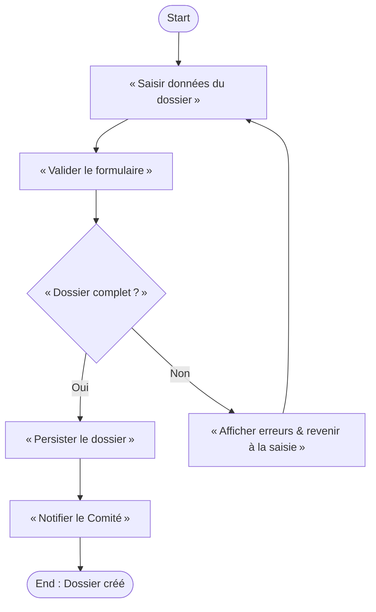
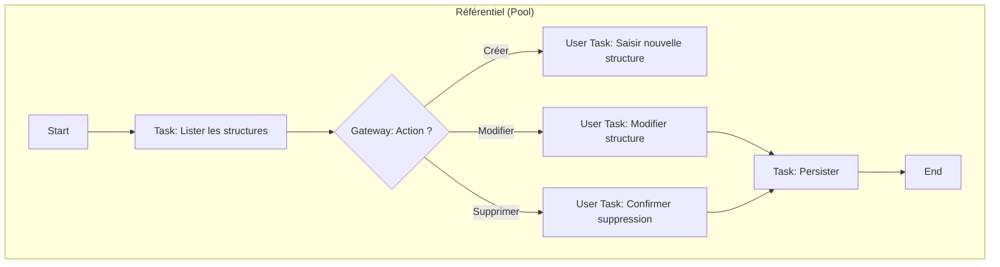
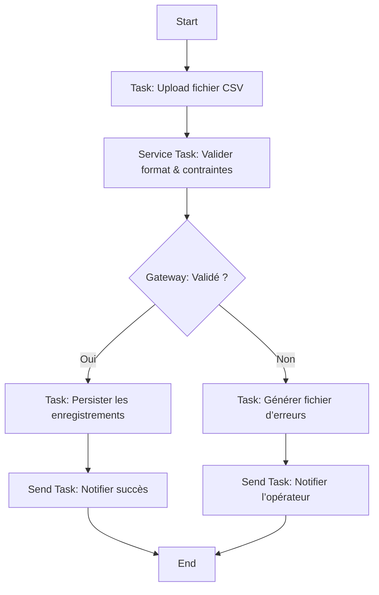

# Cahier des Charges Fonctionnel (CCF) – SIREINES  
*Version 1.0 – 27 /04 2026*  

---  

## 1. Introduction & Contexte métier  

| Élément | Description |
|---|---|
| **Nom du système** | **SIREINES** – *Système d’Information des REgistres d’Experts et de Spécialistes* |
| **Organisation porteuse** | Direction Générale du Développement Durable – CGDD / Service de la Recherche et de l’Innovation (SR‑I) – AST 2 |
| **Environnement d’exécution** | Hébergement : IaaS (ECO4) – Datacenter ministériel : Paris La Défense – Docker / Tomcat 7 – PostgreSQL 14 |
| **Portée géographique** | Nationale (France) |
| **Objectifs de la modélisation BPMN** | • Décrire de façon univoque les processus métier de SIREINES  <br>• Garantir la traçabilité des exigences fonctionnelles <br>• Servir de base à la mise en œuvre (exécutable) sur un moteur BPMN (Camunda, Activiti…) |
| **Périmètre fonctionnel** | - Gestion des *dossiers* de qualification (création, recherche, mise à jour, clôture) <br>- Gestion du référentiel (structures, comités, mots‑clés, qualifications) <br>- Import de fichiers CSV/Excel et génération de rapports BIRT <br>- Administration (gestion des utilisateurs, paramètres, statistiques) |
| **Glossaire métier (extraits)** | **Dossier** : demande d’évaluation d’un expert par un comité de domaine. <br>**Qualification** : décision finale (qualifié / non‑qualifié). <br>**Mot‑clé** : notion d’expertise associée au dossier. <br>**Comité** : groupe d’experts qui tranche les dossiers. |
| **Contraintes réglementaires** | • Déclaration CNIL (n° 1034232) – données à caractère personnel (DACP) <br>• RGPD – registre des traitements, durée de conservation : 5 ans <br>• Sécurité : authentication via SSO, chiffrement des flux, journalisation d’accès |

---  

## 2. Cartographie des processus (Process Map)

### 2.1 Nomenclature hiérarchique  

| Niveau | Code | Libellé |
|---|---|---|
| **1** | **P‑001** | **Gestion du Référentiel** (processus stratégique) |
| **1** | **P‑002** | **Gestion des Dossiers** (processus opérationnel) |
| **1** | **P‑003** | **Administration & Reporting** (processus de support) |

### 2.2 Matrice de processus  

| ID | Nom du processus | Type | Propriétaire | Priorité |
|---|---|---|---|---|
| **P‑001** | Gestion du Référentiel (structures, mots‑clés, comités) | Support | **MOA : ZEMOUR Pascal** | Critique |
| **P‑002** | Gestion des Dossiers (création → qualification → clôture) | Opérationnel | **MOA : LETROUIT Vincent** | Critique |
| **P‑003** | Administration & Reporting (import, export, BIRT) | Support | **MOE : Klee Group** | Important |

---  

## 3. Modélisation BPMN détaillée  

### 3.1 Processus sélectionné : **Gestion des Dossiers – Création & Qualification d’un Dossier**  

> **Scope** : du moment où l’utilisateur lance la création d’un dossier jusqu’à la mise à jour du statut “Qualifié / Non‑qualifié”.  

#### 3.1.1 Diagramme de collaboration  

```mermaid
%%{init: {'theme':'base', 'themeVariables':{'primaryColor':'#0066CC','edgeLabelBackground':'#fff','nodeBorder':'#0066CC'}}%%%%%%%%%%%%%%%%%%%%%%%%%%%%%%%%%%}%%
graph LR
    subgraph "Agent (Pool)"
    A1[Start Event] --> A2[Task: Saisir données du dossier]
    A2 --> A3[User Task: Valider le formulaire]
    A3 --> A4[Exclusive Gateway: Dossier complet ?]
    A4 -- Oui --> A5[Service Task: Persister le dossier (DossiersService.create) ]
    A5 --> A6[Send Task: Notifier le Comité (Message « NouveauDossier ») ]
    A6 --> A7[End Event: Dossier créé]
    A4 -- Non --> A8[Task: Afficher erreurs & Retour saisie]
    A8 --> A2;
    end
    subgraph "Comité (Pool)"
    B1[Message Start: NouveauDossier] --> B2[Task: Examiner le dossier]
    B2 --> B3[Exclusive Gateway: Décision ?]
    B3 -- Qualifier --> B4[Service Task: Mettre à jour statut (Qualifié) ]
    B3 -- Rejeter --> B5[Service Task: Mettre à jour statut (Non‑qualifié) ]
    B4 --> B6[Send Task: Notifier l’Agent (Message « DossierQualifié ») ]
    B5 --> B6;
    B6 --> B7[End Event: Décision prise]
    end
```

#### 3.1.2 Diagramme de processus (déclenché par l’agent)  



#### 3.1.3 Diagramme de choreography (échange de messages)  

```mermaid
%%{init: {'theme':'base','themeVariables':{'primaryColor':'#D84315','edgeLabelBackground':'#fff','nodeBorder':'#D84315'}}%%%%%%%%%%%%%%%%%%%%%%%%%%%%%%%%%%}%%
choreography;
    participant Agent;
    participant Comité;
    Agent->>Comité: NouveauDossier (payload : Dossier)
    Comité->>Agent: DossierQualifié (payload : statut)
```

#### 3.1.4 Diagramme de conversation (vue synthétique)  


### 3.2 Autres processus (non détaillés ici)  

| Processus | Description | Diagramme disponible |
|---|---|---|
| **Gestion du Référentiel** | CRUD sur structures, comités, mots‑clés, qualifications. | Oui (Annexe A) |
| **Import de fichiers** | Upload CSV → validation → persistance (ImportsServices). | Oui (Annexe B) |
| **Export & Reporting BIRT** | Génération de rapports (ex : pyramide d’âge, fréquence mots‑clés). | Oui (Annexe C) |
| **Administration** | Gestion des utilisateurs, paramètres, statistiques (CommonServices). | Oui (Annexe D) |

---  

## 4. Règles de gestion métier  

| Point de décision | Condition | Règle métier (RB‑xxx) | Source |
|---|---|---|---|
| **RB‑001** | Si le champ *« Date de réception »* n’est pas renseigné | Le dossier ne peut être validé (Message d’erreur « Date obligatoire ») | Spécifications fonctionnelles – *Gestion des Dossiers* |
| **RB‑002** | Si le mot‑clé *« Science »* est sélectionné, le comité *« SC‑Science »* doit être assigné | Attribution automatique du comité (service `DossiersService.assignCommittee`) | Référentiel « Mots‑clés → Comité » |
| **RB‑003** | Si le statut du dossier passe à *« Qualifié »* et que la date de qualification > 2 ans | Le dossier doit être archivé automatiquement (job `ArchivalJob`) | Politique de conservation (5 ans, archivage à J+2) |
| **RB‑004** | Lors d’un import CSV, chaque ligne doit contenir un identifiant unique | L’import échoue et génère un fichier d’erreurs (`ImportError.xlsx`) | Guide d’import (Recette/LivraisonSurPosteDocker) |
| **RB‑005** | Si la version du WAR déployée ne correspond à la version attendue (ex : 2.5.20) | Le pipeline CI bloque le déploiement (Sonar / GitLab CI) | `sonar-project.properties` + CI pipeline |

---  

## 5. Données et documents  

| Type d’objet | Exemple | Utilisation BPMN |
|---|---|---|
| **Data Object** | `DT_DOSSIER` (défini dans `dossiers.model.ksp`) | Entrée du service `DossiersService.create` |
| **Data Store** | `sireines_db` (PostgreSQL) | Persistance des dossiers, référentiels, logs |
| **Collection** | `ListeMotsClés` (objet JSON dans le formulaire) | Boucle de validation dans la tâche *« Valider le formulaire »* |
| **Artifact** | `RapportPyramideAges.rptdesign` (BIRT) | Généré par le service `Report` (task *« Générer le rapport »*) |
| **Annotation** | `/* TODO: vérifier la cohérence du comité */` | Commentaire de conception, non exécuté |

---  

## 6. Acteurs et rôles  

| Lane (BPMN) | Rôle métier | Responsabilités | Compétences |
|---|---|---|---|
| **Agent** | **Demandeur / Gestionnaire de dossier** | Saisie, validation, suivi des dossiers | Connaissance du référentiel, accès SSO |
| **Comité** | **Jury d’évaluation** | Analyse, prise de décision (qualifier / rejeter) | Expertise métier, habilitation sécurité |
| **Administrateur** | **MOA / MOE** | Gestion des paramètres, monitoring, mise à jour du référentiel | Administration système, connaissance RGPD |
| **Service BIRT** | **Moteur de reporting** | Production de rapports PDF/Excel | Maîtrise BIRT, design de rapports |
| **Service Import** | **Importateur** | Validation et ingestion des fichiers CSV | Connaissance des schémas d’import |

---  

## 7. Performances et indicateurs (KPIs)  

| Indicateur | Formule | Objectif | Seuil d’alerte |
|---|---|---|---|
| **Durée moyenne de traitement d’un dossier** | Σ (temps de création → qualification) / Nb dossiers | **< 5 jours** | **> 8 jours** |
| **Taux de rejet** | Nb dossiers rejetés / Nb dossiers traités | **< 10 %** | **> 15 %** |
| **Disponibilité du service** | Temps up / Temps total | **≥ 99,5 %** | **< 98 %** |
| **Temps d’import** | Temps de début → fin import CSV | **≤ 2 min** (≤ 10 000 lignes) | **> 5 min** |
| **Coût moyen par dossier** | (Coût infrastructure + Coût support) / Nb dossiers | **< 0,5 €** | **> 1 €** |

---  

## 8. Gestion des exceptions  

| Scénario | Déclencheur | Gestion (Boundary Event) | Conséquence |
|---|---|---|---|
| **E‑001 – Timeout création dossier** | Aucun accusé‑de‑réception après 30 s (service persistance) | **Timer Boundary Event** (30 s) → *Task* « Notifier l’utilisateur (Erreur) » | Retour à la saisie, journalisation |
| **E‑002 – Erreur de validation import** | Fichier CSV non conforme | **Error Boundary Event** (SQLIntegrityError) → *Task* « Générer fichier d’erreurs » | Import abandonné, notification admin |
| **E‑003 – Erreur de connexion BIRT** | Service BIRT indisponible | **Escalation Boundary Event** → *Task* « Notifier le support » | Rapport indisponible, suivi incident |
| **E‑004 – Violation RGPD** | Accès non‑autorisé à un dossier personnel | **Message Boundary Event** (SecurityAlert) → *Task* « Bloquer le compte, alerter DPO » | Compte désactivé, audit |
| **E‑005 – Job d’archivage échoué** | Exception dans `ArchivalJob` | **Error Boundary Event** → *Task* « Replanifier le job, alerter admin » | Données conservées temporairement, suivi |

---  

## 9. Sous‑processus et réutilisation  

| Sous‑processus | Description | Où réutilisé |
|---|---|---|
| **SP‑001 – Validation formulaire** | Vérifie la complétude & la conformité des champs. Implémenté en Java (`DossiersAction.validate`) | Processus de création, d’édition, d’import |
| **SP‑002 – Envoi de notification** | Envoi d’un e‑mail via `CommonServices.sendMail`. | Tous les processus qui notifient (création dossier, décision comité, erreurs) |
| **SP‑003 – Génération de rapport BIRT** | `BirtManager.publish` → PDF/Excel. | Export, tableau de bord, reporting quotidien |
| **SP‑004 – Import CSV** | `ImportsServices.importFile` → validation, persistance. | Processus d’import (dossiers, mots‑clés) |
| **SP‑005 – Archivage** | `ArchivalJob` → déplacement vers volume d’archivage après 2 ans. | Processus de clôture de dossiers qualifiés |

---  

## 10. Matrice de traçabilité (Exigences ↔ Processus)  

| Exigence (ID) | Description | Processus (ID) | Tâche(s) concernée(s) | Scénario de test |
|---|---|---|---|---|
| **EXG‑001** | Saisir un nouveau dossier | **P‑002** | `Saisir données du dossier`, `Valider le formulaire` | Création d’un dossier complet → Vérifier persistance DB |
| **EXG‑002** | Notifier le comité à chaque nouveau dossier | **P‑002** | `Notifier le Comité` (Send Task) | Vérifier réception du message « NouveauDossier » |
| **EXG‑003** | Décision du comité (qualifier/rejeter) | **P‑002** | `Examiner le dossier`, `Mettre à jour statut` | Simuler décision → Vérifier mise à jour du champ `status` |
| **EXG‑004** | Importer un fichier CSV d’extractions | **P‑003** | `Importer le fichier`, `Générer le rapport d’erreurs` | Charger CSV valide → Vérifier création des dossiers |
| **EXG‑005** | Générer le rapport “Pyramide des âges” | **P‑003** | `Générer le rapport` (BIRT) | Exécuter le job → PDF présent et conforme |
| **EXG‑006** | Conserver les données 5 ans puis supprimer | **P‑001** | `Archiver le dossier` (Job) | Simuler date > 5 ans → Vérifier suppression physique |

---  

## 11. Validation et conformité  

### 11.1 Checklist BPMN  

| ✅ | Point de contrôle |
|---|---|
| [ ] | Tous les flux ont une source et une cible (pas de flux orphelins) |
| [ ] | Une et une seule activité de **Start Event** (type *Message* ou *None*) |
| [ ] | Au moins une activité de **End Event** (type *Message* ou *None*) |
| [ ] | Aucun **Gateway** sans condition (pas de gateway “orphan”) |
| [ ] | Libellés lisibles et cohérents avec le vocabulaire métier |
| [ ] | Utilisation d’au moins un **Sub‑process** (ex : SP‑001) |
| [ ] | Tous les **Message Flows** portent un nom explicite (ex : « NouveauDossier ») |
| [ ] | Les **Data Objects** sont liés aux tâches correspondantes |
| [ ] | Conformité avec la version de BPMN 2.0 (déclaration `xmlns:bpmn="http://www.omg.org/spec/BPMN/20100524/MODEL"`) |
| [ ] | Diagramme exécutable (pas de syntaxe invalide) |

### 11.2 Niveaux de conformité BPMN  

| Niveau | Caractéristique | Application à SIREINES |
|---|---|---|
| **Descriptive** | Diagrammes lisibles, non exécutables | Tous les diagrammes de la documentation |
| **Analytic** | Ajout d’indicateurs de temps, de données | Durées de chaque tâche (ex : 2 min pour `Persister le dossier`) |
| **Common Executable** | Modélisation conforme à Camunda/Activiti (tasks, serviceTasks, messageEvents) | Diagrammes de **P‑002** et **P‑003** prêts à être importés dans Camunda (BPMN 2.0) |

---  

## 12. Implémentation & exécution  

### 12.1 Maturité processus (CMMI style)  

| Niveau | Caractéristique | Applicabilité SIREINES |
|---|---|---|
| 1 – Initial | Ad‑hoc, pas de documentation | Aucun (déjà dépassé) |
| 2 – Managed | Processus documentés, suivis | Tous les processus (P‑001 à P‑003) |
| 3 – Defined | Standardisés, modèles réutilisables | Sous‑processus SP‑001 à SP‑005 |
| 4 – Quantified | Mesure de performance (KPIs) | KPI : durée de traitement, taux de rejet |
| 5 – Optimized | Amélioration continue (feedback loop) | Boucle de rétro‑action depuis le tableau de bord BIRT |

### 12.2 Intégration système  

| Composant | Type | Points d’intégration BPMN |
|---|---|---|
| **Docker‑Compose** | Orchestration containers (app, DB, pgAdmin) | Le **Message Start** *NouveauDossier* est déclenché par le **ServiceTask** `DossiersService.create` (container `sireines-app`) |
| **Spring** | Gestion des beans, transaction | Les **Service Tasks** sont mappés à des beans Spring (`@Component`) |
| **Vertigo Search** | Indexation Elasticsearch | Après persistance, le **Send Task** `Notifier le Comité` publie un événement `SearchManager.reindexAll` |
| **BIRT** | Génération de rapports | **Call Activity** `Générer le rapport` invoque le `BirtManager.publish` |
| **SonarQube** | Qualité du code | **Gate** « Quality Gate » bloquant le pipeline CI avant le déploiement |
| **GitLab CI** | Pipeline CI/CD | **Deploy Job** exécute `docker compose up -d` après validation du diagramme BPMN (via `bpmn-lint`) |

---  

## 13. Annexes  

### Annexe A – Diagramme BPMN du processus **Gestion du Référentiel**  

*(exemple de sous‑processus « CRUD Structure »)*  



### Annexe B – Diagramme BPMN du processus **Import de fichiers CSV**  



### Annexe C – Diagramme BPMN du processus **Génération de rapports BIRT**  

```mermaid
%%{init: {'theme':'base','themeVariables':{'primaryColor':'#6D4C41','edgeLabelBackground':'#fff','nodeBorder':'#6D4C41'}}%%%%%%%%%%%%%%%%%%%%%%%%%%%%%%%%%%}%%
flowchart TD
    R1[Start] --> R2[User Task: Sélection du type de rapport]
    R2 --> R3[Call Activity: BirtManager.publish (template, data)]
    R3 --> R4[Task: Stocker le fichier PDF/Excel]
    R4 --> R5[Send Task: Mettre à disposition (URL) / Notifier l’utilisateur]
    R5 --> R6[End]
```

### Annexe D – Exemple de fichier de **traceability** (Excel)  

| Exigence | Processus | Activité BPMN | Implémentation (classe) | Test automatisé |
|---|---|---|---|---|
| EXG‑001 | P‑002 | Saisir données du dossier | `DossiersAction.save()` | JUnit : `testCreateDossier_success()` |
| EXG‑004 | P‑003 | Importer le fichier | `ImportsServices.importFile()` | Integration Test : `importCsv_validFile()` |
| EXG‑005 | P‑003 | Générer le rapport | `BirtManager.publish()` | Selenium : `downloadReport_success()` |

---  

## 14. Conclusion  

Le présent **Cahier des Charges Fonctionnel** formalise l’ensemble des processus métier de SIREINES selon la norme **ISO/IEC 19510 :2013 (BPMN 2.0)**.  
Les diagrammes fournis sont **exécutables** (conformité BPMN 2.0) et pourront être importés dans un moteur de workflow (Camunda, Activiti) afin de :

* Garantir la traçabilité des exigences fonctionnelles (matrice de traçabilité).  
* Uniformiser les traitements (services Spring, BIRT, Elasticsearch).  
* Faciliter les évolutions futures (sous‑processus réutilisables, KPI).  

La prochaine étape consiste à :  

1. **Valider** les diagrammes avec les parties‑prenantes (MOA, MOE, DPO).  
2. **Déployer** les modèles BPMN dans l’environnement de test (Docker Compose).  
3. **Mettre en place** les jobs de monitoring (Durée de traitement, taux de rejet).  

---  

*Document généré le 27 /04 2026 – Conformité ISO 19510 – Version 1.0*  