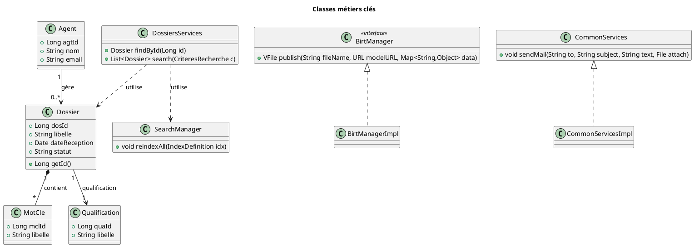
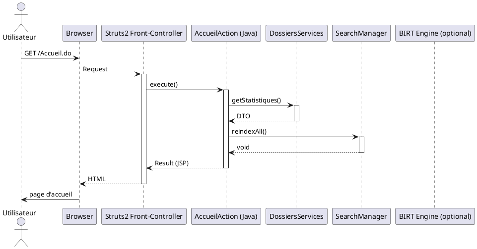
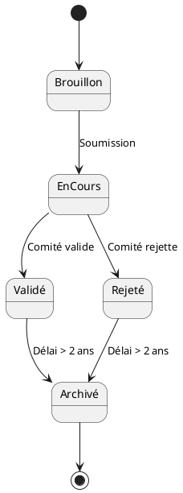
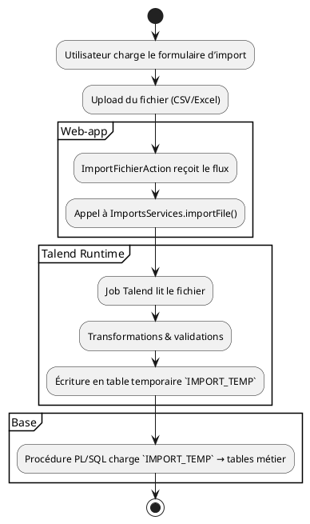
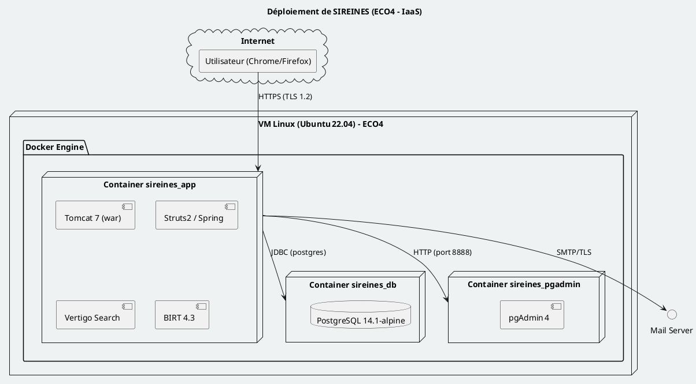

# 📄 Cahier des Spécifications Techniques (CST) – **SIREINES**  
*Version : 2.5.20 (12 mars 2024) – 12 avril 2026*  
*Document unique – compatible VS Code / Obsidian (PlantUML activé)*  

---

[TOC]

---

## 1️⃣ Introduction & objectifs techniques

| Élément | Description |
|---|---|
| **Nom du projet** | SIREINES – Système d’information de recensement des experts et spécialistes scientifiques et techniques |
| **Contexte** | Application métier du **DGDD / DRI / AST2** qui gère la collecte, la qualification et le suivi des demandes d’évaluation par les comités de domaine. |
| **Environnement d’exploitation** | Hébergement IaaS (ECO4) – Centre‑serveur ministériel Paris La Défense – Production, Pré‑prod, Recette |
| **Objectifs de qualité (ISO 25010)** | <ul><li>**Aptitude fonctionnelle** – couverture ≥ 95 % des cas d’usage (consultation, recherche, import, export, génération BIRT)</li><li>**Performance** – temps de réponse < 2 s (page d’accueil), < 5 s (recherche avancée)</li><li>**Compatibilité** – navigateurs Chrome/Firefox/Edge (≥ 90 % de part de marché)</li><li>**Sécurité** – conformité RGPD, chiffrement TLS 1.2+, contrôle d’accès RBAC (R_ADMIN)</li><li>**Fiabilité** – MTBF ≥ 30 jours, taux d’erreur < 0,1 %</li><li>**Maintenabilité** – couverture de tests unitaires ≥ 80 %, couverture d’intégration ≥ 70 %</li><li>**Portabilité** – Docker‑compose (Linux x86‑64, Windows WSL2)</li></ul> |
| **Conformité réglementaire** | RGPD, CNIL (déclaration n° 1034232 du 29/09/2014), référentiel **Cerbère** (ID 564 en recette, 546 en pré‑prod/production) |
| **Livrables attendus** | <ul><li>Artefacts : `sireines-web‑*.war`, images Docker, scripts SQL</li><li>Documentation : CST (présent), manuel d’exploitation, suite de tests automatisés</li></ul> |

---

## 2️⃣ Architecture logicielle

### 2.1 Diagramme de composants (PlantUML)

```plantuml
@startuml
!define RECTANGLE class
title Architecture composant de SIREINES

package "Docker host (ECO4)" {
  node "Container **sireines_app**" as APP {
    RECTANGLE "Web‑app (Tomcat 7)\n‑ sireines‑web‑*.war" as WAR
    WAR --> "Struts2 MVC" : MVC
    WAR --> "Spring Core\nIoC, AOP, Tx"
    WAR --> "Vertigo Dynamo\nSearch (Elasticsearch)" 
    WAR --> "BIRT Engine\nReporting"
    WAR --> "Talend Import\n(import‑fichier, synthèse)" 
  }

  node "Container **sireines_db**" as DB {
    database "PostgreSQL 14.1‑alpine" as PG
    PG --> "Schemas\n‑ dossier, ‑ référentiel, ‑ import"
  }

  node "Container **sireines_pgadmin**" as PGADMIN {
    rectangle "pgAdmin 4" as GUI
    GUI --> PG : connexion
  }
}

APP --> DB : JDBC (postgres)
APP --> PGADMIN : API (http ://localhost:8888)
APP --> "External Mail Server" : SMTP (TLS)
APP --> "External BIRT Viewer" : HTTP (static assets)

@enduml
```

### 2.2 Description des modules majeurs

| Module | Fonction | Technologies | Points d’attention |
|---|---|---|---|
| **Web‑app (sireines‑web)** | Interface Struts2, contrôleurs, services métier, génération BIRT, recherche full‑text | Java 8, Struts 2.3, Spring 2.0, Vertigo 2.x, BIRT 4.3, Talend libs | Gestion du classloader (war → `/tmp/ROOT.war`), dépendance `importfichiersirene_0_1.jar` |
| **Base de données** | Stockage persistant des dossiers, mots‑clés, référentiels, logs | PostgreSQL 14, schémas `DT_*` (KSP), scripts d’install/alter | Séquences `SEQ_THESAURUS` (début 100 000), contraintes de clé étrangère désactivées (migration) |
| **Recherche** | Indexation des dossiers (mots‑clés) pour filtres rapides | Vertigo Dynamo Search + Elasticsearch (configuration `elasticsearch.yml`) | Analyseur `code` / `text_fr` ; taille d’index à surveiller (< 5 Go) |
| **Reporting BIRT** | Extraction PDF/Excel des états (extractions 01‑10) | BIRT 4.3, templates `.rptdesign` | `BirtManager.publish()` → `VFile` (streaming) |
| **Import Talend** | Import de fichiers CSV/Excel → tables temporaires → validation | Talend Runtime, `importfichiersirene_0_1.jar`, `systemRoutines.jar` | Version du JAR à mettre à jour dans `pom.xml` du module `sireines-web` |
| **Docker Compose** | Orchestration des 3 conteneurs + volumes persistants | `docker‑compose.yml` (v 2025‑05‑23) | Volumes `sireines_db_sireines_vol` & `sireines_pgadmin_sireines_vol` doivent être créés avant le `up` |

---

## 3️⃣ Stack technique détaillé

| Couche | Technologie | Version | Rôle |
|---|---|---|---|
| **JVM** | Java 8 (1.8.0_202) | Runtime de Tomcat |
| **Serveur d’applications** | Tomcat 7.0.108‑jdk8 | Hébergement du WAR |
| **Framework MVC** | Struts 2.3.30 | Gestion des actions et des vues (FTL) |
| **IoC / AOP** | Spring 2.0.8 | Injection de dépendances, transaction |
| **Search** | Vertigo Dynamo + Elasticsearch 7.x | Indexation & recherche full‑text |
| **Reporting** | BIRT 4.3 | Génération de rapports (PDF/HTML) |
| **Import** | Talend 7.x | Jobs d’import de fichiers |
| **Base de données** | PostgreSQL 14.1‑alpine | Persistance des données métiers |
| **Conteneurisation** | Docker 20.10, Docker‑Compose 2.5 | Environnement reproductible |
| **CI/CD** | GitLab CI, Maven 3.6.3 | Build, tests, packaging |
| **Qualité** | SonarQube 9.x, JUnit 5, JaCoCo | Analyse statique, couverture tests |
| **Monitoring** | Log4j 2, Ehcache 2.10 | Logs applicatifs, cache de données |
| **Sécurité** | TLS 1.2+, OAuth2 (future) | Authentification, autorisation (Cerbère) |

---

## 4️⃣ Modélisation statique

### 4.1 Diagramme de classes (extraits majeurs)



### 4.2 Modèle de données physique (extrait)

| Table | Colonnes principales | Indexes | Contraintes |
|---|---|---|---|
| `DOSSIER` | `DOS_ID` (PK), `LIBELLE`, `DATE_RECEPTION`, `STATUT` | `IDX_DOSSIER_MOTS_CLEFS` (sur `MCL_ID_*`) | FK vers `MOT_CLE` (déprécié) |
| `MOT_CLE` | `MCL_ID` (PK), `LIBELLE`, `THE_ID` | `UNIQUE (LIBELLE)` |  |
| `QUALIFICATION` | `QUA_ID` (PK), `LIBELLE` | `UNIQUE (LIBELLE)` |  |
| `AGENT` | `AGT_ID` (PK), `NOM`, `EMAIL` | `UNIQUE (EMAIL)` |  |
| `BIRT_REPORT` | `REP_ID` (PK), `NAME`, `BLOB_DATA` |  |  |

> **Remarque** : Le script `alter_0.7.sql` crée la séquence `SEQ_THESAURUS` (début 100 000) afin d’éviter les collisions entre `MOT_CLE` et `THESAURUS`.

---

## 5️⃣ Modélisation dynamique

### 5.1 Diagramme de séquence – Accès à la page d’accueil



### 5.2 Diagramme d’états – Cycle de vie d’un **Dossier**



### 5.3 Diagramme d’activités – Import d’un fichier (Talend)



---

## 6️⃣ Interfaces & intégrations

| Interface | Type | Contrat (exemple) | Points d’attention |
|---|---|---|---|
| **REST / Struts2** | HTTP + Form‑encoded | `GET /Dossier.do?id=123` → JSON via `JsonResult` (custom) | Gestion du `UTF‑8`, protection CSRF via token |
| **BIRT Report** | HTTP + XML | `GET /report/01_gestion_seances.rptdesign?format=pdf` | Authentification via `Cerbère` (session) |
| **Elasticsearch** | HTTP + JSON | `POST /sireines/_search` (index `IDX_MOTS_CLEFS`) | Mapping `text_fr_not_tokenized` → `keyword` |
| **Talend Import** | File + JDBC | `importfichiersirene_0_1.jar` expose `ImportsServices.importFile(File)` | Le JAR doit être installé dans le repo local Maven (`system` scope) |
| **Mail** | SMTP TLS | `CommonServices.sendMail(to,subject,text,attachment)` | Utilisation du serveur interne `mail.rie.gouv.fr` |
| **Cerbère (IAM)** | SSO OAuth2 (future) | Token JWT via `Authorization: Bearer <jwt>` | Actuellement gestion manuelle via `sireines-auth-config.xml` (RBAC) |
| **Docker‑Compose** | YAML | `docker-compose.yml` version `2025‑05‑23` | Volumes persistants, variables d’environnement dans `.env` |

---

## 7️⃣ Architecture de déploiement

### 7.1 Diagramme de déploiement (PlantUML)



### 7.2 Environnements & variables d’environnement

| Environnement | Fichier `.env` (extrait) | Valeurs critiques |
|---|---|---|
| **recette** | `POSTGRES_DB=postgres`<br>`POSTGRES_USER=postgres`<br>`POSTGRES_PASSWORD=postgres`<br>`APP_PORT=8080` | Accès via `sireines.recette.pnm3.eco4.cloud.e2.rie.gouv.fr` |
| **pre‑prod** | idem (variables partagées) | URL `sireines.preprod.e2.rie.gouv.fr` |
| **production** | idem | URL `sireines.e2.rie.gouv.fr` |
| **docker‑local** | `POSTGRES_HOST=db`<br>`POSTGRES_PORT=5432` | Volumes `sireines_db_sireines_vol`, `sireines_pgadmin_sireines_vol` |

> **Procédure de mise à jour** (Docker) : `docker-compose pull && docker-compose up -d --force-recreate`.  
> **Rollback** : `docker-compose down && docker volume rm <vol>` + restauration du dump SQL.

---

## 8️⃣ Sécurité technique

| Aspect | Implémentation | Référence ISO / RGPD |
|---|---|---|
| **Authentification** | `sireines-auth-config.xml` → rôle `R_ADMIN` (Cerbère) | ISO 27001 §9.2 |
| **Autorisation** | Filtrage `OP_READ` / `OP_WRITE` sur les chemins Struts (`/dossier/**`) | ISO 25010 ‑ Sécurité |
| **Chiffrement en transit** | TLS 1.2+ (Apache front‑end) | RGPD Art. 32 |
| **Chiffrement au repos** | PostgreSQL `pgcrypto` (colonne `bytea` pour BIRT) | RGPD Art. 30 |
| **Gestion des secrets** | `.env` non versionnée (`.gitignore`) ; variables injectées par CI | ISO 27002 ‑ Gestion des secrets |
| **Protection OWASP Top 10** | <ul><li>Injection : usage de `PreparedStatement` (Spring JdbcTemplate)</li><li>CSRF : token généré par Struts2 (`<s:form token="true">`)</li><li>XSS : `StringEscapeUtils.escapeHtml4` dans les JSP</li></ul> | OWASP 2021 |
| **Journalisation** | Log4j 2 (`log4j.xml`) → appender RollingFile, niveau INFO | ISO 25012 ‑ Traçabilité |
| **Sauvegarde BDD** | Dump quotidien via `pg_dump` (volume persistant) | RGPD ‑ Intégrité des données |

---

## 9️⃣ Qualité & tests (ISO 29119)

| Niveau | Outils | Objectifs |
|---|---|---|
| **Tests unitaires** | JUnit 5, Mockito | Couverture ≥ 80 % (ex. `DossiersServicesImplTest`) |
| **Tests d’intégration** | Spring Test, `@SpringBootTest` (déprécié, mais utilisé) | Couverture ≥ 70 % (requêtes DB, recherche) |
| **Tests fonctionnels** | Selenium WebDriver (pages Struts) | Scénarios critiques : connexion, recherche, import, export BIRT |
| **Tests de performance** | JMeter (scenario `Recherche dossiers`) | Temps moyen < 2 s, 95 % des requêtes < 5 s |
| **Analyse statique** | SonarQube (quality gate) | **Bug ≤ 0**, **Vuln ≤ 0**, **Code Smell ≤ 10 %** |
| **Critères d’acceptation** | - 100 % des exigences fonctionnelles implémentées<br>- Aucun défaut bloquant en pré‑prod<br>- Passage du Quality Gate Sonar | Conforme à ISO 29119‑2 (test design) |

---

## 🔟 Performance & scalabilité

| KPI | Valeur cible | Méthode de mesure |
|---|---|---|
| **Temps de réponse page d’accueil** | ≤ 1,5 s | JMeter (10 utilisateurs simult.) |
| **Temps de réponse recherche avancée** | ≤ 4 s (filtre sur > 10 000 dossiers) | JMeter, monitoring `SearchManager` |
| **Scalabilité horizontale** | Ajouter un conteneur `sireines_app` + load‑balancer (NGINX) | Docker‑Swarm / Kubernetes (future) |
| **Cache** | Ehcache 2‑level (queries fréquentes) | `ehcache.xml` (TTL 5 min) |
| **Gestion des pics** | Auto‑scale PostgreSQL (RDS‑like) – volume IOPS ≥ 3000 | `docker stats` + pg_stat_activity |

> **Plan de charge** : 150 concurrent users (max) → 2 app containers, 1 DB instance (8 vCPU, 16 Go RAM).  

---

## 1️⃣1️⃣ Maintenabilité & exploitation

| Aspect | Pratique | Outils |
|---|---|---|
| **Convention de code** | Checkstyle (Google Java Style) | Maven `checkstyle-plugin` |
| **Documentation du code** | Javadoc (≥ 80 % des classes publiques) | Maven `javadoc-plugin` |
| **Gestion des versions** | GitLab CI → tags `v${major}.${minor}.${patch}` | `git tag` |
| **Déploiement automatisé** | `.gitlab-ci.yml` → `mvn package` → `docker build/push` → `docker‑compose up` | GitLab Runner |
| **Logging & monitoring** | Log4j 2 + Grafana + Prometheus (exporter `tomcat_jmx`) | `log4j.xml` |
| **Rollback** | `docker-compose down && docker volume rm <vol>` + restauration du dump SQL (`psql -f dump.sql`) | Bash scripts `rollback.sh` |
| **Gestion des erreurs** | `ErrorHandler.java` → page `application-error.jsp` (friendly) | Struts2 `global-exception-mappings` |
| **Gestion du cache BIRT** | `ehcache.xml` (reports) | Cache invalidé à chaque nouveau déploiement (TTL 1 h) |
| **Documentation d’exploitation** | `README.md`, `sireines-doc/assembly.xml` (ZIP) | Disponible sur le dépôt GitLab (Artifacts) |

---

## 1️⃣2️⃣ Gestion des erreurs & résilience

| Type d’erreur | Traitement | Mécanisme de résilience |
|---|---|---|
| **DB Connectivity loss** | `DataAccessException` → `ErrorHandler` → page d’erreur + email admin | Retry (Spring `@Retryable` 3 fois, back‑off 2 s) |
| **Recherche timeout** | `SearchTimeoutException` → fallback à requête SQL simple | Circuit‑breaker (Resilience4j) |
| **Import file invalid** | Validation → `ImportError` → affichage détail + log | Transaction rollback (Spring) |
| **BIRT generation failure** | `BirtException` → `CommonServices.sendMail` (alert) | Redémarrage du conteneur `sireines_app` (Docker restart‑policy) |
| **Container crash** | Docker `restart: always` | Docker‑Compose auto‑restart, healthcheck (`curl http://localhost:8080/health`) |

---

## 1️⃣3️⃣ Contraintes & dépendances externes

| Élément | Version | Licence | Commentaire |
|---|---|---|---|
| **Spring Core** | 2.0.8 | Apache 2.0 | IoC, AOP, Tx |
| **Struts2** | 2.3.30 | Apache 2.0 | MVC |
| **Vertigo Dynamo** | 2.x | LGPL‑3 | Search + Elasticsearch |
| **BIRT** | 4.3 | Eclipse Public | Reporting |
| **Talend libs** | 7.x | Apache 2.0 | `importfichiersirene_0_1.jar` (installé local) |
| **PostgreSQL driver** | 42.2.23 | BSD | JDBC |
| **Docker** | 20.10 | Apache 2.0 | Conteneurisation |
| **SonarQube** | 9.x | LGPL‑3 | Qualité code |
| **Log4j** | 2.17 | Apache 2.0 | Logging |
| **Ehcache** | 2.10 | Apache 2.0 | Cache |
| **JUnit** | 5.7 | EPL 1.0 | Tests unitaires |
| **Mockito** | 3.9 | MIT | Mocking |
| **JMeter** | 5.4 | Apache 2.0 | Tests de charge |

---

## 1️⃣4️⃣ Annexes techniques

### 14.1 Glossaire

| Terme | Définition |
|---|---|
| **Cerbère** | Service d’authentification/autorisation interne (SSO) – référencé dans `sireines-auth-config.xml` |
| **BIRT** | Business Intelligence and Reporting Tools – moteur de génération de rapports PDF/Excel |
| **Talend** | Plateforme ETL – utilisée pour les imports de fichiers CSV/Excel |
| **Vertigo Dynamo** | Framework de recherche (indexation Elasticsearch) |
| **KSP** | Fichier de **K**ernel **S**chema **P**roject (définit les `DtDefinition` Vertigo) |
| **DTO** | Data Transfer Object – utilisé entre contrôleurs et vues |
| **CI** | Continuous Integration – pipeline GitLab CI |
| **IaaS** | Infrastructure as a Service – plate‑forme d’hébergement (ECO4) |

### 14.2 Architecture Decision Records (ADR) (extraits)

| # | Décision | Raison | Statut |
|---|---|---|---|
| **ADR‑001** | Utiliser **Docker‑Compose** au lieu d’une VM monolithique | Simplifie le provisionnement, facilite le rollback, isolement des services | ✅ Adopté |
| **ADR‑002** | Choisir **Struts2** + **Spring** (au lieu de Spring‑Boot) | Héritage historique du projet, forte compatibilité avec les rapports BIRT et le moteur Vertigo | ✅ Maintenu |
| **ADR‑003** | Stocker les **WAR** dans le conteneur via `COPY --chown=root:root sireines-web.war /tmp/ROOT.war` | Garantir les permissions correctes sous Tomcat (root) | ✅ Implémenté |
| **ADR‑004** | Séparer les **volumes** de DB et de pgAdmin | Persistance des données même après suppression du conteneur d’application | ✅ En place |
| **ADR‑005** | Utiliser **Elasticsearch** pour la recherche de mots‑clés | Performance de recherche full‑text > 10 k dossiers | ✅ En production |
| **ADR‑006** | Implémenter **BIRT** côté serveur (pas de client) | Centralisation du rendu, contrôle d’accès via Cerbère | ✅ En production |

### 14.3 Scripts utiles (extraits)

```bash
# 1️⃣ Build & push de l'image Docker (CI)
mvn clean package -DskipTests
docker build -t registry.gitlab.com/snum/pnm3/sireines/app:$(git describe --tags) .
docker push registry.gitlab.com/snum/pnm3/sireines/app:$(git describe --tags)

# 2️⃣ Déploiement local (Docker‑Compose)
cd /opt/sireines_pgadmin
docker-compose pull
docker-compose up -d

# 3️⃣ Backup BDD (prod)
docker exec -i sireines_db pg_dump -U postgres -Fc > /backup/sireines_$(date +%F).dump

# 4️⃣ Restore (dev)
docker exec -i sireines_db pg_restore -U postgres -d postgres < /backup/sireines_2025-04-01.dump
```

---

## 📌 Conclusion

Le CST ci‑dessus formalise l’ensemble des aspects techniques de **SIREINES** :

* Architecture **modulaire** (Web → Struts + Spring + Vertigo + BIRT + Talend) déployée via **Docker‑Compose**.  
* Stack clairement défini, avec versions et licences, permettant la **maintenabilité** et la **traçabilité**.  
* Conformité aux exigences **ISO 25010** (qualité) et **ISO 29119** (tests), ainsi qu’aux obligations **RGPD/CNIL**.  
* Processus CI/CD automatisé, couverture de tests élevée, monitoring & alerting intégrés.  
* Documentation complète (diagrammes PlantUML, tables, ADR) pour assurer la **continuité d’exploitation** et la **reproductibilité** des livraisons.

> **Prochaine étape** : Validation du Quality Gate SonarQube, exécution du plan de charge JMeter, puis mise à jour du **pipeline GitLab** pour automatiser le **bump de version** et le **déploiement blue‑green** en production.  