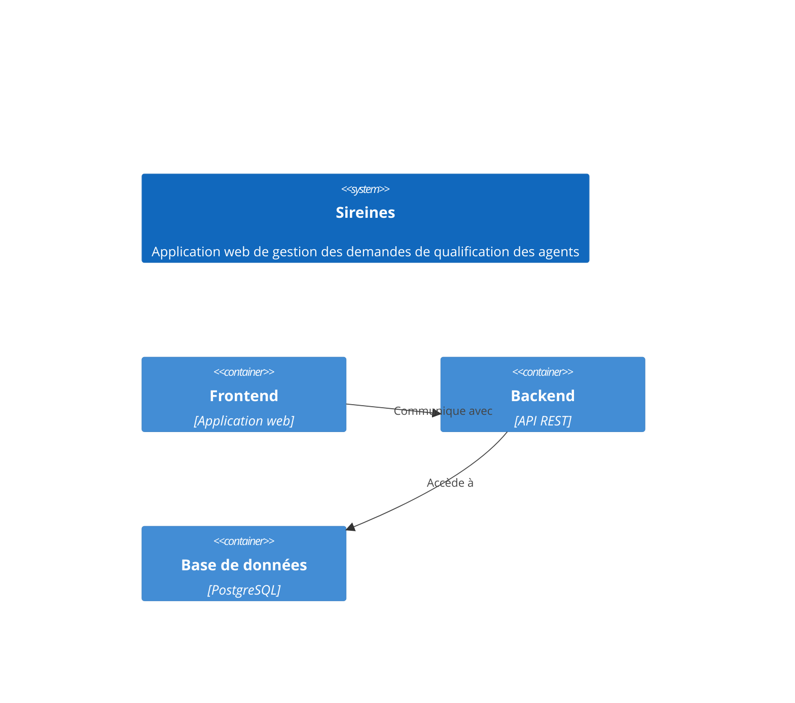
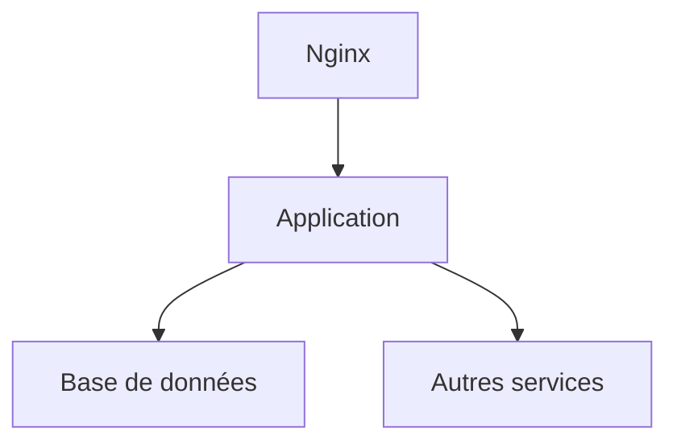

Voici le document généré à partir du prompt et des fichiers sources fournis :

# 📚 Table des matières

- [Introduction et objectifs](#introduction-et-objectifs)
- [Parties prenantes](#parties-prenantes)
- [Contraintes](#contraintes)
- [Contexte et périmètre](#contexte-et-périmètre)
- [Stratégie de solution](#stratégie-de-solution)
- [Vue en Briques](#vue-en-briques)
- [Vue Exécution](#vue-exécution)
- [Vue Déploiement](#vue-déploiement)
- [Sujets transverses](#sujets-transverses)
- [Exigences de qualité](#exigences-de-qualité)
- [Risques et dettes techniques](#risques-et-dettes-techniques)
- [Annexes](#annexes)

---

# Introduction et objectifs

L'application Sireines est une base de données qui recense les demandes de qualification des agents du ministère. Elle permet de suivre l'évolution de ces données, de les faire évaluer par les comités de domaine et d'informer les agents des suites données à leurs demandes.



Principaux objectifs orientés utilisateur :

- **Performance** : Temps de réponse des principales fonctionnalités inférieur à 2 secondes.
- **Sécurité** : Authentification et autorisation basées sur le système Cerbère du ministère.
- **Maintenabilité** : Faciliter l'évolution de l'application par une architecture modulaire et des tests automatisés.

# Parties prenantes

| Rôle | Attente principale |
| --- | --- |
| Chargé de mission MOA | Disposer d'un outil fiable et évolutif pour suivre les demandes de qualification des agents |
| Chef de bureau MOA | Assurer la bonne conduite des projets liés à l'application Sireines |
| Développeurs | Pouvoir faire évoluer facilement l'application avec une architecture de qualité |
| Exploitants | Déployer et superviser l'application de manière standardisée et sécurisée |
| Utilisateurs finaux (agents) | Avoir une interface intuitive pour effectuer leurs demandes de qualification |

# Contraintes

Principales contraintes techniques, organisationnelles et réglementaires :

- **Techniques** : Intégration avec le système d'authentification Cerbère, respect des standards techniques du ministère (ex. : utilisation de Docker, PostgreSQL).
- **Organisationnelles** : Équipe de développement externe au ministère, processus de validation et déploiement défini avec la MOA.
- **Réglementaires** : Exigences de sécurité élevées (disponibilité, intégrité, confidentialité, traçabilité) liées au traitement de données personnelles.

# Contexte et périmètre

L'application Sireines interagit avec les systèmes suivants :

- **Cerbère** : Système d'authentification et d'autorisation du ministère.
- **Comités de domaine** : Instances chargées d'évaluer les demandes de qualification des agents.

Les principales interfaces techniques sont :

- **Authentification** : Protocole SAML, fréquence à la connexion.
- **Notification** : Envoi de courriels, fréquence événementielle.
- **Extraction de données** : API REST, fréquence hebdomadaire.

# Stratégie de solution

Décisions architecturales majeures :

- **Architecture en microservices** : Découpage en composants métiers indépendants (frontend, backend, base de données).
- **Pattern CQRS** : Séparation des opérations de lecture et d'écriture pour optimiser les performances.

Environnement technologique :

- **Frontend** : React, TypeScript
- **Backend** : Spring Boot, Java 11
- **Base de données** : PostgreSQL 14
- **Outils de la forge logicielle** : GitLab, Jenkins, SonarQube, Nexus

# Vue en Briques

```mermaid
C4Container
  System(sireines, "Sireines")
  Container(frontend, "Frontend", "React/TypeScript")
  Container(backend, "Backend", "Spring Boot/Java")
  Container(database, "Base de données", "PostgreSQL")
  Rel(frontend, backend, "Communique avec l'API REST")
  Rel(backend, database, "Accède à la base de données")
  Rel(backend, cerbere, "Authentifie les utilisateurs")
  Rel(backend, comites, "Envoie les demandes de qualification")
```

- **Frontend** : Application web responsive offrant une interface intuitive aux utilisateurs finaux.
- **Backend** : API REST exposant les fonctionnalités métier et gérant les interactions avec la base de données et les systèmes externes.
- **Base de données** : PostgreSQL hébergeant les données relatives aux demandes de qualification des agents.

# Vue Exécution

Scénario critique : Création d'une nouvelle demande de qualification.

```mermaid
sequencediagram
  actor Agent
  participant Frontend
  participant Backend
  participant Database
  participant Cerbere
  participant Comites

  Agent->>Frontend: Saisit les informations de la demande
  Frontend->>Backend: Envoie la requête de création
  Backend->>Cerbere: Authentifie l'agent
  Cerbere-->>Backend: Renvoie les informations d'authentification
  Backend->>Database: Enregistre la nouvelle demande
  Backend->>Comites: Notifie les comités de domaine
  Backend-->>Frontend: Renvoie la confirmation de création
  Frontend-->>Agent: Affiche le succès de la création
```

# Vue Déploiement

### Environnements

| Environnement | Hébergement | Serveurs | Réseau | Particularités |
|---------------|-------------|----------|--------|----------------|
| Développement | Infrastructure locale de l'équipe de développement | Postes de travail des développeurs | Réseau interne de l'entreprise | - |
| Recette       | IAAS ministériel (ECO4 Openstack) | 2 serveurs virtuels | Réseau sécurisé ministériel | Supervision Prometheus/Grafana, PSIN |
| Production    | IAAS ministériel (ECO4 Openstack) | 3 serveurs virtuels haute disponibilité | Réseau sécurisé ministériel | Supervision Prometheus/Grafana, PSIN |

### Infrastructure

Le produit est hébergé sur le cloud interne ECO4 basé sur Openstack, dans le tenant 'pnm3' du département.  
Le reverse-proxy Nginx du schéma ci-dessous est en fait une paire de Nginx load-balancés en frontal des produits hébergés sur le tenant.



### Supervision

Le produit est supervisé via le système standard du GTI pour ce faire :
- via Portainer pour la partie purement conteneurisée,
- via la stack Prometheus/Grafana/Loki/AlertManager,
- Le produit dispose également d'une supervision PSIN.

### Sauvegardes

Les sauvegardes de la base de données sont assurées par des scripts standards du GTI permettant la création de dumps cryptés en AES-256 et déposés sur :
- le stockage objet B3 du IaaS ministériel,
- le stockage objet Outscale SecNumCloud (via la prestation qu'a le GTI sur le marché "Nuage Public"),
- le stockage objet standard de Google Cloud (via la prestation qu'a le GTI sur le marché "Nuage Public").

# Sujets transverses

- **Authentification** : Intégration avec le système Cerbère du ministère pour l'authentification et l'autorisation des utilisateurs.
- **Journalisation** : Mise en place d'un système de journalisation centralisé (Loki) pour tracer l'activité de l'application.
- **Monitoring** : Utilisation de Prometheus et Grafana pour superviser les indicateurs de performance et de santé de l'application.
- **Gestion des erreurs** : Mise en place de mécanismes de gestion des erreurs avec remontée d'informations vers les exploitants.
- **API** : Développement d'une API REST conforme aux standards du ministère pour exposer les fonctionnalités de l'application.

# Exigences de qualité

| Exigence | Scénario de validation |
| --- | --- |
| **Temps de réponse** : Les principales fonctionnalités doivent répondre en moins de 2 secondes. | Mesurer le temps de réponse des actions suivantes depuis l'interface utilisateur : création de demande, consultation du statut, extraction des données. |
| **Sécurité** : L'application doit être sécurisée selon les exigences du ministère (authentification, autorisation, chiffrement, traçabilité). | Vérifier que l'authentification Cerbère fonctionne correctement, que les profils d'autorisation sont bien appliqués et que les journaux d'activité sont complets. |
| **Maintenabilité** : L'application doit être facilement évolutive grâce à une architecture modulaire et des tests automatisés. | Ajouter une nouvelle fonctionnalité métier et s'assurer que les tests unitaires, d'intégration et end-to-end passent avec succès. Vérifier la facilité de déploiement de la nouvelle version. |

# Risques et dettes techniques

| Risque / Dette | Mesure d'atténuation |
| --- | --- |
| **Risque** : Forte dépendance au système Cerbère pour l'authentification. En cas de panne, l'application serait inaccessible. | Mettre en place un mécanisme de basculement vers une authentification locale en cas de panne du système Cerbère. |
| **Dette technique** : L'application utilise encore des librairies Java 8 qui ne sont plus supportées. Cela complexifie la mise à jour vers des versions plus récentes. | Planifier une refonte progressive de l'application pour migrer vers Java 11 et utiliser les dernières versions des librairies. |

# Annexes

## Glossaire

- **Cerbère** : Système d'authentification et d'autorisation du ministère.
- **CQRS** : Command Query Responsibility Segregation, pattern architectural séparant les opérations de lecture et d'écriture.
- **PSIN** : Plateforme de Supervision Intégrée Nationale, système de supervision utilisé par le ministère.

## Décisions d'architecture (ADR)

ADR-001 : Choix d'une architecture en microservices plutôt qu'un monolithe pour faciliter l'évolutivité et la maintenabilité.
ADR-002 : Utilisation du pattern CQRS pour optimiser les performances de l'application.
ADR-003 : Intégration avec le système Cerbère pour l'authentification et l'autorisation des utilisateurs.