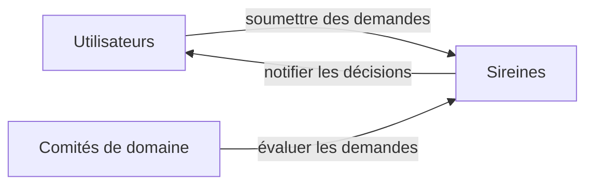
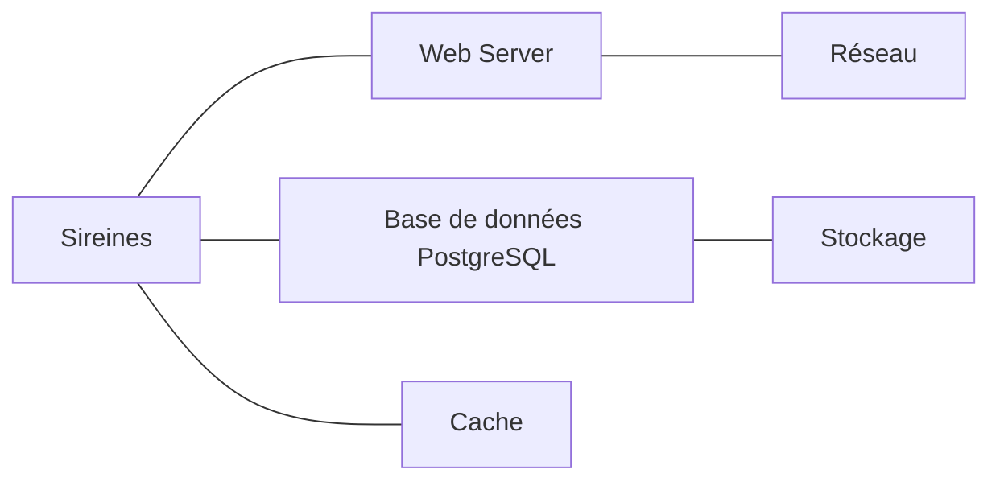
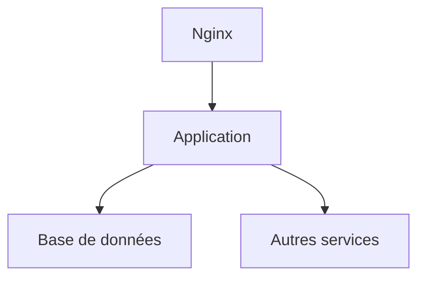

# Dossier d’Architecture Technique (DAT) pour Sireines

## Introduction et objectifs

Sireines est une application web développée par la mission des compétences scientifiques et techniques (DRI/AST4) qui recense toutes les demandes de qualification par les comités de domaine de ses agents. Elle suit l'évolution de ces données, coordonne leur évaluation par les comités de domaine, et tient les agents informés des suites de leurs de leurs demandes.

### Vue d’ensemble fonctionnelle

Sireines permet aux agents de soumettre des demandes de qualification, aux comités de domaine de traiter ces demandes et aux utilisateurs de suivre l'état de leurs demandes. L'application est accessible via un interface web et est hébergée sur des serveurs cloud.



### Objectifs de qualité

1. **Performance**: L'application doit répondre aux requêtes utilisateurs en moins d'une seconde.
2. **Sécurité**: Les données sensibles des utilisateurs sont protégées conformément aux réglementations en vigueur.
3. **Maintenabilité**: La structure de l'application permet des mises à jour et des corrections rapides et efficaces.
4. **Scalabilité**: L'application peut gérer une charge de travail variable sans perte de performance.
5. **Disponibilité**: L'application est disponible 99.9% du temps.

## Parties prenantes

- **Utilisateurs finaux**: Agents qui soumettent des demandes de qualification.
- **Comités de domaine**: Responsables de l'évaluation des demandes de qualification.
- **Administrateurs**: Personnes en charge de la maintenance et de la supervision de l'application.

### Attentes

- **Utilisateurs finaux**: Une interface utilisateur intuitive et une réponse rapide de l'application.
- **Comités de domaine**: Un outil efficace pour gérer et évaluer les demandes de qualification.
- **Administrateurs**: Une application stable et facile à maintenir, avec des outils de supervision complets.

## Contraintes

### Techniques

- L'application doit être hébergée sur un cloud interne ECO4 basé sur Openstack.
- L'application doit être développée en Java EE avec une base de données PostgreSQL.

### Organisationnelles

- Les modifications apportées à l'application doivent être revues et approuvées par le comité de projet avant mise en production.

### Réglementaires

- L'application doit respecter les lois en matière de protection des données personnelles (RGPD).

### Exigences de sécurité D-I-C-T

- **Disponibilité**: L'application doit être disponible 24/7.
- **Intégrité**: Les données doivent être protégées contre toute altération non autorisée.
- **Confidentialité**: Les données sensibles sont chiffrées et accessibles uniquement aux parties autorisées.
- **Traçabilité**: Toute action effectuée sur les données est enregistrée et pouvant être审计.

## Contexte et périmètre

Sireines interagit avec les comités de domaine via des flux de travail de validation des qualifications, avec les utilisateurs finaux pour la soumission et le suivi des demandes, et avec les serveurs cloud pour l'hébergement de l'application.

### Interfaces techniques

- **Protocole HTTP** pour les communications web.
- **JDBC** pour la communication avec la base de données PostgreSQL.
- **Docker** pour le déploiement des conteneurs de l'application.

## Stratégie de solution

### Décisions architecturales majeures

- L'application est un monolithe pour simplifier le déploiement et la maintenance.
- Un pattern MVC est utilisé pour séparer la logique d'affichage de la logique métier.

### Environnement technologique

- **Langage**: Java EE
- **Framework**: Spring Boot pour la partie serveur
- **Base de données**: PostgreSQL
- **Frontend**: HTML/CSS/JavaScript avec Angular

### Outils de la forge logicielle

- **CI/CD**: Jenkins pour l'intégration continue et le déploiement.
- **Tests**: JUnit et Selenium pour les tests unitaires et d'intégration.
- **Dépôt**: GitLab pour la gestion des versions du code.

## Vue en Briques



### Description des briques

- **Web Server**: Gère les requêtes HTTP et renvoie les réponses à l'utilisateur.
- **Base de données PostgreSQL**: Stocke toutes les données de l'application, y compris les demandes de qualification et les informations des utilisateurs.
- **Cache**: Améliore les performances en stockant temporairement les données fréquemment demandées.

## Vue Exécution

### Scénarios critiques

1. **Soumission d'une demande de qualification**: L'utilisateur remplit un formulaire et soumet sa demande. Le serveur traite la demande, la stocke dans la base de données et envoie une confirmation à l'utilisateur.
2. **Évaluation d'une demande de qualification**: Un comité de domaine accède aux informations de la demande, évalue la demande et enregistre la décision.

```mermaid
sequencediagram;
    participant Utilisateur;
    participant WebServer;
    participant BaseDonnées;
    Utilisateur->>WebServer: Soumettre une demande;
    WebServer->>BaseDonnées: Enregistrer la demande;
    BaseDonnées->>WebServer: Confirmation;
    WebServer->>Utilisateur: Afficher confirmation
```

## Vue Déploiement

### Environnements

| Environnement | Hébergement | Serveurs | Réseau | Particularités |
|---------------|-------------|----------|--------|----------------|
| Développement | Cloud interne ECO4 | À compléter | À compléter | À compléter |
| Recette       | Cloud interne ECO4 | À compléter | À compléter | À compléter |
| Production    | Cloud interne ECO4 | À compléter | À compléter | À compléter |

### Infrastructure

Le produit est hébergé sur le cloud interne ECO4 basé sur Openstack, dans le tenant 'pnm3' du département.  
Le reverse-proxy Nginx du schéma ci-dessous est en fait une paire de Nginx load-balancés en frontal des produits hébergés sur le tenant.



### Supervision

Le produit est supervisé via le système standard du GTI pour ce faire :
- via Portainer pour la partie purement conteneurisée,
- via la stack Prometheus/Grafana/Loki/AlertManager,
- Le produit dispose également d'une supervision PSIN.

### Sauvegardes

Les sauvegardes de la base de données sont assurées par des scripts standards du GTI permettant la création de dumps cryptés en AES-256 et déposés sur :
- le stockage objet B3 du IaaS ministériel,
- le stockage objet Outscale SecNumCloud (via la prestation qu'a le GTI sur le marché "Nuage Public"),
- le stockage objet standard de Google Cloud (via la prestation qu'a le GTI sur le marché "Nuage Public").

## Sujets transverses

### Authentification

L'application utilise l'authentification basée sur les formulaires pour les utilisateurs finaux et l'authentification LDAP pour les comités de domaine.

### Journalisation

Toutes les actions effectuées dans l'application sont journalisées avec un timestamp et un identifiant utilisateur pour permettre le suivi et la résolution des problèmes.

### Monitoring

L'application est监控 via Prometheus qui recueille des métriques sur les performances du serveur et de la base de données, et Grafana pour la visualisation de ces métriques.

## Exigences de qualité

### Exigences critiques

1. **Disponibilité**: L'application doit être disponible 99.9% du temps.
2. **Performance**: Les requêtes utilisateurs doivent être traitées en moins d'une seconde.

### Scénarios de validation

1. **Disponibilité**: Effectuer des tests de charge pour simuler une forte demande d'utilisation et vérifier que l'application reste disponible.
2. **Performance**: Utiliser des outils de profilage pour identifier les goulots d'étranglement et optimiser le code pour répondre aux objectifs de performance.

## Risques et dettes techniques

### Risques majeurs

1. **Changement de la politique de données personnelles**: Une modification des lois en matière de RGPD pourrait nécessiter des changements significatifs dans la manière dont l'application traite les données.

### Mesures correctives ou d’atténuation

1. **Mise à jour régulière de la politique de données**: Mettre en place un mécanisme pour surveiller les changements dans les lois relatives aux données personnelles et planifier les mises à jour de l'application en conséquence.

## Annexes

### Glossaire

- **RGPD**: Règlement général sur la protection des données.
- **MVC**: Modèle-Vue-Contrôleur, un pattern architectural utilisé pour séparer la logique d'affichage de la logique métier.

### Décisions d’architecture (ADR)

- **ADR-1**: Choisir Java EE comme langage de programmation pour tirer parti de sa stabilité et de sa richesse en fonctionnalités.
- **ADR-2**: Utiliser PostgreSQL comme base de données pour bénéficier de sa fiabilité et de sa compatibilité avec les normes de données ouvertes.