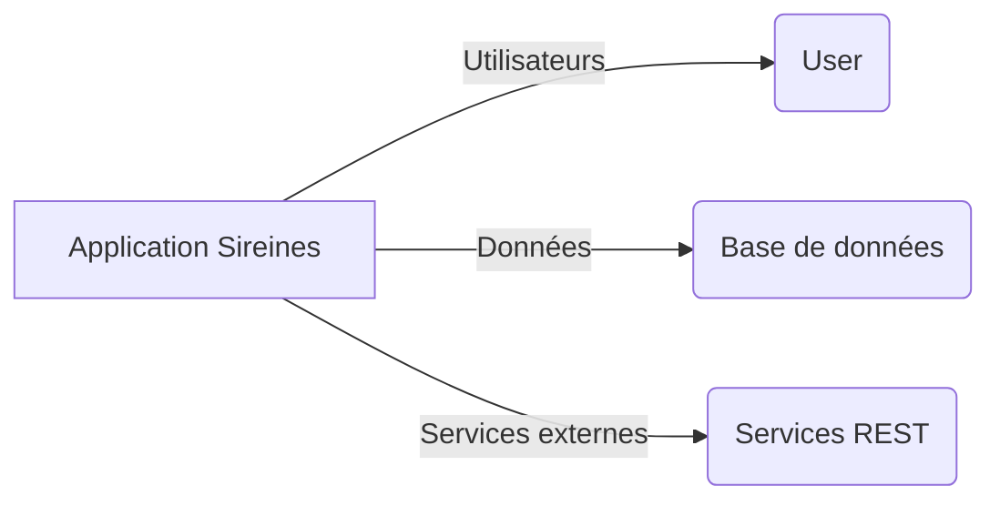
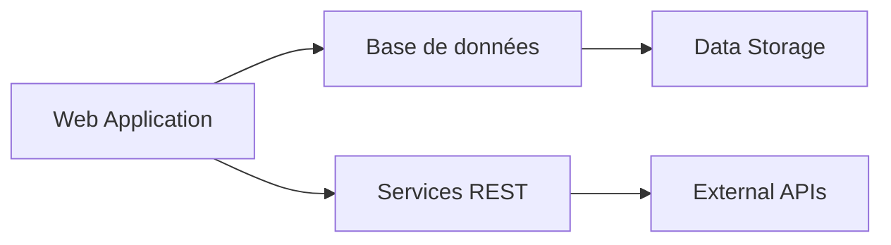
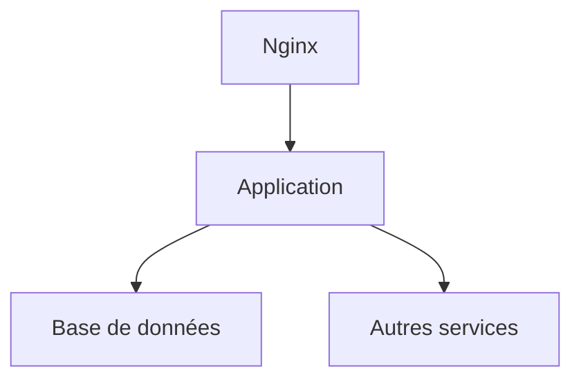

# Dossier d’Architecture Technique (DAT) - Sireines

[TOC]

## Introduction et objectifs

Voici une vue d'ensemble fonctionnelle courte de l'application Sireines. L'objectif principal est de fournir un outil de gestion des dossiers pour les agents de la Direction régionale et des services compétents.

Objectifs de qualité orientés utilisateur :
1. Performance : La solution doit garantir des temps de réponses rapides pour une utilisation fluide.
2. Sécurité : Les données sensibles doivent être protégées contre les accès non autorisés.
3. Maintenabilité : Le système doit être facile à maintenir et à évoluer.

## Parties prenantes

- **Utilisateurs finaux** : Besoin d'un système fiable pour la gestion de leurs dossiers.
- **Administrateur** : Nécessité de superviser l'accès aux données et la sécurité du système.

## Contraintes

- **Disponibilité** : 99,9% de disponibilité du service.
- **Intégrité** : Les données doivent être correctes et cohérentes.
- **Confidentialité** : Accès restreint aux données sensibles.
- **Traçabilité** : Audit des actions des utilisateurs sur la plateforme.

## Contexte et périmètre

La solution Sireines interagit avec les partenaires suivants :
- **Base de données** : Stockage des données de l'application.
- **Services externes** : Intégration avec d'autres applications au sein du réseau.

## Stratégie de solution

### Décisions architecturales

- Choix entre monolithe et microservices : Monolithe pour simplifier la maintenance et le déploiement initial.
- Pattern MVC (Modèle-Vue-Controleur) pour la couche d'application.

### Environnement technologique

- **Langage** : Java
- **Framework** : Spring Boot
- **Base de données** : PostgreSQL
- **Frontend** : Thymeleaf
- **Infrastructure** : Docker, Kubernetes

### Outils de la forge logicielle

- **CI/CD** : Jenkins
- **Tests unitaires** : JUnit
- **Gestion de versions** : Git

## Vue en Briques

### Conteneurs principaux

- **Web Application** : Interface utilisateur et logique d'application.
- **Base de données** : Gestion des données persistantes.
- **Services REST** : Intégration avec les services externes.

## Vue Exécution

### Scénarios critiques/complexes

1. **Authentification etautorisation** : Utilisation de jetons JWT pour sécuriser les communications entre les services.
2. **Traitement des données** : Intégration avec des services de données externes pour enrichir les données de l'application.

## Vue Déploiement

### Environnements

| Environnement | Hébergement | Serveurs | Réseau | Particularités |
|---------------|-------------|----------|--------|----------------|
| Développement | À compléter | À compléter | À compléter | À compléter |
| Recette       | À compléter | À compléter | À compléter | À compléter |
| Production    | À compléter | À compléter | À compléter | À compléter |

### Infrastructure

Le produit est hébergé sur le cloud interne ECO4 basé sur Openstack, dans le tenant 'pnm3' du département.

### Supervision

Le produit est supervisé via le système standard du GTI pour ce faire :
- via Portainer pour la partie purement conteneurisée,
- via la stack Prometheus/Grafana/Loki/AlertManager,
- Le produit dispose également d'une supervision PSIN.

### Sauvegardes

Les sauvegardes de la base de données sont assurées par des scripts standards du GTI permettant la création de dumps cryptés en AES-256 et déposés sur :
- le stockage objet B3 du IaaS ministériel,
- le stockage objet Outscale SecNumCloud (via la prestation qu'a le GTI sur le marché "Nuage Public"),
- le stockage objet standard de Google Cloud (via la prestation qu'a le GTI sur le marché "Nuage Public").

## Sujets transverses

- **Authentification** : Utilisation de jetons JWT pour la connexion sécurisée.
- **Journalisation** : Suivi des actions des utilisateurs au sein du système.
- **Monitoring** : Surveillance des performances et de la santé du système.

## Exigences de qualité

1. **Performance** : Le système doit répondre en moins de 2 secondes pour une requête simple.
   - Validation : Mesure des temps de réponse via des tests de charge.
2. **Sécurité** : Les données sensibles doivent être protégées contre les accès non autorisés.
   - Validation : Audits et tests de sécurité réguliers.

## Risques et dettes techniques

1. **Risque** : La dette technique est due à l'utilisation de frameworks obsolètes.
   - Mesure corrective : Mettre à jour les frameworks et les librairies utilisés.

2. **Dette** : Manque de tests unitaires et d'intégration.
   - Mesure corrective : Développer un plan pour écrire et exécuter des tests unitaires et d'intégration.

## Annexes

### Glossaire

- **JWT** : Jeton Web Token, utilisé pour l'authentification et l'autorisation.
- **CI/CD** : Intégration et déploiement continus.

### Décisions d’architecture (ADR)

1. **ADR-001** : Choix de Spring Boot comme framework principal pour le développement de l'application.