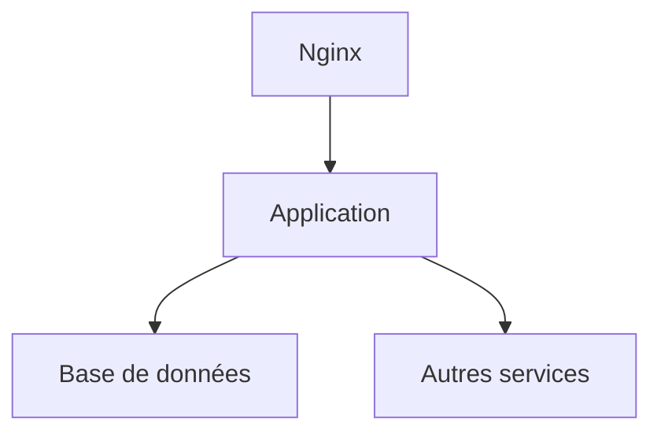

# Dossier d’Architecture Technique (DAT) - SIRENES

[TOC]

## 1. Introduction et objectifs

### Vue d’ensemble fonctionnelle courte
Le projet SIRENES est un système web Java basé sur le framework Struts2, conçu pour gérer les dossiers d'agents et les processus de qualification au sein d'une organisation. Il inclut des fonctionnalités d'import, de consultation et de génération de rapports.

### Schéma C4-L1
```mermaid
classdiagram;
    class SIRENES {
        +Accueil;
        +Agents;
        +Dossiers;
        +Extractions;
        +Imports;
        +Referentiel;
        +Seances;
    }
```

### Objectifs de qualité orientés utilisateur
1. **Performance**: Répondre aux requêtes utilisateur en moins d'une seconde.
2. **Sécurité**: Garantir la protection des données personnelles et le respect des réglementations RGPD.
3. **Maintenabilité**: Faciliter la maintenance du code en suivant les meilleures pratiques de programmation.

### Schéma C4-L2
```mermaid
classdiagram;
    class SIRENES {
        +Accueil;
        +Agents;
        +Dossiers;
        +Extractions;
        +Imports;
        +Referentiel;
        +Seances;
    }
    class Database {
        +Modele;
        +Script;
    }
    class Deployment {
        +Configuration;
    }
    class WebApplication {
        +JSP;
        +CSS;
        +JavaScript;
    }
    SIRENES --|> Database;
    SIRENES --|> Deployment;
    SIRENES --|> WebApplication
```

## 2. Parties prenantes

- **Utilisateurs finaux**: Besoin d'un accès intuitif aux fonctionnalités du système.
- **Développeurs**: Nécessitent une structure de code maintenable et documentée.
- **Administrateurs système**: Exigent des procédures de déploiement simples et de surveillance du système.

## 3. Contraintes

- **Techniques**: Utilisation de Java 8, Maven pour la gestion des dépendances, et Docker pour le déploiement.
- **Organisationnelles**: Respect des standards de codage de l'organisation.
- **Réglementaires**: Conformité avec les réglementations de protection des données (RGPD).

### Exigences de sécurité D-I-C-T
- **Disponibilité**: Le système doit être disponible 99,9% du temps.
- **Intégrité**: Les données doivent être complètes et exactes.
- **Confidentialité**: Les informations sensibles sont chiffrées et accessibles uniquement aux utilisateurs autorisés.
- **Traçabilité**: Toutes les actions effectuées dans le système doivent être enregistrées pour une auditabilité future.

## 4. Contexte et périmètre

### Partenaires fonctionnels
- **Systèmes de gestion de contenu**: Interagissent avec SIRENES pour l'import et l'export de données.
- **Bases de données**: Stockent les données des agents, des dossiers, et des rapports.

### Interfaces techniques
- **Protocole**: Utilisation de REST pour les communications entre les services.
- **Type de données**: JSON et XML pour les échanges de données.

## 5. Stratégie de solution

### Décisions architecturales majeures
- **Architecture monolithique**: Le système est déployé en tant qu'application unique mais avec la possibilité de découplage未来.

### Environnement technologique
- **Langage**: Java.
- **Framework**: Struts2 pour le MVC, Spring pour les services et les transactions.
- **Database**: PostgreSQL.
- **Frontend**: JSP avec Bootstrap pour la mise en page.

### Outils de la forge logicielle
- **CI/CD**: Jenkins pour l'intégration continue et le déploiement continu.
- **Tests**: JUnit et Mockito pour les tests unitaires.
- **Dépôt**: GitLab pour la gestion des versions.

## 6. Vue en Briques

Chaque brique représente un ensemble cohérent de fonctionnalités ou de services.

## 7. Vue Exécution

### Scénarios critiques
1. **Gestion des dossiers**: Un utilisateur final peut créer, consulter et modifier des dossiers d'agents.
2. **Génération de rapports**: Un administrateur peut générer des rapports sur la base des données des agents et des qualifications.

### Diagrammes de séquence
```mermaid
sequencediagram;
    participant Utilisateur;
    participant SIRENES;
    participant BaseDonnees;
    Utilisateur->>SIRENES: Accès à la page d'accueil;
    SIRENES-->>Utilisateur: Affichage des options;
    Utilisateur->>SIRENES: Sélection d'option "Dossiers"
    SIRENES->>BaseDonnees: Récupération des dossiers;
    BaseDonnees-->>SIRENES: Envoi des données;
    SIRENES-->>Utilisateur: Affichage des dossiers
```

## 8. Vue Déploiement

### Environnements
| Environnement | Hébergement | Serveurs | Réseau | Particularités |
|---------------|-------------|----------|--------|----------------|
| Développement | Local       | 1       | Local  | Base de données SQLite |
| Recette       | Serveur     | 1       | Intranet | Base de données PostgreSQL |
| Production    | Cloud      | 2       | Internet | Haute disponibilité, sauvegarde quotidienne |

### Infrastructure
Le produit est hébergé sur le cloud interne ECO4 basé sur Openstack, dans le tenant 'pnm3' du département.



### Supervision
Le produit est supervisé via le système standard du GTI pour ce faire : via Portainer pour la partie purement conteneurisée, via la stack Prometheus/Grafana/Loki/AlertManager, Le produit dispose également d'une supervision PSIN.

### Sauvegardes
Les sauvegardes de la base de données sont assurées par des scripts standards du GTI permettant la création de dumps cryptés en AES-256 et déposés sur :

- le stockage objet B3 du IaaS ministériel,
- le stockage objet Outscale SecNumCloud (via la prestation qu'a le GTI sur le marché "Nuage Public"),
- le stockage objet standard de Google Cloud (via la prestation qu'a le GTI sur le marché "Nuage Public").

## 9. Sujets transverses

### Authentification
L'authentification est gérée par un service externe OAuth2, avec une gestion des sessions JWT.

### Journalisation
Toutes les actions utilisateur sont journalisées avec un timestamp et un identifiant de session.

### Monitoring
La surveillance des performances et des erreurs est assurée par Prometheus et Grafana.

## 10. Exigences de qualité

### Exigences critiques
1. **Disponibilité**: Le système doit être disponible 99,9% du temps.
2. **Sécurité**: Les données doivent être protégées contre les accès non autorisés.

### Scénarios de validation
1. **Disponibilité**: Simuler un pic de trafic et vérifier que le système reste opérationnel.
2. **Sécurité**: Effectuer des tests d'intrusion pour détecter les failles de sécurité.

## 11. Risques et dettes techniques

### Risques identifiables
1. **Délais de migration des données**: Risque de ralentissement du système lors de la migration des données.
2. **Maintenance des dépendances**: Certaines bibliothèques sont obsolètes et nécessitent une mise à jour.

### Mesures correctives
1. **Optimisation des migrations**: Utilisation de scripts optimisés pour les migrations de données.
2. **Mise à jour planifiée**: Mettre en place un calendrier régulier pour la mise à jour des dépendances.

## 12. Annexes

### Glossaire
- **JWT**: Jeton Web Token, utilisé pour la gestion des sessions utilisateurs.
- **OAuth2**: Protocole d'authentification et d'autorisation.
- **RGPD**: Règlement général sur la protection des données.

### Décisions d’architecture (ADR)
- **ADR-001**: Sélection de Struts2 comme framework MVC pour sa connaissance partagée et sa stabilité.
- **ADR-002**: Utilisation de PostgreSQL pour sa fiabilité et ses fonctionnalités avancées.