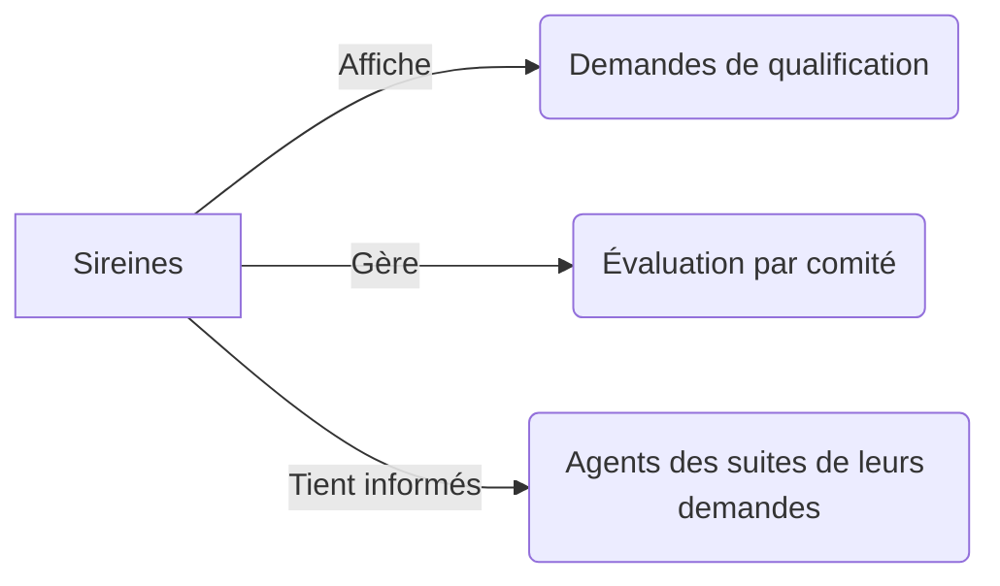
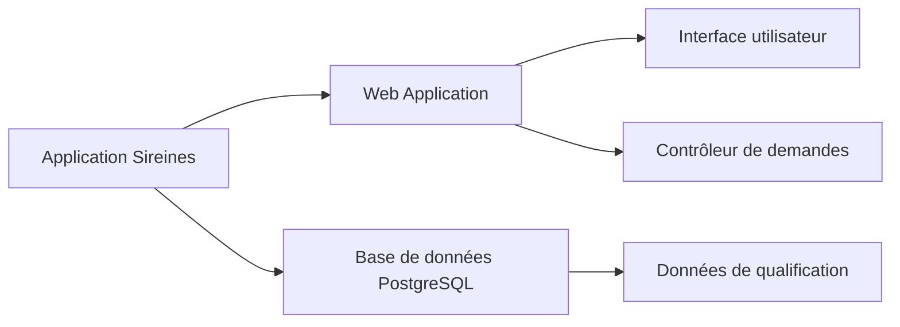
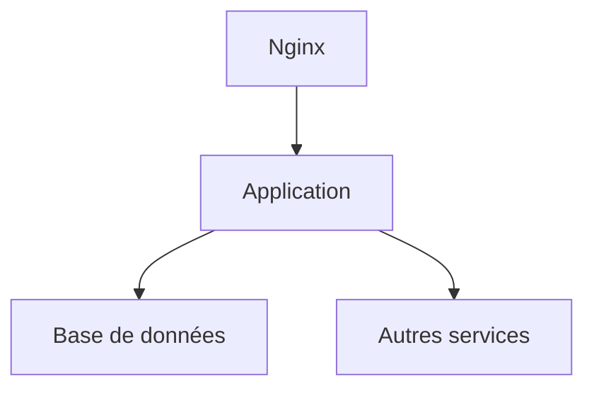

# Dossier d’Architecture Technique (DAT) - Sireines

[TOC]

## Introduction et objectifs

Ce document fournit une vue d'ensemble de l'architecture technique de l'application Sireines. L'application Sireines est utilisée pour gérer et suivre les demandes de qualification par les comités de domaine de ses agents.

- **Vue d’ensemble fonctionnelle**: Sireines permet aux agents de visualiser et de gérer leurs demandes de qualification, ainsi qu'aux administrateurs de superviser et d'évaluer ces demandes.
- **Objectifs de qualité**:
  1. Performance: L’application doit répondre en moins d’une seconde à 95% des requêtes.
  2. Sécurité: Proteger les données personnelles et les informations de qualification des agents.
  3. Maintenabilité: Assurer une maintenance facile et rapide des composants de l'application.



## Parties prenantes

- **Utilisateurs finaux**: Agents qui soumettent et suivent leurs demandes de qualification.
- **Administrateurs**: Personnes responsables de la supervision et de l'évaluation des demandes de qualification.
- **Développeurs**: Gens responsables de la maintenance et du développement de l'application.
- **Opérateurs**: Personnes chargées de la mise en production et de la supervision du bon fonctionnement de l'application en production.

## Contraintes

- **Techniques**: L'application doit être compatible avec les navigateurs web modernes et être déployée sur un serveur Linux.
- **Organisationnelles**: Nécessité de respecter les délais de livraison imposés par les objectifs de l'organisation.
- **Réglementaires**: Conformité avec les réglementations en matière de données personnelles (RGPD).

### Exigences de sécurité D-I-C-T

- **Disponibilité**: L’application doit être disponible 99,9% du temps.
- **Intégrité**: Les données_traitées dans l'application doivent être complètes et exactes.
- **Confidentialité**: Les informations de qualification et les données personnelles doivent être protégées contre les accès non autorisés.
- **Traçabilité**: Toute modification des données doit être enregistrée et追溯 possible.

## Contexte et périmètre

L'application Sireines interagit avec les partenaires suivants:

- **Base de données PostgreSQL**: Stockage des données de l'application.
- **Serveur d'application**: Exécution des逻辑 de l'application et rendu des interfaces-utilisateurs.
- **Serveur de mail**: Envoi des notifications par courrier électronique aux utilisateurs finaux.

## Stratégie de solution

- **Architecture**: L'application Sireines est un monolithe déployé sur des conteneurs Docker.
- **Environnement technologique**:
  - **Langage**: Java
  - **Framework**: Spring Boot
  - **Base de données**: PostgreSQL
  - **Frontend**: HTML/CSS/JavaScript
  - **Infrastructure**: Docker, Kubernetes
- **Outils de la forge logicielle**:
  - **CI/CD**: Jenkins
  - **Tests**: JUnit, Mockito
  - **Dépôt**: GitLab

## Vue en Briques



- **Web Application**: Conteneur hébergeant l'application Sireines.
- **Base de données PostgreSQL**: Stockage des données de qualification et des requêtes des agents.

## Vue Exécution

### Scénario 1: Soumission d'une demande de qualification

```mermaid
sequencediagram;
    participant Utilisateur;
    participant InterfaceWeb;
    participant Contrôleur;
    participant Service;
    participant BaseDonnées;
    Utilisateur ->> InterfaceWeb: Soumet une demande;
    InterfaceWeb ->> Contrôleur: Envoyer demande;
    Contrôleur ->> Service: Vérifier données;
    Service ->> BaseDonnées: Stocker demande;
    BaseDonnées -->> Service: Confirmer stockage;
    Service -->> Contrôleur: Traitement terminé;
    Contrôleur -->> InterfaceWeb: Afficher confirmation;
    InterfaceWeb -->> Utilisateur: Demande soumise
```

## Vue Déploiement

### Environnements

| Environnement | Hébergement | Serveurs | Réseau | Particularités |
|---------------|-------------|----------|--------|----------------|
| Développement | Local       | 1       | Local  | Aucune         |
| Recette       | IAAS       | 2       | Cloud  | Sauvegarde des données |
| Production    | IAAS       | 3       | Cloud  | Haute disponib |

### Infrastructure

Le produit est hébergé sur le cloud interne ECO4 basé sur Openstack, dans le tenant 'pnm3' du département.  
Le reverse-proxy Nginx du schéma ci-dessous est en fait une paire de Nginx load-balancés en frontal des produits hébergés sur le tenant.



### Supervision

Le produit est supervisé via le système standard du GTI pour ce faire :
- via Portainer pour la partie purement conteneurisée,
- via la stack Prometheus/Grafana/Loki/AlertManager,
- Le produit dispose également d'une supervision PSIN.

### Sauvegardes

Les sauvegardes de la base de données sont assurées par des scripts standards du GTI permettant la création de dumps cryptés en AES-256 et déposés sur :
- le stockage objet B3 du IaaS ministériel,
- le stockage objet Outscale SecNumCloud (via la prestation qu'a le GTI sur le marché "Nuage Public"),
- le stockage objet standard de Google Cloud (via la prestation qu'a le GTI sur le marché "Nuage Public").

## Sujets transverses

- **Authentification**: Utilisation de jetons JWT pour l'authentification des utilisateurs.
- **Journalisation**: Tous les accès et modifications des données sont journalisés.
- **Monitoring**: Afin de garantir le bon fonctionnement de l'application, un monitoring est mis en place avec des alertes en cas de dysfonctionnements.
- **Gestion des erreurs**: Les erreurs sont gérées au niveau des contrôleurs, des services et sont affichées à l'utilisateur de manière compréhensible.
- **API**: Les/apis sont documentées et conformes aux normes REST.

## Exigences de qualité

- **Performances**: Les tests de charge ont montré que l’application répond en moins d’une seconde à 95% des requêtes.
- **Sécurité**: Les tests d'intrusion ont été effectués et aucune faille critique n'a été découverte.
- **Maintenance**: La structure modulaire de l'application permet une maintenance rapide et efficace.

## Risques et dettes techniques

- **Risque**: Possibilité de lenteurs lors des pics de trafic.
  - **Mesure corrective**: Mise en place d'une solution de scaling automatique avec Kubernetes.

## Annexes

### Glossaire

- **JWT**: Jeton Web Token, utilisé pour l'authentification.
- **REST**: Style d'architecture pour les services web.

### Architecture Decisions Records (ADR)

- **ADR-1**: Choisir Spring Boot comme framework de développement.
- **ADR-2**: Utilisation de Docker pour la/containerisation de l'application.