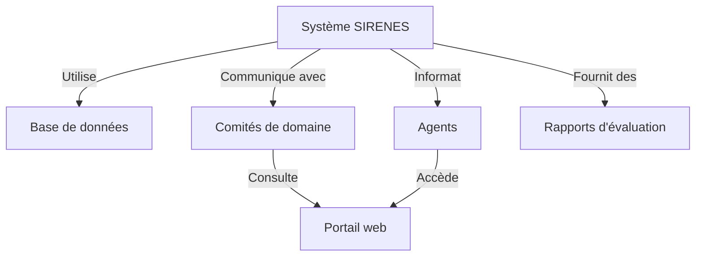
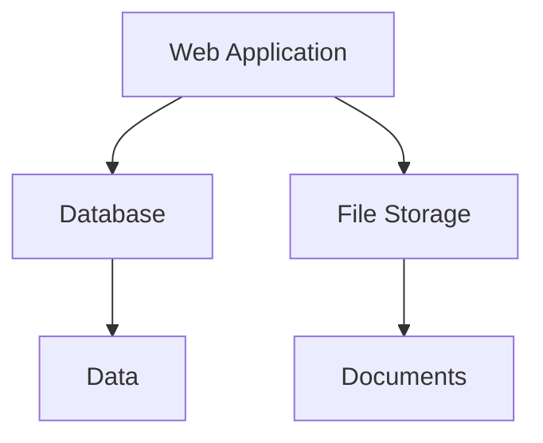

# Dossier d’Architecture Technique (DAT) - SIRENES

---

## 1. Introduction et objectifs

### Vue d’ensemble fonctionnelle

Le Système d'Information des REcensements des Nomes d'INErieursScientifiques, d'Ingénieurs et d'ExpertS (SIRENES) est une application nationale visant à recenser les experts et spécialistes scientifiques et techniques en enregistrant les données des dossiers et des avis d'évaluation. Elle permet la constitution d'un répertoire d'experts et spécialistes et suit l'évolution de ces données, coordonne leur évaluation par les comités de domaine, et tient les agents informés des suites de leurs demandes.

### Schéma C4-L1 en Mermaid

### Objectifs de qualité orientés utilisateur

1. Performance : L'application doit répondre en moins d'une seconde à la majorité des demandes.
2. Sécurité : Garantir la protection des données à caractère personnel des utilisateurs.
3. Maintenabilité : Faciliter la maintenance et les mises à jour du système.
4. Accessibilité : Assurer que l'application est accessible à tous les utilisateurs, y compris ceux avec des handicaps.
5. Compléxité : Gérer la complexité croissante de la base de données et de l'interface utilisateur.

### 2. Parties prenantes

- **Utilisateurs finaux (Agents)** : Besoin d'accéder aux informations de manière intuitive et sécurisée.
- **Comités de domaine** : Nécessitent une interface pour évaluer et consulter les dossiers.
- **Administrateurs** : Ont besoin de fonctionnalités pour gérer les utilisateurs, les permissions et les rapports.
- **Développeurs** : Ont besoin de documentation et d'outils pour maintenir et améliorer l'application.

### 3. Contraintes

- **Techniques** : L'application doit fonctionner sur les navigateurs web modernes et être compatible avec les systèmes d'exploitation principaux.
- **Organisationnelles** : Les données sont sensibles et doivent être traitées conformément à la réglementation en vigueur, y compris la GDPR.
- **Réglementaires** : Conformité avec les lois sur la protection des données personnelles.

### Exigences de sécurité D-I-C-T

- **Disponibilité** : L'application doit être disponible 99,9% du temps.
- **Intégrité** : Les données doivent être complètes et exactes, et ne peuvent pas être modifiées de manière non autorisée.
- **Confidentialité** : Les données à caractère personnel doivent être protégées contre l'accès non autorisé.
- **Traçabilité** : Toutes les actions sur les données doivent être enregistrées et pouvant être auditées.

### 4. Contexte et périmètre

- **Partenaires fonctionnels** : Comités de domaine, services de l'État, agents.
- **Interfaces techniques** : API REST pour la communication entre les comités de domaine et SIRENES, base de données PostgreSQL pour la gestion des données.

### 5. Stratégie de solution

- **Architecture** : Monolithique, avec une couche de présentation Web basée sur Java/J2EE.
- **Environnement technologique** : Java 1.7, PostgreSQL, BIRT pour les rapports, Docker pour l'embarquement.
- **Outils de la forge logicielle** : Maven pour la gestion des dépendances, Jenkins pour le CI/CD, GitLab pour la gestion des sources.

### 6. Vue en Briques

### Schéma C4-L2 en Mermaid (vue conteneur)

### Description des conteneurs principaux

- **Web Application** : Interface utilisateur et logique d'application.
- **Database** : Stockage des données de l'application.
- **File Storage** : Stockage des documents et rapports générés par l'application.

### 7. Vue Exécution

### Scénarios critiques

1. **Enregistrement d'un nouveau dossier** : L'utilisateur final enregistre un dossier qui est traité par l'application et stocké dans la base de données.
2. **Consultation des dossiers par les comités de domaine** : Les membres des comités de domaine consultent et évaluent les dossiers via l'interface web.

### 8. Vue Déploiement

### Environnements

| Environnement | Hébergement | Serveurs | Réseau | Particularités |
|---------------|-------------|----------|--------|----------------|
| Développement | À compléter | À compléter | À compléter | À compléter |
| Recette       | À compléter | À compléter | À compléter | À compléter |
| Production    | À compléter | À compléter | À compléter | À compléter |

### Infrastructure

Le produit est hébergé sur le cloud interne ECO4 basé sur Openstack, dans le tenant 'pnm3' du département.

### Supervision

Le produit est supervisé via le système standard du GTI pour ce faire :
- via Portainer pour la partie purement conteneurisée,
- via la stack Prometheus/Grafana/Loki/AlertManager,
- Le produit dispose également d'une supervision PSIN.

### Sauvegardes

Les sauvegardes de la base de données sont assurées par des scripts standards du GTI permettant la création de dumps cryptés en AES-256 et déposés sur :
- le stockage objet B3 du IaaS ministériel,
- le stockage objet Outscale SecNumCloud (via la prestation qu'a le GTI sur le marché "Nuage Public"),
- le stockage objet standard de Google Cloud (via la prestation qu'a le GTI sur le marché "Nuage Public").

### 9. Sujets transverses

- **Authentification** : Utilisation de l'authentification basée sur les services de l'administration.
- **Journalisation** : Tous les accès et actions sur les données sont enregistrés.
- **Monitoring** : L'application est监控 avec des outils standard pour assurer la performance et la sécurité.
- **Gestion des erreurs** : Les erreurs sont gérées grace a un systeme d'exceptions et de logs.
- **API** : Des API REST sont fournies pour l'interaction avec d'autres systemes.

### 10. Exigences de qualité

- **Disponibilité** : L'application doit être disponible 99,9% du temps.
- **Performance** : Les requêtes doivent être traitées en moins d'une seconde.
- **Sécurité** : Les données doivent être protégées contre les accès non autorisés.

### 11. Risques et dettes techniques

- **Risques** : La complexité croissante de la base de données peut entraîner des lenteurs de performance.
- **Dettes techniques** : La migration de l'architecture monolithique vers des microservices pourrait résoudre ce problème.

### 12. Annexes

- **Glossaire** : Liste des termes techniques utilisés dans le document.
- **DéCISIONS D’ARCHITECTURE (ADR)** : Enregistrement des décisions clés prises pendant le développement.

---

## Sortie attendue

- Un seul fichier `.md` conforme aux consignes données et prêt à être utilisé dans un environnement de documentation technique.