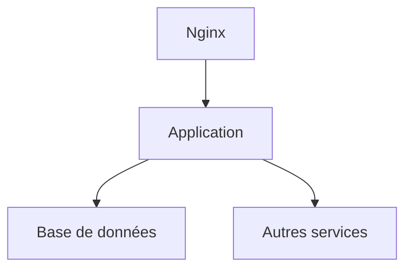

# Dossier d’Architecture Technique (DAT) pour l'application SIRENES

## Introduction et objectifs

Ce Dossier d'Architecture Technique (DAT) décrit l'architecture de l'application SIRENES, qui a pour objectif principal la constitution de la base des experts et spécialistes scientifiques et techniques en enregistrant les données des dossiers et des avis d'évaluation.

### Vue d’ensemble fonctionnelle

L'application SIRENES est un outil metier qui permet la collecte et la concentration des informations relatives aux experts et spécialistes. Elle intègre les demandes de qualifications par les comités de domaine et suit l'évolution de ces données.

```mermaid
classDiagram
    class Sireines {
        + Collecte;
        + Concentration;

```

### Objectifs de qualité orientés utilisateur

1. **Disponibilité**: Garantir une haute disponibilité du service.
2. **Sécurité**: Protéger les données à caractère personnel et les informations sensibles.
3. **Maintenabilité**: Assurer une Facilité de maintenance et d'évolution du système.
4. **Performances**: Optimiser les performances pour un nombre élevé de transactions.
5. **Confidentialité**: Garantir le respect des données personnelles conformément à la réglementation RGPD.

## Parties prenantes

- **Utilisateurs finaux**: Agents qui entrent et consultent les données des experts.
- **Administrateurs**: Personnel responsable de la maintenance et de la supervision du système.
- **Développeurs**: Equipe technique en charge du développement et de la mise à jour de l'application.
- **Chefs de projet**: Supervise la stratégie et les objectifs de l'application.

## Contraintes

### Techniques

- L'application doit être compatible avec l'environnement Java/J2EE.
- L'hébergement se fait sur la plateforme IaaS ECO4.

### organisationnelles

- L'application doit être opérationnelle 24/7, avec une maintenance prévue pendant les heures creuses.

### Réglementaires

- Conformité RGPD : Le traitement des données personnelles doit être conforme au règlement général sur la protection des données.
- Sécurité des systèmes d'information (SSI) : Garantir la classification et la protection des données en fonction des niveaux de sensibilité.

### Exigences de sécurité D-I-C-T

- **Disponibilité**: L'application doit être disponible 99,9% du temps.
- **Intégrité**: Les données doivent être complètes et exactes, sans risque de corruption.
- **Confidentialité**: Les informations sensibles sont protégées contre les accès non autorisés.
- **Traçabilité**: Toutes les actions sur les données sont enregistrées et peuvent être监控查询。

## Contexte et périmètre

L'application SIRENES interagit avec divers partenaires fonctionnels tels que les comités d'évaluation scientifique et technique. Les interfaces techniques impliquent des échanges de données via des protocoles web standards.

## Stratégie de solution

### Décisions architecturales majeures

- L'application est développée comme une application Web monolitique.
- Utilisation du modèle MVC pour assurer la séparation des préoccupations.

### Environnement technologique

- **Langage**: Java
- **Framework**: Spring Boot, Struts2
- **Base de données**: PostgreSQL
- **Frontend**: HTML, CSS, JavaScript
- **Infrastructure**: Hébergement sur IaaS ECO4, utilisation de Docker

### Outils de la forge logicielle

- **CI/CD**: Jenkins
- **Tests**: JUnit, Selenium
- **Dépôt**: GitLab

## Vue en Briques

```mermaid
classDiagram
    class ApplicationWeb {
        + Controller;
        + Service;
        + Repository;

    class BaseDonnee {
        + PostgreSQL;

    class AutresServices {
        + BIRT;
        + Cerbere;

    ApplicationWeb --|> BaseDonnee;
    ApplicationWeb --|> AutresServices
```

Chaque brique est une composante principale de l'architecture, avec son propre rôle et responsabilité.

## Vue Exécution

### Scénarios critiques

1. **Authentification et autorisation**: Un utilisateur final essaye de se connecter à l'application et accède à des données spécifiques en fonction de ses droits.
2. **Traitement des données**: L'application traite de grandes quantités de données d'experts pour les enregistrer et les archiver dans la base de données.

## Vue Déploiement

### Environnements

| Environnement | Hébergement | Serveurs | Réseau | Particularités |
|---------------|-------------|----------|--------|----------------|
| Développement | À compléter | À compléter | À compléter | À compléter |
| Recette       | À compléter | À compléter | À compléter | À compléter |
| Production    | À compléter | À compléter | À compléter | À compléter |

### Infrastructure

Le produit est hébergé sur le cloud interne ECO4 basé sur Openstack, dans le tenant 'pnm3' du département.
Le reverse-proxy Nginx du schéma ci-dessous est en fait une paire de Nginx load-balancés en frontal des produits hébergés sur le tenant.



### Supervision

Le produit est supervisé via le système standard du GTI pour ce faire :
- via Portainer pour la partie purement conteneurisée,
- via la stack Prometheus/Grafana/Loki/AlertManager,
- Le produit dispose également d'une supervision PSIN.

### Sauvegardes

Les sauvegardes de la base de données sont assurées par des scripts standards du GTI permettant la création de dumps cryptés en AES-256 et déposés sur :
- le stockage objet B3 du IaaS ministériel,
- le stockage objet Outscale SecNumCloud (via la prestation qu'a le GTI sur le marché "Nuage Public"),
- le stockage objet standard de Google Cloud (via la prestation qu'a le GTI sur le marché "Nuage Public").

## Sujets transverses

### Authentification

L'application utilise une authentification basée sur les standards OAuth 2.0.

### Journalisation

Toutes les actions effectuées dans l'application sont journalisées pour des raisons de sécurité et de débogage.

### Monitoring

L'application est监控查询 via Prometheus, Grafana, et Loki pour assurer une surveillance en temps réel de la santé du système.

## Exigences de qualité

### Performances

L'application doit gérer jusqu'à 1000 transactions par minute.

### Sécurité

Les données personnelles sont cryptées en transit et en repos.

## Risques et dettes techniques

### Risques majeurs

1. **Vulnérabilités de sécurité**: Risque potentiel d'attaques par injection SQL.
2. **Perte de données**: Risque de corruption des données en cas de panne critique.

### Mesures correctives

1. **Mise à jour régulière**: Application des dernières mises à jour de sécurité pour les frameworks et les librairies.
2. **Sauvegarde régulière**: Sauvegardes quotidiennes des données pour prévenir la perte de données.

## Annexes

### Glossaire

- **MVC**: Modèle-Vue-Controlleur, un pattern d'architecture utilisé pour séparer la logique de présentation de la logique d'entreprise.
- **OAuth 2.0**: Protocole d'autorisation pour permettre l'accès sécurisé aux ressources via un tiers.

### Décisions d’architecture (ADR)

1. **ADR-001**: Sélection de Spring Boot comme framework principal pour sa facilité d'implémentation et sa richesse fonctionnelle.
2. **ADR-002**: Utilisation de PostgreSQL pour la gestion des données en raison de sa robustesse et de sa compatibilité avec les normes SQL.