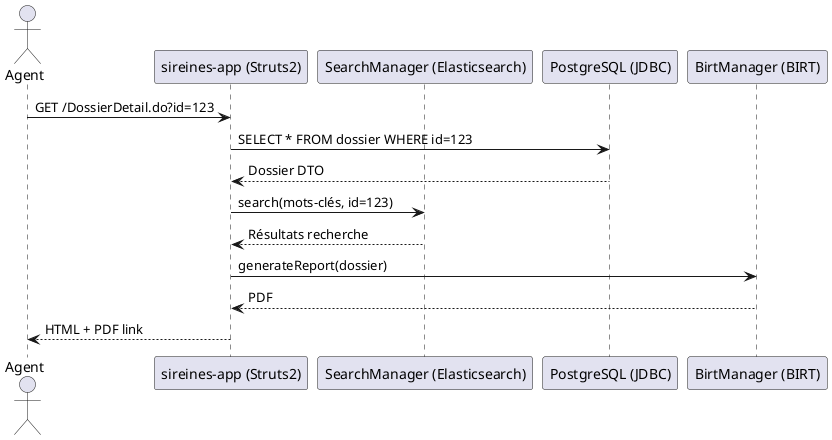

# 📘 Dossier d’Architecture Technique (DAT) – **SIREINES**

> **Version du DAT** : 1.0 – 2024‑04‑27  
> **Auteur(s)** : Équipe d’architecture (extrait des sources du projet)  
> **Statut** : Proposé → En cours de validation  

---  

## 📖 Table des matières  

[TOC]

---  

## 1️⃣ Introduction & Vision architecturale  

### 1.1 Résumé exécutif  

SIREINES est une application Java/J2EE qui gère le répertoire national des experts et spécialistes scientifiques et techniques du ministère de la Transition Écologique. Elle expose une interface web (Struts 2) et un moteur de reporting (BIRT). Les données sont stockées dans PostgreSQL et sont indexées dans Elasticsearch pour la recherche.  

Le système tourne aujourd’hui en **production** (déploiement IaaS ECO4 / Paris La Défense) et possède des environnements *Recette*, *Pré‑production* et *Production* déployés via **Docker** (tomcat + postgres + pgadmin).  

### 1.2 Objectifs de qualité (prioritaires)  

| Qualité | Objectif | Raison d’être |
|---|---|---|
| **Sécurité** | Confidentialité des DACP (coordonnées experts) – conformité RGPD | Données à caractère personnel |
| **Disponibilité** | 99,5 % / mois (SLA interne) | Service métier critique (comités d’évaluation) |
| **Performance** | Temps de réponse < 2 s pour les recherches (Elasticsearch) | Volume de requêtes élevé (extractions) |
| **Maintainabilité** | Couverture de tests unitaires ≥ 80 % | Évolution fonctionnelle rapide (nouveaux comités) |
| **Scalabilité** | Possibilité de scaler le conteneur *app* horizontalement | Besoin futur d’augmentation du nombre d’utilisateurs |

---  

## 2️⃣ Vue C4 – Niveau 1 : Contexte (System Context)  

```plantuml
@startuml C4_Context
!include https://raw.githubusercontent.com/plantuml-stdlib/C4-PlantUML/master/C4_Context.puml

System_Boundary(s1, "SIREINES") {
    System(sireines, "SIREINES", "Application métier de gestion du répertoire d’experts")
}
Person(user, "Agent / Utilisateur métier", "Consulte & saisit des dossiers")
Person(admin, "Administrateur technique", "Déploie & administre l’application")
System_Ext(birt, "BIRT", "Moteur de reporting")
System_Ext(es, "Elasticsearch", "Indexation & recherche plein‑texte")
System_Ext(pg, "PostgreSQL", "Base de données métier")
System_Ext(cerbere, "Cerbère", "Gestion des droits d’accès (recette / prod)")

Rel(user, sireines, "Utilise")
Rel(admin, sireines, "Déploie / Administre")
Rel(sireines, pg, "Lit / écrit")
Rel(sireines, es, "Indexe / recherche")
Rel(sireines, birt, "Génère les rapports")
Rel(sireines, cerbere, "Vérifie les habilitations")
@enduml
```

**Acteurs externes**  

| Acteur | Rôle |
|---|---|
| **Agent / Utilisateur métier** | Saisie & consultation des dossiers de qualification |
| **Administrateur technique** | Gestion des environnements Docker, mise à jour des WAR |
| **Cerbère** | Gestion centralisée des habilitations (recette / prod) |
| **BIRT** | Production de rapports PDF/Excel |
| **Elasticsearch** | Recherche full‑text sur les dossiers et mots‑clés |
| **PostgreSQL** | Persistance des données métier |

---  

## 3️⃣ Vue C4 – Niveau 2 : Conteneurs (Containers)  

```plantuml
@startuml C4_Container
!include https://raw.githubusercontent.com/plantuml-stdlib/C4-PlantUML/master/C4_Container.puml

Container(app, "sireines‑app", "Tomcat 7 + Struts 2 + Spring", "Web‑application (WAR)") {
    Component(search, "SearchManager", "Elasticsearch integration")
    Component(birtMgr, "BirtManager", "Facilitates BIRT report generation")
    Component(auth, "AuthConfig", "Custom authorisation (sireines‑auth‑config.xml)")
}
ContainerDb(db, "sireines‑db", "PostgreSQL 14 (Docker)", "Base de données relationnelle")
Container(es, "sireines‑es", "Elasticsearch 7 (Docker)", "Index full‑text")
Container(pgadmin, "sireines‑pgadmin", "pgAdmin 4", "Console d’administration DB")
Rel(app, db, "JDBC (datasource)")
Rel(app, es, "REST/Transport client")
Rel(app, birtMgr, "HTTP (BIRT servlet)")
Rel(app, auth, "Interne – filtre Struts2")
@enduml
```

| Conteneur | Image Docker | Port(s) exposé(s) | Volume persistant |
|---|---|---|---|
| `sireines‑app` | `sireines_app_usine_image` (build à partir du `Dockerfile`) | 8080 (Tomcat) | `sireines_pgadmin_sireines_vol` (logs, config) |
| `sireines‑db` | `postgres:14.1‑alpine` | 5432 | `sireines_db_sireines_vol` (data) |
| `sireines‑es` | `elasticsearch:7.x` | 9200, 9300 | – |
| `sireines‑pgadmin` | `dpage/pgadmin4` | 8888 | `sireines_pgadmin_sireines_vol` (sessions) |

---  

## 4️⃣ Vue C4 – Niveau 3 : Composants (exemple du conteneur *app*)  

```plantuml
@startuml C4_Component
!include https://raw.githubusercontent.com/plantuml-stdlib/C4-PlantUML/master/C4_Component.puml

Container(app, "sireines‑app", "Tomcat 7 + Struts 2 + Spring")

Component(boot, "Boot Initializer", "Initialise le moteur de recherche")
Component(controller, "Struts2 Controllers", "Gestion des actions (Accueil, Dossiers, Extractions …)")
Component(service, "Domain Services", "Business logic (Agents, Dossiers, Extractions)")
Component(persistence, "DAO Layer", "Vertigo Dynamo + JPA")
Component(report, "BIRT Integration", "Publication de rapports")
Component(security, "Auth Filter", "sireines‑auth‑config.xml")
Component(cache, "Ehcache", "Cache d’objets fréquemment utilisés")

Rel(boot, controller, "Initialise")
Rel(controller, service, "Appelle")
Rel(service, persistence, "Accède")
Rel(service, report, "Déclenche")
Rel(controller, security, "Filtre")
Rel(service, cache, "Lit / écrit")
@enduml
```

**Principaux packages Java (extraits)**  

| Package | Description |
|---|---|
| `i2.application.sireines.boot` | Initialisation du moteur de recherche (`SearchManagerInitializer`) |
| `i2.application.sireines.controller.*` | Actions Struts 2 (Accueil, Dossiers, Extractions, Référentiels…) |
| `i2.application.sireines.service.*` | Services métiers (Agents, Courriers, Dossiers, Extractions, Séances) |
| `i2.application.sireines.util` | Helpers (CSV export, date formatting, Cerbere utilities) |
| `i2.application.sireines.boot.manager` | Interfaces BIRT (`BirtManager`) |
| `i2.application.sireines.errorhandler` | Gestion centralisée des erreurs (`ErrorHandler`) |

---  

## 5️⃣ Décisions architecturales (ADRs)  

> **Convention** : chaque ADR est numérotée séquentiellement, stockée dans le répertoire `adr/` (non présent dans l’arborescence fournie).  

### ADR‑001 – Choix du style d’architecture  

|  |  |
|---|---|
| **Statut** | ✅ Accepté |
| **Date** | 2023‑12‑01 |
| **Décideurs** | PO / Architecte technique |
| **Contexte** | L’application doit être déployée rapidement, avec un code existant (Struts 2, Spring) et sans micro‑services pré‑existants. |
| **Options** | 1️⃣ Monolithe (WAR) ; 2️⃣ Micro‑services (décomposer en services indépendants) |
| **Décision** | **Monolithe** – on garde le WAR, on le containerise dans Docker. |
| **Conséquences** | - Déploiement simple (un conteneur d’app). <br> - Pas de complexité d’orchestration. <br> - Scalabilité horizontale via réplication du conteneur. |
| **À valider** | Passage à micro‑services si le trafic dépasse 10 000 rps. |

---

### ADR‑002 – Stack technologique principal  

|  |  |
|---|---|
| **Statut** | ✅ Accepté |
| **Date** | 2023‑12‑02 |
| **Décideurs** | Architecte |
| **Contexte** | Code existant en Java 7, Struts 2, Spring, Vertigo Dynamo, BIRT, Elasticsearch. |
| **Options** | 1️⃣ Java 8 + Spring Boot 2.x ; 2️⃣ Conserver Java 7 + Struts 2 (actuel). |
| **Décision** | **Conserver la stack actuelle** (Java 7, Struts 2, Spring) – migration prévue vers Java 11 + Spring Boot dans la V2. |
| **Conséquences** | - Aucun refactoring majeur requis. <br> - Limite de support Java 7 (fin 2025). |
| **À valider** | Plan de migration Java 11 (projet futur). |

---

### ADR‑003 – Persistance des données  

|  |  |
|---|---|
| **Statut** | ✅ Accepté |
| **Date** | 2024‑01‑15 |
| **Décideurs** | DBA / Architecte |
| **Contexte** | Base de données relationnelle déjà en place (PostgreSQL 14). |
| **Options** | 1️⃣ PostgreSQL (actuel) ; 2️⃣ Migration vers une base NoSQL (ex : MongoDB). |
| **Décision** | **PostgreSQL** – répond aux exigences de consistance et de requêtes SQL complexes (jointures, reporting). |
| **Conséquences** | - Utilisation du driver JDBC standard. <br> - Sauvegarde et restauration via `pg_dump`. |
| **À valider** | Aucun. |

---

### ADR‑004 – Authentification & sécurité  

|  |  |
|---|---|
| **Statut** | ✅ Accepté |
| **Date** | 2024‑02‑10 |
| **Décideurs** | Sécurité, PO |
| **Contexte** | Besoin d’une authentification centrale, gestion des habilitations via Cerbère. |
| **Options** | 1️⃣ Authentification LDAP (existant) ; 2️⃣ JWT + OAuth2. |
| **Décision** | **LDAP + Cerbère** – configuration via `sireines‑auth‑config.xml`. |
| **Conséquences** | - Dépendance à l’annuaire interne. <br> - Aucun changement d’interface utilisateur. |
| **À valider** | Étude de migration vers OAuth2 (future V2). |

---

### ADR‑005 – Stratégie de déploiement & conteneurisation  

|  |  |
|---|---|
| **Statut** | ✅ Accepté |
| **Date** | 2024‑03‑01 |
| **Décideurs** | DevOps |
| **Contexte** | Besoin d’un déploiement reproductible sur plusieurs environnements (recette, pre‑prod, prod). |
| **Options** | 1️⃣ Docker Compose (actuel) ; 2️⃣ Kubernetes (Helm). |
| **Décision** | **Docker Compose** – suffisant pour les volumes modestes et la charge actuelle. |
| **Conséquences** | - Simplicité de mise à jour (remplacement du WAR). <br> - Gestion des volumes via Docker‑volume. |
| **À valider** | Migration vers K8s si besoin de haute disponibilité multi‑zone. |

---

### ADR‑006 – Intégration avec systèmes externes  

|  |  |
|---|---|
| **Statut** | ✅ Accepté |
| **Date** | 2024‑03‑10 |
| **Décideurs** | Architecte |
| **Contexte** | L’application doit exporter des rapports BIRT et indexer les données dans Elasticsearch. |
| **Options** | 1️⃣ Intégration directe via API REST (actuel) ; 2️⃣ Bus d’évènements (Kafka). |
| **Décision** | **Intégration directe** – plus simple à maintenir. |
| **Conséquences** | - Couplage fort entre app et ES. <br> - Pas de latence supplémentaire. |
| **À valider** | Adoption d’un bus d’évènements si la charge augmente. |

---

### ADR‑007 – Gestion du cache  

|  |  |
|---|---|
| **Statut** | ✅ Accepté |
| **Date** | 2024‑03‑15 |
| **Décideurs** | PO |
| **Contexte** | Certaines listes (structures, comités) sont fréquemment lues. |
| **Option** | Utiliser **Ehcache** (déjà présent ; `ehcache.xml`). |
| **Décision** | **Ehcache** – configuration locale, aucune dépendance externe. |
| **Conséquences** | - Diminution du temps de réponse pour les listes statiques. <br> - Cache invalidé lors des imports. |
| **À valider** | Passage à Redis si le cache devient partagé entre plusieurs instances. |

---

### ADR‑008 – Gestion des erreurs & résilience  

|  |  |
|---|---|
| **Statut** | ✅ Accepté |
| **Date** | 2024‑04‑01 |
| **Décideurs** | Architecte |
| **Contexte** | L’application doit présenter des messages d’erreur clairs à l’utilisateur et logger les stack‑traces. |
| **Options** | 1️⃣ `ErrorHandler` Struts 2 (déjà implémenté) ; 2️⃣ Spring Boot `@ControllerAdvice`. |
| **Décision** | **Conserver `ErrorHandler`** – déjà intégré à la vue Struts 2 (`actionerror.ftl`). |
| **Conséquences** | - Uniformisation des pages d’erreur. <br> - Logs centralisés via Log4j (`log4j.xml`). |
| **À valider** | Refactorisation vers `@ControllerAdvice` lors de la migration Spring Boot. |

---  

## 6️⃣ Scénarios critiques (Séquence)  

### 6.1 **Connexion utilisateur → Consultation d’un dossier**  



### 6.2 **Déploiement d’une nouvelle version (Docker)**  

```plantuml
@startuml
actor "Admin" as Admin
participant "Docker‑Compose" as DC
participant "sireines‑app (container)" as App
participant "PostgreSQL (container)" as DB

Admin -> DC : docker