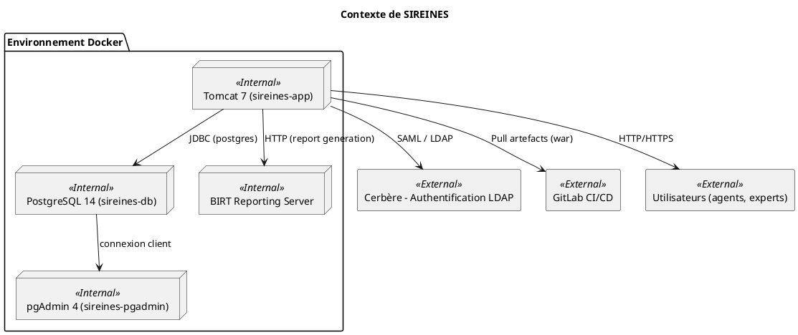
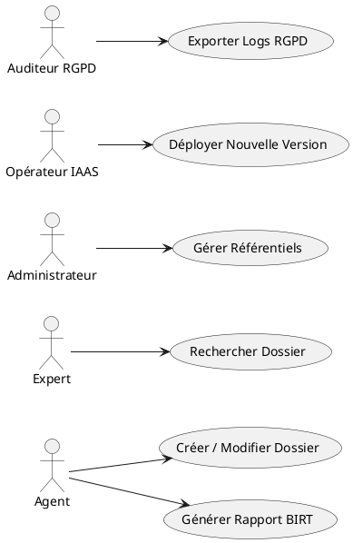
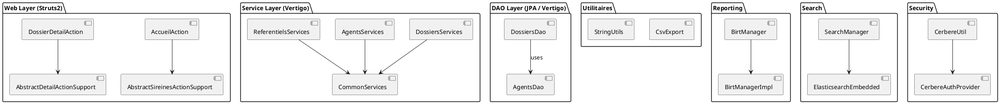
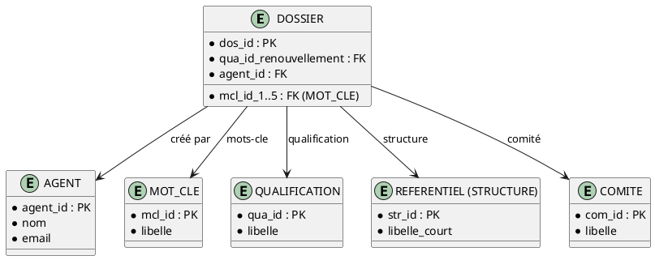

# Dossier d’Architecture Technique (DAT) – SIREINES  
*Conforme à ISO/IEC/IEEE 42010 : 2022*  

---  

## Table des matières  

- [1️⃣ Introduction & contexte de l’architecture](#section-1)  
- [2️⃣ Parties prenantes & préoccupations](#section-2)  
- [3️⃣ Points de vue architecturaux](#section-3)  
- [4️⃣ Vues architecturales](#section-4)  
  - 4.1 Vue **Contexte** (C1)  
  - 4.2 Vue **Fonctionnelle / Métier** (F1)  
  - 4.3 Vue **Applicative / Logicielle** (A1)  
  - 4.4 Vue **Données & Information** (D1)  
  - 4.5 Vue **Technique / Infrastructure** (T1)  
  - 4.6 Vue **Intégration** (I1)  
  - 4.7 Vue **Sécurité** (S1)  
  - 4.8 Vue **Opérationnelle / Exploitation** (O1)  
- [5️⃣ Correspondance entre les vues](#section-5)  
- [6️⃣ Décisions architecturales (ADR)](#section-6)  
- [7️⃣ Analyse des écarts, risques & dettes techniques](#section-7)  
- [8️⃣ Qualités & exigences non‑fonctionnelles (ISO 25010)](#section-8)  
- [9️⃣ Évolutivité & feuille de route](#section-9)  
- [🔟 Annexes](#section-10)  

---  

## 1️⃣ Introduction & contexte de l’architecture  

**Nom du projet** : **SIREINES** – *Système d’Information de Recensement des Experts et Spécialistes*  

**Périmètre**  
- Gestion du cycle de vie des **dossiers** d’évaluation par les comités de domaine.  
- Interfaces de **consultation**, **import** de fichiers, **extraction** de rapports (BIRT).  
- Exposition d’une **API de recherche** (Elasticsearch embedded).  
- Déploiement **Dockerisé** (Tomcat 7 + PostgreSQL 14 + pgAdmin).  
- Environnements : **recette**, **pré‑production**, **production** (IaaS ECO4).  

**Objectif du DAT**  
- Documenter l’architecture actuelle afin de permettre :  
  - L’évaluation de la conformité aux exigences (fonctionnelles, RGPD, disponibilité).  
  - La planification de l’évolution (scalabilité, migration vers Java 11/17, conteneurs K8s).  
  - La communication entre parties prenantes (MOA, MOE, exploitation, sécurité).  

**Sources d’information**  
- Code source (modules `sireines-web`, `sireines-database`, `sireines-talend`).  
- Scripts de déploiement Docker (`docker‑compose.yml`).  
- Documents de procédure (GitLab MR, procédures de mise à jour, wiki).  
- Diagrammes PlantUML générés ci‑dessous.  

---  

## 2️⃣ Parties prenantes & préoccupations  

| **#** | **Partie prenante** | **Rôle / Responsabilité** | **Préoccupations (concerns)** |
|------|----------------------|---------------------------|------------------------------|
| **P1** | **MOA – CGDD / DRI / AST4** (Pascal Zemour, Vincent Letrouit) | Pilotage fonctionnel, validation des livrables, conformité CNIL | ✅ Fonctionnalités métiers, ✅ Qualité des données, ✅ Conformité RGPD, ✅ Traçabilité |
| **P2** | **MOE – Klee Group** (Matthieu Georges, Olivier Venot) | Développement, maintenance, livraisons | ✅ Maintenabilité du code, ✅ Gestion des dépendances, ✅ Tests automatisés, ✅ Documentation |
| **P3** | **Exploitation – DNUM / SG / PNM3** | Exploitation des plateformes IaaS, monitoring | ✅ Disponibilité ≥ 99,5 %, ✅ Performances (temps de réponse < 2 s), ✅ Sauvegarde/RAID, ✅ Gestion des incidents |
| **P4** | **Sécurité – Cerbère** (Équipe SSI) | Gestion des habilitations, audit sécurité | ✅ Confidentialité, ✅ Intégrité, ✅ Gestion des accès (LDAP), ✅ Journalisation |
| **P5** | **Utilisateurs finaux** (agents, experts, référents) | Consultation et saisie de dossiers, génération de rapports | ✅ Ergonomie UI, ✅ Temps de réponse, ✅ Accessibilité (WCAG 2.1 AA) |
| **P6** | **Auditeur RGPD / CNIL** | Vérification de la conformité légale | ✅ Minimisation des données, ✅ Droit d’accès/effacement, ✅ Registre des traitements |
| **P7** | **Direction IT** | Pilotage stratégique, budget | ✅ Coût total de possession, ✅ Évolution technologique, ✅ Alignement avec la roadmap ministérielle |

> **Correspondance préoccupation ↔ point de vue** (exemple)  
> - *Disponibilité* → **Vue Technique (T1)**  
> - *Fonctionnalités métier* → **Vue Fonctionnelle (F1)**  
> - *Sécurité des données* → **Vue Sécurité (S1)**  

---  

## 3️⃣ Points de vue architecturaux  

| **ID** | **Nom du point de vue** | **Préoccupations couvertes** | **Langage de modélisation** | **Méthode d’analyse** |
|--------|--------------------------|-----------------------------|-----------------------------|-----------------------|
| **C1** | **Contexte** | Environnement externe, dépendances | PlantUML *Component Diagram* | Analyse d’impact (scope) |
| **F1** | **Fonctionnel / Métier** | Cas d’usage, flux métier | PlantUML *Use‑Case Diagram* | Validation des exigences |
| **A1** | **Applicatif** | Modules Java, couches (Web, Service, DAO) | PlantUML *Component Diagram* | Cohérence des couches, couplage |
| **D1** | **Données** | Modèle conceptuel, persistance | PlantUML *Entity‑Relationship* | Qualité du schéma, normalisation |
| **T1** | **Technique / Infrastructure** | Conteneurs, serveurs, réseau | PlantUML *Deployment Diagram* | Analyse de résilience, scalabilité |
| **I1** | **Intégration** | Interfaces externes (BIRT, Elasticsearch, Cerbère) | PlantUML *Sequence Diagram* | Traçabilité des appels |
| **S1** | **Sécurité** | AuthN/AuthZ, chiffrement, journalisation | PlantUML *Component Diagram* (with security zones) | Analyse de menace (STRIDE) |
| **O1** | **Opérationnelle** | Monitoring, backups, CI/CD | PlantUML *Activity Diagram* | Gestion du cycle de vie (ops) |

---  

## 4️⃣ Vues architecturales  

> Chaque sous‑section comporte : (i) description, (ii) diagramme PlantUML, (iii) éléments clés liés au point de vue.

### 4.1 Vue **Contexte** (C1)  

**Description**  
Le système SIREINES s’insère dans l’écosystème ministériel : il interagit avec les services d’authentification (Cerbère), la base de données PostgreSQL, le serveur de reporting BIRT et les outils d’import (Talend). Le déploiement s’effectue dans trois environnements Docker‑isolés.

**Éléments clés**  
- **Tomcat** exécute le WAR `sireines-web‑*.war`.  
- **PostgreSQL** stocke les tables `DOSSIER`, `AGENT`, `REFERENTIEL`, etc.  
- **BIRT** produit les rapports (extractions).  
- **Cerbère** assure l’authentification unique (SAML).  
- **Docker‑Compose** orchestre les conteneurs (`sireines-app`, `sireines-db`, `sireines-pgadmin`).  

---

### 4.2 Vue **Fonctionnelle / Métier** (F1)  

**Cas d’usage principaux**  

| # | Acteur | Description du scénario | Priorité |
|---|--------|--------------------------|----------|
| **U1** | Agent | Crée / consulte un **dossier** d’évaluation, saisit les mots‑clefs, déclenche la génération du **rapport BIRT**. | Haute |
| **U2** | Expert | Recherche des dossiers via le **moteur de recherche** (Elasticsearch) et ajoute son **avis**. | Haute |
| **U3** | Administrateur | Gère les **référentiels** (structures, comités, mots‑clefs) via les écrans de maintenance. | Moyenne |
| **U4** | Opérateur IAAS | Déploie une nouvelle version du WAR en suivant la procédure de **Merge Request** (recette → pre‑prod → prod). | Haute |
| **U5** | Auditeur RGPD | Exporte les logs d’accès et les historiques de traitement des données personnelles. | Haute |

**Contraintes métier**  
- **CNIL** : traçabilité de chaque modification (audit).  
- **RGPD** : droit d’accès, d’effacement, journalisation des traitements.  
- **Disponibilité** : les comités doivent pouvoir accéder aux dossiers 24 h/24.  

---

### 4.3 Vue **Applicative / Logicielle** (A1)  

**Architecture en couches**  

**Points saillants**  

| Couche | Packages principaux | Principaux artefacts |
|--------|-------------------|----------------------|
| **Web** | `i2.application.sireines.controller.*` | `AccueilAction`, `DossierDetailAction`, `Extraction*Action` |
| **Service** | `i2.application.sireines.service.*` | `DossiersServices`, `AgentsServices`, `ReferentielsServices` |
| **DAO** | `i2.application.sireines.service.*` (ksp) | `dossiersDao.ksp`, `agentsDao.ksp`, `referentielDao.ksp` |
| **Reporting** | `i2.application.sireines.boot.manager` | `BirtManager`, `BirtManagerImpl` |
| **Search** | `io.vertigo.dynamo.search` | `SearchManagerInitializer` |
| **Util** | `i2.application.sireines.util` | `CsvExport`, `FormatterAnnee` |
| **Security** | `CerbereUtil` (custom) | Integration Cerbère (SAML) |

**Frameworks / Bibliothèques**  

- **Struts 2** (v2.x) – MVC web.  
- **Spring** (v2.0) – gestion des beans, transactions.  
- **Vertigo** – Dyna‑model, recherche, génération de code.  
- **BIRT** 4.3 – génération de rapports.  
- **Elasticsearch embedded** – indexation des mots‑clefs des dossiers.  
- **Docker** (compose) – conteneurisation.  

---

### 4.4 Vue **Données & Information** (D1)  

**Modèle conceptuel simplifié**  

**Persistance**  

- **Schéma** : `public` (PostgreSQL).  
- **Tables principales** : `DOSSIER`, `AGENT`, `MOT_CLE`, `QUALIFICATION`, `STRUCTURE`, `COMITE`.  
- **Index** : `IDX_MOTS_CLEFS` (sur