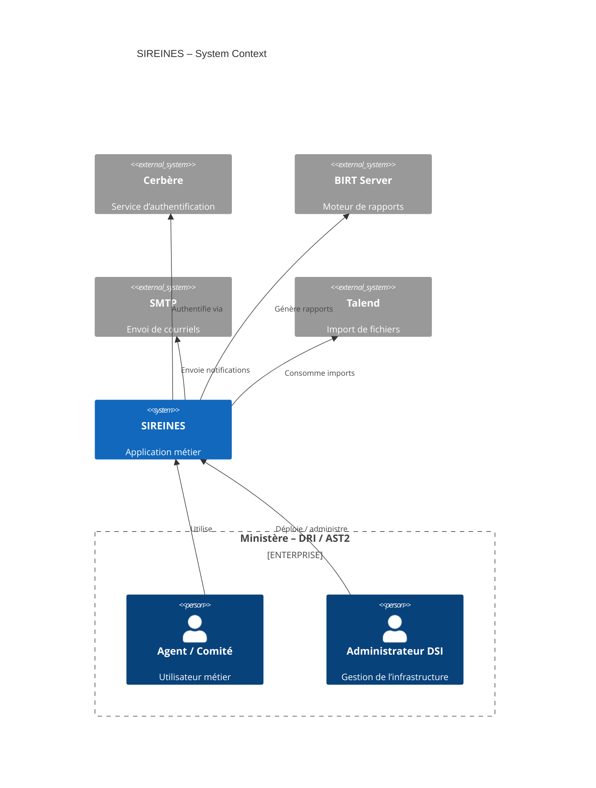
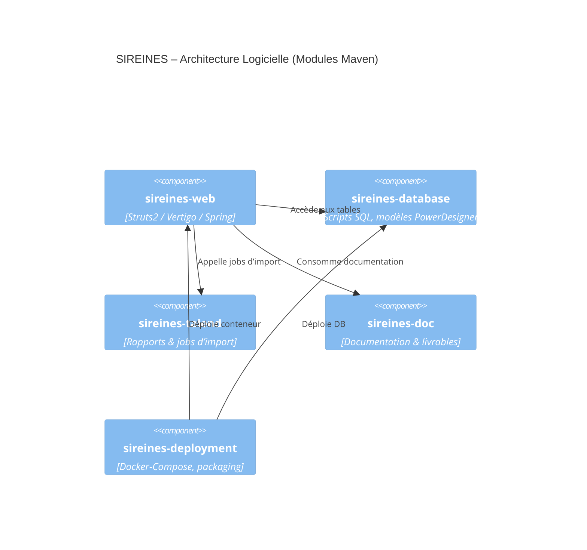

# 📄 Dossier d’Architecture Technique (DAT) – **SIREINES**  
*Version 2.5.20 – 12 mars 2024*  

> **Objet** – Ce document décrit, de façon structurée et traçable, l’architecture du système SIREINES conformément à la norme **ISO/IEC/IEEE 42010 :2022**. Il permet aux parties prenantes (MOA, MOE, exploitation, sécurité, utilisateurs) d’analyser, d’évaluer et de communiquer l’architecture du système.  

---

[TOC]

---

## 1️⃣ Introduction & Contexte de l’Architecture  

### 1.1 Objectifs du DAT  

| Objectif | Description |
|----------|-------------|
| **Clarté** | Fournir une vue unifiée du système (composants, flux, contraintes). |
| **Traçabilité** | Lier chaque **préoccupation** aux **points de vue** et **vues** correspondants. |
| **Décision** | Documenter les décisions majeures d’architecture (ADRs). |
| **Évolution** | Identifier les marges de manœuvre et les scénarios de croissance. |

### 1.2 Périmètre  

Le périmètre fonctionnel couvre :  

* La collecte et le suivi des demandes de qualification d’experts (dossiers, avis).  
* La génération de rapports BIRT.  
* Les imports de fichiers via Talend.  
* L’authentification via le service **Cerbère**.  

Le périmètre technique inclut :  

* Application web **SIREINES‑web** (Struts 2 / Vertigo / Spring).  
* Base de données **PostgreSQL** (scripts SQL, modèles PowerDesigner).  
* Conteneurs Docker : `sireines-app`, `sireines-db`, `sireines-pgadmin`.  
* Environnement de construction **Maven** (modules : web, database, talend, doc, deployment).  
* Reporting BIRT, import Talend, monitoring (log4j, ehcache).  

### 1.3 Références  

| Référence | Type | Lien |
|-----------|------|------|
| ISO/IEC/IEEE 42010 :2022 | Norme | https://www.iso.org/standard/73955.html |
| ISO/IEC 25010 | Qualité logicielle | https://www.iso.org/standard/71533.html |
| Projet GitLab – SIREINES | Source code | https://gitlab-forge.din.developpement-durable.gouv.fr/snum/pnm3/produits/rh/sireines |
| Documentation d’exploitation | Wiki interne | `Technique/DocumentationInstallationEtExploitation.md` |
| Procédures de déploiement | Wiki interne | `Deploiement/DeploiementApplicatif/*.md` |
| Cerbère (auth) | Wiki interne | `Sireines/Cerbère.md` |
| Historique RGPD | Wiki interne | `Home.md` (section “Historique”) |

---

## 2️⃣ Parties Prenantes & Préoccupations  

### 2.1 Tableau des parties prenantes  

| # | **Partie prenante** | **Rôle** | **Objectifs** | **Préoccupations (concerns)** |
|---|----------------------|----------|----------------|------------------------------|
| P1 | **MOA – CGDD / SRI / AST2** (Zémour Pascal, Letrouit Vincent) | Pilotage fonctionnel, exigences métier | Garantir la conformité aux exigences de qualification, CNIL, suivi des dossiers | ✅ Fonctionnalités, ✅ Conformité RGPD, ✅ Disponibilité, ✅ Traçabilité |
| P2 | **MOE – Klee Group / prestataires** (Georges, Venot) | Réalisation technique, maintenance | Livraison dans les délais, qualité du code, évolutivité | ✅ Architecture, ✅ Performance, ✅ Sécurité, ✅ Documentation |
| P3 | **Utilisateurs finaux** (agents, comités de domaine) | Saisie & consultation de dossiers | Ergonomie, temps de réponse, accès aux rapports | ✅ UX, ✅ Disponibilité, ✅ Intégrité des données |
| P4 | **DSI – Hébergement (ECO4 IaaS)** | Exploitation, infrastructure | Continuité de service, sauvegarde, monitoring | ✅ Disponibilité, ✅ Sécurité, ✅ Scalabilité |
| P5 | **Sécurité – Cerbère** | Gestion des identités & des droits | Authentification forte, gestion des rôles | ✅ Confidentialité, ✅ Intégrité, ✅ Gestion des accès |
| P6 | **Qualité – Audit RGPD / CNIL** | Contrôle conformité | Traçabilité des traitements, respect des durées de conservation | ✅ Confidentialité, ✅ Conformité légale |
| P7 | **Support – Portail‑support DIN** | Gestion des incidents | Rapidité de résolution, suivi des tickets | ✅ Opérationnel, ✅ Disponibilité |

> **Notation** – ✅  préoccupation prise en compte dans l’architecture.  

### 2.2 Matrice Parties‑Prenantes ↔ Préoccupations  

| Préoccupation | P1 | P2 | P3 | P4 | P5 | P6 | P7 |
|---------------|----|----|----|----|----|----|----|
| Fonctionnalités métier | ✅ | ✅ | ✅ |   |   |   |   |
| Performance / Temps de réponse |   | ✅ | ✅ | ✅ |   |   |   |
| Disponibilité (≥ 99,5 %) | ✅ | ✅ | ✅ | ✅ | ✅ |   | ✅ |
| Sécurité (auth, RBAC) | ✅ | ✅ |   | ✅ | ✅ | ✅ |   |
| Conformité RGPD / CNIL | ✅ | ✅ |   | ✅ | ✅ | ✅ |   |
| Traçabilité & audit | ✅ | ✅ |   | ✅ | ✅ | ✅ | ✅ |
| Maintenabilité / Documentation |   | ✅ |   | ✅ |   |   |   |
| Scalabilité (Docker, IaaS) |   | ✅ |   | ✅ | ✅ |   |   |

---

## 3️⃣ Points de Vue (Viewpoints)  

| **ID** | **Nom du point de vue** | **Préoccupations couvertes** | **Langage / Méthode** | **Analyse** |
|--------|--------------------------|----------------------------|-----------------------|--------------|
| VP‑SYS‑CTX | **System Context** | Disponibilité, Sécurité, Intégration, Conformité | Diagramme **Mermaid** (C4‑L1) | Analyse d’interactions externes |
| VP‑FCT | **Functional View** | Fonctionnalités métier, Traçabilité | Diagramme **Mermaid** (C4‑L2) | Cartographie des cas d’usage |
| VP‑APP | **Application (Component) View** | Maintenabilité, Performance, Scalabilité | Diagramme **Mermaid** (C4‑L2) | Découpage en modules Maven |
| VP‑DAT | **Data View** | Intégrité, Confidentialité, Conservation | Diagramme **Mermaid** (ER) | Modèle conceptuel (PowerDesigner) |
| VP‑TECH | **Technical / Deployment View** | Disponibilité, Scalabilité, Opérationnel | Diagramme **Mermaid** (UML Deployment) | Docker‑Compose, Tomcat, PostgreSQL |
| VP‑INT | **Integration View** | Sécurité (Cerbère), Reporting (BIRT), Import (Talend) | Diagramme **Mermaid** (Sequence) | Flux d’authentification & génération de rapports |
| VP‑SEC | **Security View** | Confidentialité, Intégrité, Gestion des accès | Diagramme **Mermaid** (C4‑L3) | Zones de confiance, RBAC |
| VP‑OP | **Operational View** | Monitoring, Logging, Sauvegarde | Diagramme **Mermaid** (C4‑L3) | Log4j, ehcache, backup Docker volumes |

---

## 4️⃣ Vues Architecturales  

### 4.1 Vue **System Context** – VP‑SYS‑CTX  



**Analyse** – Le système interagit avec : Cerbère (auth), BIRT (reporting), SMTP (mail), Talend (import). Les utilisateurs métier sont les agents et les comités de domaine.

---

### 4.2 Vue **Functional** – VP‑FCT  

```mermaid
C4Container
title SIREINES – Functional Overview
Container(sire, "SIREINES", "Web Application") {
  Component(dossier, "Gestion des dossiers", "CRUD + workflow")
  Component(qualif, "Gestion des qualifications", "Rules, notifications")
  Component(report, "Reporting BIRT", "Export PDF/Excel")
  Component(import, "Import Talend", "Batch files")
}
Person(agent, "Agent / Comité")
Rel(agent, dossier, "Crée / consulte")
Rel(agent, qualif, "Soumet / suit")
Rel(agent, report, "Consulte rapports")
Rel(agent, import, "Dépose fichiers")
```

**Fonctions majeures** – Saisie de dossiers, attribution de qualifications, génération de rapports, import de données, suivi des statuts.

---

### 4.3 Vue **Application (Component)** – VP‑APP  



* **sireines‑web** : contrôleurs Struts, services Vertigo, BIRT Manager, filtres, sécurité.  
* **sireines‑database** : scripts `install/`, `alter/`, `drop/`, modèles `.oom/.pdm`.  
* **sireines‑talend** : rapports `.rptdesign`, job d’import.  
* **sireines‑deployment** : `docker-compose.yml`, `assembly‑*.xml`.  

---

### 4.4 Vue **Data** – VP‑DAT  

```mermaid
erDiagram;
    DOSSIER ||--o{ MOT_CLE : "contient"
    DOSSIER ||--|| QUALIFICATION : "est qualifié par"
    DOSSIER ||--o{ COMITE : "revue par"
    AGENT ||--o{ DOSSIER : "dépose"
    AGENT ||--o{ COMITE : "membre de"
    AGENT ||--o{ QUALIFICATION : "recev. avis"
    AGENT {
        int id PK;
        string nom;
        string prenom;
        string email;
    }
    DOSSIER {
        int id PK;
        string libelle;
        date dateReception;
        int statut;
    }
    MOT_CLE {
        int id PK;
        string libelle;
    }
    QUALIFICATION {
        int id PK;
        string libelle;
        date dateDecision;
    }
    COMITE {
        int id PK;
        string libelle;
    }
```

*Modèle simplifié* – Les tables principales (`DOSSIER`, `AGENT`, `QUALIFICATION`, `COMITE`, `MOT_CLE`) proviennent du modèle PowerDesigner (fichiers `.oom/.pdm`).  

---

### 4.5 Vue **Technical / Deployment** – VP‑TECH  

```mermaid
deployment
title SIREINES – Déploiement Docker
node("Host ECO4 IaaS") {
  node("Docker‑Engine") {
    container(sire_app, "sireines‑app", "Tomcat 7 + WAR")
    container(sire_db, "sireines‑db", "PostgreSQL 14‑alpine")
    container(sire_pgadmin, "sireines‑pgadmin", "pgAdmin 4")
  }
}
artifact(war, "sireines‑web‑*.war")
artifact(sql, "scripts/*.sql")
rel(war, sire_app, "Déployé via Dockerfile")
rel(sql, sire_db, "Initialisation via volume")
```

* **Volumes persistants** – `sireines_db_sireines_vol` (BDD) et `sireines_pgadmin_sireines_vol` (config pgAdmin).  
* **Réseau interne** – Docker‑compose expose le port 8080 (`sireines‑app`) et le port 5432 (`sireines‑db`).  
* **Mécanisme de mise à jour** – Remplacement du WAR dans le répertoire `docker-compose` puis `docker compose up -d`.  

---

### 4.6 Vue **Integration** – VP‑INT  

```mermaid
sequencediagram;
    participant User as Agent;
    participant Web as SIREINES‑web;
    participant Cerb as Cerbère (Auth)
    participant BIRT as BIRT Server;
    participant DB as PostgreSQL;
    User->>Web: Login / Session;
    Web->>Cerb: Authentification (OAuth‑like)
    Cerb-->>Web: Token / Rôle;
    Web->>DB: CRUD dossiers;
    Web->>BIRT: Génération rapport;
    BIRT-->>Web: PDF/Excel;
    Note right of Web: Tous les appels sont sécurisés (HTTPS)
```

*Flux d’authentification* – Cerbère fournit le token et les rôles (`R_ADMIN`, etc.).  
*Flux de reporting* – BIRT est appelé via l’interface `BirtManager`.  

---

### 4.7 Vue **Security** – VP‑SEC  

```mermaid
C4Component
title SIREINES – Sécurité (Zonage)
Boundary(trust, "Zone de confiance (Docker‑network)") {
  Component(web, "sireines‑app")
  Component(db, "sireines‑db")
}
Boundary(public, "Zone publique (Internet)") {
  Person(user, "Agent / Comité")
}
Rel(user, web, "HTTPS (TLS 1.2+)")
Rel(web, db, "SSL‑PostgreSQL (cert‑signed)")
Rel(web, cerb, "OAuth‑like (token)")
```

* **RBAC** – Définie dans `sireines‑auth‑config.xml` (rôles `R_ADMIN` etc.).  
* **Chiffrement** – TLS 1.2 + pour le trafic HTTP, SSL pour la connexion DB.  
* **Isolation** – Conteneurs séparés, réseau interne non exposé.  

---

### 4.