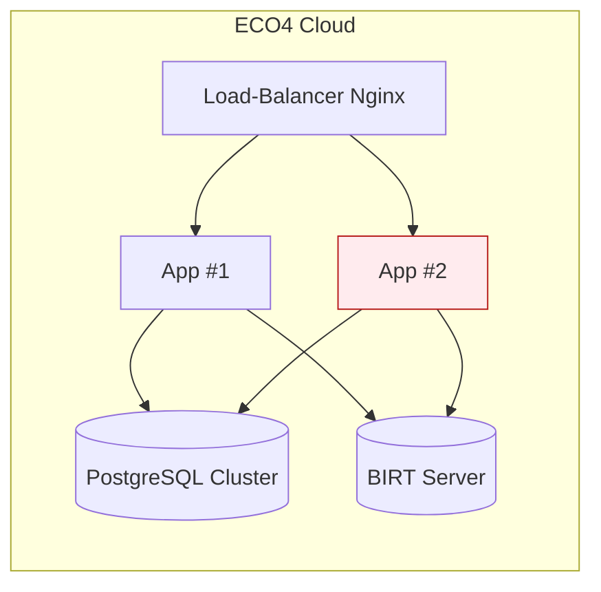

**SIREINES – Dossier d’Architecture Technique (DAT)**  
*Conforme au modèle Arc42 – version 2024*  

---  

## 📑 Table des matières  
[TOC]

---  

# 1️⃣ Introduction et objectifs  

## 1.1 Vue d’ensemble fonctionnelle  
SIREINES est la **base de données des experts et spécialistes scientifiques et techniques** du Ministère de la Transition Écologique. Elle recense les demandes de qualification, suit leur évolution et informe les agents des décisions des comités de domaine.  

```mermaid
graph TD
    A[Agent (utilisateur) ] -->|dépose une demande| B[SIREINES Web]
    B -->|requête| C[(PostgreSQL)]
    B -->|rapports BIRT| D[BI / BIRT]
    B -->|authentification| E[Cerbère (IAM)]
    style A fill:#E3F2FD,stroke:#0B5394,stroke-width_2px;
    style B fill:#FFF3E0,stroke:#BF9000,stroke-width_2px;
    style C fill:#E8F5E9,stroke:#1B5E20,stroke-width_2px;
    style D fill:#FCE4EC,stroke:#C2185B,stroke-width_2px;
    style E fill:#F3E5F5,stroke:#6A1B9A,stroke-width_2px
```

## 1.2 Objectifs de qualité orientés utilisateur  

| # | Objectif | Raison métier |
|---|----------|---------------|
| **Q‑01** | **Disponibilité ≥ 99,5 %** (SLA 24 h/7) | Garantir l’accès permanent aux services de qualification. |
| **Q‑02** | **Sécurité RGPD & CNIL** (confidentialité, traçabilité) | Protection des données personnelles des experts. |
| **Q‑03** | **Temps de réponse ≤ 3 s** pour les écrans de recherche | Fluidité de la saisie et de la consultation. |
| **Q‑04** | **Maintenabilité** : couverture de tests unitaires ≥ 80 % | Faciliter les évolutions fonctionnelles (ex : nouveaux comités). |
| **Q‑05** | **Scalabilité** : capacité à supporter +200 utilisateurs simultanés | Anticiper la montée en charge lors des campagnes de qualification. |

---  

# 2️⃣ Parties prenantes  

| Rôle | Responsable | Attente principale |
|------|-------------|--------------------|
| **MOA MTES** | Pascal Zémour (Chargé de mission) – `Pascal.Zemour@developpement-durable.gouv.fr` | Conformité fonctionnelle, respect du planning. |
| **MOA AST4** | Vincent Letrouit (Chef de bureau) – `Vincent.Letrouit@developpement-durable.gouv.fr` | Fiabilité du service, reporting statistique. |
| **MOE Prestataire** | Klee Group (ex) – `matthieu.georges@kleegroup.com`<br>`olivier.venot@kleegroup.com` | Livraison de correctifs, évolutions techniques. |
| **Exploitation** | INFRA DPNM3 – `infocentre.bun.sdsed.cgdd@developpement-durable.gouv.fr` | Disponibilité, monitoring, sauvegarde. |
| **Utilisateurs finaux** | Agents experts | Interface simple, traçabilité de leurs dossiers. |
| **RSSI** | SG/DNUM/PNM/DPNM3 | Sécurité, conformité RGPD/CNIL. |
| **Support** | Portail‑support DIN – <https://portail-support.din.developpement-durable.gouv.fr/projects/sireines> | Gestion des incidents, tickets. |

### 📇 Contacts détaillés (section “Contacts”)  

| Nom | Fonction | Courriel |
|-----|----------|----------|
| Pascal Zémour | MOA MTES | `Pascal.Zemour@developpement-durable.gouv.fr` |
| Vincent Letrouit | MOA AST4 | `Vincent.Letrouit@developpement-durable.gouv.fr` |
| Infocentre BUN | Exploitation | `infocentre.bun.sdsed.cgdd@developpement-durable.gouv.fr` |
| Support DIN | Support fonctionnel | <https://portail-support.din.developpement-durable.gouv.fr/projects/sireines> |

---  

# 3️⃣ Contraintes  

| Type | Description | Référence |
|------|-------------|-----------|
| **Technique** | Java 7, Tomcat 7, Struts 2, Vertigo (Framework), BIRT 4.3, PostgreSQL 14 (Docker) | `pom.xml`, `Dockerfile` |
| **Organisationnelle** | Déploiement via GitLab CI, Merge‑Request obligatoire (dev→recette→preprod→prod) | `DeploiementApplicatif` (wiki) |
| **Réglementaire** | RGPD, CNIL (déclaration 29/09/2014 n°1034232) | `Home.md` |
| **Sécurité D‑I‑C‑T** | <ul><li>**Disponibilité** : HA Docker + monitoring Prometheus + alerting.</li><li>**Intégrité** : contraintes DB, signatures BIRT.</li><li>**Confidentialité** : chiffrement AES‑256 des sauvegardes, accès via Cerbère (IAM).</li><li>**Traçabilité** : journalisation via Log4j, audit PostgreSQL.</li></ul> | `sireines-auth-config.xml`, `log4j.xml` |

---  

# 4️⃣ Contexte et périmètre  

## 4.1 Partenaires fonctionnels  

| Système | Rôle | Type d’interface |
|--------|------|-----------------|
| **Cerbère** | Gestion des identités (IAM) | SSO / OIDC (HTTP Headers) |
| **BIRT** | Génération de rapports | HTTP GET / POST (report URL) |
| **PGAdmin** | Administration DB (dev/recette) | Web UI |
| **Portail‑support DIN** | Gestion tickets | Web (REST) |
| **Supervision (Prometheus / Grafana / Loki)** | Monitoring applicatif | Exporters HTTP/Pushgateway |

## 4.2 Interfaces techniques  

| Interface | Protocole | Fréquence | Données |
|-----------|-----------|------------|---------|
| **Web → App** | HTTP/HTTPS (Struts 2) | On‑demand | Formulaires, JSON (AJAX) |
| **App → DB** | JDBC (PostgreSQL) | Transactionnelle | Dossiers, experts, historiques |
| **App → BIRT** | HTTP (REST) | On‑demand | Rapports PDF/CSV |
| **App → Cerbère** | HTTP Headers (SAML/OIDC) | Authentification | Token, attributs utilisateur |
| **Docker → Host** | Unix sockets / TCP | Continu | Health‑check, logs |

---  

# 5️⃣ Stratégie de solution  

| Décision | Justification |
|----------|--------------|
| **Architecture monolithique** (Struts 2 + Vertigo) | Simplicité de déploiement, code historique, faible besoin de découplage. |
| **Conteneurisation Docker** (3 conteneurs : app, PostgreSQL, pgAdmin) | Portabilité, isolation, alignement avec la politique IaaS (ECO4). |
| **CI / CD GitLab** (pipeline : build → test → docker‑compose up) | Automatisation du build, traçabilité des livraisons. |
| **BIRT 4.3** pour les rapports | Fonctionnalité métier déjà implémentée, génération PDF/Excel. |
| **Sauvegarde chiffrée AES‑256** (scripts du dépôt `sireines-docker`) | Conformité CNIL / RGPD. |
| **Supervision Prometheus + Grafana** (stack standard GTI) | Observation des métriques (CPU, RAM, latence HTTP, DB). |
| **Log4j + ELK** (ou Loki) | Centralisation, recherche, rétention. |
| **Gestion des secrets** via variables d’environnement Docker (`.env`) | Séparation du code et des secrets. |

---  

# 6️⃣ Vue en Briques (C4 L2)  

```mermaid
graph TB
    subgraph "Docker‑Compose"
    A[Container: sireines_app_usine]:::app;
    B[Container: sireines_db_usine]:::db;
    C[Container: sireines_pgadmin]:::admin;
    end
    A -->|JDBC| B;
    A -->|HTTP| D[BIRT Server]
    A -->|HTTP Headers| E[Cerbère IAM]
    A -->|HTTP| F[Front‑End (Struts2)]
    B -->|SQL| G[(PostgreSQL DB)]
    C -->|Web UI| G;
    D -->|Report Files| G;
    classDef app fill:#fff3e0,stroke:#bf9000;
    classDef db fill:#e8f5e9,stroke:#1b5e20;
    classDef admin fill:#f3e5f5,stroke:#6a1b9a;
```

> **Légende**  
> *app* = application Java (Tomcat 7) ; *db* = PostgreSQL 14 ; *admin* = pgAdmin 4.  

---  

# 7️⃣ Vue Exécution (Scénario critique)  

## 7.1 Scénario : **Extraction d’un rapport**  

```mermaid
sequencediagram;
    participant U as Agent (Web)
    participant W as SIREINES Web (Struts2)
    participant B as BIRT Server;
    participant D as PostgreSQL;
    participant C as Cerbère (IAM)

    U->>W: Authentification (via Cerbère)
    Note right of W: SSO, jeton stocké en session;
    W->>D: Vérification des droits (RBAC)
    alt droit ok;
    W->>W: Affiche formulaire d’extraction;
    U->>W: Soumet paramètres (extraction 04)
    W->>D: Query SQL (index = IDX_MOTS_CLEFS)
    D-->>W: Résultat (JSON)
    W->>B: Request report (template = 04_extraction_totale.rptdesign)
    B-->>W: PDF (ou CSV)
    W->>U: Téléchargement du rapport;
    else droit refusé;
    W->>U: Message d’erreur (403)
    end
```

*Points de contrôle :*  
- **Authentification** : jeton Cerbère dans `HttpSession`.  
- **Autorisation** : filtre `sireines-auth-config.xml` (permissions `PRM_READ_ALL`, `PRM_WRITE_ALL`).  
- **Intégrité** : requêtes via `SearchManagerInitializer` → ré‑indexation.  
- **Traçabilité** : log4j → audit d’accès (user, timestamp, query).  

---  

# 8️⃣ Vue Déploiement *(section standardisée)*  

```markdown
### Environnements
| Environnement | Hébergement | Serveurs | Réseau | Particularités |
|--------------|-------------|----------|--------|----------------|
| **Développement** | Poste de travail (Docker Desktop) | 1 × app, 1 × db, 1 × pgAdmin | localhost | `.env` = dev, données de test. |
| **Recette** | ECO4 (Cloud) – bastion `bastion.recette.pnm3` | 1 × app, 1 × db, 1 × pgAdmin | VPC privé, VPN | URL `http://sireines.recette.pnm3.eco4.cloud.e2.rie.gouv.fr/Accueil.do`. |
| **Pre‑prod** | ECO4 (Cloud) – bastion `bastion.preprod` | idem | VPC privé, VPN | URL `https://sireines.preprod.e2.rie.gouv.fr/Accueil.do`. |
| **Production** | ECO4 (Cloud) – bastion `bastion.prod` | idem | VPC privé, VPN, HA (2 instances) | URL `https://sireines.e2.rie.gouv.fr/Accueil.do`. |
```

**Infrastructure**  



- **Reverse‑proxy Nginx** (pair) assure le *load‑balancing* et le *TLS termination*.  
- **Base de données** : réplication PostgreSQL (HA) + volumes persistance.  
- **Sauvegardes** : scripts `backup.sh` → objets chiffrés AES‑256 → stockage `B3`, `Outscale SecNumCloud`, `Google Cloud`.  

---  

# 9️⃣ Sujets transverses  

| Aspect | Implémentation |
|--------|----------------|
| **Authentification** | Cerbère (OIDC) → filtre `SIREINES‑auth‑config.xml`. |
| **Journalisation** | Log4j 2 + appender file + ELK/Loki (central). |
| **Monitoring** | Prometheus + Grafana + Alertmanager (CPU, RAM, latence HTTP, DB). |
| **Gestion des erreurs** | `ErrorHandler.java` → pages `application‑error.jsp`. |
| **API REST** | Aucun public → internes via Struts2 actions (ex : `Extraction*Action`). |
| **Sécurité des données** | Chiffrement des dumps, `pgcrypto`, mots de passe en env. |
| **Gestion des sessions** | `SireinesSessionFilter` (HTTP session, timeout 30 min). |
| **Reporting** | BIRT 4.3 → templates `.rptdesign` (ex : `04_extraction_totale.rptdesign`). |
| **Internationalisation** | Ressources i18n dans `src/main/resources` (fr / en). |
| **CI/CD** | GitLab CI → stages : `build`, `test`, `package`, `docker‑compose up`. |
| **Versioning** | `version.properties` (ex : `2.5.20 (12/03/2026)`). |

---  

# 🔟 Exigences de qualité  

| Exigence | Critère | Méthode de validation |
|----------|---------|-----------------------|
| **Disponibilité ≥ 99,5 %** | Uptime mensuel > 99,5 % | Rapport Grafana + alertes SLA. |
| **Temps de réponse ≤ 3 s** | 95 % des requêtes < 3 s | Test de charge JMeter (scenario extraction). |
| **RGPD – Consentement** | Tous les champs PII journalisés avec pseudonymisation | Audit log4j + examen des tables `expert`. |
| **Sauvegarde chiffrée** | Backup quotidien + vérification d’intégrité | Script `pg_dump | openssl aes‑256‑cbc` → hash SHA‑256. |
| **Couverture unitaires ≥ 80 %** | SonarQube → metric `coverage` | Rapport Sonar dans pipeline CI. |
| **Scalabilité** | Support de 200 sessions simultanées | Test de charge (100 → 200 users) – seuil ≤ 5 % d’erreurs. |

---  

# 1️⃣1️⃣ Risques et dettes techniques  

| Risque / Dette | Impact | Mitigation |
|----------------|--------|------------|
| **Monolithe difficile à évoluer** | Risque de régression lors d’ajouts fonctionnels. | Introduire des modules Vertigo + tests d’intégration. |
| **Dépendance à Tomcat 7 (EOL)** | Fin de support, vulnérabilités non corrigées. | Plan migration vers Tomcat 9 / Jakarta EE 9 d’ici 2025. |
| **Base de données unique** (pas de réplication en dev) | Perte de données en cas de panne. | Activer la réplication PostgreSQL en dev (docker‑compose). |
| **Gestion des secrets dans `.env`** (stockés en clair) | Fuite possible. | Utiliser HashiCorp Vault ou GitLab CI variables masked. |
| **Scripts de backup manuels** | Oubli de rotation ou de test de restauration.