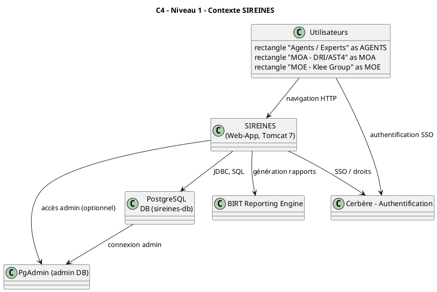
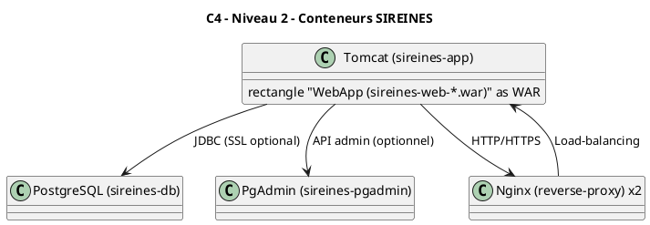
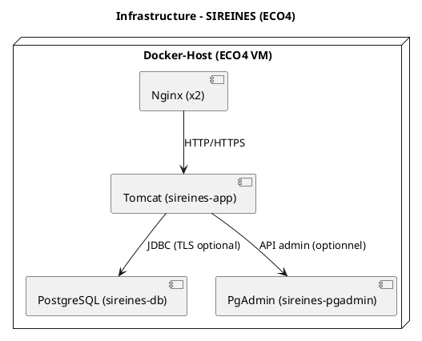

**Dossier d’Architecture Technique (DAT) – SIREINES**  
*Version : 2024‑03‑15 | Auteur : ChatGPT (AI) – généré à partir des sources fournies*  

---  

# 📖 Table des matières  
[↩ Retour au sommaire](#)  

1. [Introduction et objectifs](#introduction-et-objectifs)  
2. [Parties prenantes](#parties-prenantes)  
3. [Contraintes](#contraintes)  
4. [Contexte et périmètre](#contexte-et-périmètre)  
5. [Stratégie de solution](#stratégie-de-solution)  
6. [Vue en briques (C4 L2)](#vue-en-briques-c4‑l2)  
7. [Vue d’exécution (scénarios)](#vue-dexécution-scenarios)  
8. [Vue Déploiement (standardisée)](#vue-déploiement-standardisée)  
9. [Sujets transverses](#sujets-transverses)  
10. [Exigences de qualité](#exigences-de-qualité)  
11. [Risques et dettes techniques](#risques-et-dettes-techniques)  
12. [Annexes](#annexes)  

---  

## 1️⃣ Introduction et objectifs   

**Vue d’ensemble fonctionnelle**  
SIREINES (Système d’Information de REgistre des INtéressés EN Sciences) recense les demandes de qualification d’experts et de spécialistes scientifiques et techniques. Il assure :  

* la collecte et la mise à jour des dossiers d’évaluation,  
* la diffusion des résultats aux agents (via courriels, BIRT),  
* le suivi des commissions de domaine et la génération de statistiques.  

**Diagramme C4 – Niveau 1 (System Context)**  

**Objectifs de qualité orientés utilisateur**  

| # | Objectif (qualité) | Raison métier |
|---|---------------------|----------------|
| 1 | **Disponibilité ≥ 99,5 %** | L’accès aux dossiers doit être continu pour les agents. |
| 2 | **Intégrité des données** (transaction ACID) | Garantir la fiabilité des qualifications. |
| 3 | **Sécurité : chiffrement des données personnelles** | Conformité RGPD (DACP). |
| 4 | **Temps de réponse < 2 s** pour les écrans de recherche | Expérience utilisateur fluide. |
| 5 | **Traçabilité des actions** (audit log) | Répondre aux exigences de traçabilité (D‑I‑C‑T). |

---  

## 2️⃣ Parties prenantes   

| Rôle | Principaux contacts | Attente principale |
|------|--------------------|--------------------|
| **MOA – Ministère de la Transition Ecologique (DRI/AST4)** | Pascal Zemour, Vincent Letrouit | Livraison fonctionnelle, conformité réglementaire (RGPD, CNIL). |
| **MOE – Klee Group (prestataire)** | Matthieu Georges, Olivier Venot | Respect des spécifications, stabilité du code Java /J2EE. |
| **Opérateurs d’infrastructure (ECO4 – IaaS)** | Équipe « Infra » du DPNM3 | Disponibilité de l’hébergement, mise à jour des containers Docker. |
| **Utilisateurs finaux (agents, experts)** | - | Accès simple, performances rapides, rapports BIRT fiables. |
| **Support / Ticketing** | Portail‑support DIN | Gestion des incidents, suivi des évolutions. |
| **Auditeur sécurité** | CGDD/SRI/AST2 | Conformité D‑I‑C‑T, traçabilité, chiffrement. |

---  

## 3️⃣ Contraintes   

### Techniques  
* **Plateforme** : Java 1.7, Tomcat 7.0.108 (JDK 8), Spring 2.0, Struts 2, Vertigo, BIRT 4.3.  
* **Base de données** : PostgreSQL 14 (image `postgres:14.1-alpine`).  
* **Conteneurisation** : Docker Compose (3 services : `sireines-app`, `sireines-db`, `sireines-pgadmin`).  
* **Réseau** : Port 8080 (Web), 5432 (PostgreSQL), 8888 (PgAdmin).  
* **Gestion des dépendances** : Maven (assemblies, archetype).  

### Organisationnelles  
* **Processus de mise en production** : Merge‑request → pipeline CI → validation du merge → redéploiement via Docker‑Compose.  
* **Calendrier de livraison** : 1 déploiement par mois (ex : version 2.5.20 du 12/03/2026).  

### Réglementaires (D‑I‑C‑T)  

| Axe | Exigence | Mesure |
|-----|----------|--------|
| **Disponibilité** | ≥ 99,5 % (SLA) | Redondance du container DB via volume persistant, monitoring (Prometheus/Grafana). |
| **Intégrité** | ACID, contraintes FK, triggers | Scripts SQL d’install (`crebas.sql`, `creconstraint.sql`). |
| **Confidentialité** | Chiffrement des données personnelles (DACP) | TLS entre Nginx (reverse‑proxy) et Tomcat, chiffrement des backups AES‑256. |
| **Traçabilité** | Logs d’audit détaillés | `log4j.xml` + Portainer + AlertManager. |

---  

## 4️⃣ Contexte et périmètre   

| Entité | Interface | Protocoles / Données |
|--------|-----------|----------------------|
| **SIREINES Web** | HTTP/HTTPS (port 8080) | Pages JSP, JSON, BIRT reports. |
| **Base PostgreSQL** | JDBC (TCP 5432) | Scripts SQL, tables `DOSSIER`, `MOT_CLE`, etc. |
| **Cerbère (SSO)** | HTTP / SAML2 | Jeton d’authentification. |
| **PgAdmin** (admin) | HTTP / HTTPS (port 8888) | Accès DBA. |
| **BIRT** | HTTP (report servlet) | Generation PDF/CSV. |
| **Docker Host** | Unix socket / Docker‑API | `docker-compose` pour orchestration. |

Le périmètre **défini** inclut : le code source Java, les scripts SQL, les fichiers de configuration (`settings.xml`, `log4j.xml`, `application-config.xml`), les templates Freemarker (`*.ftl`), le `Dockerfile`, le `docker‑compose.yml` et les scripts de déploiement (README, assembly).  

Les **exclusions** : les rapports BIRT pré‑générés, les archives d’ancienne documentation, les données historiques non‑persistées.

---  

## 5️⃣ Stratégie de solution   

| Décision | Justification |
|----------|---------------|
| **Architecture monolithique** (Web + Servlets) | Simplicité de maintenance, historique existant (Struts 2, Vertigo). |
| **Conteneurisation Docker** | Isolation, reproductibilité, alignement avec le processus CI/CD. |
| **Reverse‑proxy Nginx (2 instances)** | Haute disponibilité, load‑balancing frontale. |
| **Persisted volumes** (`sireines_db_sireines_vol`, `sireines_pgadmin_sireines_vol`) | Garantie de la persistance des données entre les redeploiements. |
| **Maven + Assembly** pour les livrables (`*.war`, `scripts.zip`) | Standardisation du packaging. |
| **CI / CD GitLab** (pipeline, artefacts) | Automatisation du build, tests unitaires, déploiement via `docker‑compose`. |
| **Supervision** (Prometheus + Grafana + AlertManager) + **Portainer** | Visibilité de l’état des containers, alertes temps réel. |
| **Sauvegarde** : scripts `crebas.sql`, `creuser.sql` + dumps chiffrés AES‑256 sur stockage objet B3 / SecNumCloud / Google Cloud. | Conformité RGPD, continuité d’activité. |

### Stack technologique (extraits)  

* **Langage** : Java 1.7, JSP, Struts 2, Spring 2, Vertigo, BIRT.  
* **Serveur d’application** : Tomcat 7 (Docker image `tomcat:7.0.108-jdk8`).  
* **Base** : PostgreSQL 14 (Docker).  
* **Gestion de configuration** : `settings.xml` (Maven), `log4j.xml`, `application-config.xml`.  
* **Outils de build** : Maven, Docker, GitLab CI.  
* **Monitoring** : Prometheus, Grafana, AlertManager, Portainer.  

---  

## 6️⃣ Vue en briques (C4 L2)   

*Le diagramme montre les trois conteneurs principaux (WebApp, DB, PgAdmin) et le reverse‑proxy Nginx en front.*  

---  

## 7️⃣ Vue d’exécution (scénarios critiques)   

### 7.1 Authentification d’un agent  
1. L’agent ouvre `https://sireines.e2.rie.gouv.fr/Accueil.do`.  
2. Nginx redirige vers Tomcat.  
3. Tomcat déclenche le filtre `SireinesSessionFilter` → redirection SSO vers **Cerbère**.  
4. Cerbère renvoie un token SAML.  
5. Le filtre valide le token, crée la session `HttpSession`.  
6. L’utilisateur accède aux écrans (accueil, dossiers, extractions).  

*Critères de succès* : temps < 1 s, trace log `INFO` avec `userId`.  

### 7.2 Création / mise à jour d’un dossier  
1. L’agent remplit le formulaire (Struts 2).  
2. Le contrôleur `DossierDetailAction` valide les champs (`StringUtils.isValidCriteria`).  
3. La couche service `DossiersServicesImpl` ouvre une transaction (Spring).  
4. Le DAO persiste le dossier via JDBC.  
5. Le trigger `misajourqualification` (SQL) met à jour les références qualification.  
6. Le commit est confirmé, le journal `log4j` écrit `INFO` : *Dossier {id} créé*.  

*Critères* : ACID, rollback en cas d’erreur, durée < 2 s.  

### 7.3 Génération d’un rapport BIRT  
1. L’utilisateur clique sur « Statistiques ».  
2. `BirtManager.publish` charge le modèle `.rptdesign`.  
3. Le moteur BIRT génère le PDF (ou CSV).  
4. Le fichier est renvoyé au navigateur avec le header `Content‑Disposition`.  

*Critères* : génération < 5 s, taille < 10 Mo, logs d’audit.  

---  

## 8️⃣ Vue Déploiement (section standardisée)   

### Environnements  

| Environnement | Hébergement | Serveurs | Réseau | Particularités |
|--------------|-------------|----------|--------|----------------|
| **Recette** | ECO4 – IaaS (Paris La Défense) | 1 VM Docker‑host, 3 containers (app, db, pgadmin) | 10.0.0.10 (app), 10.0.0.11 (db), 10.0.0.12 (pgadmin) | URL : `http://sireines.recette.pnm3.eco4.cloud.e2.rie.gouv.fr/Accueil.do` |
| **Pré‑production** | ECO4 – IaaS (Paris La Défense) | Idem Recette | Idem | URL : `https://sireines.preprod.e2.rie.gouv.fr/Accueil.do` |
| **Production** | ECO4 – IaaS (Paris La Défense) | Idem Recette | Idem | URL : `https://sireines.e2.rie.gouv.fr/Accueil.do` |

> **Remarque** : chaque environnement possède ses propres volumes Docker (`sireines_db_sireines_vol`, `sireines_pgadmin_sireines_vol`) afin d’isoler les données.

### Infrastructure  

### Supervision  

* **Portainer** – gestion et visualisation des containers.  
* **Prometheus + Grafana + AlertManager** – métriques (CPU, Mémoire, latence HTTP, disponibilité DB).  
* **Supervision PSIN** – monitoring applicatif dédié (logs, alertes métier).  

### Sauvegardes  

| Cible | Méthode | Fréquence | Chiffrement |
|-------|---------|-----------|-------------|
| **Base PostgreSQL** | `pg_dump` → script `crebas.sql` + `creuser.sql` | Quotidien (full) + Horaire (incremental) | AES‑256, stockage sur B3 (Ministériel) + SecNumCloud + Google Cloud. |
| **Volumes Docker** (`sireines_db_sireines_vol`, `sireines_pgadmin_sireines_vol`) | `docker run --volumes-from` + `tar` | Hebdomadaire | AES‑256, même destinations que ci‑dessus. |

---  

## 9️⃣ Sujets transverses   

| Sujet | Description | Implémentation |
|-------|--------------|----------------|
| **Authentification** | SSO via Cerbère (SAML) | `S