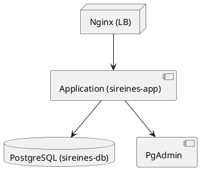

# 📘 Dossier d’Architecture Technique (DAT) – **SIREINES**  

> **Version** : 1.0 – 2024‑03‑15  
> **Auteur** : [Nom à préciser] – Architecture & Sécurité  
> **Statut** : En cours de validation  

---  

## 📑 Table des matières  
[TOC]

---  

## 1️⃣ Introduction & objectifs  

### 1.1 Vue d’ensemble fonctionnelle  
SIREINES est une application métier Java/J2EE qui recense, suit et évalue les demandes de qualification d’experts et spécialistes scientifiques et techniques.  
Les agents publics remplissent des dossiers, les comités de domaine les examinent, et les résultats sont consultables via une interface web.

```mermaid
flowchart TD
    A[Agent] -->|Saisie dossier| B[SIREINES (Web UI)]
    B -->|Persist| C[(PostgreSQL DB)]
    B -->|Rapports BIRT| D[BIRT Engine]
    B -->|Mails| E[Service Mail (SMTP)]
    B -->|Auth| F[Cerbère (IAM)]
    B -->|Monitoring| G[Prometheus / Grafana]
    style B fill:#f9f,stroke:#333,stroke-width_2px
```

### 1.2 Objectifs de qualité (orientés utilisateur)  

| # | Objectif | Motivation | KPI |
|---|----------|-------------|-----|
| O‑1 | **Performance** | Temps de réponse < 2 s pour les écrans de recherche | % de requêtes < 2 s (cible ≥ 95 %) |
| O‑2 | **Sécurité** | Protection des données personnelles (RGPD, CNIL) | Nombre d’incidents = 0 |
| O‑3 | **Disponibilité** | 99,9 % de disponibilité en production | Temps de service (MTBF) |
| O‑4 | **Maintenabilité** | Code modulaire, tests unitaires > 80 % | Couverture de tests |
| O‑5 | **Scalabilité** | Possibilité de scaler horizontalement via Docker | Nombre de réplicas supportés |
| O‑6 | **Traçabilité** | Historisation de chaque modification de dossier | Audit complet (D‑I‑C‑T) |

↩ [Retour au sommaire](#table-des-matières)

---  

## 2️⃣ Parties prenantes  

| Rôle | Responsable | Attente principale |
|------|--------------|---------------------|
| **MOA MTES** | Pascal Zemour (Chargé de mission) – `Pascal.Zemour@developpement-durable.gouv.fr` | Garantie fonctionnelle, conformité RGPD |
| **MOA AST 4** | Vincent Letrouit (Chef de bureau) – `Vincent.Letrouit@developpement-durable.gouv.fr` | Planning, livrables, qualité de service |
| **MOE Prestataire** (historique) | Klee Group – Mat Georges, Ol Venot | Architecture, livrables techniques |
| **MOE Interne** | SG/DNUM/PNM/DPNM3 – équipe DevOps | Exploitation, évolutions, support |
| **Utilisateurs finaux** | Agents publics (fonctionnaires, experts) | Simplicité d’usage, fiabilité |
| **Support** | Portail‑support DIN – `support@sireines` | Gestion des incidents et tickets |
| **Infrastructure** | Équipe IaaS (ECO4) – centre serveur Paris La Défense | Disponibilité, sauvegarde, monitoring |

↩ [Retour au sommaire](#table-des-matières)

---  

## 3️⃣ Contraintes  

| Type | Description | Exemple |
|------|-------------|----------|
| **Techniques** | Java 1.7, Tomcat 7, Struts 2, Maven 3, PostgreSQL 14, BIRT 4.3, Docker 20.10 | `Dockerfile` basé sur `tomcat:7.0.108-jdk8` |
| **Organisationnelles** | Déploiement via *GitLab CI* → *Docker‑Compose* → environnements **recette → pré‑prod → prod** | Pipeline `gitlab-ci.yml` |
| **Réglementaires** | RGPD, CNIL (déclaration n° 1034232), traçabilité des accès | `authorisation-config.xml` (rôles R_ADMIN) |
| **Performance** | Charge maximale ≈ 150 utilisateurs simultanés, requêtes < 2 s | Index Elasticsearch, cache Ehcache |
| **Sécurité** | Authentification via Cerbère, communications HTTPS, mots de passe chiffrés (AES‑256) | `sireines-auth-config.xml` |
| **Sauvegarde** | Dumps PostgreSQL chiffrés, stockage multi‑site (B3, Outscale, GCP) | Scripts de sauvegarde dans `sireines-docker` |
| **Disponibilité** | Redondance du conteneur DB, health‑checks Docker, supervision Prometheus | `docker-compose.yml` avec `restart: always` |

↩ [Retour au sommaire](#table-des-matières)

---  

## 4️⃣ Contexte & périmètre  

### 4.1 Partenaires fonctionnels (systèmes externes)  

| Système | Type d’échange | Protocole / Format | Fréquence |
|---------|-----------------|-------------------|------------|
| **Cerbère** | Gestion des comptes & rôles | HTTP / JSON (API interne) | À chaque login |
| **SMTP** | Envoi de notifications | SMTP TLS | À la création/modif de dossier |
| **BIRT** | Génération de rapports PDF/HTML | BIRT Engine | Sur demande utilisateur |
| **Prometheus / Grafana** | Métriques d’application | HTTP / Prometheus format | Scraping chaque 15 s |
| **Portail‑support** | Ticketing & suivi | HTTPS / REST | Asynchrone |
| **PgAdmin** | Administration DB (post‑déploiement) | HTTP / Web UI | Occasionnel |
| **GitLab** | CI/CD & gestion du code source | HTTPS / Git | Continu |

↩ [Retour au sommaire](#table-des-matières)

### 4.2 Interfaces techniques  

| Interface | Description | Exemple de payload |
|-----------|-------------|-------------------|
| **HTTP / HTTPS** (front) | Accès web via navigateur (HTML + FTL) | `GET /Accueil.do` |
| **JDBC** | Accès à PostgreSQL | `jdbc:postgresql://sireines-db:5432/sireines` |
| **Elasticsearch** (embedded) | Indexation des dossiers pour recherche full‑text | JSON documents |
| **SMTP** | Envoi de courriels (ex : validation) | `MAIL FROM:<no-reply@sireines>` |
| **Docker‑Compose** | Orchestration des conteneurs (app, db, pgadmin) | `docker-compose up -d` |
| **GitLab CI** | Build, test, packaging | `.gitlab-ci.yml` |

↩ [Retour au sommaire](#table-des-matières)

---  

## 5️⃣ Stratégie de solution  

| Décision | Motif | Impact |
|----------|-------|--------|
| **Monolithe web** (Struts 2) | Simplicité de déploiement, code historique | Besoin de refactoriser pour micro‑services futur |
| **Docker** comme unité de déploiement | Portabilité, isolement, réplication | Nécessite une orchestration (Docker‑Compose) |
| **PostgreSQL** comme SGBD principal | Robustesse, support JSON, conformité RGPD | Sauvegarde chiffrée obligatoire |
| **BIRT** pour les rapports | Suite à la chaîne d’outils existante | Dépendance aux libs BIRT 4.3 |
| **Elasticsearch embedded** pour recherche | Indexation rapide, filtres complexes | Consommation mémoire, configuration fine |
| **Prometheus/Grafana** pour la supervision | Observabilité standard | Gestion des alertes (Portail‑support) |
| **Cerbère (IAM)** pour l’authentification | Centralisation des comptes | Nécessite synchronisation des rôles |

↩ [Retour au sommaire](#table-des-matières)

---  

## 6️⃣ Vue en Briques (C4 ‑ L2)  

```mermaid
graph LR
    subgraph "Docker‑Compose"
    APP[Container: sireines_app_usine_container<br/>Image: sireines_app_usine_image]
    DB[Container: sireines_db_usine_container<br/>Image: postgres_14‑alpine]
    PGADMIN[Container: sireines_pgadmin_container<br/>Image: dpage/pgadmin4]
    end
    APP -->|JDBC| DB;
    APP -->|Elasticsearch (embedded)| DB;
    APP -->|SMTP| MAIL[Service Mail]
    APP -->|BIRT| BIRT[Engine BIRT 4.3]
    APP -->|Auth| CERB[Service Cerbère]
    APP -->|Metrics| PROM[Prometheus]
    DB -->|Backup| VOL_DB[(Volume: sireines_db_sireines_vol)]
    PGADMIN -->|UI| VOL_PGADMIN[(Volume: sireines_pgadmin_sireines_vol)]
```

↩ [Retour au sommaire](#table-des-matières)

---  

## 7️⃣ Vue Exécution (Scénarios critiques)  

### 7.1 Authentification & Consultation d’un dossier  

```mermaid
sequencediagram;
    participant User as Agent (Navigateur)
    participant UI as SIREINES UI (Struts2)
    participant Auth as Cerbère (IAM)
    participant App as SIREINES (Tomcat)
    participant DB as PostgreSQL;
    User->>UI: Accède à /Accueil.do;
    UI->>Auth: Demande d’auth (login/password)
    Auth-->>UI: Token + rôles;
    UI->>App: Session créée (cookie)
    User->>UI: Sélectionne “Recherche dossier”
    UI->>App: GET /Dossiers.do?critères;
    App->>DB: SELECT … FROM dossier WHERE …
    DB-->>App: Résultat;
    App-->>UI: Rendu HTML (FTL)
    UI-->>User: Affichage
```

### 7.2 Génération d’un rapport BIRT  

```mermaid
sequencediagram;
    participant User as Agent;
    participant UI as SIREINES UI;
    participant App as SIREINES (Tomcat)
    participant BIRT as BIRT Engine;
    participant DB as PostgreSQL;
    User->>UI: Clique “Export PDF”
    UI->>App: POST /Report.do (params)
    App->>DB: SELECT data for report;
    DB-->>App: Result set;
    App->>BIRT: GenerateReport(reportId, data)
    BIRT-->>App: PDF stream;
    App-->>UI: File download;
    UI-->>User: PDF ouvert
```

↩ [Retour au sommaire](#table-des-matières)

---  

## 8️⃣ Vue Déploiement *(section standardisée)*  

```markdown
### Environnements
| Environnement | Hébergement | Serveurs | Réseau | Particularités |
|---------------|-------------|----------|--------|----------------|
| Développement | Poste de travail (Docker Desktop) | 1 × App, 1 × DB, 1 × PgAdmin | localhost | Volumes locaux |
| Recette | Bastion → sireinesrec (Docker) | 1 × App, 1 × DB, 1 × PgAdmin | VLAN Recette | Snapshots B3 |
| Pré‑production | Bastion → sireinesppr (Docker) | idem | VLAN Pre‑prod | Tests charge |
| Production | ECO4 IaaS (Paris La Défense) | 2 × App (HA), 1 × DB (replication), 1 × PgAdmin | VLAN Prod | Sauvegarde multi‑site (B3, Outscale, GCP) |

### Infrastructure
Le produit est hébergé sur le cloud interne ECO4 basé sur Openstack, dans le tenant **pnm3** du département.  
Le reverse‑proxy Nginx du schéma ci‑dessous est en fait une paire de Nginx load‑balancés en frontal des produits hébergés sur le tenant.



### Supervision
Le produit est supervisé via le système standard du GTI :

- **Portainer** : gestion des conteneurs Docker.  
- **Stack Prometheus / Grafana / Loki / AlertManager** : collecte métriques, logs et alertes.  
- **Supervision PSIN** : monitoring de la couche IaaS.

### Sauvegardes
Les sauvegardes de la base de données sont assurées par des scripts standards du GTI permettant la création de dumps chiffrés AES‑256 et déposés sur :

- le stockage objet **B3** du IaaS ministériel,  
- le stockage objet **Outscale SecNumCloud**,  
- le stockage objet **Google Cloud** (via le marché « Nuage Public »).

↩ [Retour au sommaire](#table-des-matières)

---  

## 9️⃣ Sujets transverses  

| Thème | Implémentation | Référence |
|-------|----------------|------------|
| **Authentification** | Cerbère (RBAC) + filtre `SireinesSessionFilter` | `sireines-web/src/main/java/.../filter/SireinesSessionFilter.java` |
| **Journalisation** | Log4j 2 (`log4j.xml`), logs agrégés dans Loki | `sireines-web/src/main/resources/log4j.xml` |
| **Monitoring** | Exporters Prometheus (JVM, HTTP, DB) | `docker-compose.yml` → `prometheus.yml` |
| **Gestion des erreurs** | `ErrorHandler.java`, pages `application-error.jsp` | `sireines-web/src/main/java/.../errorhandler/ErrorHandler.java` |
| **API REST** | Non exposée ; toutes les interactions passent par Struts 2 (MVC) | `struts.xml` |
| **Internationalisation** | Fichiers de messages (`*.properties`) via Struts 2 | `src/main/resources/i18n/*.properties` |
| **Sécurité des données** | Chiffrement AES‑256 des dumps, paramètres `*.env` non versionnés | `sireines-docker/.env.sample` |
| **Gestion des dépendances** | Maven multi‑module (`pom.xml` à la racine) | `pom.xml` |
| **CI/CD** | GitLab CI → Docker‑Compose → Déploiement automatisé | `.