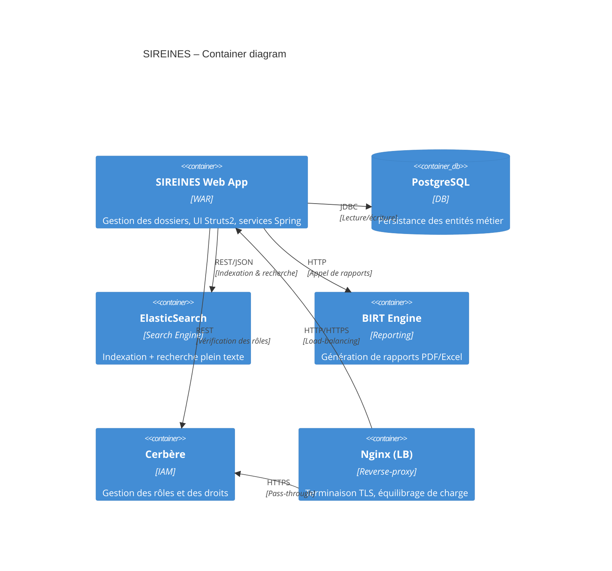

# 📘 Dossier d’Architecture Technique (DAT) – SIREINES  
*Version : 2.5.20 – 12 mars 2024*  

---  

## 📑 Table des matières  

```markdown
[TOC]
```  

---  

## 1️⃣ Introduction et objectifs <a id="introduction-et-objectifs"></a>  

### 1.1 Vue d’ensemble fonctionnelle  
SIREINES (Système d’Information de REgistre des INExperts et Spécialistes) recense les demandes de qualification des agents par les comités de domaine, assure le suivi de leurs dossiers, génère les courriers et les rapports BIRT, et propose des extractions statistiques.  

### 1.2 Diagramme C4‑L1 – System Context  

```mermaid
C4Context
title SIREINES – System Context
Enterprise_Boundary(gov, "Ministère de la Transition Écologique") {
    Person(admin, "MOA / Chef de projet", "Zémour Pascal, Letrouit Vincent")
    Person(user, "Agent public", "Dépose un dossier de qualification")
    System_Ext(cerbere, "Cerbère", "Gestion des droits d’accès")
    System_Ext(birt, "BIRT", "Moteur de reporting")
    System_Ext(es, "ElasticSearch", "Indexation / recherche plein texte")
    System_Ext(db, "PostgreSQL", "Base de données métier")
    System(sireines, "SIREINES", "Application web de gestion de dossiers")

Rel(admin, sireines, "Définit les exigences, valide les livraisons")
Rel(user, sireines, "Utilise l’application (Web UI)")
Rel(sireines, cerbere, "Vérifie les rôles (RBAC) via API")
Rel(sireines, birt, "Génère les rapports et export PDF")
Rel(sireines, es, "Indexe les dossiers / recherche")
Rel(sireines, db, "Persistance des données")
```  

### 1.3 Objectifs qualité orientés utilisateur  

| # | Objectif | Motivation |
|---|----------|-------------|
| Q1 | **Performance** – temps de réponse ≤ 2 s pour la recherche de dossiers | Garantir une expérience fluide aux agents |
| Q2 | **Sécurité** – conformité D‑I‑C‑T (Disponibilité, Intégrité, Confidentialité, Traçabilité) | Respect du RGPD (déclaration CNIL n° 1034232) |
| Q3 | **Maintenabilité** – couverture de tests unitaires ≥ 80 % | Réduire le coût de l’évolution fonctionnelle |
| Q4 | **Scalabilité** – capacité à supporter + 500 concurrent users sans dégradation | Anticiper les pics d’usage lors des campagnes de qualification |
| Q5 | **Observabilité** – métriques & alertes via Prometheus/Grafana | Détecter rapidement les incidents de production |

---  

## 2️⃣ Parties prenantes <a id="parties-prenantes"></a>  

| Rôle | Nom / Contact | Responsabilités |
|------|---------------|-----------------|
| **MOA (Maîtrise d’Ouvrage)** | **Pascal Zémour** – CGDD/DRI/AST4 – `pascal.zemour@developpement-durable.gouv.fr` | Pilotage fonctionnel, validation des livrables |
| **MOE (Maîtrise d’Œuvre)** | **Vincent Letrouit** – CGDD/DRI/AST4 – `vincent.letrouit@developpement-durable.gouv.fr` | Gestion du projet technique, planification des releases |
| **Équipe de développement** | Klee Group (historique) – Actuellement équipes internes DPNM3 | Implémentation, tests, support |
| **Exploitation / SSI** | **SG/DNUM/PNM/DPNM3** – Responsables de la sécurité du SI | Gestion de la sécurité, supervision, sauvegardes |
| **Utilisateurs finaux** | Agents publics (fonctionnaires, experts) | Saisie, suivi et consultation des dossiers |
| **Support / Ticketing** | **Portail‑support DIN** – `portail-support.din@developpement-durable.gouv.fr` | Gestion des incidents et des demandes d’évolution |
| **Auditeurs RGPD** | **CNIL** – Déclaration 29/09/2014 n° 1034232 | Vérification conformité protection des données |

> **Contacts** : voir la section « Contacts » du fichier `Sireines.Wiki.md`.  

---  

## 3️⃣ Contraintes <a id="contraintes"></a>  

| Type | Description | Référence |
|------|-------------|-----------|
| **Techniques** | Java 7, Tomcat 7, Spring 2, Struts2, Vertigo, PostgreSQL 14, Docker 20, BIRT 4.3, ElasticSearch 7 | `pom.xml`, `Dockerfile` |
| **Organisationnelles** | Processus GitLab CI/CD, validation de merge‑request (pré‑prod → prod) | `DeploiementApplicatif/*.md` |
| **Réglementaires** | RGPD – traçabilité, droit d’accès, archivage 5 ans (DUA) | `Sireines.Wiki.md` – “Sécurité et risques” |
| **Sécurité (D‑I‑C‑T)** | Disponibilité ≥ 99,9 % (SLA), intégrité via contraintes DB, chiffrement des sauvegardes (AES‑256), logs centralisés (Log4j) | `application-auth-config.xml`, `log4j.xml` |
| **Performance** | Chargement page ≤ 2 s, requêtes DB < 200 ms, index ElasticSearch pour recherche plein texte | `elasticsearch.yml` |
| **Infrastructure** | Hébergement IaaS (ECO4) – Data‑center Paris La Défense, réplication en lecture, sauvegarde quotidienne | `sireines-docker/docker-compose.yml` |

---  

## 4️⃣ Contexte et périmètre <a id="contexte-perimetre"></a>  

### 4.1 Interactions fonctionnelles  

| Système | Type d’interface | Protocole / Fréquence | Données échangées |
|--------|----------------|-----------------------|-------------------|
| **Cerbère** | AuthZ (RBAC) | REST HTTPS (on‑demand) | JWT, listes de rôles |
| **BIRT** | Reporting | HTTP (synchrones) | Templates *.rptdesign, paramètres de requête |
| **ElasticSearch** | Indexation / Recherche | REST HTTPS (asynchrone) | Documents JSON (dossiers, mots‑clé) |
| **PostgreSQL** | Persistance | JDBC (poolé) | Tables métier (`dossier`, `qualification`, …) |
| **Portail‑support** | Ticketing | HTTP HTTPS (on‑demand) | Incidents, demandes d’évolution |
| **Supervision** | Monitoring | Prometheus (scrape) | Métriques JVM, HTTP, DB, ES |

### 4.2 Périmètre fonctionnel  

- Gestion du cycle de vie d’un **dossier** (création, mise à jour, affectation, clôture).  
- **Recherche** plein texte (ElasticSearch) et filtres métier.  
- **Génération** de courriers et de rapports BIRT (PDF, Excel).  
- **Export** de statistiques (CSV via `CsvExport`).  
- **Administration** des référentiels (agents, structures, mots‑clé).  
- **Gestion des droits** via Cerbère (rôles R_ADMIN, etc.).  

---  

## 5️⃣ Stratégie de solution <a id="strategie-solution"></a>  

| Décision | Raison |
|----------|--------|
| **Architecture modulaire monolithique** (un seul WAR ` s i r e i n e s - w e b .war `) | Réduction de la complexité de déploiement, compatibilité avec l’infrastructure existante (Tomcat 7). |
| **Spring + Struts2** pour l’injection de dépendances et la couche web | Stack déjà maîtrisée, large communauté, support de Vertigo (Dynamo). |
| **Dockerisation** du conteneur d’application et de la base PostgreSQL | Isolation, reproductibilité, alignement avec la stratégie « Docker » décrite dans `LivraisonSurPosteDocker`. |
| **ElasticSearch** en tant que moteur de recherche dédié | Performance de recherche texte supérieur aux requêtes SQL classiques. |
| **BIRT** pour le reporting | Historique d’utilisation, génération de rapports complexes. |
| **GitLab CI/CD** avec pipelines de validation (lint, tests, sonar) | Qualité du code (SonarQube) et automatisation des livraisons. |
| **Sauvegardes chiffrées** (AES‑256) vers trois stockages (B3, Outscale, Google Cloud) | Conformité aux exigences de continuité et de protection des données. |
| **Monitoring** via Prometheus / Grafana + Portainer | Visibilité complète des conteneurs, alertes SLA. |

### 5.1 Environnement technique  

| Couche | Technologie | Version | Commentaire |
|--------|-------------|---------|-------------|
| **OS / Runtime** | Debian 11 (base `tomcat:7.0.108-jdk8`) | – | Compatibilité JDK 8 |
| **Serveur d’app** | Tomcat 7 | – | Déploiement du WAR |
| **Framework** | Spring 2, Struts2 2.5, Vertigo 4 | – | Inversion de contrôle, actions Struts |
| **Langage** | Java 7 (compatibilité JDK 8) | – | Conformité aux dépendances legacy |
| **Base de données** | PostgreSQL 14 (alpine) | – | Docker image `postgres:14.1-alpine` |
| **Recherche** | ElasticSearch 7 | – | Config `elasticsearch.yml` |
| **Reporting** | BIRT 4.3 | – | Templates *.rptdesign |
| **Orchestration** | Docker‑Compose v2 | – | Fichier `docker-compose.yml` |
| **CI/CD** | GitLab CI, Maven 3.6 | – | `sonar-project.properties` |
| **Monitoring** | Prometheus 2, Grafana 9, Portainer 2 | – | Métriques JVM/DB/ES |
| **Sécurité** | JWT, Log4j 2, HTTPS (reverse‑proxy Nginx en prod) | – | `application-auth-config.xml` |
| **Gestion des mots‑clé** | Vertigo Dynamo Search Plugin (embedded) | – | `ESEmbeddedSearchServicesPlugin` |

---  

## 6️⃣ Vue en Briques (C4‑L2) <a id="vue-briques"></a>  



### 6.1 Description des conteneurs  

| Conteneur | Responsabilité principale | Principaux artefacts |
|----------|--------------------------|----------------------|
| `sireines_app_usine_container` | Application métier (WAR) | `sireines-web‑*.war`, `application‑config.xml`, `log4j.xml` |
| `sireines_db_usine_container` | Base de données métier | Scripts `script/*.sql`, schéma PowerDesigner |
| `sireines_pgadmin_container` | Console d’administration DB (pgAdmin) | UI web, connexion au conteneur DB |
| `nginx` (prod) | Terminaison TLS & répartition | `nginx.conf` (non versionné) |
| `elastic` | Indexation & recherche | Mapping *dossier* (`DT_DOSSIER_MOTS_CLEFS`) |
| `birt` | Moteur de reporting BIRT | Templates *.rptdesign* (Talend reports) |

---  

## 7️⃣ Vue Exécution (Scénarios critiques) <a id="vue-execution"></a>  

### 7.1 Scénario 1 – Création d’un dossier et indexation  

```mermaid
sequencediagram;
    participant Agent as Agent (Web UI)
    participant Web as SIREINES Web App;
    participant DB as PostgreSQL;
    participant ES as ElasticSearch;
    Agent->>Web: Saisie du formulaire « Nouveau dossier »
    Web->>DB: INSERT dossier + commit;
    DB-->>Web: OK (id généré)
    Web->>ES: POST /dossiers/_doc (payload JSON)
    ES-->>Web: 201 Created;
    Web->>Agent: Confirmation + numéro de dossier
```  

*Validation* : La réponse `201` d’ElasticSearch doit être reçue en < 500 ms (exigence Q4).  

### 7.2 Scénario 2 – Recherche de dossiers (full‑text)  

```mermaid
sequencediagram;
    participant User as Agent;
    participant Web as SIREINES Web App;
    participant ES as ElasticSearch;
    User->>Web: Saisie d’un mot‑clé dans le champ recherche;
    Web->>ES: GET /dossiers/_search?q=« mot‑clé »
    ES-->>Web: Résultats (JSON)
    Web->>User: Affichage paginé
```  

*Validation* : Temps de réponse < 2 s pour < 500 résultats (exigence Q1).  

### 7.3 Scénario 3 – Génération d’un rapport BIRT  

```mermaid
sequencediagram;
    participant User as Agent;
    participant Web as SIREINES Web App;
    participant BIRT as BIRT Engine;
    User->>Web: Demande d’impression du rapport « Statistiques qualification »
    Web->>BIRT: POST /run?report=statistiques.rptdesign;
    BIRT-->>Web: PDF (stream)
    Web->>User: Téléchargement du PDF
```  

*Validation* : Rapport disponible < 5 s, taille < 10 Mo.  

---  

## 8️⃣ Vue Déploiement (section standardisée) <a id="vue-deploiement"></a>  

### 8️⃣ Environnements  

| Environnement | Hébergement | Serveurs | Réseau | Particularités |
|---------------|------------|----------|--------|----------------|
| **Développement** | Poste de travail – Docker Desktop | 1 × cont. app, 1 × cont. db, 1 × pgAdmin | Bridge Docker interne | `docker-compose.yml` – volumes locaux (`sireines_db_sireines_vol`) |
| **Recette** | IaaS (ECO4) – Déploiement Docker | 2 × Nginx (LB), 1 × app, 1 × db, 1 × es, 1 × birt | VLAN Recette, HTTPS via LB | Sauvegardes quotidiennes chiffrées, accès via Bastion |
| **Pré‑production** | IaaS (ECO4) – Clone de Recette | Identique à Recette | VLAN Pre‑prod, certificats dédiés | Validation de version avant prod |
| **Production** | IaaS (ECO4) – Data‑center Paris La Défense | 2 × Nginx (HA),