# 📘 Dossier d’Architecture Technique (DAT) – **SIREINES**  

> **Version du DAT** : 1.0 – 2024‑04‑27  
> **Auteur** : ChatGPT (expert UML ISO/IEC 19505)  

---  

## 1️⃣ Introduction architecturale  

| Élément | Description |
|---|---|
| **Objet** | Système d’information « SIREINES » – répertoire national des experts et spécialistes scientifiques et techniques, gestion des dossiers de qualification et des avis de comités de domaine. |
| **Périmètre** | Application web Java (Struts 2 / Spring / Vertigo), base de données PostgreSQL, génération de rapports BIRT, import/export Talend, déploiement Docker (Tomcat 7 + PostgreSQL 14). |
| **Documents sources** | `sireines.code.filtered.md`, `sireines.code.summarized.md`, `sireines.wiki.md`, `sireines.wikisi.md`, `pom.xml`… |
| **Vue d’ensemble des diagrammes** | 13 diagrammes UML : Class, Component, Deployment, Package, Composite Structure, Use‑Case, Activity, State‑Machine, Sequence, Communication, Interaction‑Overview, Timing, Object (exemple). |
| **Organisation du document** | <br>1️⃣ Introduction – 2️⃣ Vue structurelle – 3️⃣ Vue comportementale – 4️⃣ Vue d’interaction – 5️⃣ Traçabilité – 6️⃣ Profils & stéréotypes – 7️⃣ Contraintes OCL – 8️⃣ Patterns – 9️⃣ Décisions – 🔟 Normes de modélisation |

---  

## 2️⃣ Vue Structurelle  

### 2.1 Diagramme de **Classes** (`ClassDiagram`)  

```plantuml
@startuml ClassDiagram
'--- Stereotypes -------------------------------------------------
skinparam class {
    BackgroundColor<<entity>>    #F8F8F8
    BackgroundColor<<service>>    #E8F5E9
    BackgroundColor<<controller>>#E3F2FD
    BackgroundColor<<repository>>#FFF3E0
    BackgroundColor<<utility>>   #F3E5F5
    BorderColor<<entity>>        #607D8B
    BorderColor<<service>>        #4CAF50
    BorderColor<<controller>>     #2196F3
    BorderColor<<repository>>     #FF9800
    BorderColor<<utility>>        #9C27B0
}
'--- Entities ----------------------------------------------------
class Dossier <<entity>> {
    +Long dosId
    +String libelle
    +Date dateReception
    +String statut
    +Integer anneeQualification
    +String renouvlement
    +Qualification qualification
    +Agent responsable
}
class Agent <<entity>> {
    +Long agtId
    +String nom
    +String prenom
    +String email
    +String fonction
}
class Structure <<entity>> {
    +Long strId
    +String libelleCourt
    +String libelleLong
}
class Comite <<entity>> {
    +Long comId
    +String libelle
}
class Qualification <<entity>> {
    +Long quaId
    +String libelle
}
class MotCle <<entity>> {
    +Long mkId
    +String libelle
    +Integer niveau
}
class Rapporteur <<entity>> {
    +Long rapId
    +String nom
}
class Mail <<utility>> {
    +String to
    +String subject
    +String body
    +File attachment
    +send()
}
'--- Services ----------------------------------------------------
interface DossierService <<service>> {
    +List<Dossier> rechercher(Criteres c)
    +Dossier charger(Long id)
    +void sauvegarder(Dossier d)
    +void supprimer(Long id)
}
interface AgentService <<service>> {
    +List<Agent> lister()
    +Agent charger(Long id)
}
interface QualificationService <<service>> {
    +List<Qualification> lister()
}
interface MotCleService <<service>> {
    +List<MotCle> rechercher(String texte)
}
interface ExportService <<service>> {
    +File exporter(List<Dossier> dossiers, String format)
}
'--- Repositories ------------------------------------------------
interface DossierRepository <<repository>> {
    +List<Dossier> find(Criteres c)
    +Dossier findById(Long id)
    +void save(Dossier d)
    +void delete(Long id)
}
interface AgentRepository <<repository>> { … }
interface QualificationRepository <<repository>> { … }
interface MotCleRepository <<repository>> { … }

'--- Controllers ------------------------------------------------
class DossierController <<controller>> {
    -DossierService ds
    +String liste()
    +String detail()
    +String edit()
}
class AgentController <<controller>> { … }
class ExtractionController <<controller>> { … }

'--- Relations ---------------------------------------------------
Dossier "1" --> "1" Agent : responsable
Dossier "1" --> "1" Qualification : qualification
Dossier "1" --> "0..*" MotCle : motsClés
Agent "1" --> "0..*" Structure : appartientÀ
Comite "1" --> "0..*" Qualification : évalue
Qualification "1" --> "0..*" Rapporteur : attribuéÀ
DossierController --> DossierService
AgentController --> AgentService
ExtractionController --> ExportService
DossierService --> DossierRepository
AgentService --> AgentRepository
QualificationService --> QualificationRepository
MotCleService --> MotCleRepository
ExportService --> Mail

@enduml
```

**Légende**  

| Stéréotype | Signification |
|---|---|
| `<<entity>>` | Table métier persistant (DTO/Entity) |
| `<<service>>` | Business‑logic (Spring `@Service`) |
| `<<controller>>` | Struts 2 Action / Spring MVC Controller |
| `<<repository>>` | DAO (Vertigo/Dynamo) |
| `<<utility>>` | Classe utilitaire (ex. `Mail`) |

### 2.2 Diagramme de **Composants** (`ComponentDiagram`)  

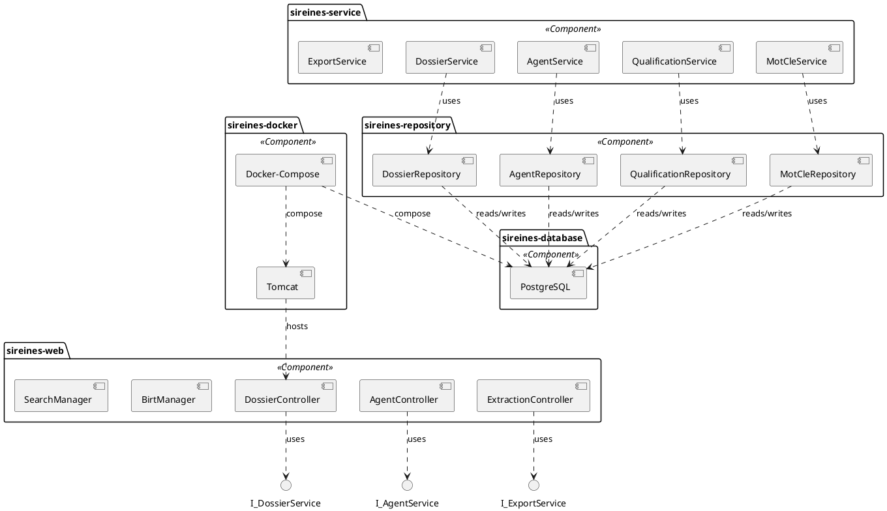

**Légende**  

| Élément | Description |
|---|---|
| `sireines-web` | Application web (Struts 2 / Spring) |
| `sireines-service` | Couche métier |
| `sireines-repository` | Accès persistant (Vertigo) |
| `sireines-database` | PostgreSQL 14 (Docker) |
| `sireines-docker` | Conteneurs Tomcat 7 & PostgreSQL, orchestrés par `docker‑compose.yml` |

### 2.3 Diagramme de **Déploiement** (`DeploymentDiagram`)  

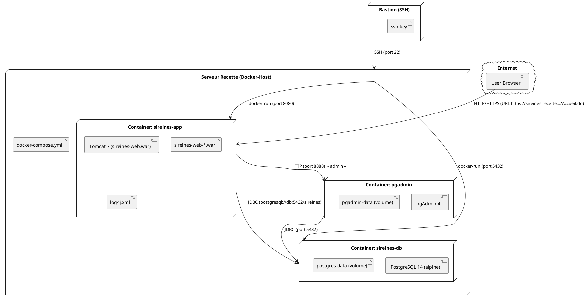

**Légende**  

| Symbole | Signification |
|---|---|
| `node` | Machine physique ou conteneur Docker |
| `artifact` | Fichier déployable (WAR, volume) |
| `component` | Processus ou service exécuté dans le conteneur |
| `cloud` | Internet / navigateur client |

### 2.4 Diagramme de **Paquets** (`PackageDiagram`)  

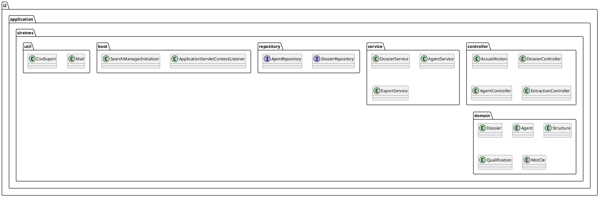

### 2.5 Diagramme **Composite Structure** (optionnel) – Vue du *DossierController*  

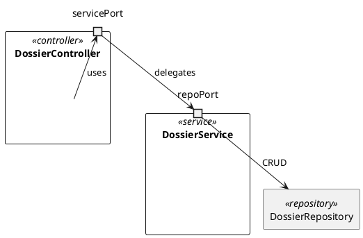

---  

## 3️⃣ Vue Comportementale  

### 3.1 Diagramme de **Cas d’utilisation** (`UseCaseDiagram`)  

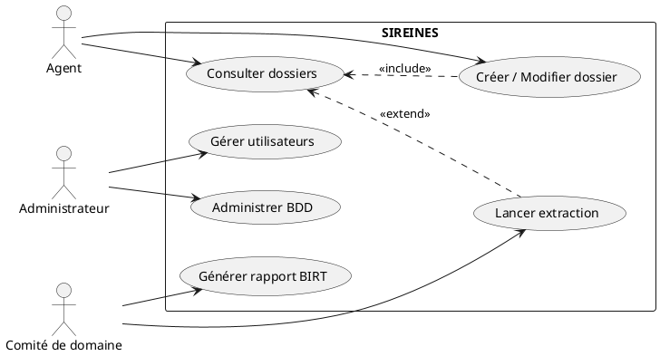

### 3.2 Diagramme d’**Activité** (`ActivityDiagram`) – *Flux de création d’un dossier*  

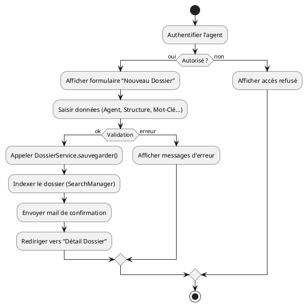

### 3.3 Diagramme d’**État** (`StateMachineDiagram`) – *Cycle de vie d’un **Dossier***  

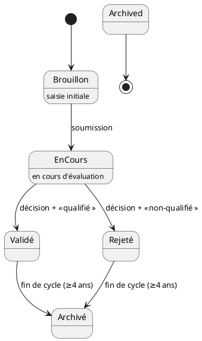

---  

## 4️⃣ Vue d’Interaction  

### 4.1 Diagramme de **Séquence** – *Recherche d’un dossier*  

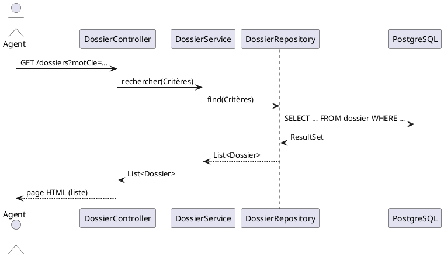

### 4.2 Diagramme de **Communication** – *Export BIRT*  

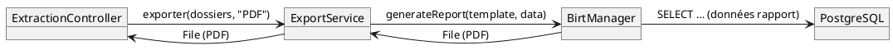

### 4.3 Diagramme d’**Overview d’Interaction** (optionnel) – *Scénario de livraison Docker*  

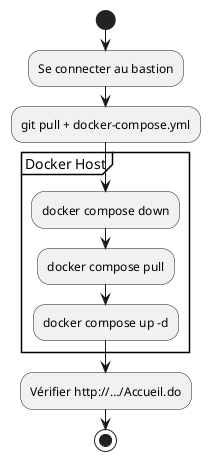

### 4.4 Diagramme de **Timing** (optionnel) – *Délai de mise à jour de l’index*  

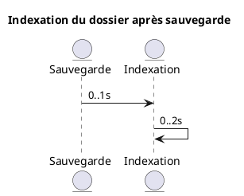

---  

## 5️⃣ Matrice de traçabilité UML  

| Élément | Class Diagram | Component Diagram | Deployment Diagram | Use‑Case | Activity | State‑Machine | Sequence |
|---|---|---|---|---|---|---|---|
| **Dossier** | ✔ | ✔ (DossierRepository) | ✔ (DB) | UC1