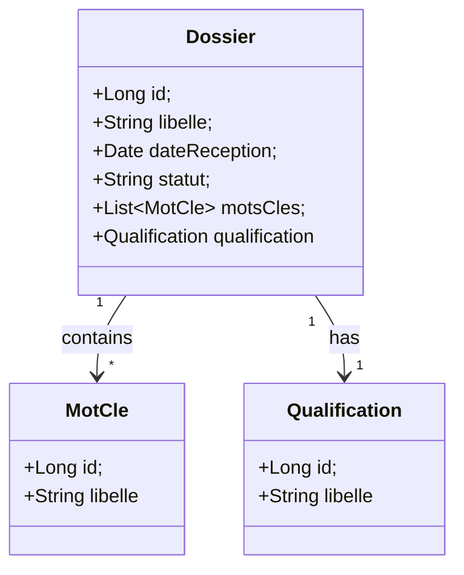
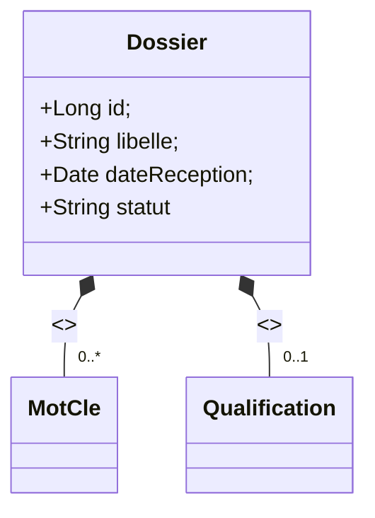

# Dossier d’Architecture Technique (DAT) – **SIREINES**  
**Version : 1.0 – 2024‑04‑27**  

---  

## 1️⃣ Introduction architecturale  

| Élément | Description |
|--------|-------------|
| **Objet** | Application métier de gestion du répertoire des experts et spécialistes scientifiques et techniques (SIREINES). |
| **Périmètre** | Front‑end web (Struts 2), couche métier (services Vertigo), persistance (PostgreSQL), reporting (BIRT), recherche plein‑texte (Elasticsearch), déploiement Docker. |
| **Sources** | - Code Java (src/main/java) <br> - Configuration Maven, Spring, Struts, Vertigo <br> - Scripts SQL (scripts DB) <br> - Documentation Wiki (déploiement, procédure, version) |
| **Public cible** | Architectes, développeurs, équipes d’exploitation, MOA, MOE, auditeurs de sécurité. |
| **Vue d’ensemble des diagrammes** | 13 diagrammes UML (class, component, deployment, object, package, composite‑structure, use‑case, activity, state‑machine, sequence, communication, interaction‑overview, timing). |
| **Organisation du document** | 1️⃣ Introduction – 2️⃣ Vue structurelle – 3️⃣ Vue comportementale – 4️⃣ Vue d’interaction – 5️⃣ Matrice de traçabilité – 6️⃣ Profils & stéréotypes – 7️⃣ Contraintes OCL – 8️⃣ Patterns – 9️⃣ Décisions – 🔟 Normes de modélisation. |

---  

## 2️⃣ Vue structurelle  

### 2.1 Diagramme de classes (obligatoire)  

```mermaid
%%{init: {'theme':'base','themeVariables':{'primaryColor':'#e0f7fa','edgeLabelBackground':'#ffffff','fontSize':12}}%%%%%%%%%%%%%%%%%%%%}%%
classDiagram
  %% Packages
  package "i2.application.sireines.boot" {
    class ApplicationServletContextListener <<component>>
    class SearchManagerInitializer <<component>>
    class PersistenceManagerInitializer <<component>>
  }
  package "i2.application.sireines.boot.manager" {
    class BirtManager <<interface>> 
    class BirtManagerImpl <<component>>
    class BirtMergerPlugin <<component>>
  }
  package "i2.application.sireines.controller" {
    class AbstractSireinesActionSupport <<abstract>>
    class AccueilAction;
    class ContactAction;
    class MentionsLegalesAction;
    class DossierDetailAction;
    class DossierRechercheAction;
    class Extraction01Action;
    class ImportFichierAction;
    class NavigationItem <<enumeration>>
    class Menu <<enumeration>>
    class OngletDossierEnum <<enumeration>>
  }
  package "i2.application.sireines.service" {
    class AgentsServices <<interface>>
    class AgentsServicesImpl <<component>>
    class DossiersServices <<interface>>
    class DossiersServicesImpl <<component>>
    class CommonServices <<interface>>
    class CommonServicesImpl <<component>>
    class ExtractionsServices <<interface>>
    class ExtractionsServicesImpl <<component>>
    class ImportsServices <<interface>>
    class ImportsServicesImpl <<component>>
    class ReferentielsServices <<interface>>
    class ReferentielsServicesImpl <<component>>
    class SeancesServices <<interface>>
    class SeancesServicesImpl <<component>>
  }
  package "i2.application.sireines.util" {
    class CsvExport;
    class StringUtils;
    class CerbereUtil;
    class FormatterAnnee
  }
  package "i2.application.sireines.domain.dossier" {
    class Dossier <<entity>>
    class MotCle <<entity>>
    class Qualification <<entity>>
  }
  package "i2.application.sireines.search" {
    class SearchManager <<component>>
  }

  %% Relations
  ApplicationServletContextListener --> SearchManagerInitializer : init
  SearchManagerInitializer --> SearchManager : reindexAll()
  BirtManager <|.. BirtManagerImpl
  BirtManagerImpl --> BirtMergerPlugin : uses
  AbstractSireinesActionSupport <|-- AccueilAction
  AbstractSireinesActionSupport <|-- ContactAction
  AbstractSireinesActionSupport <|-- MentionsLegalesAction
  AbstractSireinesActionSupport <|-- DossierDetailAction
  AbstractSireinesActionSupport <|-- DossierRechercheAction
  AbstractSireinesActionSupport <|-- Extraction01Action
  AbstractSireinesActionSupport <|-- ImportFichierAction
  AccueilAction --> Menu : provides
  DossierDetailAction --> DossiersServices : uses
  DossierRechercheAction --> DossiersServices : uses
  Extraction01Action --> ExtractionsServices : uses
  ImportFichierAction --> ImportsServices : uses
  DossiersServicesImpl --> Dossier : manages
  DossiersServicesImpl --> MotCle : manages
  DossiersServicesImpl --> Qualification : manages
  CommonServicesImpl --> StringUtils : uses
  CsvExport ..> StringUtils : uses
  SearchManager --> "Elasticsearch" : embedded
  Dossier --> "MotCle" : contains
  Dossier --> "Qualification" : has

  %% Legend
  class <<entity>> {<font color="#ff7f50">Entity métier (persisté)</font>}
  class <<interface>> {<font color="#90caf9">Interface métier / service</font>}
  class <<component>> {<font color="#a5d6a7">Implémentation (Spring bean)</font>}
  class <<abstract>> {<font color="#ffcc80">Classe abstraite (base d’action)</font>}
  class <<enumeration>> {<font color="#ce93d8">Enumération (navigation)</font>}
```

**Légende**  

| Stéréotype | Signification |
|------------|----------------|
| `<<entity>>` | Classe métier persistée (table DB) |
| `<<interface>>` | Contrat du service |
| `<<component>>` | Implémentation Spring bean |
| `<<abstract>>` | Classe de base pour les actions Struts2 |
| `<<enumeration>>` | Enumération de navigation ou de configuration |

**Version du diagramme** : 1.0 – 2024‑04‑27  

---

### 2.2 Diagramme de composants (obligatoire)

```mermaid
%%{init: {'theme':'base','themeVariables':{'primaryColor':'#e8f5e9','edgeLabelBackground':'#ffffff','fontSize':12}}%%%%%%%%%%%%%%%%%%%%}%%
graph TB
  subgraph "Docker Host"
    subgraph "Container: sireines‑app (Tomcat 7)"
      A1[Web‑UI (Struts2) <br/> JSP/FTL]:::ui;
      A2[Controller Layer]:::ctrl;
      A3[Service Layer]:::svc;
      A4[SearchManager (Elasticsearch‑embedded)]:::search;
      A5[BIRT Reporting]:::birt;
    end
    subgraph "Container: sireines‑db (PostgreSQL 14)"
      DB[(PostgreSQL DB)]:::db;
    end
    subgraph "Container: pgadmin (dpage/pgadmin4)"
      PGADMIN[(PgAdmin UI)]:::admin;
    end
  end

  %% Dependencies
  A1 --> A2
  A2 --> A3
  A3 --> DB
  A3 --> A4
  A3 --> A5
  A4 --> DB
  A5 --> DB
  PGADMIN --> DB

  classDef ui fill:#fff9c4,stroke:#fbc02d;
  classDef ctrl fill:#bbdefb,stroke:#1976d2;
  classDef svc fill:#c8e6c9,stroke:#388e3c;
  classDef search fill:#ffe0b2,stroke:#f57c00;
  classDef birt fill:#e1bee7,stroke:#7b1fa2;
  classDef db fill:#ffccbc,stroke:#d84315;
  classDef admin fill:#e0f7fa,stroke:#006064;
```

**Légende**  

| Couleur | Élément |
|---------|---------|
| `UI` (jaune) | Interface web (Struts2 / JSP / FTL) |
| `CTRL` (bleu) | Contrôleurs Struts2 (Action) |
| `SVC` (vert) | Services métiers (Spring beans) |
| `SEARCH` (orange) | Moteur de recherche (Elasticsearch) |
| `BIRT` (violet) | Génération de rapports |
| `DB` (rouge) | Base de données PostgreSQL |
| `ADMIN` (cyan) | Console d’administration PgAdmin |

**Version du diagramme** : 1.0 – 2024‑04‑27  

---

### 2.3 Diagramme de déploiement (obligatoire)

```mermaid
%%{init: {'theme':'base','themeVariables':{'primaryColor':'#e3f2fd','edgeLabelBackground':'#ffffff','fontSize':12}}%%%%%%%%%%%%%%%%%%%%}%%
deploymentDiagram
  node DockerHost {
    node "sireines‑app (Tomcat)" {
      artifact "sireines‑web‑*.war" as WAR;
      component "Struts2 MVC" as MVC;
      component "Spring Context" as Spring;
      component "SearchManager (Embedded ES)" as ES;
      component "BIRT Engine" as BIRT;
      WAR --> MVC;
      MVC --> Spring;
      Spring --> ES;
      Spring --> BIRT;
    }
    node "sireines‑db (PostgreSQL)" {
      database "PostgreSQL 14" as PGSQL;
    }
    node "pgadmin (dpage/pgadmin4)" {
      component "PgAdmin UI" as PGADMIN;
    }
    node "Docker Volume: sireines_db_vol" {
      artifact "Data files" as DBVOL;
    }
    node "Docker Volume: pgadmin_vol" {
      artifact "Config files" as PGADMINVOL;
    }
  }

  WAR -[Deploy]-> "sireines‑app"
  PGSQL -[Store]-> DBVOL
  PGADMIN -[Connect]-> PGSQL
  ES -[Uses]-> PGSQL
```

**Légende**  

| Symbole | Signification |
|---------|----------------|
| `node` | Machine ou conteneur Docker |
| `artifact` | Artefact binaire (WAR, volume) |
| `component` | Unité fonctionnelle déployée |
| `database` | Instance de SGBD |
| `-[Deploy]->` | Déploiement d’un artefact |
| `-[Store]->` | Persistance dans un volume |
| `-[Connect]->` | Connexion client‑serveur |

**Version du diagramme** : 1.0 – 2024‑04‑27  

---

### 2.4 Diagramme d’objets (optionnel) – Exemple d’une instance `Dossier`



**Version du diagramme** : 1.0 – 2024‑04‑27  

---

### 2.5 Diagramme de packages (obligatoire)

```mermaid
%%{init: {'theme':'base','themeVariables':{'primaryColor':'#e8eaf6','edgeLabelBackground':'#ffffff','fontSize':12}}%%%%%%%%%%%%%%%%%%%%}%%
packageDiagram
  package "i2.application.sireines" {
    package boot {
      [ApplicationServletContextListener]
      [SearchManagerInitializer]
    }
    package controller {
      [AbstractSireinesActionSupport]
      [AccueilAction]
      [ContactAction]
      [DossierDetailAction]
      [ImportFichierAction]
    }
    package service {
      package agents { [AgentsServices] }
      package dossiers { [DossiersServices] }
      package extractions { [ExtractionsServices] }
      package imports { [ImportsServices] }
      package referentiels { [ReferentielsServices] }
      package seances { [SeancesServices] }
      [CommonServices]
    }
    package util { [CsvExport] [StringUtils] }
    package domain { [Dossier] [MotCle] [Qualification] }
  }
  package "i2.io.vertigo.dynamo.search" {
    [SearchManager]
  }
  package "docker" {
    [sireines‑app] 
    [sireines‑db] 
    [pgadmin]
  }
```

**Version du diagramme** : 1.0 – 2024‑04‑27  

---

### 2.6 Diagramme de structure composite (optionnel) – Vue de `Dossier`  



**Version du diagramme** : 1.0 – 2024‑04‑27  

---  

## 3️⃣ Vue comportementale  

### 3.1 Diagramme de cas d’utilisation (obligatoire)

```mermaid
%%{init: {'theme':'base','themeVariables':{'primaryColor':'#fff3e0','edgeLabelBackground':'#ffffff','fontSize':12}}}%%
usecaseDiagram
  actor "Agent" as Agent
  actor "Gestionnaire" as Gest
  actor "Rapporteur" as Rap
  actor "Administrateur" as Admin