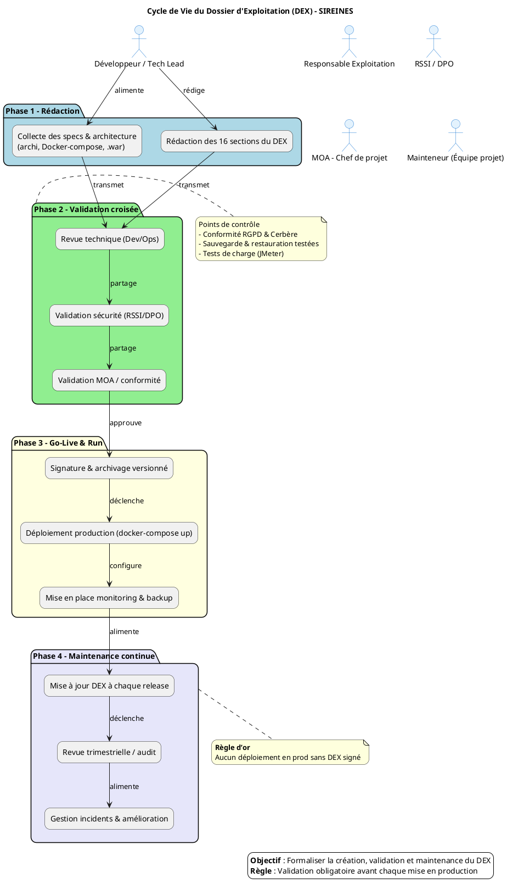

# 📘 DEX – SIREINES – Dossier d’Exploitation  
*Document de référence garantissant la continuité, la maintenabilité et la sécurisation de l’exploitation de l’application SIREINES en production.*  

---  

## 📚 Table des matières  
[TOC]  

---  

## 1️⃣ Introduction et objectifs  

| Objectif | ✅ |
|----------|----|
| **Assurer la continuité de service** | ✅ |
| **Documenter les procédures de gestion courante** | ✅ |
| **Faciliter le support et la résolution d’incidents** | ✅ |
| **Encadrer les responsabilités (Dev / Ops / Sécurité)** | ✅ |
| **Assurer la conformité (RGPD, CNIL, Cerbère)** | ✅ |
| **Accompagner la phase de transition `Build → Run`** | ✅ |

> **Document établi sur les principes de la transition Build → Run et des bonnes pratiques ITIL/DevOps pour l’exploitation applicative**  

---  

## 2️⃣ Contexte d’usage et périmètre  

| Champ | Valeur |
|------|--------|
| **Nom du service** | **SIREINES** |
| **Nature** | Application métier / Web (Java/J2EE) |
| **Environnement cible** | Production (IaaS – ECO4 – Paris‑La Défense) |
| **Stack technique** | Tomcat 7 (JDK 8), PostgreSQL 14 (alpine), Docker Compose, Maven 3, Struts 2, BIRT 4.3, Spring Framework, FreeMarker, SonarQube, Cerbère (authentification) |
| **SLA / SLO** | À définir (ex. : disponibilité 99,9 % mensuelle, temps de réponse < 2 s) |
| **Version actuelle (prod)** | **2.5.20** – déploiée le 12/03/2026 |
| **Contacts clés** | • **Vincent Letrouit** – Chef de bureau – CGDD/SRI/AST2 \<Vincent.Letrouit@developpement-durable.gouv.fr\>   • **Pascal Zemour** – Chargé de mission – CGDD/SRI/AST2 \<Pascal.Zemour@developpement-durable.gouv.fr\>   • **Infocentre BUN** – Support technique – CGDD/SDSED/BUN \<infocentre.bun.sdsed.cgdd@developpement-durable.gouv.fr\> |
| **Politiques de backup** | Sauvegarde quotidienne du volume Docker `/var/lib/postgresql/data` (dump *.sql) conservée 30 jours + archivage hebdomadaire sur site de secours. |
| **Politiques de sécurité** | Authentification via **Cerbère** (RGPD, CNIL n°1034232), chiffrement TLS 1.2 sur HTTP S, contrôle d’accès RBAC, mise à jour mensuelle des images Docker. |
| **Périmètre fonctionnel** | Gestion des dossiers d’expertise, suivi des comités de domaine, export BIRT, import/export via Talend, API interne de recherche Elasticsearch. |

> **Quand l’utiliser**  
> - Avant chaque mise en production (go‑live)  
> - Pour la formation des équipes d’exploitation  
> - Comme référence lors d’audits de conformité ou de sécurité  

---  

## 3️⃣ Prérequis et jalons  

| ✅ | Action | Responsable | Commentaire |
|----|--------|--------------|-------------|
| [ ] | **Validation de l’architecture** (schémas réseau, volumes Docker) | Architecte / DevOps | Documenter dans `architecture_sireines.pdf` |
| [ ] | **Mise à jour des images Docker** (Tomcat 7, PostgreSQL 14) | DevOps | Vérifier les tags `latest` → `x.y.z` |
| [ ] | **Déploiement du fichier `.war`** (sireines‑web‑*.war) | DevOps | Copier dans le répertoire `docker/` avant `docker‑compose up`. |
| [ ] | **Configuration des secrets** (`.env` – DB user/pass, Cerbère token) | Sécurité | Stocker dans le coffre Vault, ne jamais versionner. |
| [ ] | **Plan de continuité** (scripts `docker‑compose restart`, bascule DR) | Ops | Test de bascule mensuel. |
| [ ] | **Signature du DEX** | Responsable DEX (MOA) | Aucun déploiement en prod sans signature. |

> **Jalon critique** : Le DEX doit être **validé et signé** *avant* chaque mise à jour de version en production. Aucun déploiement ne doit intervenir sans ce livrable.  

---  

## 4️⃣ Gouvernance et rôles  

| Rôle | Profil type | Responsabilité |
|------|-------------|----------------|
| **Rédacteur principal** | Tech Lead / DevOps | Rédaction, structuration, intégration des spécifications techniques. |
| **Validateur exploitation** | Responsable exploitation / Ops | Vérification de l’opérabilité, des procédures de backup & monitoring. |
| **Validateur sécurité / conformité** | RSSI / DPO | Validation des politiques de sécurité (Cerbère, RGPD, CNIL). |
| **Mainteneur** | Équipe projet / PO technique | Mise à jour continue à chaque release ou changement d’infrastructure. |
| **Approbare final** | MOA / Chef de projet | Signature officielle du DEX. |

---  

## 5️⃣ Structure détaillée du DEX (16 sections)  

| # | Section | Contenu attendu (extraits SIREINES) |
|---|----------|--------------------------------------|
| **1** | **Généralités** | Objet : DEX SIREINES – Prod ; Audience : équipes Ops, Sec, Dev, MOA; Version : 2.5.20 (12/03/2026). |
| **2** | **Documents applicables et de référence** | - `docker-compose.yml` (version : 2025‑05‑23)   - `settings.xml` (Maven)   - `sireines‑web‑*.war`   - Procédures de déploiement (`DeploiementApplicatif/*.md`)   - Politique de backup (`backup_policy.md`) |
| **3** | **Terminologie** | *Docker‑compose*, *container*, *image*, *volume*, *war*, *BIRT*, *Cerbère*, *RGPD*, *CNIL*. |
| **4** | **Spécificités** | - **SLA cible** : disponibilité ≥ 99,9 %   - **Statistiques d’usage** : 84 % SELECT, 10 % INSERT, 4 % UPDATE   - **Déclaration CNIL** : 29/09/2014 (n° 1034232). |
| **5** | **Architecture** | Diagramme (à l’annexe) :   - **Docker‑host** (ECO4)   - **Containers** : `sireines-app`, `sireines-db`, `sireines-pgadmin`   - **Volumes** : `sireines_db_sireines_vol`, `sireines_pgadmin_sireines_vol`   - **Flux** : HTTP S ↔ Tomcat ↔ Servlet ↔ PostgreSQL ↔ BIRT ↔ Elasticsearch. |
| **6** | **Serveurs** | - **Host** : `iiaas-xyz.e2.rie.gouv.fr` (Linux Ubuntu 22.04)   - **OS** : Ubuntu 22.04 LTS   - **CPU / RAM** : 4 vCPU / 8 GiB (minimum)   - **Ports** : 8080 (Tomcat), 5432 (PostgreSQL), 8888 (pgAdmin). |
| **7** | **Application** | - **Artefact** : `sireines-web-<version>.war`   - **Framework** : Struts 2, Spring 4, Vertigo 2   - **Paramètres** : `application-config.xml`, `sireines‑auth‑config.xml` (Cerbère). |
| **8** | **Supervision & métrologie** | - **Prometheus + Grafana** (Docker‑compose) : métriques Tomcat, PostgreSQL, Docker‑engine.   - **Alertes** : CPU > 80 % 5 min, DB latence > 500 ms, container `sireines‑app` down.   - **Logs** : `catalina.out`, `postgres.log` (centralisés via ELK). |
| **9** | **Sauvegarde** | - **Dump quotidien** (`pg_dump`) automatisé via `cron` dans le volume `sireines_db_sireines_vol`.   - **Rétention** : 30 jours (daily) + 4 semaines (weekly) + 1 mois (monthly). |
| **10** | **Stockage** | - **Volumes Docker** : `sireines_db_sireines_vol` (≈ 10 GiB)   - **Chemins** : `/var/lib/postgresql/data`, `/var/lib/pgadmin`. |
| **11** | **Inventaire des bases** | - **DBMS** : PostgreSQL 14 (alpine)   - **Schéma** : `public` (tables `dossier`, `qualification`, `agent`, …)   - **Comptes** : `sireines` (app), `postgres` (admin). |
| **12** | **Flux inter‑applicatifs** | - **API interne** : `REST` / `JSON` pour recherche (Elasticsearch).   - **Export BIRT** : PDF/CSV via `sireines-web` → `birt‑engine`. |
| **13** | **Plan de production** | - **Cron** : `0 2 * * * docker exec sireines-db pg_dump …`   - **Maintenance** : `docker‑compose down` (fenêtre 02:00‑03:00). |
| **14** | **Sécurisation des images** | - **Scan** : Trivy (CI → pipeline)   - **Hardening** : utilisateur non‑root, `COPY --chown=root:root`. |
| **15** | **Opérations courantes** | - **Checklist démarrage** : vérifier conteneurs, logs, alertes.   - **Gestion des incidents** : procédure `INC‑SIREINES‑001` (défaillance Tomcat). |
| **16** | **Opérations récurrentes** | - **Rotation des logs** : logrotate (weekly).   - **Renouvellement des certificats** : Let's Encrypt (90 jours).   - **Revue mensuelle** : conformité Cerbère, sauvegarde, KPI. |

---  

## 6️⃣ Diagramme PlantUML du cycle de vie DEX  

---  

## 7️⃣ Conseils de rédaction et de maintenance  

| Bonne pratique | À éviter |
|----------------|----------|
| Utiliser le **versioning Git** (`git tag v2.5.20‑dex`) et stocker le DEX dans le dépôt `sireines-doc` | Laisser le DEX en PDF isolé, non traçable |
| Rédiger des **procédures pas‑à‑pas** avec des commandes Docker exactes (`docker compose up -d`) | Utiliser des placeholders non remplis (`[À COMPLÉTER]`) |
| Inclure des **captures d’écran** (ex. : `docker ps`, page d’accueil) dans le DEX (répertoire `doc/screens/`) | Omettre les captures d’écran de validation |
| Vérifier **automatiquement** la conformité des images (`trivy scan`) dans le CI | Oublier de mettre à jour les images Docker après chaque version |
| Lier le DEX aux **tickets de suivi** (GitLab MR, JIRA) | Ne pas tracer les changements de procédure |

---  

## 8️⃣ Adaptations contextuelles  

| Contexte | Adaptation recommandée |
|----------|------------------------|
| **Applications Cloud / Serverless** | Remplacer