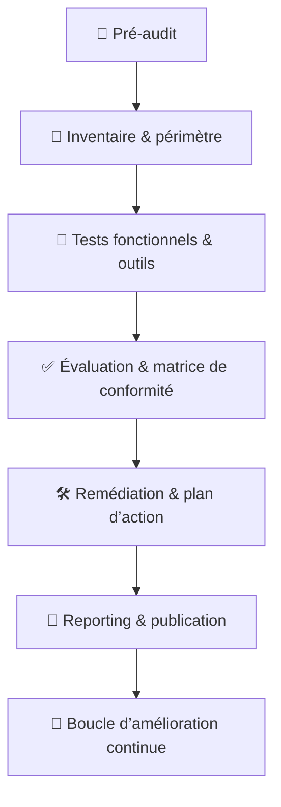
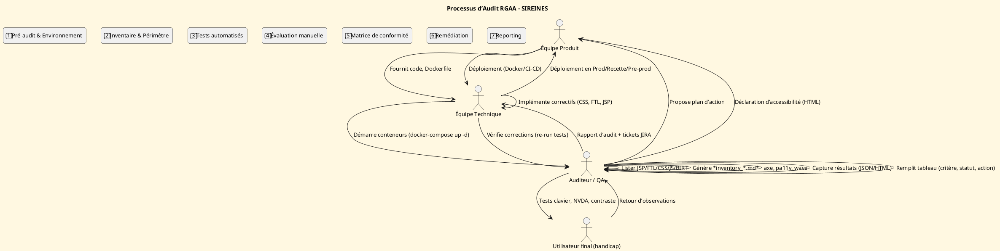

# 📑 Guide d’Audit d’Accessibilité RGAA 4.1+ – Projet **SIREINES**  
*Préparé pour un atelier de 3 h à destination des équipes produit, technique, UX & conformité.*

---  

## 1️⃣ Objectifs du guide  

| # | Objectif | Résultat attendu |
|---|----------|------------------|
| 🎯 | **Vérifier la conformité** du livrable SIREINES aux exigences du **RGAA 4.1+** (déclinaison française des WCAG 2.1/2.2). | Taux de conformité ≥ 75 % (seuil légal) – idéal = 100 % (cible SIG). |
| 📋 | **Produire** une matrice de conformité / check‑list exploitable par les équipes. | Document partagé (MD/Excel) listant chaque critère, son statut, observations et actions. |
| 🛠️ | **Définir** les actions de remédiation prioritaires (quick‑wins, effort / impact). | Road‑map d’améliorations incrémentales. |
| 📊 | **Formaliser** le reporting d’audit (déclaration d’accessibilité, preuves, suivi). | Modèle de déclaration prêt à être publié. |
| 🔄 | **Intégrer** l’audit dans le cycle de **déploiement** (Docker, CI/CD, procédures de recette). | Processus ré‑utilisable à chaque livraison. |

---  

## 2️⃣ Cadre réglementaire & références RGAA  

| Niveau | Référence | Points clés |
|--------|------------|-------------|
| **Loi 2005‑102** | Obligation d’accessibilité des services publics en ligne. |
| **Décret 2019‑768** | Modalités de mise en conformité. |
| **Arrêté 2021‑04‑29** | RGAA 4.1 (critères 1‑84). |
| **Directive UE 2016‑2102** | Accessibilité des sites publics de l’UE. |
| **RGAA 4.1** | 13 thèmes, 84 critères, **seuil 75 %** (minimum) – **100 %** cible SIG. |

---  

## 3️⃣ Périmètre technique du projet SIREINES  

> **Arborescence clé (extraits) :**

```
sireines/
├─ sireines-web/
│   ├─ src/
│   │   ├─ main/
│   │   │   ├─ java/…                ← contrôleurs Struts2 (ex. ContactAction.java)
│   │   │   └─ resources/
│   │   │       ├─ template/
│   │   │       │   ├─ simple/…      ← thèmes “simple” (checkbox.ftl, css.ftl, …)
│   │   │       │   ├─ simple_read/… ← version “read‑only”
│   │   │       │   ├─ xhtml/…       ← thème principal (form.ftl, label.ftl, …)
│   │   │       │   └─ xhtml_read/…  ← version read‑only du thème xhtml
│   │   │       └─ static/css/…     ← CSS (bootstrap, sireines.css, …)
│   └─ src/main/webapp/
│       ├─ jsp/…                    ← pages JSP (ex. contact.jsp, dossierDetail.jsp)
│       ├─ index.html                ← redirection vers Accueil.do
│       └─ static/…                  ← assets JS/CSS/images
├─ sireines-docker/
│   └─ Dockerfile / docker‑compose.yml
└─ … (scripts DB, Talend reports, documentation, …)
```

**Points d’entrée à auditer**  

| Catégorie | Fichiers / Dossiers concernés |
|-----------|------------------------------|
| **Pages JSP** | `src/main/webapp/jsp/**/*.jsp` (ex. `contact.jsp`, `dossierDetail.jsp`, `extractions/*.jsp`, `include/*.jsp`). |
| **Templates FTL** | `src/main/resources/template/**/*.ftl` (xhtml, simple, simple_read). |
| **CSS** | `src/main/webapp/static/css/*.css` (`bootstrap*.css`, `sireines.css`, `error.css`). |
| **BIRT reports** | `sireines-talend/reports/**/*.rptdesign` (ex. `04_extraction_totale.rptdesign`). |
| **Scripts d’initialisation** | `Dockerfile`, `docker‑compose.yml` (pour déployer un environnement test). |
| **Configuration Spring / Struts** | `src/main/resources/META-INF/*.xml` (ex. `application-config.xml`, `sireines-auth-config.xml`). |
| **Assets JS** | `src/main/webapp/static/js/*.js` (ex. `kit-ajax.js`, `sirenes.js`). |

---  

## 4️⃣ Méthodologie d’audit – Processus en 5 étapes  



### 4.1 🔎 Pré‑audit (15 min)

1. **Rassembler** les livrables : code source, Dockerfile, `docker‑compose.yml`, scripts de CI (`.gitlab-ci.yml`).  
2. **Définir** le périmètre : production + pré‑prod + recette (voir section 3).  
3. **Préparer** l’environnement de test :  
   ```bash
   cd /opt/app
   cp docker-compose.yml docker-compose.yml.$(date +%Y%m%d)
   docker compose up -d          # démarre les conteneurs (app, db, pgadmin)
   ```  
   → Accéder à `http://localhost:8080/Accueil.do` (ou URL de recette).  

### 4.2 📂 Inventaire & périmètre (30 min)

| Élément | Action | Livrable |
|--------|--------|----------|
| JSP | Lister tous les fichiers `*.jsp` via `git ls-files "**/jsp/**/*.jsp"` | `inventory_jsp.md` |
| FTL | Lister les thèmes (`simple`, `simple_read`, `xhtml`, `xhtml_read`) | `inventory_ftl.md` |
| CSS/JS | Lister les assets CSS/JS | `inventory_assets.md` |
| BIRT | Lister les rapports | `inventory_birt.md` |
| DB | Identifier les scripts de schéma (`*.sql` dans `sireines-database/script`) | `inventory_db.md` |

### 4.3 🧪 Tests fonctionnels & outils (45 min)

| Outil | Usage RGAA | Exemple de commande |
|-------|------------|----------------------|
| **axe‑core (Chrome)** | Vérification rapide des critères 1‑29, 30‑36, 41‑44, 50‑55, 60‑62, 71‑73. | `npm i -g @axe-core/cli && axe http://localhost:8080/Accueil.do` |
| **pa11y** | Automatisation de tests d’accessibilité sur toutes les URLs. | `pa11y http://localhost:8080/Accueil.do --reporter html > pa11y_report.html` |
| **wave** (extension) | Analyse visuelle (contraste, alt, ARIA). | Ouvrir la page dans Chrome → Wave. |
| **NVDA** (Windows) ou **VoiceOver** (macOS) | Tests d’usage clavier & lecteur d’écran. | Navigation clavier sur chaque formulaire. |
| **HTML‑Validator** (W3C) | Vérifier la validité du HTML généré (ex. `contact.jsp`). | `vnu --format json src/main/webapp/jsp/accueil/contact.jsp` |
| **CSS‑Validator** | Contraste de couleur, usage de `!important`. | `stylelint src/main/webapp/static/css/*.css` |

> **Note** : chaque outil couvre un sous‑ensemble de critères RGAA. Croisez les résultats pour atteindre la couverture totale.

### 4.4 ✅ Évaluation & matrice de conformité (45 min)

1. **Créer** la matrice :  

```markdown
| Thème | Critère RGAA | Fichier | Statut | Observation | Action | Priorité |
|-------|--------------|----------|--------|------------|--------|----------|
| Perceptible – Images | 1.1 – Texte alternatif | jsp/accueil/contact.jsp (logo) | ❌ | `alt=""` manquant | Ajouter `alt="Logo SIREINES"` | P1 |
| Navigable – Clavier | 7.1 – Navigation au clavier | template/xhtml/form.ftl | ✅ | OK | – | – |
| … | … | … | … | … | … | … |
```

2. **Remplir** le tableau en s’appuyant sur les sorties d’axe/pa11y + les tests manuels.  
3. **Calculer** le taux :  
   ```text
   Taux = (Nb critères conformes / Nb critères applicables) × 100
   ```
   - **Objectif pré‑prod** ≥ 80 % (quick‑wins).  
   - **Cible SIG** = 100 % (tous les critères).  

### 4.5 🛠️ Remédiation & plan d’action (30 min)

| Priorité | Impact | Effort | Exemple d’action |
|----------|--------|--------|------------------|
| **P1 – Quick‑wins** | Fort | Faible | - Ajouter `alt` sur toutes les images (`*.jsp`, `*.ftl`).<br>- Corriger les contrastes (`#000` sur `#fff` dans `sireines.css`). |
| **P2 – Corrections majeures** | Fort | Moyen | - Implémenter le focus visible sur les éléments interactifs (`:focus-visible` dans CSS).<br>- Ajouter des rôles ARIA (`role="navigation"` sur le menu). |
| **P3 – Améliorations** | Modéré | Élevé | - Refactoriser les templates `simple_read` pour éviter les `tabindex="-1"` inutiles.<br>- Repenser la pagination des tableaux BIRT (ajout d’en‑têtes de colonne). |
| **P4 – Refactorisation** | Faible | Élevé | - Uniformiser les balises `label` (`for` → id du champ).<br>- Centraliser les messages d’erreur dans un composant dédié. |

#### 4.5.1 Exemple de correctif – Image sans texte alternatif  

*Fichier :* `src/main/webapp/jsp/accueil/contact.jsp`  

```jsp
<!-- Avant -->


<!-- Après -->

```

#### 4.5.2 Exemple de correctif – Contraste insuffisant  

*Fichier :* `src/main/webapp/static/css/sireines.css`  

```css
/* Avant */
.btn-primary { background:#e0e0e0; color:#666; }

/* Après (contraste ≥ 4.5:1) */
.btn-primary { background:#0066cc; color:#fff; }
```

### 4.6 📄 Reporting & publication (30 min)

| Document | Contenu | Format |
|----------|---------|--------|
| **Déclaration d’accessibilité** | - Version du produit<br>- Taux de conformité<br>- Liste des critères non‑conformes avec justification/exemptions<br>- Moyens de signalement | `declaration-accessibilite.html` (déjà présent) – à mettre à jour. |
| **Rapport d’audit** | - Méthodologie<br>- Matrice de conformité (tableau complet)<br>- Plan d’action (priorités, responsables, échéances) | Markdown + PDF (export via `pandoc`). |
| **Ticket JIRA / GitLab Issue** | Chaque action de remédiation = ticket (label `RGAA`) | Lien direct depuis la matrice (`#`). |
| **Guide de test de régression** | Scénarios manuels (NVDA, navigation clavier) + scripts automatisés (axe/pa11y). | `tests/accessibility_test_plan.md`. |

> **Publication** : le fichier `declaration-accessibilite.html` doit être déployé sur le serveur (ex. `https://sireines.e2.rie.gouv.fr/declaration-accessibilite.html`) dès que le taux ≥ 75 %.

---  

## 5️⃣ Intégration au **cycle de livraison Docker / CI‑CD**

1. **Ajout d’une étape “accessibility‑test”** dans `.gitlab-ci.yml` (exemple : )  

```yaml
accessibility_test:
  stage: test
  image: node:18-alpine
  script:
    - npm i -g @axe-core/cli pa11y
    - docker compose -f docker-compose.yml up -d   # démarre l’app
    - sleep 30                                     # attente du boot
    - axe http://localhost:8080/Accueil.do > axe_report.txt
    - pa11y http://localhost:8080/Accueil.do --json > pa11y_report.json
  artifacts:
    paths:
      - axe_report.txt
      - pa11y_report.json
    expire_in: 1 week
  only:
    - merge_requests
    - master
```

2. **Intégrer le tableau de conformité** dans le *merge‑request* (ex. via commentaire automatisé).  

3. **Déclencher** le *pipeline de recette* (`docker‑compose up -d`) sur le serveur de **recette** (`sireinesrec`) : les étapes décrites en section 4.3 permettent de valider rapidement chaque livraison.  

4. **Mise à jour de la documentation** :  
   - Ajouter une section “Audit d’accessibilité” dans `Home.md` → lien vers le guide.  
   - Mettre à jour le wiki (`sireines.wiki.md`) avec le diagramme de processus (voir § 6).  

---  

## 6️⃣ Diagramme PlantUML – Processus d’audit d’accessibilité



---  

## 7️⃣ Checklist opérationnelle – “Ready‑to‑audit”  

| ✅ | Item | Commentaire |
|----|------|-------------|
| 1 | Cloner le dépôt `sireines` sur le poste de travail. | `git clone …` |
| 2 | Vérifier la présence du `Dockerfile` et du `docker‑compose.yml`. | `ls sireines-docker/` |
| 3 | Lancer le conteneur de test (sans VPN) : `docker compose up -d`. | Attendre 30 s. |
|