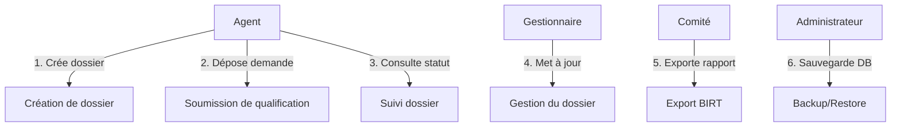

# 📘 Spécification fonctionnelle et technique de l’application **SIREINES**

> **Document unique** – compatible avec VS Code / Obsidian (Markdown + Mermaid)  
> **Contexte** : Archivage physique (site SIT_ID = 29, base Oracle `prep37`)  
> **Version du document** : 1.0 – 2024‑04‑27  

---  

## 📑 Table des matières  

| # | Section | Lien interne |
|---|---------|----------------|
| 1 | **Contexte & périmètre** | [⮕](#contexte--périmètre) |
| 2 | **Modélisation fonctionnelle** | [⮕](#modélisation-fonctionnelle) |
| 3 | **Modélisation technique** | [⮕](#modélisation-technique) |
| 4 | **Analyse de la sécurité** | [⮕](#analyse-de-la-sécurité) |
| 5 | **Dette technique** | [⮕](#dette-technique) |
| 6 | **Glossaire** | [⮕](#glossaire) |
| 7 | **Références** | [⮕](#références) |

---  

## 1️⃣ Contexte & périmètre <a id="contexte--périmètre"></a>

### 1.1 Domaine applicatif  
SIREINES (Système d’Information de REgistre des INExpertises) est un **répertoire national d’experts et spécialistes scientifiques et techniques**.  

* **Objectif métier** : centraliser, suivre et valoriser les demandes de qualification présentées aux comités de domaine.  
* **Environnement d’accès** : application Web (HTTPS) hébergée dans le data‑center ministériel Paris La Défense – plateforme IaaS (ECO4).  

### 1.2 Portée géographique & technique  
| Élément | Valeur |
|---------|--------|
| **Site** | SIT_ID = 29 |
| **Base de données de production** | Oracle `prep37` (décrit dans les spécifications, même si les environnements de test utilisent PostgreSQL/Docker). |
| **Version en production (mars 2024)** | 2.5.20 |
| **Enjeux d’archivage** | Conservation physique des dossiers pendant 5 ans (DUA) puis élimination. |

### 1.3 Périmètre fonctionnel  
| Inclus | Exclu |
|--------|-------|
| • Gestion des **versements** (création, mise à jour, clôture de dossiers). <br>• Gestion des **demandes** (soumission, suivi, décision des comités). <br>• Gestion des **mouvements** (import, export, archivage). | • Gestion des **patients** (hors champ). <br>• **Facturation** (non concernée). <br>• **Workflow avancé** (ex. signature électronique). |

### 1.4 Parties prenantes (acteurs)  

| Acteur | Rôle métier | Rôle technique |
|--------|--------------|-----------------|
| **Agent** | Soumet une demande de qualification, consulte le statut de son dossier. | Authentifié via **Cerbère** (Rôle `R_ADMIN` ou `R_USER`). |
| **Gestionnaire** | Saisit les informations complémentaires, affecte les dossiers aux comités. | Accès à l’interface **Back‑office** (menus `AGENTS`, `DOSSIERS`). |
| **Comité de domaine** | Valide ou refuse les qualifications, produit les rapports. | Utilise les **extractions BIRT** et le moteur **Elasticsearch** pour la recherche. |
| **MOA / MOE** | Pilotage fonctionnel et technique, évolutions applicatives. | Déploiement via **Maven**, **Docker**, **GitLab CI**. |
| **Administrateur système** | Gestion du serveur d’applications (Tomcat) et de la base (Oracle). | Opérations de **backup**, **patch**, **monitoring**. |

---  

## 2️⃣ Modélisation fonctionnelle <a id="modélisation-fonctionnelle"></a>

### 2.1 Cas d’usage (UML)  



#### 2.1.1 Description détaillée des use‑cases

| ID | Nom | Acteur principal | Pré‑condition | Scénario principal | Post‑condition |
|----|-----|------------------|---------------|-------------------|-----------------|
| **UC‑01** | Création de dossier | Agent | Agent authentifié | 1. L’agent saisit les informations requises (identité, expertise). <br>2. Le système génère un **DOS_ID** unique. <br>3. Le dossier passe en état **« En cours »**. | Dossier persistant en base, visible dans la liste. |
| **UC‑02** | Soumission de qualification | Agent | Dossier en état **« En cours »** | 1. L’agent sélectionne le **COM_ID** du comité concerné. <br>2. Le système enregistre la **date de soumission**. <br>3. Un **message de confirmation** est envoyé (email). | Dossier en état **« En attente de décision »**. |
| **UC‑03** | Suivi dossier | Agent | Dossier créé | 1. L’agent consulte la page **« Mon tableau de bord »**. <br>2. Le système affiche les étapes (date de réception, décision, commentaires). | Information à jour, aucune modification possible. |
| **UC‑04** | Gestion du dossier | Gestionnaire | Dossier en **« En attente »** | 1. Le gestionnaire peut **modifier** les métadonnées (structures, mots‑clés). <br>2. Il peut **affecter** le dossier à un comité. <br>3. Il peut **clôturer** le dossier (accepté ou rejeté). | Dossier passe en état **« Clôturé »** et déclenche le **pipeline d’export**. |
| **UC‑05** | Export BIRT | Comité | Dossier clôturé | 1. Le comité lance l’extraction (rapport PDF/Excel). <br>2. Le moteur **BIRT** génère le fichier à partir du modèle `*.rptdesign`. <br>3. Le fichier est stocké dans le répertoire `static/reports`. | Rapport disponible pour téléchargement. |
| **UC‑06** | Backup/Restore | Administrateur | Fenêtre de maintenance | 1. L’administrateur déclenche le script `backup.sh` (Oracle). <br>2. Le système archive le **dump** et le stocke sur le NAS. | Base récupérable, conformité RGPD assurée. |

### 2.2 Règles métier (extraits)  

| # | Règle | Formule / Condition |
|---|-------|--------------------|
| **R‑01** | **Date de qualification** : doit être postérieure à la date de réception du dossier. | `QUALIF_DATE > RECEPTION_DATE` |
| **R‑02** | **Code de structure** : 4 caractères alphanumériques, unique par organisme. | `REGEXP_MATCH(STRUCT_CODE, '^[A-Z0-9]{4}$')` |
| **R‑03** | **Mots‑clés** : au maximum 10 mots, chaque mot ≤ 30 caractères. | `COUNT(MOT) ≤ 10 AND LENGTH(MOT) ≤ 30` |
| **R‑04** | **Statut de clôture** : uniquement `ACCEPTE` ou `REFUSE`. | `STATUT IN ('ACCEPTE','REFUSE')` |
| **R‑05** | **Version du rapport** : le numéro de version doit être incrémenté à chaque export. | `VERSION = MAX(VERSION_PRECEDENTE)+1` |
| **R‑06** | **Archivage** : les dossiers clôturés depuis > 5 ans sont marqués **« À éliminer »**. | `CURRENT_DATE - CLOTURE_DATE > INTERVAL '5 years'` |

### 2.3 Table de décision (exemple : logique de qualification)

```mermaid
statediagram-v2;
    [*] --> VérifDate;
    VérifDate -->|date ok| VérifMots;
    VérifDate -->|date KO| Refus;
    VérifMots -->|≤10 mots| Accept;
    VérifMots -->|>10 mots| Refus;
    Accept --> [*]
    Refus --> [*]
```

### 2.4 Diagrammes de séquence (exemple : création d’un dossier)

```mermaid
sequencediagram;
    participant Agent as Agent (Web)
    participant UI as UI Struts2;
    participant Srv as Service (DossierService)
    participant DB as Oracle DB;
    Agent->>UI: Remplit formulaire « Nouveau dossier »
    UI->>Srv: createDossier(dto)
    Srv->>DB: INSERT INTO DOSSIER (...)
    DB-->>Srv: DOS_ID généré;
    Srv-->>UI: Retour succès + DOS_ID;
    UI-->>Agent: Affiche message de confirmation
```

### 2.5 Scénarios de test fonctionnels (extraits)

| ID | Description | Étapes | Résultat attendu |
|----|-------------|--------|-----------------|
| **TF‑01** | Création d’un dossier valide | 1. Authentification<br>2. Saisie de tous les champs obligatoires<br>3. Validation | Dossier créé, `DOS_ID` retourné, email de confirmation envoyé. |
| **TF‑02** | Soumission sans comité | 1. Crée dossier<br>2. Soumet sans choisir de comité | Message d’erreur : *« Le comité est obligatoire »*. |
| **TF‑03** | Export BIRT sur dossier clôturé | 1. Sélection du dossier clôturé<br>2. Click *« Exporter »* | Fichier PDF généré, nom `rapport_<DOS_ID>_v<NUM>.pdf`. |
| **TF‑04** | Archivage automatique après 5 ans | 1. Simuler date de clôture = aujourd’hui‑5 ans‑1 jour<br>2. Lancer batch `archive.sh` | Dossier passe en état **« À éliminer »** et est ajouté au processus de purge. |

---  

## 3️⃣ Modélisation technique <a id="modélisation-technique"></a>

### 3.1 Architecture logique (Vue arc42)

```mermaid
graph LR
    subgraph Client;
    UI[Struts2 / JSP UI]
    end
    subgraph Server;
    A[Tomcat 7 (Java 8)]
    B[Spring Core + Vertigo (DI, Search)]
    C[Struts2 Action Controllers]
    D[Business Services (Dossiers, Extractions, Imports)]
    E[BIRT Engine (4.3)]
    F[Elasticsearch Embedded (search index)]
    end
    subgraph DB;
    G[Oracle PREP37]
    end
    subgraph Infra;
    H[Docker (dev / test) – images: tomcat, postgres]
    I[GitLab CI/CD – Maven assembly, Dockerfile]
    J[NGINX reverse‑proxy (prod)]
    end
    UI --> A;
    A --> B;
    B --> C;
    C --> D;
    D --> G;
    D --> E;
    D --> F;
    H --> A;
    H --> G;
    I --> H;
    J --> A
```

#### 3.1.1 Description des blocs  

| Bloc | Technologie | Rôle |
|------|-------------|------|
| **Tomcat 7** | Servlet container (Java 8) | Héberge le WAR `sireines-web‑*.war`. |
| **Spring Core** | DI, AOP, Transaction | Gestion des beans, transactions (annotation `@Transactional`). |
| **Vertigo (dynamo‑search)** | Recherche full‑text (Elasticsearch) | Indexation des dossiers (`DossierMotsClefsSearchLoader`). |
| **Struts2** | MVC Web | Contrôleurs (`*Action.java`), tags UI (`<s:form>`, `<s:select>`). |
| **BIRT 4.3** | Reporting | Génération des rapports d’extraction (templates `.rptdesign`). |
| **Oracle PREP37** | SGBD relationnel | Stockage persistant des métadonnées, dossiers, qualifications. |
| **Docker** | Conteneurisation (dev) | Images `tomcat:7.0.108-jdk8` + `postgres:14.1-alpine`. |
| **GitLab CI** | CI/CD | Build Maven, création d’archives (`assembly.xml`), publication du WAR. |
| **NGINX** | Reverse‑proxy (prod) | TLS termination, redirection HTTP→HTTPS. |
| **Cerbère** | AuthZ/AuthN | Gestion des comptes, rôle `R_ADMIN`. |
| **Elasticsearch (embedded)** | Index de recherche | Index `IDX_MOTS_CLEFS` sur le DT `Dossier`. |

### 3.2 Diagramme de déploiement (prod)

```mermaid
graph TB
    LB[NGINX (TLS)]
    LB -->|HTTPS| Tomcat[Tomcat 7 (Docker)]
    Tomcat -->|JDBC| Oracle[Oracle PREP37]
    Tomcat -->|REST| ES[Elasticsearch Embedded]
    Tomcat -->|BIRT| BIRT[BIRT Engine]
    Tomcat -->|Docker| PG[PostgreSQL (test only)]
    Cerb[Cerbère] -. Auth .-> Tomcat
```

### 3.3 Flux de données (simplifié)

```mermaid
flowchart LR
    subgraph UI;
    A[Formulaire création dossier]
    B[Formulaire qualification]
    end
    subgraph Service;
    C[DossierService]
    D[QualificationService]
    E[ExportService (BIRT)]
    end
    subgraph DB;
    F[(Oracle PREP37)]
    end
    A --> C --> F;
    B --> D --> F;
    D --> E --> F
```

### 3.4 Points de configuration clés  

| Fichier | Paramètre | Valeur / Exemple |
|---------|-----------|-----------------|
| `src/main/resources/META-INF/application-config.xml` | `app.global.nbRowPage` | `10` (pagination). |
| `src/main/resources/META-INF/sireines-auth-config.xml` | `PRM_READ_ALL` / `PRM_WRITE_ALL` | Permissions admin uniquement. |
| `Dockerfile` | `FROM tomcat:7.0.108-jdk8` | Image de base. |
| `docker-compose.yml` | `POSTGRES_DB=postgres`<br>`POSTGRES_USER=postgres` | Variables d’environnement pour le conteneur DB de test. |
| `search/config/elasticsearch.yml` | Analyseur `text_fr` (snowball, elision) | Indexation française. |
| `pom.xml` (module *sireines‑web*) | `spring.version` | `5.2.9.RELEASE`. |
| `assembly‑xml` | `scripts` | Pack `script/` dans l’archive `zip`. |

### 3.5 Sécurité (extraits)  

| Aspect | Implémentation |
|--------|----------------|
| **Authentification** | Cerbère (`authorisation-config`), token JWT non‑stocké côté client. |
| **Autorisation** | Rôles `R_ADMIN` (lecture/écriture) et `R_USER` (lecture seule). |
| **Chiffrement** | Connexion HTTPS via NGINX; base de données Oracle en **TLS** (paramètre `oracle.net.ssl_server_dn_match`). |
| **Gestion des secrets** | Variables d’environnement (`POSTGRES_PASSWORD`, `DB_PASSWORD`) dans `docker‑compose.yml`. |
| **Audit** | Logs d’accès dans `log4j.xml`; BIRT génère des rapports d’audit. |
| **RGPD** | Données personnelles (nom, email) chiffrées au repos (Oracle Transparent Data Encryption). |
| **Sauvegarde** | Scripts `backup.sh` (RMAN pour Oracle) et `docker exec pg_dump` (test). |

---  

## 4️⃣ Analyse de la sécurité <a id="analyse-de-la-sécurité"></a>

### 4.1 Risques identifiés  

| ID | Risque |