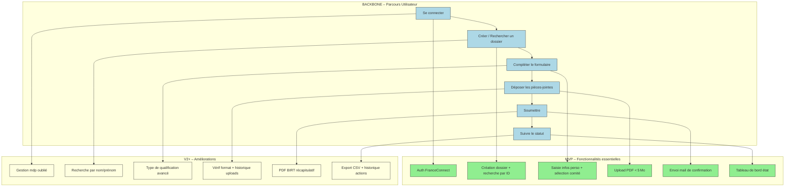

# 📘 Guide d’atelier **Story Mapping** – SIREINES  
*Document : `storymap_workshop_sireines.md`*  

> **Objectif** : Construire, avec l’équipe produit, une carte visuelle du périmètre fonctionnel de **SIREINES** (répertoire d’experts et spécialistes) en suivant la méthode *User Story Mapping* de Jeff Patton.  
> **Livrable** : Backbone + activities + ligne de découpe (MVP / V1) = Story Map prête à être exportée (photo ou export digital).  

---  

## 📑 Table des matières  

| # | Section | Ancre |
|---|---|---|
| 1 | Introduction & objectifs | [intro](#1-introduction--objectifs) |
| 2 | Contexte d’usage | [contexte](#2-contexte-dusage) |
| 3 | Pré‑requis | [prerequis](#3-prérequis) |
| 4 | Parties prenantes & rôles | [roles](#4-parties‑prenantes‑et‑rôles) |
| 5 | Logistique | [logistique](#5-logistique) |
| 6 | Déroulé détaillé de l’atelier | [deroule](#6-déroulé‑détaillé‑de‑latelier) |
| 7 | Conseils de facilitation | [facilitation](#7-conseils‑de‑facilitation) |
| 8 | Exemple de Story Map (SIREINES) | [exemple](#8-exemple‑de‑story‑map‑sireines) |
| 9 | Diagramme Mermaid (Backbone + MVP) | [mermaid](#9-diagramme‑mermaid‑backbone‑et‑mvp) |
| 10 | Adaptations contextuelles | [adaptations](#10-adaptations‑contextuelles) |
| 11 | Livrables & prochaines étapes | [livrables](#11-livrables‑et‑prochaines‑étapes) |
| 12 | Mini‑glossaire | [glossaire](#12-mini‑glossaire) |

---  

## 1️⃣ Introduction & objectifs <a id="intro"></a>

**Livrable attendu** : *Story Map* – une vue à la fois **horizontale** (parcours utilisateur) et **verticale** (granularité fonctionnelle).  

| Objectif | Pourquoi ? |
|----------|------------|
| **Comprendre collectivement le parcours cible** | Aligner tous les acteurs sur la même vision du flux « du premier clic au dernier état » |
| **Identifier les fonctionnalités nécessaires** | Découper le besoin en **Epics → User Stories** |
| **Prioriser pour définir le MVP** | Décider rapidement ce qui doit être livrable pour valider l’hypothèse métier |
| **Créer un artefact partagé** | Faciliter la communication avec les équipes techniques, le **MOA**, les **MOE** et les **experts métier** |

---  

## 2️⃣ Contexte d’usage <a id="contexte"></a>

| Élément | Valeur |
|---------|--------|
| **Produit** | **SIREINES** – répertoire national des experts et spécialistes scientifiques et techniques |
| **Domaines métier** | Transverse (gestion des demandes de qualification, suivi de dossiers, génération de courriers, rapports BIRT) |
| **Personas principaux** | <ul><li>**Agent** : soumet une demande de qualification.</li><li>**Responsable de comité** : examine, commente et valide.</li><li>**MOA / Chef de produit** : suit les indicateurs de performance.</li></ul> |
| **Contraintes majeures** | <ul><li>Déclaration CNIL (RGPD) – données à caractère personnel.</li><li>Déploiement Docker / IaaS (ECO4), version 2.5.x.</li><li>Statistiques BIRT, envoi de courriels, gestion de pièces jointes.</li></ul> |
| **Environnements** | Recette – `http://sireines.recette.pnm3.eco4.cloud.e2.rie.gouv.fr/`<br>Pré‑prod – `https://sireines.preprod.e2.rie.gouv.fr/Accueil.do`<br>Production – `https://sireines.e2.rie.gouv.fr/Accueil.do` |
| **Vision produit** | “Permettre à chaque **agent** de suivre en temps réel l’état de sa demande de qualification et aux **comités** de rendre des décisions rapides et traçables.” |

---  

## 3️⃣ Pré‑requis <a id="prerequis"></a>

| Élément | Action |
|---------|--------|
| Vision produit | Pitch, objectifs, métriques (ex. : temps moyen de validation < 5 jours). |
| Personas & Jobs‑to‑be‑Done | Synthèse des besoins (ex. : *« En tant qu’**agent**, je veux **déposer mon dossier** afin d’obtenir **une qualification** »). |
| Contraintes RGPD & techniques | Liste des champs PII, schéma de la base (`sireines-db`), variables d’environnement Docker (`POSTGRES_*`). |
| Accès aux environnements | Accès SSH via *Bastion* (alias : `sireinesrec`, `sireinesppr`, `sireinesprod`). |
| Outils de capture | Post‑it / feutres **ou** tableau blanc numérique (Miro, Mural, FigJam). |
| Temps disponible | **2 h 30 – 3 h** (inclut pause). |

> **⚡ Astuce** : Si un pré‑requis manque, bloquez 15 min en début d’atelier pour le co‑construire rapidement (ex. : clarification d’un persona).  

---  

## 4️⃣ Parties prenantes & rôles <a id="roles"></a>

| Rôle | Profil type | Responsabilité dans l’atelier |
|------|-------------|--------------------------------|
| **Animateur** | Chef de produit / PO | Facilite, garde le cadre, assure la participation de tous. |
| **Product Owner (MOA)** | Responsable métier (ex. : Vincent Letrouit) | Valide le périmètre fonctionnel, priorise les besoins. |
| **Technical Lead / Architecte** | DevOps / développeur senior (ex. : Matthieu Georges) | Vérifie la faisabilité technique, les dépendances (Docker, BIRT, PostgreSQL). |
| **UX / UI Designer** (optionnel) | Designer produit | Propose des patterns d’interaction (ex. : wizard de dépôt). |
| **Ops / Infra** | Responsable hébergement (ex. : SG/DNUM/PNM) | Apporte les contraintes d’infrastructure (volumes Docker, IaaS). |
| **Testeur fonctionnel** | QA | Identifie les critères d’acceptation (ex. : validation du mail de confirmation). |

> **💡 Remarque** : Plusieurs rôles peuvent être cumulés selon la disponibilité des participants.  

---  

## 5️⃣ Logistique <a id="logistique"></a>

| Élément | Détails |
|---------|---------|
| **Durée** | 2 h 30 – 3 h (pause à 1 h 30 si 3 h). |
| **Matériel physique** | Mur ou tableau blanc, post‑its (3 couleurs : épic = bleu, story = vert, critère = jaune), marqueurs. |
| **Matériel digital** | Miro / FigJam avec template : *Backbone → Epics → Stories* (pré‑chargé). |
| **Livrable de sortie** | Photo/export du tableau + **Diagramme Mermaid** (voir § 9) + liste des décisions MVP + points de vigilance. |
| **Environnement de travail** | Salle calme, disposition en U pour favoriser la visibilité du tableau. |

---  

## 6️⃣ Déroulé détaillé de l’atelier <a id="deroule"></a>

### 🎯 Étape 1 – Introduction (15 min)  
1. Accueil, tour de table rapide (nom, rôle).  
2. Rappel du **but** de l’atelier et des **règles** : écoute active, pas de jugement, chaque idée est la bienvenue.  
3. Présentation du **persona exemple** (ex. : *Agent*).  
   ```text
   En tant qu’agent,
   je veux déposer mon dossier de qualification,
   afin d’obtenir une réponse dans les meilleurs délais.
   ```

### 🗺️ Étape 2 – Backbone : le parcours utilisateur (30 min)  
1. **Question clé** : « Quelles sont les grandes étapes que suit l’utilisateur ? »  
2. Écrire chaque étape sur un post‑it (verbe d’action) et les placer **de gauche à droite**.  
3. Exemple de backbone pour SIREINES :  

| 1️⃣ | 2️⃣ | 3️⃣ | 4️⃣ | 5️⃣ | 6️⃣ |
|----|----|----|----|----|----|
| **Se connecter** | **Créer / Rechercher un dossier** | **Compléter le formulaire** | **Déposer les pièces‑jointes** | **Soumettre** | **Suivre le statut** |

4. Valider la séquence avec le PO / MOA.  

### 📋 Étape 3 – Détail vertical (45 min)  
Pour chaque étape du backbone :  

| Prompt | Exemple de réponses |
|--------|----------------------|
| *Que doit faire concrètement l’utilisateur ?* | « Saisir les informations personnelles », « Choisir le comité » |
| *Quelles données sont nécessaires ?* | Nom, prénom, fonction, références, fichiers PDF, etc. |
| *Quel est le point de friction potentiel ?* | Taille maximale du fichier, validation de la CNIL, délai de traitement. |
| *Quel comportement système doit se déclencher ?* | Envoi d’un e‑mail de confirmation, mise à jour du tableau de bord, génération du PDF BIRT. |

Placez chaque réponse **sous forme de post‑it** **verticalement** sous l’étape correspondante : du plus **essentiel** (en bas) au **détail** (en haut).  

### 🎚️ Étape 4 – Priorisation & ligne de découpe (30‑45 min)  

1. Dessinez une **ligne horizontale** au-dessus du backbone (la “ligne de flottaison”).  
2. **Au‑dessus** : fonctionnalités **indispensables** pour le **MVP** (ou V1).  
3. **En‑dessous** : fonctionnalités “nice‑to‑have” à planifier pour les versions ultérieures.  

| Critères de sélection | Questions à poser |
|-----------------------|-------------------|
| *Quel est le minimum pour que l’utilisateur atteigne son objectif ?* | “L’agent peut‑il déposer un dossier sans pièce jointes ?” |
| *Quelles fonctionnalités sont contraintes par la réglementation ?* | “Le mail de confirmation est obligatoire (RGPD).” |
| *Quelles dépendances techniques bloquent la mise en production ?* | “BIRT nécessite un serveur Tomcat ; le conteneur doit être présent.” |

### 🏁 Étape 5 – Conclusion & actions (15 min)  

1. Relire la Story Map **en commun** : vérifier cohérence et complétude.  
2. Noter :  
   - **Points de vigilance** (ex. : taille des uploads, conformité RGPD).  
   - **Questions ouvertes** (ex. : qui valide les pièces ? ).  
   - **Prochaines étapes** (ex. : rédaction du backlog, estimation).  
3. **Export** : photo du tableau + export du diagramme Mermaid (voir § 9).  
4. Partager le livrable **dans les 24 h** via le canal Slack #sireines‑story‑mapping.  

---  

## 7️⃣ Conseils de facilitation <a id="facilitation"></a>

| Bonnes pratiques | À éviter |
|------------------|----------|
| Reformuler régulièrement pour garantir la compréhension. | Se perdre dans les détails techniques (ex. : configuration Docker). |
| Faire participer **tous** les profils (MOA, dev, ops). | Laisser un seul profil monopoliser la discussion. |
| Utiliser le **time‑boxing** strict (ex. : 30 min par étape). | S’attarder indéfiniment sur une activité. |
| Ancrer chaque story dans un **Job‑to‑be‑Done** (verbe + bénéfice). | Confondre “nice‑to‑have” et “must‑have”. |
| Documenter immédiatement les décisions (MVP vs V2). | Reporter les décisions à la fin (risque d’oubli). |

---  

## 8️⃣ Exemple de Story Map – SIREINES <a id="exemple"></a>

> **Remplacez les crochets** (`[…]`) par les éléments réels de votre projet.  

```
Parcours utilisateur (Backbone) → 
[Se connecter] → [Créer / Rechercher un dossier] → [Compléter le formulaire] → 
[Déposer les pièces‑jointes] → [Soumettre] → [Suivre le statut]

Activités (verticales) :

Se connecter
 ├─ Authentifier via FranceConnect (MVP)
 ├─ Gestion du mot de passe oublié (V2)

Créer / Rechercher un dossier
 ├─ Saisir numéro d’identifiant (MVP)
 ├─ Recherche par nom / prénom (V2)
 ├─ Création d’un nouveau dossier (MVP)

Compléter le formulaire
 ├─ Saisie des informations personnelles (MVP)
 ├─ Sélection du comité de domaine (MVP)
 ├─ Indication du type de qualification (V2)

Déposer les pièces‑jointes
 ├─ Upload PDF (max 5 Mo) (MVP)
 ├─ Vérification du format (V2)
 ├─ Historique des uploads (V2)

Soumettre
 ├─ Validation côté serveur (MVP)
 ├─ Envoi d’un e‑mail de confirmation (MVP, RGPD)
 ├─ Génération du PDF de récapitulatif BIRT (V2)

Suivre le statut
 ├─ Tableau de bord avec couleur d’état (MVP)
 ├─ Historique des actions (V2)
 ├─ Export CSV des dossiers (V2)
```

---  

## 9️⃣ Diagramme Mermaid – Backbone + MVP <a id="mermaid"></a>



