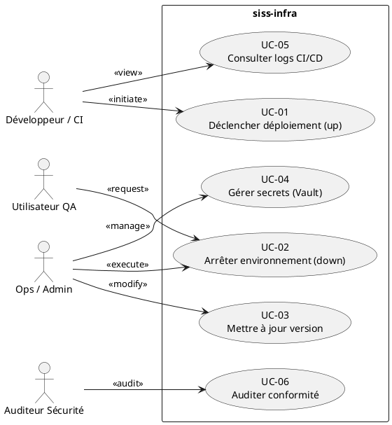
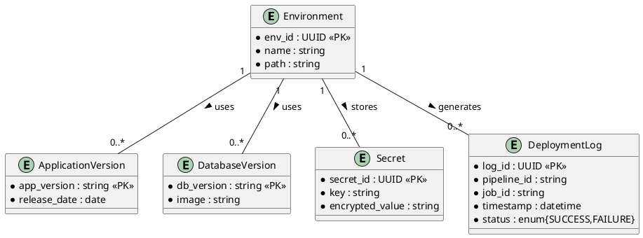

# 📘 Cahier des Charges Fonctionnel – **siss‑infra**  
[TOC]

---

## 1️⃣ Introduction et contexte du projet <a id="intro"></a>

| Élément | Description |
|---------|-------------|
| **Nom du projet** | **siss‑infra** – Infrastructure as Code (IaC) pour le déploiement des environnements applicatifs (pre‑prod, prod, recette). |
| **Organisation porteuse** | *Ambulon – Workplace‑Ambulon* (GitLab). |
| **Objectif stratégique** | Garantir la reproductibilité, la traçabilité et la sécurisation du déploiement d’applications conteneurisées via Docker‑Compose, pilotées par Ansible, sur l’ensemble des environnements de la chaîne de valeur (développement → recette → pré‑production → production). |
| **Enjeux clés** | - **Fiabilité** du démarrage/arrêt des conteneurs.<br>- **Gestion centralisée** des secrets et des versions d’applications/bases de données.<br>- **Automatisation** du pipeline CI/CD.<br>- **Conformité** aux exigences de sécurité (chiffrement des secrets, traçabilité des changements). |
| **Périmètre fonctionnel** | **Inclus** :<br>• Gestion des variables d’environnement (versions, secrets).<br>• Orchestration Docker‑Compose (up, down, remove‑orphan).<br>• Exécution des playbooks Ansible par environnement.<br>• Support des trois environnements (pre‑prod, prod, recette).<br>**Exclus** :<br>• Gestion du code applicatif (micro‑services, bases de données).<br>• Monitoring/alerting (hors du scope du présent CCF). |

---

## 2️⃣ Expression fonctionnelle du besoin (NF EN 16271) <a id="besoin"></a>

| # | Fonction de service (FS) | Description du besoin (quoi) | Critères d’appréciation (mesurables) | Pondération | Contraintes associées |
|---|--------------------------|-----------------------------|--------------------------------------|--------------|----------------------|
| **FS‑01** | **Déploiement automatisé d’un environnement** | L’utilisateur doit pouvoir déclencher, depuis le CI, le démarrage des conteneurs Docker‑Compose d’un environnement cible (pre‑prod, prod, recette). | • Temps moyen de déploiement ≤ 2 min.<br>• 100 % des conteneurs déclarés dans le fichier `docker‑compose.yml.j2` sont actifs.<br>• Aucun conteneur “orphan” après le lancement. | 20 % | • Utilisation de `docker compose up -d --remove-orphans`.<br>• Le répertoire `{{ app_path }}` doit être pré‑existant. |
| **FS‑02** | **Arrêt contrôlé d’un environnement** | L’utilisateur doit pouvoir arrêter proprement l’ensemble des conteneurs d’un environnement de test (recette). | • Temps moyen d’arrêt ≤ 1 min.<br>• Aucun conteneur résiduel (`docker ps` vide). | 10 % | • Utilisation de `docker compose down`. |
| **FS‑03** | **Gestion centralisée des versions d’application et de base de données** | Le système doit permettre de spécifier, versionner et récupérer les versions d’application (`appVersion`) et de base de données (`dbVersion`) par environnement. | • Version récupérée = version déclarée dans `vars/versions.yml`.<br>• Historique des versions conservé ≥ 30 jours. | 15 % | • Format `":<major>.<minor>.<patch>"` (ex. `:6.4.0`). |
| **FS‑04** | **Sécurisation et injection des secrets** | Les secrets (mots de passe, tokens) doivent être stockés chiffrés et injectés de façon transparente dans les conteneurs. | • Secrets chiffrés via Ansible Vault (`$ANSIBLE_VAULT`).<br>• Aucun secret en clair visible dans le dépôt. | 25 % | • Accès aux fichiers `vars/secrets.yml` limité aux comptes disposant de la clé Vault. |
| **FS‑05** | **Paramétrage d‑infrastructure par fichier de configuration** | L’opérateur doit pouvoir adapter les paramètres d’infrastructure (chemins, ports, variables) via les fichiers `*.properties` et les templates Jinja2. | • Modifications appliquées sans erreur de syntaxe.<br>• Validation de la configuration via `ansible‑lint` (score ≥ 90 %). | 10 % | • Respect du format `key=value`. |
| **FS‑06** | **Traçabilité du processus CI/CD** | Chaque exécution du playbook doit être journalisée et liée à la pipeline GitLab. | • Log complet disponible dans GitLab CI artefacts.<br>• Correlation `pipeline_id → playbook_run_id`. | 10 % | • Utilisation de variables d’environnement GitLab (`CI_PIPELINE_ID`). |
| **FS‑07** | **Extensibilité multi‑environnement** | Le même code doit pouvoir être réutilisé pour de nouveaux environnements (ex. *staging*). | • Ajout d’un répertoire `staging/` sans duplication de logique.<br>• Tests automatisés réussis (≥ 95 % de réussite). | 10 % | • Architecture « DRY » (handlers, templates, vars partagés). |

---

## 3️⃣ Acteurs et parties prenantes <a id="acteurs"></a>

| # | Acteur | Rôle | Objectifs | Besoins spécifiques |
|---|--------|------|-----------|----------------------|
| **A‑01** | **Développeur / Responsable CI** | MOA (Maîtrise d’Ouvrage) | Déclencher les déploiements, vérifier la conformité des versions. | Accès aux pipelines GitLab, visibilité des logs, paramétrage des variables CI. |
| **A‑02** | **Ops / Administrateur Système** | MOE (Maîtrise d’Œuvre) | Maintenir l’infrastructure, gérer les secrets, assurer la disponibilité. | Accès aux fichiers Ansible Vault, droits d’exécution sur les serveurs, documentation de procédure. |
| **A‑03** | **Auditeur Sécurité** | Contrôle conformité | Vérifier le chiffrement des secrets et la traçabilité des changements. | Accès en lecture aux dépôts, rapports d’audit automatisés. |
| **A‑04** | **Utilisateur Métier (ex. testeur QA)** | Consommateur final | Exécuter les scénarios fonctionnels sur l’environnement *recette*. | Environnement stable, capacité à réinitialiser (down/up) rapidement. |
| **A‑05** | **Responsable Gouvernance IT** | Pilotage | S’assurer que les processus respectent les normes NF EN 16271 et ISO 29148. | Vue d’ensemble des fonctions de service, indicateurs de performance (KPIs). |
| **A‑06** | **Système de Gestion de Configuration (GitLab)** | Plateforme | Héberger le code, orchestrer les pipelines CI/CD. | Intégration avec Ansible, stockage sécurisé des variables CI. |

---

## 4️⃣ Cas d’usage (Use Cases) <a id="usecases"></a>

### 4.1 Diagramme de cas d’utilisation (UML)  



### 4.2 Tableau récapitulatif des cas d’usage  

| ID | Nom du cas d’usage | Acteur(s) principal(aux) | Scénario nominal | Scénarios alternatifs / d’erreur | Pré‑conditions | Post‑conditions |
|----|--------------------|--------------------------|------------------|----------------------------------|----------------|-----------------|
| **UC‑01** | **Déclencher déploiement (up)** | Développeur / CI | 1. CI lance le job.<br>2. Ansible exécute le handler `up the containers`.<br>3. Docker‑Compose démarre les services.<br>4. Retour du statut OK. | - Environnement déjà en cours de déploiement → attendre.<br>- Erreur Docker → abort & notifier. | Pipeline CI déclenchée, variables `app_path` définies. | Tous les conteneurs sont actifs, logs archivés. |
| **UC‑02** | **Arrêter environnement (down)** | Ops / Admin, QA | 1. Opérateur lance le handler `down the containers` (recette).<br>2. Docker‑Compose stoppe les services.<br>3. Retour du statut OK. | - Conteneurs déjà arrêtés → message d’avertissement.<br>- Erreur réseau → ré‑essayer 3×. | Environnement actif. | Aucun conteneur en cours d’exécution. |
| **UC‑03** | **Mettre à jour version** | Ops / Admin | 1. Modifier `vars/versions.yml` (ex: `appVersion`).<br>2. Commit & push.<br>3. CI déclenche redeploiement. | - Version non conforme au format → rejet du commit.<br>- Version non disponible → rollback. | Accès en écriture au dépôt. | Nouvelle version déployée, historique version conservé. |
| **UC‑04** | **Gérer secrets (Vault)** | Ops / Admin | 1. Ouvrir `vars/secrets.yml` avec la clé Vault.<br>2. Modifier/ajouter un secret.<br>3. Commit chiffré. | - Clé Vault manquante → échec.<br>- Secret en clair détecté → abort. | Posséder la clé de déchiffrement. | Secrets stockés chiffrés, injectés via Ansible. |
| **UC‑05** | **Consulter logs CI/CD** | Développeur / CI, Auditeur | 1. Accéder aux artefacts du job GitLab.<br>2. Visualiser le log d’exécution Ansible. | - Artefact manquant → contacter Ops.<br>- Log corrompu → re‑exécuter job. | Job terminé avec succès ou échec. | Logs disponibles, traçabilité assurée. |
| **UC‑06** | **Auditer conformité** | Auditeur Sécurité | 1. Vérifier le chiffrement des secrets.<br>2. Contrôler la présence des logs.<br>3. Générer le rapport d’audit. | - Absence de chiffrement → non‑conformité.<br>- Logs incomplets → demande de correction. | Accès en lecture aux dépôts et CI. | Rapport d’audit délivré, actions correctives définies. |

---

## 5️⃣ Processus métier (BPMN) <a id="processus"></a>

```plantuml
@startbpmn
startEvent(start, "Déclenchement CI")
task(task1, "Récupérer variables d’environnement")
exclusiveGateway(gw1, "Environnement ?")
gateway(gw1) -->|preprod| task2a
gateway(gw1) -->|prod| task2b
gateway(gw1) -->|recette| task2c

task2a --> task3a : "Playbook up (preprod)"
task2b --> task3b : "Playbook up (prod)"
task2c --> task3c : "Playbook up (recette)"

task3a --> endEvent(endA, "Déploiement preprod OK")
task3b --> endEvent(endB, "Déploiement prod OK")
task3c --> endEvent(endC, "Déploiement recette OK")

@endbpmn
```

**Description**  
1. **Déclenchement CI** : le pipeline GitLab démarre suite à un push ou à une demande manuelle.  
2. **Récupération des variables** : Ansible lit `vars/versions.yml` et `vars/secrets.yml`.  
3. **Sélection de l’environnement** : le pipeline indique l’environnement cible (pre‑prod / prod / recette).  
4. **Exécution du playbook** : le handler `up the containers` (ou `down` pour recette) est exécuté.  
5. **Fin** : le job renvoie le statut et les logs sont archivés.

---

## 6️⃣ Règles métier et contraintes fonctionnelles <a id="regles"></a>

| # | Règle métier (IF…THEN) | Source / Référence |
|---|------------------------|--------------------|
| **R‑01** | **IF** le fichier `vars/secrets.yml` est modifié **THEN** il doit être chiffré avec Ansible Vault (`$ANSIBLE_VAULT`). | NF EN 16271 – Sécurité des données. |
| **R‑02** | **IF** la version `appVersion` est mise à jour **THEN** le playbook `up the containers` doit être ré‑exécuté sur l’environnement concerné. | ISO 29148 – Gestion des versions. |
| **R‑03** | **IF** un pipeline CI échoue **THEN** l’état du déploiement doit rester inchangé (rollback ou aucune modification). | Bonnes pratiques CI/CD. |
| **R‑04** | **IF** l’utilisateur QA demande l’arrêt de l’environnement recette **THEN** le handler `down the containers` doit être exécuté avant tout nouveau déploiement. | Gestion du cycle de test. |
| **R‑05** | **IF** un secret est exposé en clair dans les logs **THEN** le job doit être immédiatement annulé et le secret ré‑chiffré. | RGPD, ISO 27001. |
| **R‑06** | **IF** la version `dbVersion` n’est pas au format `:<major>.<minor>-alpine` **THEN** le job doit être bloqué. | Conformité versionnage. |

**Contraintes supplémentaires**  

- **Sécurité** : accès aux répertoires `vars/` limité aux comptes disposant de la clé Vault.  
- **Performance** : le temps total du job CI (incl. déploiement) ne doit pas dépasser 5 minutes.  
- **Portabilité** : le même playbook doit fonctionner sur des serveurs Linux (Ubuntu 22.04 ou équivalent).  
- **Traçabilité** : chaque exécution doit être liée à `CI_PIPELINE_ID` et `CI_JOB_ID`.  

---

## 7️⃣ Parcours utilisateurs (User Journey) <a id="journey"></a>

| Étape | Action utilisateur | Point de contact | Résultat attendu (Given/When/Then) |
|-------|-------------------|------------------|-----------------------------------|
| **1** | **Développeur** pousse une modification de version dans `vars/versions.yml`. | GitLab repository | **Given** le dépôt à jour, **When** le push est effectué, **Then** le pipeline CI démarre automatiquement. |
| **2** | **CI** récupère les variables et lance le playbook `up the containers`. | GitLab Runner (Ansible) | **Given** la configuration valide, **When** le job s’exécute, **Then** les conteneurs sont démarrés et le statut `SUCCESS` est enregistré. |
| **3** | **Ops** consulte les logs du job pour vérifier la version déployée. | Artefacts GitLab CI | **Given** le job terminé, **When** l’opérateur ouvre les logs, **Then** il voit la version `appVersion` et `dbVersion` utilisées. |
| **4** | **QA** lance les tests fonctionnels sur l’environnement `recette`. | Application UI (via URL) | **Given** l’environnement `recette` actif, **When** les scripts de test s’exécutent, **Then** les résultats sont enregistrés. |
| **5** | **Ops** demande l’arrêt de `recette` après les tests. | GitLab CI (manual job) | **Given** les tests terminés, **When** le job `down the containers` est lancé, **Then** tous les conteneurs sont arrêtés. |
| **6** | **Auditeur** récupère le rapport d’audit des secrets. | GitLab repository (lecture) | **Given** les secrets chiffrés, **When** l’audit est réalisé, **Then** aucun secret en clair n’est détecté. |

---

## 8️⃣ Modèle Conceptuel de Données (MCD) <a id="mcd"></a>



**Explications**  

- **Environment** regroupe les trois environnements (pre‑prod, prod, recette).  
- **ApplicationVersion** et **DatabaseVersion** contiennent les versions déclarées dans `vars/versions.yml`.  
- **Secret** représente chaque entrée chiffrée du fichier `vars/secrets.yml`.  
- **DeploymentLog** capture les métadonnées d’exécution du playbook (pipeline, job, statut).  

---

## 9️⃣ Critères d’acceptation et validation <a id="acceptation"></a>

| Fonction de service | Critère d’acceptation | Méthode de validation | Responsable | Priorité (MoSCoW) |
|---------------------|-----------------------|-----------------------|-------------|------------------|
| **FS‑01** (Déploiement) | Le job CI se termine `SUCCESS` et tous les services déclarés sont `running`. | Vérification du statut du job + `docker ps`. | Ops / CI | **M** |
| **FS‑02** (Arrêt) | Aucun conteneur actif après exécution du handler `down`. | `docker ps` doit être vide. | Ops | **M** |
| **FS‑03** (Versions) | La version déployée correspond exactement à celle du fichier `versions.yml`. | Comparaison du tag Docker/variable d’environnement. | Dev | **S** |
| **FS‑04** (Secrets) | Tous les secrets sont stockés sous forme chiffrée et aucune valeur en clair n’apparaît dans le repo. | Scan du dépôt (`git grep`) + test de déchiffrement. | Auditeur | **C** |
| **FS‑05** (Paramétrage) | La configuration `*.properties` est correctement rendue dans le template Docker‑Compose. | Diff du rendu Jinja2 vs attendu. | Ops | **S** |
| **FS‑06** (Traçabilité) | Chaque exécution possède les métadonnées `CI_PIPELINE_ID` et `CI_JOB_ID` dans les logs. | Inspection des artefacts CI. | Dev | **S** |
| **FS‑07** (Extensibilité) | Ajout d’un environnement `staging/` sans duplication de code et avec succès des tests unitaires. | Exécution du pipeline sur `staging`. | Ops | **W** |

*MoSCoW* : **M**ust, **S**hould, **C**ould, **W**on’t.

---

## 🔟 Annexes <a id="annexes"></a>

### 10.1 Glossaire métier

| Terme | Définition |
|-------|------------|
| **IaC** | Infrastructure as Code – gestion de l’infrastructure via du code versionné. |
| **Ansible Vault** | Outil d’Ansible permettant de chiffrer des variables sensibles. |
| **Docker‑Compose** | Orchestrateur de conteneurs déclaratif (fichier `docker‑compose.yml`). |
| **Pipeline CI/CD** | Chaîne d’intégration et de déploiement continu automatisée (GitLab CI). |
| **Orphan container** | Conteneur non référencé par le fichier compose actuel. |
| **Environnement** | Ensemble de ressources (serveurs, variables) dédié à un stade du cycle de vie (prod, pre‑prod, recette). |
| **Handler** | Tâche Ansible réutilisable (ex. `up the containers`). |

### 10.2 Référentiels et normes applicables

| Référence | Intitulé |
|-----------|----------|
| NF EN 16271 | Management par la valeur – Expression fonctionnelle du besoin et cahier des charges fonctionnel. |
| ISO 29148 | Ingénierie des exigences – processus, documentation et traçabilité. |
| ISO 27001 | Sécurité de l’information – exigences de protection des données. |
| ISO 9001 | Management de la qualité – contrôle des processus. |
| ISO 19505 | UML – modélisation graphique. |
| ISO 19510 | BPMN – modélisation des processus métier. |

### 10.3 Historique des versions du CCF

| Version | Date | Auteur | Modifications |
|---------|------|--------|----------------|
| 1.0 | 2026‑04‑28 | ChatGPT (OpenAI) | Création initiale du CCF (structure complète, diagrammes, critères). |
| 1.1 | – | – | — (à venir) |

---

*Fin du Cahier des Charges Fonctionnel – siss‑infra*  

↩ Retour au **sommaire**.