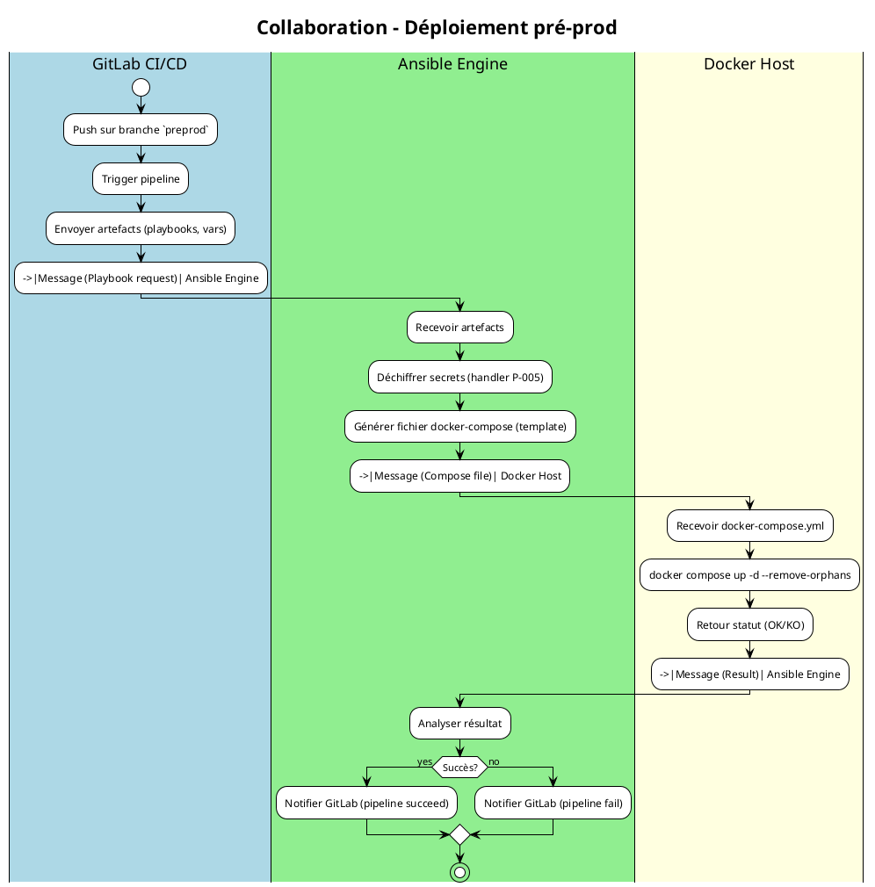
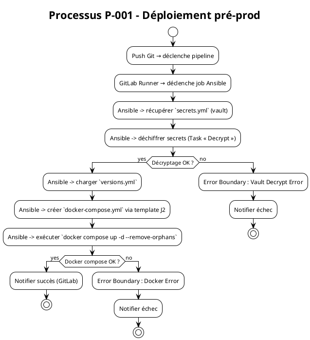
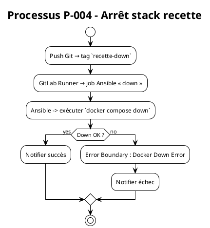
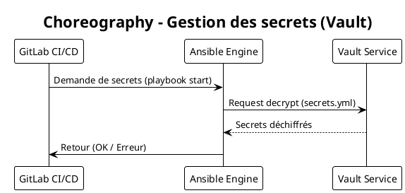

# Cahier des Charges Fonctionnel (CCF) – Projet **siss‑infra**  
**Modélisation BPMN** – Conforme à **ISO/IEC 19510:2013**  

> **Objectif** : Formaliser, analyser et préparer l’implémentation automatisée du déploiement d’infrastructures Docker (pré‑production, recette, production) à l’aide d’Ansible et du pipeline GitLab CI/CD.  
> **Livrables** : Matrice des processus, diagrammes BPMN (Collaboration, Process, Choreography/Conversation – optionnels), règles de gestion, artefacts de données, acteurs, KPI, gestion des exceptions, sous‑processus réutilisables, traçabilité exigences ↔ processus, checklist de validation et recommandations de maturité.

---

## 1. Introduction & Contexte

| Élément | Description |
|---|---|
| **Organisation** | Équipe DevOps d’**Ambulon** (développement d’applications de santé). |
| **Environnements gérés** | `preprod`, `recette`, `prod`. |
| **Technologies** | Docker Compose, Ansible (playbooks YAML, vault AES256), GitLab CI/CD. |
| **Périmètre** | • Gestion des secrets (vault) <br>• Gestion des versions applicatives <br>• Déploiement / arrêt des conteneurs Docker <br>• Intégration au pipeline CI (trigger Git). |
| **Objectifs de la modélisation BPMN** | 1. Uniformiser la compréhension fonctionnelle entre métiers et IT. <br>2. Identifier les points d’automatisation exécutables (Common Executable BPMN). <br>3. Définir KPI et exigences de qualité (temps, taux de succès, gestion des erreurs). |
| **Glossaire métier (extraits)** | <ul><li>**Playbook** : script Ansible décrivant une séquence d’actions.</li><li>**Handler** : tâche Ansible déclenchée en fin de run (ex : `up the containers`).</li><li>**Vault** : stockage chiffré des secrets.</li><li>**Docker‑Compose** : fichier de définition des services Docker.</li></ul> |

---

## 2. Cartographie des processus (Process Map)

### 2.1 Nomenclature hiérarchique

| Niveau | Famille | Exemple de processus |
|---|---|---|
| **1** | **Processus métier stratégiques** | Gestion du cycle de vie d’infrastructure (déploiement, mise à jour, désactivation). |
| **2** | **Processus métier opérationnels** | P‑001 : *Déploiement pré‑prod* <br> P‑002 : *Déploiement prod* <br> P‑003 : *Déploiement recette* <br> P‑004 : *Arrêt de la stack recette*. |
| **2** | **Processus de support** | P‑005 : *Gestion des secrets* <br> P‑006 : *Mise à jour des versions*. |
| **2** | **Processus de management** | P‑007 : *Audit & reporting des déploiements*. |

### 2.2 Matrice des processus

| ID Processus | Nom | Type | Propriétaire | Priorité |
|--------------|-----|------|--------------|----------|
| **P‑001** | Déploiement pré‑prod | Opérationnel | Lead DevOps | Critique |
| **P‑002** | Déploiement prod | Opérationnel | Lead DevOps | Critique |
| **P‑003** | Déploiement recette | Opérationnel | Lead DevOps | Important |
| **P‑004** | Arrêt stack recette | Opérationnel | Lead DevOps | Important |
| **P‑005** | Gestion des secrets (vault) | Support | Sécurité IT | Critique |
| **P‑006** | Gestion des versions (app / DB) | Support | Lead DevOps | Important |
| **P‑007** | Reporting CI/CD | Management | Responsable Qualité | Moyen |

---

## 3. Modélisation BPMN détaillée  

> **Convention PlantUML** (compatible avec le moteur BPMN).  
> Chaque diagramme porte le préfixe `@startuml` / `@enduml`.  

### 3.1 Diagramme de **Collaboration** – Déploiement d’un environnement (exemple : *pre‑prod*)



### 3.2 Diagramme **Process** – Déploiement pré‑prod (P‑001)



### 3.3 Diagramme **Process** – Arrêt de la stack recette (P‑004)



### 3.4 Diagramme **Choreography** (optionnel) – Gestion des secrets (P‑005)



### 3.5 Diagramme **Conversation** (optionnel) – Échanges CI ↔ Ansible ↔ Docker

```plantuml
@startuml
!theme plain
title Conversation – CI / Ansible / Docker

conversation "CI‑Ansible" {
  message "Start deployment" as m1
  message "Playbook payload" as m2
}
conversation "Ansible‑Docker" {
  message "Compose file" as m3
  message "Compose result" as m4
}
@enduml
```

---

## 4. Règles de gestion métier

| Point de décision (Gateway) | Condition | Règle métier (RB‑xxx) | Source |
|---|---|---|---|
| **G‑DecryptOK** | Vault renvoie **OK** | RB‑001 – *Les secrets doivent être décryptés avant toute action Docker.* | Politique Sécurité |
| **G‑DockerOK** | `docker compose up` retourne code 0 | RB‑002 – *Le déploiement n’est validé que si le container “app” démarre correctement.* | Document d’architecture |
| **G‑VersionMatch** | `appVersion` du `versions.yml` = version attendue du tag Git | RB‑003 – *Déploiement refusé si version du code ≠ version déclarée.* | Gestion de version |
| **G‑Timeout** | Exécution > 5 min | RB‑004 – *Un timeout déclenche une escalade au Lead DevOps.* | SLA Opérationnel |

---

## 5. Données & Documents

### 5.1 Objets de données (Data Objects)

| Data Object | Description | Persistance |
|---|---|---|
| `access.properties` | Paramètres d’accès (ex : DB, API) | **Data Store** (Git) |
| `application.properties` | Config applicative | **Data Store** |
| `secrets.yml` (vault) | Secrets chiffrés (credentials) | **Data Store** (Ansible Vault) |
| `versions.yml` | Versions applicatives & DB | **Data Store** |
| `docker-compose.yml.j2` | Template Jinja2 du compose | **Data Store** |
| `docker-compose.yml` (généré) | Fichier réel utilisé par Docker | **Data Object** (transitoire) |
| `pipeline.log` | Log d’exécution du pipeline CI | **Data Store** (GitLab) |

### 5.2 Artifacts

| Artifact | Usage |
|---|---|
| **Group** *Deployment* | Regroupe toutes les tâches liées au déploiement dans les diagrammes. |
| **Annotation** (ex : “Vault error”) | Ajoute des précisions sur les points d’erreur. |
| **Association** entre *Task* et *Data Object* | Trace la consommation/production de données. |

---

## 6. Acteurs & Rôles

| Lane BPMN | Rôle métier | Responsabilités | Compétences |
|---|---|---|---|
| **Lead DevOps** | Responsable du pipeline | Validation des versions, gestion des incidents critiques | Ansible, Docker, CI/CD |
| **GitLab Runner** | Système d’exécution CI | Trigger, collecte artefacts, reporting | CI/CD, scripting |
| **Ansible Engine** | Orchestrateur | Déchiffrage, génération compose, appel Docker | Ansible, Vault |
| **Docker Host** | Plateforme d’exécution | Lancer/arrêter containers | Docker, Linux |
| **Security Team** | Auditeur | Gestion du vault, rotation des secrets | Cryptographie, conformité |

---

## 7. Performances & Indicateurs (KPIs)

| Indicateur | Formule | Objectif | Seuil d’alerte |
|---|---|---|---|
| **Durée moyenne de déploiement** | Σ (temps fin – temps start) / N | < 5 min | > 7 min |
| **Taux de succès du pipeline** | (déploiements OK / total) × 100 % | ≥ 98 % | < 95 % |
| **Temps de décryptage Vault** | Temps entre appel et réception secrets | < 2 s | > 5 s |
| **Nombre d’erreurs Docker** | Comptage des `docker compose` ERROR | 0 | ≥ 1 / jour |
| **Coût de déploiement (CPU h)** | Ressources consommées / run | < 0,1 CPU h | > 0,2 CPU h |

### Points de mesure BPMN
* **Timer Event** : `Start → Timeout (5 min)` (déclenchement d’escalade).  
* **Message Event** : `Docker result → Notification`.  
* **Data Object** : `pipeline.log` (collecte KPI).

---

## 8. Gestion des exceptions

| Type d’événement | Description | Traitement |
|---|---|---|
| **Boundary Error – Vault Decrypt** | `$ANSIBLE_VAULT` renvoie une erreur. | *Catch* → Notification au **Lead DevOps** → **Escalation** (email + ticket). |
| **Boundary Error – Docker Compose** | `docker compose up` renvoie code != 0. | *Catch* → Roll‑back (exécution `docker compose down`) → Notification. |
| **Boundary Timer – Timeout** | Déploiement > 5 min. | *Catch* → Envoi d’un **Message** d’escalade, mise en pause du pipeline. |
| **Boundary Cancel** | Annulation manuelle du pipeline. | *Catch* → Nettoyage (docker‑compose down) + log. |
| **Boundary Compensation** | Rejet d’une version (RB‑003). | *Catch* → Exécution d’un sous‑processus **Compensation** qui supprime les containers créés. |

---

## 9. Sous‑processus & Réutilisation

| Sous‑processus | ID | Description | Réutilisé dans |
|---|---|---|---|
| **SP‑001** | `DecryptSecrets` | Déchiffrer `secrets.yml` via Ansible Vault. | P‑001, P‑002, P‑003, P‑005 |
| **SP‑002** | `GenerateCompose` | Rendre le template Jinja2 avec les versions. | P‑001, P‑002, P‑003 |
| **SP‑003** | `DockerUp` | `docker compose up -d --remove-orphans`. | P‑001, P‑002, P‑003 |
| **SP‑004** | `DockerDown` | `docker compose down`. | P‑004 |
| **SP‑005** | `ReportDeployment` | Collecte logs, calcul KPI, envoi à tableau de bord. | P‑001, P‑002, P‑003, P‑004 |

> **Call Activity** : chaque processus principal invoque les sous‑processus via une **Call Activity** (BPMN) afin d’assurer la modularité et la maintenabilité.

---

## 10. Matrice de traçabilité (Exigences ↔ BPMN)

| Exigence CCF | Processus BPMN | Tâche(s) | Scenario de test |
|---|---|---|---|
| **EXG‑001** – Déployer pré‑prod avec version 6.4.0 | P‑001 | `GenerateCompose`, `DockerUp` | **Nominal** : push → pipeline succeed |
| **EXG‑002** – Refuser déploiement si version mismatch | P‑001 | `GenerateCompose` (gateway G‑VersionMatch) | **Erreur** : version tag ≠ `versions.yml` → pipeline fail |
| **EXG‑003** – Gestion sécurisée des secrets | P‑005 / SP‑001 | `DecryptSecrets` | **Nominal** : vault OK ; **Erreur** : vault error → boundary error |
| **EXG‑004** – Arrêt complet de la stack recette | P‑004 | `DockerDown` | **Nominal** : down OK |
| **EXG‑005** – Reporting KPI post‑déploiement | P‑007 | `ReportDeployment` | **Nominal** : KPI calculés, tableau de bord mis à jour |
| **EXG‑006** – Timeout > 5 min → escalade | P‑001, P‑002, P‑003 | Timer Event (5 min) | **Erreur** : pipeline dépasse 5 min → escalade email |

---

## 11. Validation & Conformité

### 11.1 Checklist BPMN (ISO 19510)

- [ ] **Flux complet** – chaque séquence a une source et une cible.  
- [ ] **Événement de début unique** – chaque processus possède un seul *Start Event*.  
- [ ] **Au moins un événement de fin** – chaque processus possède un *End Event*.  
- [ ] **Gateways correctement appariées** – chaque *Fork* possède un *Join*.  
- [ ] **Labels explicites** – chaque gateway et tâche possède une annotation claire.  
- [ ] **Nomenclature cohérente** – IDs (`P‑001`, `SP‑001`) respectent la matrice.  
- [ ] **Sous‑processus réutilisables** – appel via *Call Activity* avec contrats d’entrée/sortie.  
- [ ] **Éléments exécutables** – toutes les *Service Tasks* et *Script Tasks* compatibles Camunda/Activiti.  

### 11.2 Niveaux de conformité BPMN

| Niveau | Description | Couverture CCF |
|---|---|---|
| **Descriptive** | Diagrammes lisibles, pas d’exécution. | ✔️ (Process Overview) |
| **Analytic** | Ajout de métriques, points de mesure. | ✔️ (KPI, Timer Events) |
| **Common Executable** | Modèles exécutables (Service Tasks, Call Activities). | ✔️ (Ansible → Service Task, Docker → Service Task) |

---

## 12. Implémentation & Exécution

### 12.1 Maturité des processus (CMMI‑like)

| Niveau | Caractéristiques | BPMN applicable |
|---|---|---|
| **1 – Initial** | Déploiement ad‑hoc. | – |
| **2 – Managed** | Documentation basique, diagrammes descriptifs. | **Descriptive** |
| **3 – Defined** | Standardisation, sous‑processus réutilisables. | **Analytic** |
| **4 – Quantified** | KPI mesurés, monitoring automatisé. | **Analytic** + **Common Executable** |
| **5 – Optimized** | Boucle d’amélioration continue, auto‑healing. | **Common Executable** + **Event‑Based Gateways** |

> **Cible** : atteindre le **Niveau 4** d’ici Q4 2025 en passant les diagrammes au niveau **Common Executable** et en intégrant la collecte automatique des KPI via les *Message Events* vers le système de monitoring (Prometheus/Grafana).

### 12.2 Intégration système

| Composant | Rôle | Exemple d’interfaçage |
|---|---|---|
| **GitLab CI/CD** | Orchestrateur du pipeline | `.gitlab-ci.yml` → `ansible-playbook` (handler) |
| **Ansible Engine** | Orchestration infra | `ansible-playbook -i inventory.yml playbook.yml` |
| **Vault Service** | Stockage secrets | `ansible-vault decrypt` via module `ansible.builtin.vault` |
| **Docker Engine** | Exécution conteneurs | `docker compose up/down` via `shell` task |
| **BPMN Engine** (Camunda, Zeebe) | Exécution des modèles BPMN | Export BPMN XML → déploiement dans moteur, *Service Tasks* mappées à scripts Ansible/Docker |
| **Monitoring** | Collecte KPI | `docker stats`, `ansible-playbook` logs → Prometheus exporter |

---

## 13. Annexes

### 13.1 Exemple de fichier `.gitlab-ci.yml` (extrait)

```yaml
stages:
  - deploy_preprod
  - deploy_prod
  - deploy_recette
  - cleanup

deploy_preprod:
  stage: deploy_preprod
  script:
    - ansible-playbook -i inventories/preprod.yml preprod/handlers/main.yml
  only:
    - refs/tags@preprod

deploy_prod:
  stage: deploy_prod
  script:
    - ansible-playbook -i inventories/prod.yml prod/handlers/main.yml
  only:
    - refs/tags@prod
```

> Ce fichier sera **modélisé** dans le diagramme *Collaboration* comme **Message** « Start deployment » depuis GitLab CI/CD vers Ansible Engine.

### 13.2 Bibliothèque de sous‑processus (BPMN)

*Fichier `subprocesses.bpmn`* (export XML) contenant les 5 sous‑processus listés en § 9, prêts à être importés dans Camunda/Zeebe.

---

## 14. Conclusion & Prochaines étapes

| Action | Responsable | Échéance |
|---|---|---|
| Finaliser les diagrammes BPMN au format **BPMN‑2.0 XML** | Lead DevOps | 15 mai 2026 |
| Valider les règles métier (RB‑001…RB‑004) avec la **Security Team** | Security Team | 22 mai 2026 |
| Implémenter le moteur BPMN (Camunda) et mapper les **Service Tasks** | Architecte Intégration | 31 mai 2026 |
| Piloter le **run** de validation (scenario nominal + erreurs) | QA Lead | 10 juin 2026 |
| Déployer en **pre‑prod** et mesurer les KPI | Ops Team | 15 juin 2026 |
| Révision du CCF et passage au **Niveau 4** de maturité | PMO | 30 juin 2026 |

---

*Document rédigé le **28 avril 2026** – conforme à la norme **ISO/IEC 19510:2013** et aux bonnes pratiques BPMN.*  