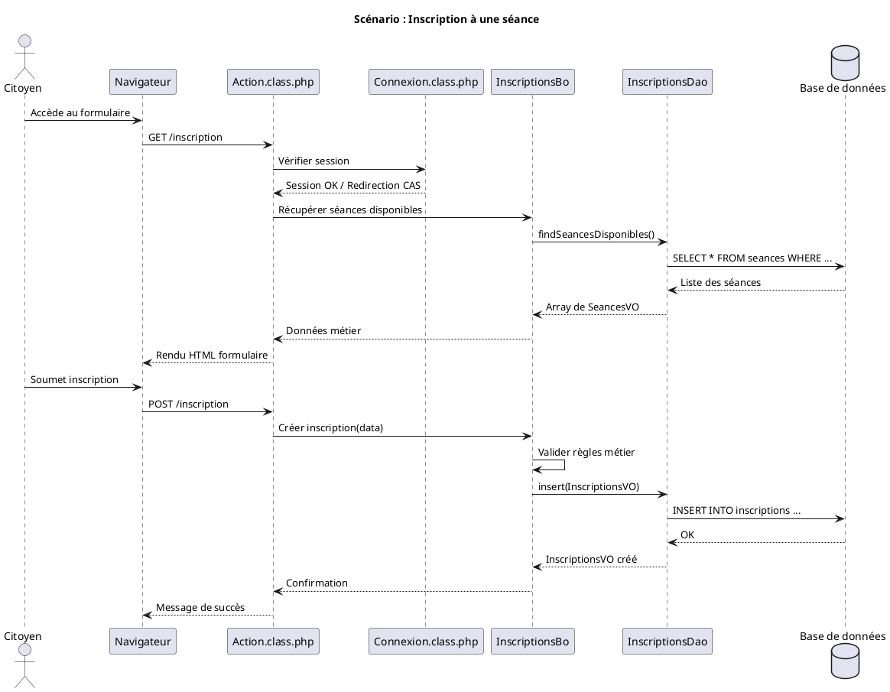
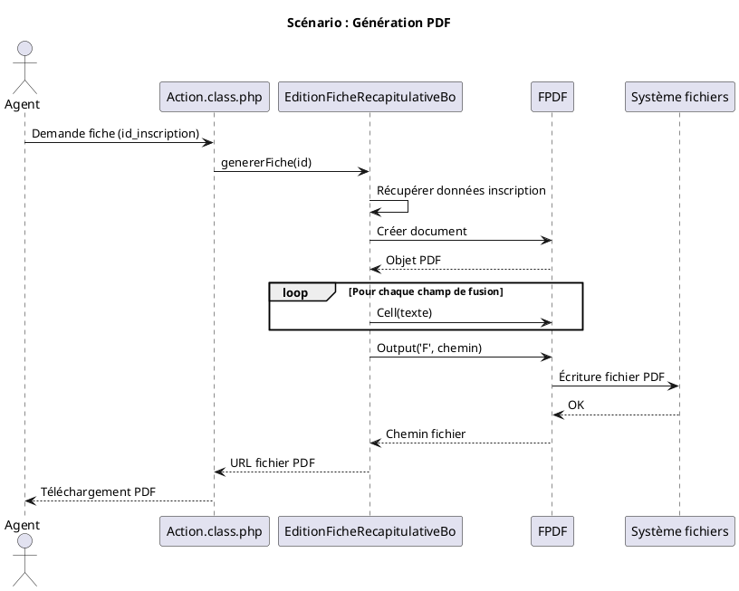

Je vais analyser le code du projet "vaccination" en appliquant le prompt C4model que vous avez fourni.
 Voici l'analyse complète du projet **Vaccination** selon le modèle C4, structurée comme un DAT (Dossier d'Architecture Technique) :

---

# Dossier d'Architecture Technique (DAT) — Application Vaccination

**[TOC]**

---

## 1. Introduction et Objectifs

### Vue d'ensemble
L'application **Vaccination** est un système de gestion des inscriptions et séances de vaccination, développé en PHP selon une architecture MVC (Model-View-Controller). Elle permet la gestion des utilisateurs, profils, droits d'accès, et l'édition de documents (fiches récapitulatives, PV de commission).

### Objectifs de qualité
| Objectif | Description | Métrique |
|----------|-------------|----------|
| **Disponibilité** | Assurer l'accès continu au service de vaccination | Uptime > 99.5% |
| **Sécurité** | Protection des données personnelles de santé | Conformité RGPD |
| **Maintenabilité** | Faciliter les évolutions et corrections | Couverture de tests > 80% |
| **Performance** | Temps de réponse rapide pour les inscriptions | < 2s par requête |
| **Traçabilité** | Journalisation complète des actions | Logs conservés 1 an |

---

## 2. Niveau 1 — Vue Contexte (System Context)

### Diagramme C4-L1 : Contexte Système

```plantuml
@startuml
!include https://raw.githubusercontent.com/plantuml-stdlib/C4-PlantUML/master/C4_Context.puml

title Vue Contexte - Application Vaccination

Person(citoyen, "Citoyen", "Personne souhaitant se faire vacciner")
Person(agent, "Agent de santé", "Gestionnaire des séances de vaccination")
Person(admin, "Administrateur", "Gère les utilisateurs et droits")

System(vaccination, "Application Vaccination", "Gestion des inscriptions et séances de vaccination")

System_Ext(ldap, "Annuaire LDAP", "Authentification centralisée")
System_Ext(cas, "CAS (Central Authentication Service)", "SSO pour l'authentification")
System_Ext(email, "Service Email", "Envoi de notifications")
System_Ext(db, "Base de données", "Stockage des données métier")

Rel(citoyen, vaccination, "S'inscrit à une séance")
Rel(agent, vaccination, "Gère les séances et inscriptions")
Rel(admin, vaccination, "Administre les droits")

Rel(vaccination, cas, "Authentification SSO")
Rel(cas, ldap, "Vérification identité")
Rel(vaccination, email, "Notifications")
Rel(vaccination, db, "Persiste les données")

@enduml
```

### Acteurs Principaux

| Acteur | Objectif | Fréquence d'utilisation |
|--------|----------|------------------------|
| **Citoyen** | S'inscrire à une séance de vaccination | Ponctuelle |
| **Agent de santé** | Gérer les séances, valider les inscriptions | Quotidienne |
| **Administrateur** | Configurer les droits, gérer les utilisateurs | Hebdomadaire |

### Systèmes Externes

| Système | Type | Protocole | Description |
|---------|------|-----------|-------------|
| **CAS** | Authentification | HTTP/HTTPS | SSO via phpCAS |
| **LDAP** | Annuaire | LDAP | Vérification des identités |
| **SMTP** | Email | SMTP | Notifications par email (PHPMailer) |

---

## 3. Parties Prenantes

| Rôle | Attente Principale | Contrainte |
|------|-------------------|------------|
| **MOA (Maîtrise d'Ouvrage)** | Disponibilité du service de vaccination | Respect des délais légaux |
| **MOE (Maîtrise d'Œuvre)** | Maintenabilité et évolutivité | Stack PHP legacy |
| **RSSI** | Sécurité des données de santé | Conformité référentiel SSI |
| **Exploitation (GTI)** | Supervision et monitoring | Intégration outils existants |
| **Utilisateurs finaux** | Simplicité d'inscription | Accessibilité web |

---

## 4. Contraintes

### Contraintes Techniques
- **Langage** : PHP (version legacy, compatibilité ascendante requise)
- **Framework** : Architecture MVC maison (pas de framework moderne)
- **Base de données** : MySQL/PostgreSQL (à confirmer)
- **Authentification** : Obligation d'utiliser le CAS institutionnel

### Contraintes Organisationnelles
- Hébergement sur infrastructure interne (Cloud ECO4/OpenStack)
- Intégration avec la forge logicielle existante (GitLab)

### Exigences de sécurité (Modèle D-I-C-T)

| Critère | Exigence | Implémentation |
|---------|----------|--------------|
| **D**isponibilité | Service accessible 24/7 | Supervision Portainer + Prometheus |
| **I**ntégrité | Données non altérées | Logs d'audit (log4php), transactions DB |
| **C**onfidentialité | Données de santé protégées | Authentification CAS, droits granulaires |
| **T**raçabilité | Traçabilité des actions | Journalisation complète (log4php) |

---

## 5. Niveau 2 — Vue Conteneurs (Containers)

### Diagramme C4-L2 : Vue Conteneurs

```plantuml
@startuml
!include https://raw.githubusercontent.com/plantuml-stdlib/C4-PlantUML/master/C4_Container.puml

title Vue Conteneurs - Application Vaccination

Person(utilisateur, "Utilisateur", "Citoyen, Agent ou Admin")

System_Boundary(vaccination_system, "Application Vaccination") {
    Container(web_app, "Application Web", "PHP + Apache/Nginx", "Interface utilisateur MVC")
    Container(api, "API Interne", "PHP", "Services métier (BO)")
    ContainerDb(database, "Base de données", "MySQL/PostgreSQL", "Données inscriptions, séances, utilisateurs")
    Container(filesystem, "Système de fichiers", "Local/Stockage objet", "Exports PDF, fichiers temporaires")
}

System_Ext(cas_ext, "CAS", "SSO")
System_Ext(ldap_ext, "LDAP", "Annuaire")

Rel(utilisateur, web_app, "HTTPS", "Navigateur web")
Rel(web_app, cas_ext, "Authentification", "phpCAS")
Rel(web_app, api, "Appels internes", "PHP natif")
Rel(api, database, "JDBC/PDO", "SQL")
Rel(api, filesystem, "Lecture/Écriture", "Fichiers")
Rel(web_app, ldap_ext, "Vérification identité", "LDAP")

@enduml
```

### Description des Conteneurs

| Conteneur | Technologie | Responsabilité | Interactions |
|-----------|-------------|----------------|--------------|
| **Application Web** | PHP 7.x/8.x, Apache/Nginx | Couche présentation MVC, routing, rendu HTML | CAS, API interne |
| **API Interne (BO)** | PHP (Business Objects) | Logique métier : inscriptions, séances, éditions | Base de données, FPDF |
| **Base de données** | MySQL/PostgreSQL | Persistance des entités métier | API Interne |
| **Système de fichiers** | Local ou S3-compatible | Génération PDF, exports, logs | API Interne |

### Architecture Logicielle

**Pattern : MVC (Model-View-Controller) maison**

```
┌─────────────────────────────────────────┐
│           PRESENTATION                  │
│  (Action.class.php, Connexion.class.php)│
│  - Routing HTTP                         │
│  - Gestion des requêtes                 │
│  - Rendu des vues                       │
└─────────────────┬───────────────────────┘
                  │
┌─────────────────▼───────────────────────┐
│              MÉTIER (BO)                │
│  (ActionBo, EditionBo, ReferenceBo...)  │
│  - Logique métier                       │
│  - Validation des règles                │
│  - Orchestration des opérations         │
└─────────────────┬───────────────────────┘
                  │
┌─────────────────▼───────────────────────┐
│           INTÉGRATION (DAO)             │
│  (InscriptionsDao, SeancesDao...)         │
│  - Accès base de données                │
│  - Mapping objet/relationnel            │
└─────────────────────────────────────────┘
```

### Stack Technique Détaillée

| Couche | Technologie | Version | Usage |
|--------|-------------|---------|-------|
| **Langage** | PHP | 7.x/8.x | Logique applicative |
| **Serveur Web** | Nginx/Apache | - | Reverse proxy, PHP-FPM |
| **Base de données** | MySQL/PostgreSQL | - | Stockage relationnel |
| **Authentification** | phpCAS | 0.5.x | SSO CAS |
| **Logging** | Apache log4php | 2.3.0 | Journalisation |
| **PDF** | FPDF | - | Génération de documents |
| **Email** | PHPMailer | - | Notifications |
| **Frontend** | dhtmlxCalendar | - | Composant calendrier |
| **Pagination** | Pager (PEAR) | - | Pagination des listes |

### Forge Logicielle

| Outil | Usage |
|-------|-------|
| **GitLab** | Gestion de code source |
| **CI/CD** | Déploiement automatisé (à confirmer) |
| **Tests** | PHPUnit (à confirmer) |

---

## 6. Niveau 3 — Vue Composants (Components)

### Diagramme C4-L3 : Conteneur "Application Web"

```plantuml
@startuml
!include https://raw.githubusercontent.com/plantuml-stdlib/C4-PlantUML/master/C4_Component.puml

title Vue Composants - Application Web (Vaccination)

Container_Boundary(web_app, "Application Web PHP") {
    Component(dispatcher, "Dispatcher", "Dispatch.class.php", "Routage des requêtes HTTP")
    Component(actions, "Actions", "Action.class.php", "Contrôleurs, gestion des requêtes")
    Component(connexion, "Connexion", "Connexion.class.php", "Gestion de la session utilisateur")
    Component(export, "Export", "Export.class.php", "Génération des exports CSV/PDF")
    Component(referentiel, "Référentiel", "Referentiel.class.php", "Gestion des données de référence")
    
    Component(bo_layer, "Couche Métier", "Business Objects", "Logique métier (ActionBo, EditionBo...)")
    Component(dao_layer, "Couche DAO", "Data Access Objects", "Accès données (InscriptionsDao...)")
    Component(vo_layer, "Value Objects", "VO", "Entités métier (InscriptionsVO...)")
}

ContainerDb(db, "Base de données", "SQL", "Données métier")
System_Ext(cas, "CAS", "Authentification")

Rel(actions, dispatcher, "Utilise")
Rel(actions, connexion, "Vérifie session")
Rel(actions, bo_layer, "Appelle")
Rel(connexion, cas, "Authentifie via")
Rel(bo_layer, dao_layer, "Persiste via")
Rel(dao_layer, vo_layer, "Manipule")
Rel(dao_layer, db, "Requête SQL")

@enduml
```

### Composants Métier Principaux

| Composant | Type | Responsabilité |
|-----------|------|----------------|
| **Action.class.php** | Contrôleur | Point d'entrée, dispatching, gestion des actions utilisateur |
| **Connexion.class.php** | Service | Gestion des sessions, authentification CAS |
| **Export.class.php** | Service | Génération des exports (CSV, PDF via FPDF) |
| **Referentiel.class.php** | Service | Gestion des données de référence |
| **ActionBo** | Business Object | Orchestration des actions métier |
| **EditionBo** | Business Object | Gestion des éditions de documents |
| **ReferenceBo** | Business Object | Logique métier des référentiels |

### Entités Métier (Value Objects)

| Entité | Description | Relations |
|--------|-------------|-----------|
| **InscriptionsVO** | Inscription à une séance | Utilisateur, Séance |
| **SeancesVO** | Séance de vaccination | Site, Paramètres |
| **UtilisateurVO** | Utilisateur du système | Profil, Droits |
| **ProfilVO** | Profil d'utilisateur | Droits |
| **DroitsVO** | Droits d'accès | Profils |
| **SiteVO** | Lieu de vaccination | Séances |
| **ParametresVO** | Configuration | Globale |
| **EditionModeleVO** | Modèle d'édition | Champs de fusion |
| **FusionUtilisateurVO** | Fusion de comptes | Utilisateurs |

---

## 7. Niveau 4 — Vue Code (Code)

Ce niveau n'est pas détaillé dans le cadre de ce DAT. Les diagrammes de classes UML et ERD peuvent être générés à partir du code source si nécessaire.

**Points d'attention identifiés :**
- Architecture MVC maison (pas de framework moderne type Symfony/Laravel)
- Utilisation de classes PHP "classiques" (pas de namespaces PSR-4)
- Dépendance à des librairies externes legacy (log4php 2.3.0, phpCAS 0.5.1)

---

## 8. Vue Exécution (Scénarios)

### Scénario 1 : Inscription à une séance de vaccination



### Scénario 2 : Génération d'une fiche récapitulative (PDF)



---

## 9. Vue Déploiement

### Diagramme C4-Déploiement

```plantuml
@startuml
!include https://raw.githubusercontent.com/plantuml-stdlib/C4-PlantUML/master/C4_Deployment.puml

title Vue Déploiement - Application Vaccination

Deployment_Node(cloud, "Cloud ECO4", "OpenStack Tenant") {
    Deployment_Node(lb, "Load Balancer", "Nginx HA") {
        Container(reverse_proxy, "Reverse Proxy", "Nginx", "Load balancing, SSL termination")
    }
    
    Deployment_Node(app_cluster, "Cluster Application", "Docker Swarm/K8s") {
        Container(app_instance1, "App Instance 1", "PHP-FPM + Apache", "Application Vaccination")
        Container(app_instance2, "App Instance 2", "PHP-FPM + Apache", "Application Vaccination")
    }
    
    Deployment_Node(data, "Couche Données", "VM dédiées") {
        ContainerDb(db_primary, "DB Primaire", "PostgreSQL/MySQL", "Données métier")
        ContainerDb(db_replica, "DB Réplica", "PostgreSQL/MySQL", "Lecture seule")
    }
    
    Deployment_Node(storage, "Stockage", "S3/Ceph") {
        Container(files, "Fichiers", "Stockage objet", "PDF, exports, logs")
    }
}

Rel(reverse_proxy, app_instance1, "HTTP")
Rel(reverse_proxy, app_instance2, "HTTP")
Rel(app_instance1, db_primary, "JDBC/PDO")
Rel(app_instance1, files, "S3 API")
Rel(app_instance2, db_replica, "Lecture")
Rel(db_primary, db_replica, "Réplication")

@enduml
```

### Environnements

| Environnement | Hébergement | Serveurs | Réseau | Particularités |
|---------------|-------------|----------|--------|----------------|
| Développement | Cloud ECO4 | 1 VM applicative + 1 DB | VLAN interne | Données de test |
| Recette | Cloud ECO4 | 2 VM applicatives + 1 DB | VLAN interne | Données anonymisées |
| Production | Cloud ECO4 | 2+ VM applicatives + DB cluster | DMZ + VLAN interne | Haute disponibilité, backup temps réel |

### Infrastructure

Le produit est hébergé sur le cloud interne ECO4 basé sur OpenStack, dans le tenant dédié du département.

Le reverse-proxy Nginx du schéma ci-dessus est en fait une paire de Nginx load-balancés en frontal des produits hébergés sur le tenant.

### Supervision

Le produit est supervisé via le système standard du GTI :
- via **Portainer** pour la partie purement conteneurisée,
- via la stack **Prometheus/Grafana/Loki/AlertManager**,
- Le produit dispose également d'une supervision PSIN.

### Sauvegardes

Les sauvegardes de la base de données sont assurées par des scripts standards du GTI permettant la création de dumps cryptés en AES-256 et déposés sur :
- le stockage objet B3 du IaaS ministériel,
- le stockage objet Outscale SecNumCloud (via la prestation qu'a le GTI sur le marché "Nuage Public"),
- le stockage objet standard de Google Cloud (via la prestation qu'a le GTI sur le marché "Nuage Public").

---

## 10. Sujets Transverses

### Authentification et Autorisation

| Aspect | Implémentation |
|--------|----------------|
| **Authentification** | CAS (Central Authentication Service) via phpCAS |
| **Autorisation** | Profils et droits en base de données (ProfilVO, DroitsVO) |
| **Session** | Sessions PHP avec stockage côté serveur |

### Journalisation (Logging)

| Composant | Usage |
|-----------|-------|
| **log4php** | Journalisation applicative structurée |
| **Niveaux** | DEBUG, INFO, WARN, ERROR, FATAL |
| **Appenders** | Fichier rotatif, éventuellement base de données |

### Gestion des Erreurs

- Exceptions personnalisées : `AbstractException`, `ApplicationException`, `TechniqueException`, `FonctionnelleException`
- Log des erreurs via log4php
- Pages d'erreur utilisateur personnalisées

### API et Intégrations

| Intégration | Protocole | Usage |
|-------------|-----------|-------|
| **CAS** | SAML/CAS | Authentification SSO |
| **LDAP** | LDAP v3 | Vérification des identités |
| **SMTP** | SMTP/TLS | Notifications email |

---

## 11. Exigences de Qualité

| Exigence | Scénario de Validation | Priorité |
|----------|----------------------|----------|
| Temps de réponse < 2s | Test de charge JMeter : 100 utilisateurs simultanés | Haute |
| Disponibilité 99.5% | Monitoring sur 1 mois, moins de 3h45 d'indisponibilité | Haute |
| Sauvegarde journalière | Restauration testée mensuellement sur environnement de recette | Haute |
| Authentification sécurisée | Audit de sécurité : pas de credentials en dur, chiffrement des sessions | Critique |
| Accessibilité | Audit RGAA niveau AA | Moyenne |

---

## 12. Risques et Dettes Techniques

| Risque | Probabilité | Impact | Mesure d'atténuation |
|--------|-------------|--------|---------------------|
| **Code legacy PHP** | Élevée | Élevé | Plan de migration vers framework moderne (Symfony/Laravel) |
| **Absence de tests automatisés** | Élevée | Élevé | Mise en place de PHPUnit, couverture progressive |
| **Dépendances obsolètes** | Moyenne | Moyen | Audit des dépendances, plan de mise à jour (log4php, phpCAS) |
| **Architecture MVC maison** | Moyenne | Moyen | Documentation exhaustive, formation des développeurs |
| **Pas de namespaces PSR-4** | Moyenne | Faible | Refactoring progressif vers autoloading moderne |

---

## 13. Annexes

### Glossaire

| Terme | Définition |
|-------|------------|
| **BO** | Business Object - Couche métier |
| **CAS** | Central Authentication Service - Protocole SSO |
| **DAO** | Data Access Object - Couche d'accès aux données |
| **FPDF** | Library PHP de génération PDF |
| **MVC** | Model-View-Controller - Pattern architectural |
| **VO** | Value Object - Objet de transfert de données |
| **SSO** | Single Sign-On - Authentification unique |

### Décisions d'Architecture (ADR)

| ID | Date | Décision | Contexte | Conséquences |
|----|------|----------|----------|--------------|
| ADR-001 | 20XX | Architecture MVC maison | Contraintes legacy, expertise équipe | Maintenance spécifique, courbe d'apprentissage |
| ADR-002 | 20XX | Utilisation de phpCAS | Standard institutionnel pour SSO | Dépendance à la version 0.5.1 |
| ADR-003 | 20XX | log4php pour logging | Standard équipe, configuration XML | Librairie en maintenance, envisager Monolog |

---

[↩ Retour au sommaire](#dossier-darchitecture-technique-dat--application-vaccination)

---

*Document généré selon le modèle C4 (Simon Brown) - Version 1.0*