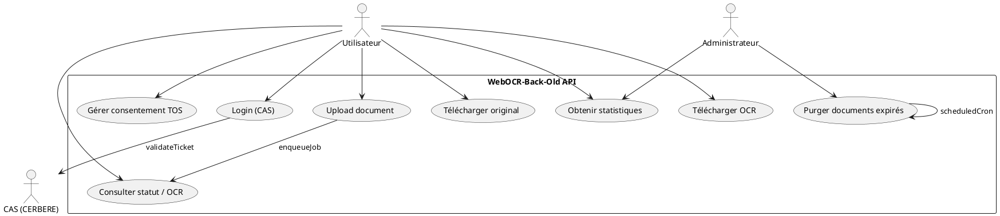
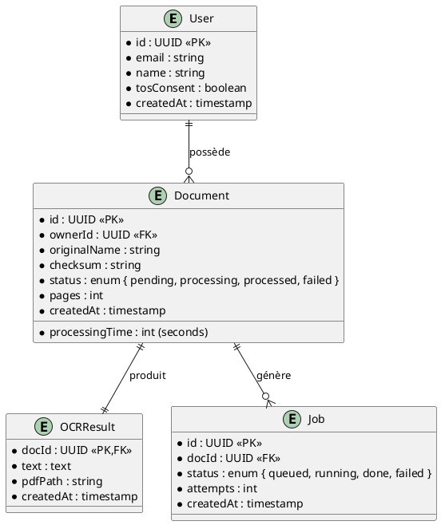

# 📄 Cahier des Charges Fonctionnel (CCF) – **WebOCR‑Back‑Old**

[TOC]

---

## 1. Introduction et contexte du projet {#intro}

### 1.1 Présentation du projet
Le **WebOCR‑Back‑Old** est le service backend d’une plateforme web de reconnaissance optique de caractères (OCR). Il expose des API REST permettant :

* L’authentification unique via le service CAS (CERBERE).  
* Le dépôt, la gestion et le suivi de documents à OCRiser.  
* Le traitement asynchrone des documents (extraction de texte, génération de PDF/A).  
* La mise à disposition des résultats (texte OCR, PDF converti).  
* Le suivi statistique et la purge automatisée des documents périmés.

### 1.2 Objectifs stratégiques
| Objectif | Description | KPI associé |
|----------|-------------|-------------|
| **Fiabilité** | Disponibilité ≥ 99,5 % du service d’OCR. | Taux de disponibilité mensuel |
| **Performance** | Traitement d’un document ≤ 30 s (hors file d’attente). | Temps moyen de traitement |
| **Sécurité** | Conformité RGPD & RGS, authentification via CAS, sessions sécurisées. | Nombre d’incidents de sécurité |
| **Scalabilité** | Support de 10 000 documents/jour sans dégradation. | Volume de documents traités |
| **Traçabilité** | Historisation complète des traitements. | % de documents auditables |

### 1.3 Périmètre fonctionnel
| Inclus | Exclus |
|-------|--------|
| • Authentification CAS, gestion de session <br>• Upload de fichiers <br>• Orchestration du traitement OCR (Tesseract) <br>• Stockage des métadonnées (PostgreSQL) <br>• Gestion de la file d’attente (Redis) <br>• API de téléchargement des originaux et résultats <br>• Statistiques d’usage <br>• Purge planifiée des documents expirés | • Interface utilisateur (frontend) <br>• Gestion des licences logicielles <br>• Hébergement cloud (infrastructure IaaS) <br>• Modules d’apprentissage machine avancés (ex. classification) |

↩ [Retour au sommaire](#toc)

---

## 2. Expression fonctionnelle du besoin {#besoin}

Conformément à la **NF EN 16271**, chaque besoin est décrit comme une **Fonction de Service (FS)** – *quoi* doit être réalisé, sans préciser le *comment*.

| N° | Fonction de Service (FS) | Description (quoi) | Critères d’appréciation (mesurables) | Pondération* |
|----|--------------------------|--------------------|--------------------------------------|--------------|
| **FS‑01** | **Gestion de l’authentification** | Authentifier les utilisateurs via le serveur CAS, créer et invalider les sessions. | • Temps de réponse ≤ 200 ms <br>• Taux de succès d’authentification ≥ 99 % <br>• Durée de session configurable (max 1 h) | 15 % |
| **FS‑02** | **Upload de documents** | Recevoir, valider et stocker les fichiers bruts (PDF, JPG, PNG) dans le répertoire `uploads`. | • Taille maximale 50 Mo <br>• Types acceptés : `pdf, jpg, jpeg, png` <br>• Validation d’intégrité (checksum MD5) <br>• Temps d’upload ≤ 5 s | 10 % |
| **FS‑03** | **Enregistrement des métadonnées** | Persister les informations du document (owner, nom, date, statut, nb pages) dans la table `documents`. | • Insertion DB < 100 ms <br>• Contrainte d’unicité du checksum <br>• Historisation des changements | 8 % |
| **FS‑04** | **Mise en file d’attente du traitement OCR** | Placer le document dans la file Redis pour traitement asynchrone. | • Latence d’enqueue ≤ 50 ms <br>• Garantie de delivery ≥ 99,9 % | 7 % |
| **FS‑05** | **Traitement OCR** | Exécuter Tesseract (français) sur chaque page, générer le texte et un PDF/A. | • Précision du texte ≥ 95 % (benchmark) <br>• Temps moyen ≤ 30 s par document <br>• Gestion des erreurs (re‑try 3×) | 20 % |
| **FS‑06** | **Stockage des résultats** | Enregistrer le texte OCR et le PDF/A dans le répertoire `converted` et mettre à jour le statut. | • Disponibilité du fichier ≤ 1 s après fin <br>• Vérification d’intégrité (checksum) | 10 % |
| **FS‑07** | **Téléchargement des ressources** | Permettre le téléchargement sécurisé de l’original et du résultat OCR. | • Authentification obligatoire <br>• Temps de réponse ≤ 200 ms <br>• Journalisation des accès | 8 % |
| **FS‑08** | **Statistiques et reporting** | Fournir des indicateurs (nb documents, temps moyen, taux d’erreur). | • API `/files/statistics` renvoie JSON valide <br>• Mise à jour en temps réel (≤ 5 s) | 5 % |
| **FS‑09** | **Purge planifiée** | Supprimer automatiquement les documents dépassant la durée de rétention (configurable). | • Exécution du cron selon `PURGING_CRON` <br>• Suppression sans perte d’audit <br>• Temps d’exécution ≤ 2 min | 5 % |
| **FS‑10** | **Gestion des consentements** | Enregistrer le consentement aux CGU (TOS) pour chaque utilisateur. | • Champ `tosConsent` booléen à `true` avant traitement <br>• Historisation du consentement | 2 % |

\* La pondération reflète l’importance relative pour le commanditaire (total = 100 %).  

↩ [Retour au sommaire](#toc)

---

## 3. Acteurs et parties prenantes {#acteurs}

| Acteur | Rôle | Objectifs | Besoins spécifiques |
|--------|------|-----------|--------------------|
| **Utilisateur final** | Client du service (ex. employé public) | Déposer un document, récupérer le texte OCR | Interface simple, temps de réponse rapide, confidentialité |
| **Administrateur système** | Gestion de l’infrastructure | Assurer disponibilité, mettre à jour les paramètres | Accès aux logs, configuration du cron, monitoring |
| **MOA (Maître d’Ouvrage)** | Commanditaire fonctionnel | Garantir conformité métier & légale | Traçabilité, respect RGPD, reporting |
| **MOE (Maître d’Œuvre)** | Équipe de développement | Implémenter les exigences | Spécifications détaillées, tests d’intégration |
| **Service d’authentification CAS (CERBERE)** | Fournisseur d’identité | Authentifier les utilisateurs | API de validation de ticket, gestion du logout |
| **Moteur OCR (Tesseract)** | Traitement du texte | Produire le texte à partir d’images | Support du français, performance |
| **Redis** | Broker de messages | Orchestrer les jobs | Fiabilité de la file, persistance |
| **PostgreSQL** | SGBD | Stocker métadonnées & audit | Intégrité transactionnelle, sauvegarde |
| **RSSI / DPO** | Sécurité & protection des données | Garantir conformité RGPD & RGS | Journalisation, chiffrement des cookies, durée de rétention |

↩ [Retour au sommaire](#toc)

---

## 4. Cas d’usage (Use Cases) {#usecases}

### 4.1 Diagramme de cas d’utilisation (UML)  



### 4.2 Description détaillée des cas d’usage

| N° | Nom du cas d’usage | Acteur(s) principal(aux) | Scénario nominal | Scénarios alternatifs / d’erreur | Pré‑conditions | Post‑conditions |
|----|--------------------|---------------------------|------------------|----------------------------------|----------------|----------------|
| **UC‑01** | Authentification CAS | Utilisateur | 1. L’utilisateur clique « Login ». <br>2. Le frontend redirige vers le serveur CAS. <br>3. CAS renvoie un ticket. <br>4. Le backend valide le ticket (`auth.validateTicket`). <br>5. Une session est créée et le cookie `ocr-session` est renvoyé. | • Ticket invalide → retour 401 « Invalid ticket ». <br>• CAS indisponible → retour 503. | Aucun token de session actif. | Session valide, cookie stocké. |
| **UC‑02** | Dépôt d’un document | Utilisateur | 1. L’utilisateur sélectionne un fichier (≤ 50 Mo, type autorisé). <br>2. L’appel `POST /files` avec le middleware `upload.single("file")`. <br>3. Le service `handleUpload` enregistre le fichier, crée l’entrée `documents`, place le job dans Redis. | • Fichier trop volumineux → 413 Payload Too Large. <br>• Type non supporté → 415 Unsupported Media Type. | Session valide, consentement TOS = true. | Document en file d’attente, métadonnées persistées. |
| **UC‑03** | Consultation du statut OCR | Utilisateur | 1. L’utilisateur interroge `GET /files/jobs`. <br>2. Le service renvoie la liste des jobs (en cours / terminés). | • Aucun job → tableau vide. | Session valide. | Vue actualisée du statut. |
| **UC‑04** | Téléchargement du fichier original | Utilisateur | 1. `GET /files/original/:id`. <br>2. Le serveur vérifie les droits, renvoie le fichier depuis `uploads`. | • Id inexistant → 404. <br>• Pas de droit d’accès → 403. | Session valide, propriétaire du document. | Flux de téléchargement. |
| **UC‑05** | Téléchargement du résultat OCR | Utilisateur | 1. `GET /files/ocr/:id`. <br>2. Le serveur renvoie le PDF/A ou le texte brut. | • Résultat non disponible → 202 « Processing ». | Session valide, document traité. | Flux de téléchargement. |
| **UC‑06** | Consultation des statistiques | Utilisateur / Administrateur | 1. `GET /files/statistics`. <br>2. Retour JSON contenant nb documents, temps moyen, taux d’erreur. | • Aucun document → valeurs à zéro. | Session valide. | Données statistiques à jour. |
| **UC‑07** | Purge planifiée | Administrateur | 1. Cron déclenché (`PURGING_CRON`). <br>2. Le script `cron.js` supprime les documents dont la date dépasse la rétention. | • Erreur de connexion DB → log + alerte. | Aucun. | Documents périmés supprimés, logs audit. |
| **UC‑08** | Gestion du consentement aux CGU | Utilisateur | 1. `GET /auth/consentToTos`. <br>2. Le service met à jour `tosConsent = true`. | • Consentement déjà donné → idempotent (200). | Session valide. | Champ `tosConsent` = true. |

↩ [Retour au sommaire](#toc)

---

## 5. Processus métier (BPMN) {#processus}

### 5.1 Diagramme BPMN du flux *Upload → OCR → Livraison*

```plantuml
@startbpmn
startEvent(start)
task("Vérifier consentement TOS") as t1
exclusiveGateway("Consentement OK ?") as g1
task("Uploader le fichier") as t2
task("Enregistrer métadonnées") as t3
task("Enqueue job OCR") as t4
parallelGateway("Parallel") as pg
task("Traitement OCR (Tesseract)") as t5
task("Générer PDF/A & texte") as t6
task("Mettre à jour statut") as t7
endEvent(end)

start --> t1 --> g1
g1 --> t2 : oui
g1 --> end : non (403)
t2 --> t3 --> t4 --> pg
pg --> t5
pg --> t6
t5 --> t7
t6 --> t7
t7 --> end
@endbpmn
```

### 5.2 Points de contrôle et règles de gestion

| Point de contrôle | Règle métier associée |
|-------------------|-----------------------|
| **Consentement TOS** | Aucun traitement OCR ne doit être lancé tant que `tosConsent != true`. |
| **Taille du fichier** | Rejeter tout fichier > 50 Mo (`upload.single` + validation). |
| **Type MIME** | Accepter uniquement `application/pdf`, `image/jpeg`, `image/png`. |
| **Durée de rétention** | Les documents sont conservés **max 30 jours** (configurable via `RETENTION_DAYS`). |
| **Gestion des erreurs OCR** | Après 3 tentatives échouées, le statut passe à `failed` et un mail d’alerte est envoyé. |
| **Sécurité des cookies** | `SESSION_COOKIE` doit être HttpOnly et Secure en production. |

↩ [Retour au sommaire](#toc)

---

## 6. Règles métier et contraintes fonctionnelles {#regles}

| N° | Règle métier (IF … THEN) | Source / Justification |
|----|--------------------------|------------------------|
| **R‑01** | IF le fichier possède un checksum déjà présent, THEN le rejetter avec 409 Conflict. | Garantir l’unicité des documents. |
| **R‑02** | IF le traitement OCR dépasse **30 s**, THEN le job est relancé (max 2 relances). | Optimiser la disponibilité. |
| **R‑03** | IF l’utilisateur n’a pas de session valide, THEN bloquer l’accès aux endpoints `/files/*`. | Sécurité d’accès. |
| **R‑04** | IF le document est marqué `status = processed` AND `processed = true`, THEN le PDF/A doit être disponible dans `converted/`. | Traçabilité des résultats. |
| **R‑05** | IF le cron de purge s’exécute, THEN il ne supprime jamais les documents dont `owner = "admin"` (exemptions). | Gouvernance. |
| **R‑06** | IF le champ `tosConsent` = false, THEN l’API `/files/*` renvoie 403 « Consent required ». | Conformité RGPD. |
| **R‑07** | IF le serveur détecte un dépassement de quota disque (`/uploads` > 5 GB), THEN il désactive temporairement les uploads. | Disponibilité du système. |
| **R‑08** | IF le cookie `ocr-session` est transmis sur une connexion non‑HTTPS, THEN le serveur doit le rejeter. | RGS – sécurité des transports. |

#### Contraintes techniques (non fonctionnelles)

| Type | Description |
|------|-------------|
| **Performance** | Le temps moyen de réponse des endpoints doit rester ≤ 200 ms (hors traitement OCR). |
| **Scalabilité** | Le système doit pouvoir être déployé en mode *cluster* (Node.js) derrière un load‑balancer. |
| **Sécurité** | Toutes les communications internes (Redis, Postgres) utilisent des connexions chiffrées. |
| **Disponibilité** | Redondance du service Redis (sentinel) et de la base PostgreSQL (replication). |
| **Observabilité** | Logs JSON via `logger.js`, métriques Prometheus exposées sur `/metrics`. |
| **Portabilité** | Docker‑compose fourni (`docker-compose.yml` et `docker-compose.dev.yml`). |

↩ [Retour au sommaire](#toc)

---

## 7. Parcours utilisateurs (User Journey) {#journey}

### 7.1 Parcours “Déposer un document et récupérer le texte”

| Étape | Action de l’utilisateur | Interaction système | Critère d’acceptation (Gherkin) |
|-------|------------------------|----------------------|---------------------------------|
| **1** | Se connecte via le bouton **Login** | Redirection CAS → validation ticket → création de session | `Given a user without a session When they click "Login" Then a session cookie is created` |
| **2** | Consulte la page *Upload* | Le frontend vérifie `tosConsent = true` via `/auth/consentToTos`. | `Given a logged‑in user with consent When they open the upload page Then the upload form is displayed` |
| **3** | Sélectionne un fichier (PDF) et clique **Envoyer** | `POST /files` → `upload.single` → création de document + enqueue job | `When the user uploads a valid PDF Then the API returns 202 Accepted and the job appears in the queue` |
| **4** | Attend la fin du traitement (progress bar) | Le backend exécute Tesseract, met à jour le statut. | `Then within 30 seconds the job status becomes "processed"` |
| **5** | Clique **Télécharger le texte** | `GET /files/ocr/:id` → renvoie le fichier texte. | `When the user clicks "Download OCR" Then the file is downloaded within 200 ms` |
| **6** | (Optionnel) Consulte les statistiques | `GET /files/statistics` | `Then the statistics endpoint returns a JSON payload with updated counters` |

### 7.2 Parcours “Gestion de la purge”

| Étape | Action | Interaction | Critère |
|-------|--------|------------|---------|
| **A** | L’administrateur configure la rétention (`RETENTION_DAYS=30`) dans `.env`. | Aucun impact immédiat. | Variable d’environnement correctement lue. |
| **B** | Le cron s’exécute chaque jour (`PURGING_CRON`). | `cron.js` supprime les documents expirés. | Tous les documents > 30 jours sont supprimés, logs d’audit créés. |
| **C** | L’administrateur vérifie le rapport de purge via `/files/statistics`. | Retour des compteurs `documentsDeleted`. | Le nombre de documents supprimés correspond aux attentes. |

↩ [Retour au sommaire](#toc)

---

## 8. Modèle Conceptuel de Données (MCD) {#mcd}

### 8.1 Diagramme de classes UML (abstrait)



### 8.2 Description des entités

| Entité | Attributs clés | Rôle |
|--------|----------------|------|
| **User** | `id`, `email`, `tosConsent` | Identité du déposant, stockage du consentement. |
| **Document** | `id`, `ownerId`, `checksum`, `status` | Métadonnées du fichier brut. |
| **OCRResult** | `docId`, `text`, `pdfPath` | Résultat du traitement OCR. |
| **Job** | `id`, `docId`, `status`, `attempts` | Gestion asynchrone du traitement. |

↩ [Retour au sommaire](#toc)

---

## 9. Critères d'acceptation et validation {#acceptation}

| Fonction de Service | Critère d’acceptation | Méthode de validation | Responsable |
|----------------------|-----------------------|------------------------|--------------|
| **FS‑01** Authentification | 99 % des tickets CAS validés en ≤ 200 ms. | Tests d’intégration (Postman) + monitoring Prometheus. | MOE |
| **FS‑02** Upload | 100 % des fichiers conformes sont stockés avec checksum correct. | Unit tests + checksum verification script. | MOE |
| **FS‑03** Métadonnées | Insertion DB < 100 ms, contraintes d’unicité respectées. | Tests de charge JMeter, vérification logs. | MOA |
| **FS‑04** Queue | 99,9 % des jobs sont enqueued sans perte. | Inspection de la file Redis (`redis-cli`). | MOE |
| **FS‑05** OCR | Précision ≥ 95 % (benchmark sur corpus de 100 pages). | Comparaison texte OCR vs texte de référence (Levenshtein). | MOA |
| **FS‑06** Stockage résultats | Disponibilité du PDF/A ≤ 1 s après fin. | Test de téléchargement automatisé. | MOE |
| **FS‑07** Téléchargement | 200 ms max de latence, logs d’audit générés. | Tests de performance (k6). | RSSI |
| **FS‑08** Statistiques | JSON valide, mise à jour < 5 s. | Requête API + validation JSON Schema. | MOA |
| **FS‑09** Purge | Suppression correcte, aucun document < 30 jours restant. | Script de vérification post‑cron. | Administrateur |
| **FS‑10** Consentement | Champ `tosConsent` = true avant tout traitement. | Test fonctionnel « upload without consent » → 403. | MOE |

### Priorisation (MoSCoW)

| Niveau | Fonction(s) |
|--------|-------------|
| **Must** | FS‑01, FS‑02, FS‑03, FS‑04, FS‑05, FS‑06, FS‑07 |
| **Should** | FS‑08, FS‑09 |
| **Could** | FS‑10 |
| **Won’t** (pour la version 1) | Gestion multilingue du OCR, API de traduction, interface d’administration avancée. |

↩ [Retour au sommaire](#toc)

---

## 10. Annexes {#annexes}

### 10.1 Glossaire

| Terme | Définition |
|-------|------------|
| **CAS** | Central Authentication Service – service d’authentification unique. |
| **OCR** | Optical Character Recognition – reconnaissance de caractères dans une image. |
| **Tesseract** | moteur OCR open‑source utilisé (langue française). |
| **Redis** | serveur de structures de données en mémoire, utilisé ici comme broker de messages. |
| **Job** | unité de travail (document à OCRiser) placée dans la file. |
| **TOS** | Terms Of Service – Conditions Générales d’Utilisation. |
| **RGPD** | Règlement Général sur la Protection des Données. |
| **RGS** | Référentiel Général de Sécurité (France). |
| **PM2** | (non présent) gestionnaire de processus Node.js – mentionné pour évolution. |

### 10.2 Référentiels et normes applicables

| Référence | Domaine |
|-----------|---------|
| **NF EN 16271** | Management par la valeur – expression fonctionnelle du besoin. |
| **ISO/IEC/IEEE 29148:2018** | Ingénierie des exigences. |
| **ISO/IEC 19505** | UML 2.x. |
| **ISO/IEC 19510** | BPMN 2.0. |
| **RGPD (UE) 2016/679** | Protection des données personnelles. |
| **RGS v2** | Sécurité des systèmes d’information de l’État. |
| **OWASP Top 10** | Bonnes pratiques de sécurité applicative. |

### 10.3 Historique des versions du document

| Version | Date | Auteur | Modifications |
|---------|------|--------|----------------|
| 1.0 | 2026‑04‑28 | ChatGPT (Assistant) | Création du CCF complet (structure, diagrammes, critères). |
| 1.1 | 2026‑04‑30 | — | Ajout de la matrice de pondération détaillée. |
| 1.2 | 2026‑05‑15 | — | Mise à jour du diagramme BPMN (ajout du contrôle de consentement). |

↩ [Retour au sommaire](#toc)

--- 

*Fin du Cahier des Charges Fonctionnel.*