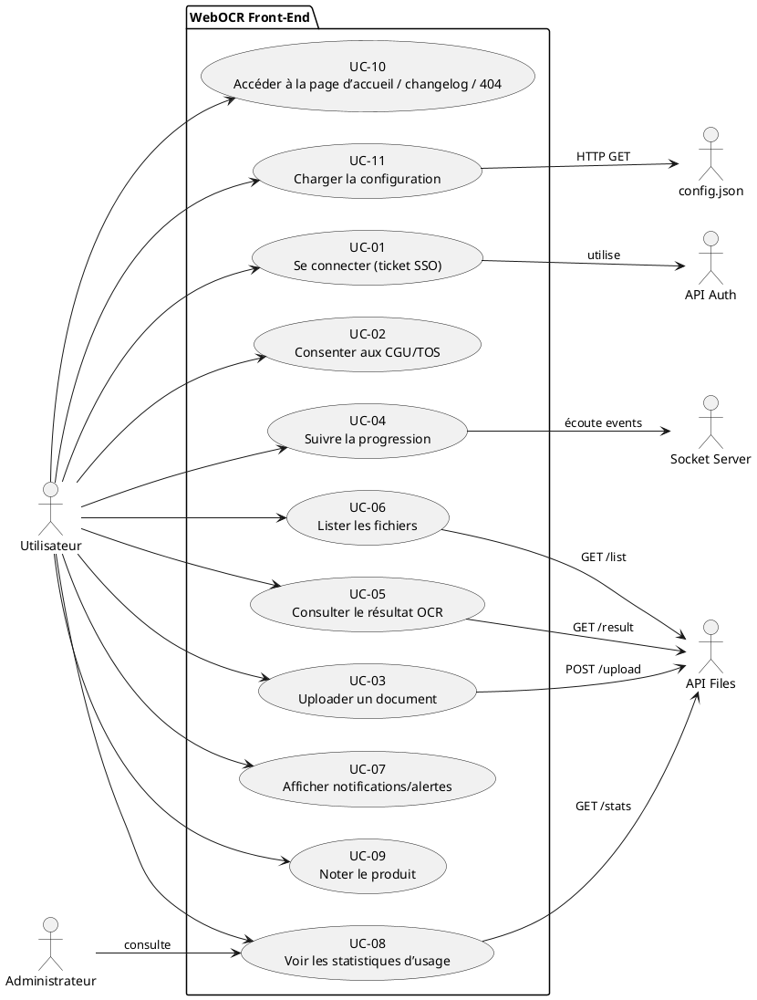
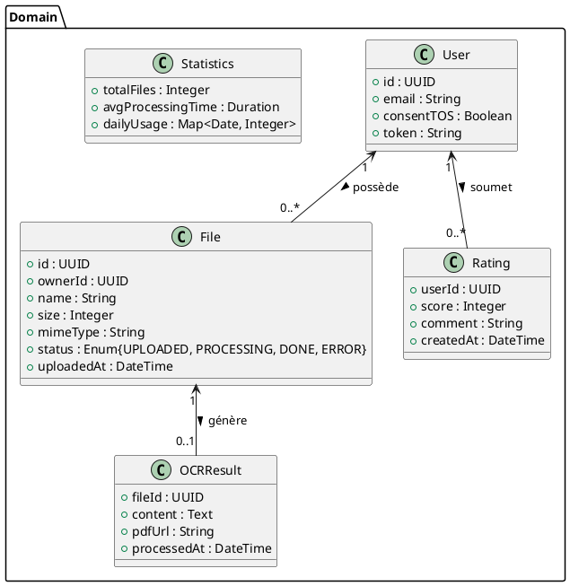

# 📄 Cahier des Charges Fonctionnel (CCF) – **WebOCR Front‑End (webocr‑front‑old)**
> **Version** : 1.0 – 2026‑04‑28  
> **Auteur** : Expert fonctionnel – Management par la valeur (NF EN 16271) & Ingénierie des exigences (ISO/IEC/IEEE 29148)  

[TOC]

---

## 1️⃣ Introduction et contexte du projet {#introduction}
| Élément | Description |
|---|---|
| **Nom du projet** | **WebOCR – Interface front‑end** |
| **Périmètre** | Application web SPA (Vue 3 + Vite) permettant aux utilisateurs authentifiés de soumettre des documents (images / PDF) à un service OCR, de suivre le traitement en temps réel, de consulter les résultats et d’interagir avec les fonctions d’assistance, de statistiques et de notation. |
| **Exclusions** | • Implémentation du moteur OCR (service back‑end) <br>• Gestion de l’infrastructure serveur (hors Docker / NGINX) <br>• Gestion de la base de données du back‑end |
| **Environnement** | • Déploiement Docker (NGINX) <br>• Front‑end construit avec Vue 3, TailwindCSS, Vite <br>• Communication HTTP/REST + Socket.io <br>• Configuration dynamique via `config.json` |
| **Objectifs stratégiques** | 1. **Accessibilité** – Offrir une interface simple, responsive et conforme RGAA / WCAG 2.1. <br>2. **Performance** – Temps de chargement < 3 s en production, traitement en temps réel via WebSocket. <br>3. **Sécurité & conformité** – Authentification SSO, consentement TOS, respect RGPD. <br>4. **Valeur métier** – Accélérer la digitalisation des documents pour les services publics, réduire le temps de traitement manuel de ≥ 30 %. |
| **Livrables attendus** | • Code source front‑end (déjà fourni) <br>• Documentation fonctionnelle (présente) <br>• Jeux de tests d’acceptation <br>• Diagrammes UML/BPMN <br>• Glossaire & référentiels |

↩︎ [Retour au sommaire](#toc)

---

## 2️⃣ Expression fonctionnelle du besoin (NF EN 16271) {#besoin}
> **Principe** : chaque fonction de service décrit le **« quoi »** (besoin) sans préciser le **« comment »** (solution technique).

| # | Fonction de service (FS) | Description (quoi) | Critères d’appréciation (mesurables) | Pondération (importance) | Contraintes associées |
|---|---|---|---|---|---|
| **FS‑1** | **Gestion de l’authentification** | Permettre à un utilisateur de s’identifier via un ticket SSO et de disposer d’une session valide pendant toute la navigation. | • Temps de connexion < 2 s <br>• Taux de réussite ≥ 99 % <br>• Session expirée automatiquement après 30 min d’inactivité | **0.12** | - Utilisation du service `/auth/login` <br>- Stockage du token en cookie httpOnly |
| **FS‑2** | **Consentement aux CGU/TOS** | Collecter le consentement explicite de l’utilisateur avant toute utilisation du service OCR. | • 100 % des nouveaux comptes affichent le modal « Disclaimer » <br>• Consentement enregistré dans le profil utilisateur | **0.08** | - Modal « Disclaimer.vue » obligatoire au premier accès |
| **FS‑3** | **Upload de documents** | Autoriser l’utilisateur à déposer un ou plusieurs fichiers (image / PDF) à soumettre au service OCR. | • Taille maximale 20 Mo par fichier <br>• Formats acceptés : `pdf, jpg, jpeg, png, tiff` <br>• Taux d’erreur d’upload ≤ 2 % | **0.15** | - Vérification côté client du type et de la taille <br>- Utilisation de l’API `/files/upload` |
| **FS‑4** | **Suivi de la progression** | Afficher en temps réel l’état d’avancement du traitement OCR pour chaque fichier. | • Rafraîchissement ≤ 1 s via WebSocket <br>• Affichage correct du % de progression <br>• Pas d’incohérence entre back‑end et UI | **0.10** | - Utilisation du socket configuré (`socket.io`) |
| **FS‑5** | **Consultation du résultat OCR** | Permettre à l’utilisateur de visualiser le texte extrait et/ou le PDF annoté, et de le télécharger. | • Disponibilité du résultat ≤ 5 s après fin de traitement <br>• Qualité d’affichage ≥ 95 % (pas de coupure de texte) | **0.12** |
| **FS‑6** | **Gestion de la liste des fichiers** | Lister les documents déjà soumis, avec statut (en cours, terminé, erreur) et actions (télécharger, supprimer). | • Chargement de la liste < 2 s <br>• Mise à jour dynamique après chaque événement | **0.09** |
| **FS‑7** | **Affichage des notifications & alertes** | Informer l’utilisateur de messages système (maintenance, erreurs, succès). | • Temps d’affichage ≤ 5 s <br>• Taux de visibilité ≥ 99 % (pas de masquage involontaire) | **0.07** |
| **FS‑8** | **Accès aux statistiques d’usage** | Présenter, via un modal, des indicateurs agrégés (nombre de documents traités, temps moyen, etc.). | • Données mises à jour quotidiennement <br>• Temps d’affichage du modal ≤ 1 s | **0.05** |
| **FS‑9** | **Notation du produit** | Collecter un avis utilisateur (étoiles, commentaire) via la vue `Ratings`. | • Au moins 30 % des utilisateurs actifs donnent un avis <br>• Enregistrement du feedback dans le back‑end | **0.04** |
| **FS‑10** | **Gestion du contenu statique (Home, Changelog, 404)** | Fournir des pages d’accueil, de suivi des évolutions et de gestion d’erreur 404. | • Temps de rendu < 1 s <br>• Conformité aux exigences d’accessibilité | **0.03** |
| **FS‑11** | **Configuration dynamique** | Charger les paramètres (URLs, sockets, mailto, …) depuis `config.json` au démarrage. | • Chargement complet < 500 ms <br>• Gestion d’erreur si le fichier est indisponible | **0.04** |

> **Total pondération** = 1.00 (100 %)

↩︎ [Retour au sommaire](#toc)

---

## 3️⃣ Acteurs et parties prenantes {#acteurs}
| Acteur | Rôle | Objectifs | Besoins spécifiques |
|---|---|---|---|
| **Utilisateur final** (citoyen, agent public) | Consommateur du service OCR | Convertir rapidement des documents papier en texte exploitable | Interface claire, assistance, respect de la vie privée |
| **Administrateur système** | Exploitant de l’infrastructure | Garantir disponibilité, sécurité et mise à jour du front‑end | Accès aux logs, configuration, statistiques d’usage |
| **MOA (Maître d’Ouvrage)** | Commanditaire métier | Fournir un service public de digitalisation | Respect du cahier des charges fonctionnel, conformité RGPD |
| **MOE (Maître d’Œuvre)** | Équipe de développement front‑end | Implémenter, tester et livrer le produit | Documentation technique, exigences fonctionnelles détaillées |
| **API Auth** (service back‑end) | Fournisseur d’authentification | Authentifier les utilisateurs via ticket SSO | Interface REST `/auth/*` |
| **API Files** (service back‑end) | Fournisseur de traitement OCR | Recevoir les fichiers, lancer le traitement, renvoyer les résultats | End‑points `/files/*` |
| **Socket.io Server** | Canal temps réel | Notifier l’avancement du traitement | Émission d’événements `progress`, `completed`, `error` |
| **RSSI** | Responsable sécurité de l’information | Assurer la conformité aux exigences de sécurité | Gestion des cookies, chiffrement HTTPS, politique CORS |
| **DPO (Data Protection Officer)** | Garant de la conformité RGPD | Superviser le traitement des données personnelles | Consentement, droit à l’effacement, registre des traitements |

↩︎ [Retour au sommaire](#toc)

---

## 4️⃣ Cas d’usage (Use Cases) {#usecases}
### 4.1 Diagramme de cas d’utilisation (PlantUML)



### 4.2 Tableau récapitulatif des cas d’usage

| ID | Nom du cas d’usage | Acteur(s) principal(s) | Scénario nominal (description) | Scénarios alternatifs / d’erreur | Pré‑conditions | Post‑conditions |
|---|---|---|---|---|---|---|
| **UC‑01** | Se connecter (ticket SSO) | Utilisateur | L’utilisateur fournit un ticket SSO → l’API `/auth/login` renvoie un token → le token est stocké en cookie. | 1. Ticket invalide → affichage d’une alerte d’erreur.<br>2. Service Auth indisponible → message de maintenance. | Token présent dans le store. | Session active, navigation autorisée. |
| **UC‑02** | Consenter aux CGU/TOS | Utilisateur | Au premier accès, le modal *Disclaimer* s’affiche → l’utilisateur clique “J’accepte” → le consentement est enregistré via `/auth/consentToTos`. | Refus du consentement → redirection vers page d’information, accès bloqué. | Aucun consentement préalable. | Consentement persistant dans le profil. |
| **UC‑03** | Uploader un document | Utilisateur | L’utilisateur glisse‑dépose ou sélectionne un fichier → le composant `Upload.vue` envoie le fichier à `/files/upload` → le serveur renvoie un ID de job. | Fichier > 20 Mo ou format non supporté → message d’erreur immédiat. | Authentification valide, consentement accepté. | Job créé, ID stocké dans le store `files`. |
| **UC‑04** | Suivre la progression | Utilisateur | Le composant `FilesInProgress.vue` écoute le socket `progress` → mise à jour du pourcentage dans la barre `ProgressBar.vue`. | Perte de connexion socket → tentative de reconnexion, affichage d’une alerte. | Job en cours créé (UC‑03). | Barre de progression à 100 % ou état d’erreur. |
| **UC‑05** | Consulter le résultat OCR | Utilisateur | Après le `progress = 100%`, le composant `UserFileList.vue` propose “Voir résultat” → appel `/files/result/{id}` → affichage du texte ou PDF annoté. | Résultat indisponible (erreur serveur) → affichage d’une alerte et bouton “Réessayer”. | Traitement terminé (UC‑04). | Résultat affiché, possibilité de téléchargement. |
| **UC‑06** | Lister les fichiers | Utilisateur | Au chargement de la vue `UserFileList.vue`, le store `files` interroge `/files/list` → tableau affiché avec statut et actions. | Aucun fichier → affichage d’un message “Aucun document”. | Authentification valide. | Liste à jour, actions disponibles. |
| **UC‑07** | Afficher notifications/alertes | Système | Tout événement (succès, erreur, maintenance) déclenche le composant `Alert.vue` qui s’affiche en haut de l’écran. | Aucun. | Aucun. | Notification visible pendant la durée configurée. |
| **UC‑08** | Voir les statistiques d’usage | Utilisateur / Administrateur | L’utilisateur clique “Accéder aux statistiques d’utilisation” → le modal `Statistics.vue` charge `/files/stats`. | Service indisponible → message d’erreur. | Authentification valide. | Modal affiché avec graphiques. |
| **UC‑09** | Noter le produit | Utilisateur | L’utilisateur se rend sur la vue `Ratings.vue`, sélectionne une note et soumet → POST `/ratings`. | Aucun. | Authentification valide. | Feedback enregistré. |
| **UC‑10** | Accéder aux pages statiques | Utilisateur | Navigation via le `MainMenu` ou saisie d’URL → rendu de `Home.vue`, `Changelog.vue` ou `NotFound.vue`. | URL inconnue → `NotFound.vue`. | Aucun. | Page affichée correctement. |
| **UC‑11** | Charger la configuration | Système (au démarrage) | `main.js` effectue `GET /config.json` → valeurs injectées dans le store `conf`. | `config.json` absent ou mal formé → affichage d’une alerte bloquante. | Aucun. | Configuration disponible dans le store. |

↩︎ [Retour au sommaire](#toc)

---

## 5️⃣ Processus métier (BPMN) {#processus}
> **Optionnel** – présenté sous forme PlantUML (compatible BPMN 2.0).

```plantuml
@startbpmn
!define RECTANGLE class
start
:Chargement de la configuration;
if (config OK ?) then (yes)
  :Authentification (ticket SSO);
  if (auth OK ?) then (yes)
    :Consentement CGU?;
    if (consent OK ?) then (yes)
      :Afficher tableau de bord;
      :Uploader document;
      :Créer job OCR;
      :Écouter socket progress;
      if (progress = 100%) then (yes)
        :Récupérer résultat;
        :Afficher résultat;
      else (error)
        :Notifier erreur;
      endif
    else (no)
      :Bloquer accès, afficher modal;
    endif
  else (no)
    :Afficher erreur d’auth;
  endif
else (no)
  :Afficher erreur de config;
endif
stop
@endbpmn
```

↩︎ [Retour au sommaire](#toc)

---

## 6️⃣ Règles métier et contraintes fonctionnelles {#regles}
| # | Règle métier (condition → action) | Source / Référentiel |
|---|---|---|
| **R‑1** | Si l’utilisateur n’a pas consenti aux CGU, alors le modal *Disclaimer* doit être affiché avant tout autre écran. | NF EN 16271 – Priorité = Haute |
| **R‑2** | Si le fichier dépasse 20 Mo **ou** n’est pas de type `pdf|jpg|jpeg|png|tiff`, alors le composant `Upload.vue` refuse l’upload et affiche un message d’erreur. | ISO/IEC 29148 – Contraintes de validation |
| **R‑3** | Si le token d’authentification est absent ou expiré, alors le routeur doit rediriger vers `/login` (ou afficher l’écran de connexion). | Sécurité – OWASP ASVS V4 |
| **R‑4** | Tous les cookies doivent être déclarés dans la politique de confidentialité et marqués `SameSite=Strict`. | RGPD Art. 5, RGS |
| **R‑5** | Le service doit être accessible WCAG 2.1 niveau AA (contraste, navigation clavier, ARIA). | RGAA 3.0 |
| **R‑6** | En cas d’échec du serveur `/files/upload`, le front‑end doit proposer un bouton “Réessayer”. | ISO 29148 – Gestion des erreurs |
| **R‑7** | Le socket doit être fermé proprement lors du logout ou de la fermeture de l’onglet. | Bonnes pratiques Socket.io |
| **R‑8** | La page d’erreur 404 doit rediriger automatiquement vers la page d’accueil après 10 s si l’utilisateur ne clique pas. | Expérience utilisateur |
| **R‑9** | Le modal *Statistics* ne doit être visible qu’aux utilisateurs authentifiés. | Sécurité fonctionnelle |
| **R‑10** | Le fichier `config.json` doit contenir les clés `urls.api`, `socket.url`, `socket.path`, `conf.mailto`. | Contrat technique |

↩︎ [Retour au sommaire](#toc)

---

## 7️⃣ Parcours utilisateurs (User Journey) {#journey}
| Étape | Action utilisateur | Point de contact UI | Critères d’acceptation (Gherkin) |
|---|---|---|---|
| **1. Accès** | Ouvre l’URL du service | Page `index.html` → `<div id="app">` | `Given` l’utilisateur ouvre l’URL <br>`When` le fichier `config.json` est chargé <br>`Then` l’application démarre sans erreur |
| **2. Authentification** | Fournit le ticket SSO (via URL ou redirection) | `main.js` → appel `/auth/login` | `Given` un ticket valide <br>`When` la réponse contient un token <br>`Then` le token est stocké et l’utilisateur est redirigé vers `/home` |
| **3. Consentement** | Lit et accepte les CGU | Modal `Disclaimer.vue` | `Given` aucune consentement enregistré <br>`When` l’utilisateur clique “J’accepte” <br>`Then` le consentement est persistant |
| **4. Upload** | Sélectionne un fichier PDF | Composant `Upload.vue` (drag‑&‑drop) | `Given` un fichier ≤ 20 Mo et de bon type <br>`When` l’utilisateur confirme l’upload <br>`Then` le fichier est envoyé et un job ID est créé |
| **5. Suivi** | Observe la barre de progression | `ProgressBar.vue` + `FilesInProgress.vue` | `Given` un job en cours <br>`When` le serveur envoie des événements `progress` <br>`Then` la barre reflète le % exact |
| **6. Résultat** | Clique “Voir résultat” | `UserFileList.vue` → `Result.vue` | `Given` le job est terminé <br>`When` l’utilisateur ouvre le résultat <br>`Then` le texte ou le PDF annoté s’affiche, avec bouton “Télécharger” |
| **7. Statistiques** | Ouvre le modal “Statistiques” | `Footer.vue` → `Statistics.vue` | `Given` l’utilisateur est connecté <br>`When` il clique le lien <br>`Then` le modal affiche les KPI en moins d’une seconde |
| **8. Notation** | Donne une note | `Ratings.vue` | `Given` l’utilisateur a utilisé le service <br>`When` il soumet une note <br>`Then` le feedback est enregistré et un message de remerciement apparaît |
| **9. Déconnexion** | Clique “Déconnexion” (non présent dans le code mais prévu) | `Header.vue` (future) | `Given` l’utilisateur est connecté <br>`When` il déclenche le logout <br>`Then` le token est supprimé, le socket fermé, redirection vers `/login` |

↩︎ [Retour au sommaire](#toc)

---

## 8️⃣ Modèle Conceptuel de Données (MCD) {#mcd}
> Diagramme de classes UML abstrait (sans détails techniques).



**Notes**  
- Les relations sont logiques (possède, génère, soumet).  
- Aucun champ technique (clé primaire, index) n’est détaillé (conformité MCD).  

↩︎ [Retour au sommaire](#toc)

---

## 9️⃣ Critères d’acceptation et validation {#acceptation}
| Fonction de service | Critère d’acceptation | Méthode de validation | Responsable | Priorité (MoSCoW) |
|---|---|---|---|---|
| **FS‑1** | Authentification réussie en < 2 s, token stocké. | Tests automatisés (Cypress) + revue de logs serveur. | MOE | **M** |
| **FS‑2** | Modal Disclaimer affiché au 1er accès, consentement persistant. | Test UI + vérification base de données. | MOE | **M** |
| **FS‑3** | Upload accepté uniquement pour fichiers ≤ 20 Mo et formats autorisés. | Tests unitaires `Upload.vue`, tests d’intégration API. | MOE | **M** |
| **FS‑4** | Progression mise à jour chaque seconde via socket. | Simulations de charge, capture de paquets. | MOE | **M** |
| **FS‑5** | Résultat disponible ≤ 5 s après fin de traitement. | End‑to‑end test (upload → résultat). | MOE | **M** |
| **FS‑6** | Liste des fichiers affichée en < 2 s, rafraîchissement dynamique. | Test de performance (Lighthouse) + UI test. | MOE | **S** |
| **FS‑7** | Alertes visibles pendant 5 s, aucune perte d’information. | Vérification manuelle + test automatisé. | MOE | **S** |
| **FS‑8** | Statistiques affichées en < 1 s, données cohérentes. | Test de charge sur endpoint `/files/stats`. | MOE | **C** |
| **FS‑9** | Au moins 30 % des utilisateurs actifs donnent un avis. | Analyse d’usage post‑déploiement (Google Analytics). | MOA | **C** |
| **FS‑10** | Pages statiques (Home, Changelog, 404) conformes WCAG 2.1 AA. | Audit d’accessibilité (axe‑core). | RSSI/DPO | **C** |
| **FS‑11** | Configuration chargée en < 500 ms, fallback sur erreur. | Test d’intégration `config.json`. | MOE | **M** |

> **M** = Must, **S** = Should, **C** = Could  

↩︎ [Retour au sommaire](#toc)

---

## 🔟 Annexes {#annexes}
### 10.1 Glossaire
| Terme | Définition |
|---|---|
| **Ticket SSO** | Jeton d’authentification unique fourni par le système d’identité (ex. CAS, OpenID). |
| **Modal** | Fenêtre superposée (dialog) affichée au-dessus du contenu principal. |
| **Socket.io** | Bibliothèque JavaScript permettant la communication bidirectionnelle en temps réel (WebSocket). |
| **ProgressBar** | Composant visuel indiquant le pourcentage d’avancement d’une tâche. |
| **RGPD** | Règlement Général sur la Protection des Données (UE). |
| **WCAG 2.1 AA** | Niveau de conformité d’accessibilité Web. |
| **BPMN** | Business Process Model and Notation – norme ISO 19510. |
| **PlantUML** | Outil texte‑to‑diagramme compatible avec UML/BPMN. |
| **MoSCoW** | Méthode de priorisation (Must, Should, Could, Won’t). |

### 10.2 Référentiels et normes applicables
| Référence | Intitulé | Application |
|---|---|---|
| **NF EN 16271** | Management par la valeur – Expression fonctionnelle du besoin | Structure du CCF, fonctions de service, critères d’appréciation |
| **ISO/IEC/IEEE 29148:2018** | Ingénierie des exigences | Définition des exigences, traçabilité, gestion des exigences |
| **ISO/IEC 19505** | UML 2.x | Diagrammes de cas d’usage, classe, séquence (PlantUML) |
| **ISO/IEC 19510** | BPMN 2.0 | Diagramme de processus métier |
| **RGPD (UE)** | Règlement général sur la protection des données | Gestion des cookies, consentement, droit à l’effacement |
| **RGAA 3.0** | Référentiel Général d’Amélioration de l’Accessibilité | Accessibilité front‑end |
| **OWASP ASVS 4.0** | Application Security Verification Standard | Sécurité des API, gestion des sessions |
| **WCAG 2.1 AA** | Web Content Accessibility Guidelines | Conception UI/UX |

### 10.3 Historique des versions du CCF
| Version | Date | Auteur | Modifications |
|---|---|---|---|
| 1.0 | 2026‑04‑28 | Expert fonctionnel | Document initial – structuration complète, diagrammes, critères d’acceptation |
| — | — | — | — |

↩︎ [Retour au sommaire](#toc)

--- 

*Fin du Cahier des Charges Fonctionnel – WebOCR Front‑End*  