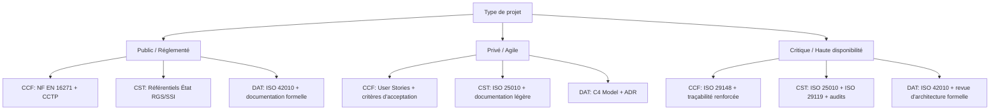
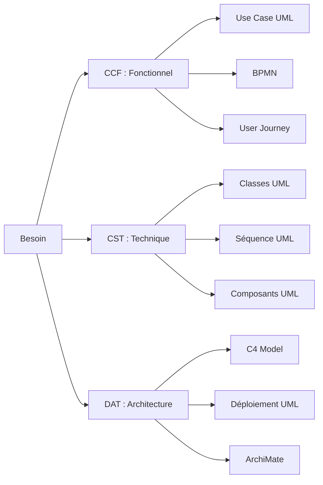

# Types de documents de reverse

Les projets liés à l’intelligence artificielle portent principalement sur deux axes :  
  
- la mise en place d’un outil de rétrodocumentation automatisée permettant de générer de la documentation technico-fonctionnelle (CST, CCF, DAT, etc.) ;  
 - la poursuite du projet WikiSI IA, qui vise à développer un chatbot intelligent dédié au système d’information.  

### 📋 CCF — Cahier des Charges Fonctionnel

Le **Cahier des Charges Fonctionnel** est un document qui présente de manière détaillée et structurée les attendus d'un projet (services, produit) et ses contraintes (techniques, managériales, contextuelles)

www.manager-go.com

.

- **Objectif** : Définir **CE QUE** le système doit faire
- **Public cible** : Maître d'ouvrage, AMOA, utilisateurs finaux
- **Contenu** : Fonctionnalités, cas d'usage, règles métier, parcours utilisateur, critères d'acceptation
- **Langage** : Compréhensible par les non-techniques

### ⚙️ CST — Cahier des Spécifications Techniques

Le **Cahier des Spécifications Techniques** est un document de référence destiné aux développeurs, intégrateurs et architectes techniques, qui décrit **COMMENT** le système sera construit

definitions-digital.com

.

- **Objectif** : Définir **COMMENT** le système va être réalisé
- **Public cible** : Développeurs, architectes, prestataires techniques
- **Contenu** : Technologies utilisées, architecture logicielle, environnements (dev/staging/prod), intégrations externes (API, SSO), standards de code, contraintes de performance, sécurité, hébergement
- **Langage** : Technique, orienté développement

### 🏗️ DAT — Dossiers d'Architecture Technique (comme vous l'avez indiqué)

Les **Dossiers d'Architecture Technique** documentent l'architecture globale du système :

- Schémas d'architecture (composants, flux de données, interfaces)
- Choix architecturaux justifiés
- Modèles de données, API, patterns utilisés
- Documentation des décisions techniques (ADR - Architecture Decision Records)

### 🔗 Complémentarité dans un projet informatique

|Document|Question clé|Phase du projet|
|---|---|---|
|**CCF**|_Quoi ?_ (besoins fonctionnels)|Cadrage / Expression du besoin|
|**CST**|_Comment ?_ (spécifications techniques)|Conception technique|
|**DAT**|_Quelle architecture ?_ (structure globale)|Architecture / Design|

Ces trois documents forment une chaîne de traçabilité essentielle : le CCF exprime le besoin métier, le CST le traduit en exigences techniques exploitables par les équipes de développement, et le DAT assure la cohérence architecturale globale du système.

> 💡 **Bon à savoir** : Dans certaines organisations, vous pourrez aussi rencontrer les acronymes **CSF** (Cahier des Spécifications Fonctionnelles, synonyme de CCF) ou **CCTP** (Cahier des Clauses Techniques Particulières, proche du CST dans les marchés publics).

## 📋 Standards et normes pour les documents CCF, CST et DAT

Il existe des cadres normatifs et des bonnes pratiques pour ces documents, bien que leur application varie selon le contexte (secteur public/privé, taille de l'organisation, méthodologie projet).

### 🔹 Pour le CCF — Cahier des Charges Fonctionnel

**Norme française de référence :**

- **NF EN 16271** (février 2013) : _Management par la valeur — Expression fonctionnelle du besoin et cahier des charges fonctionnel_
    
    www.kicklox.com
    
    fr.wikipedia.org
    
    . Cette norme a remplacé l'ancienne **NF X50-151**.
- Elle encadre l'expression et la validation du besoin dans un processus d'acquisition ou de développement
    
    www.kicklox.com
    
    .

**Principes clés de la norme :**

- Décomposition logique des besoins pour isoler les fonctions de service
- Distinction claire entre _besoin_ (quoi) et _solution_ (comment)
- Critères d'appréciation et de pondération pour l'évaluation des offres

**Autres référentiels utiles :**

- **ISO/IEC/IEEE 29148** : Ingénierie des exigences logicielles (cadre international)
- Méthodes agiles : User Stories, critères d'acceptation (Given/When/Then)

---

### 🔹 Pour le CST — Cahier des Spécifications Techniques

Il n'existe pas de norme française dédiée spécifiquement au "CST" en tant que tel, mais plusieurs référentiels s'appliquent :

**Normes internationales pertinentes :**

- **ISO/IEC/IEEE 29119** : Série de normes pour les tests logiciels, incluant des modèles de documentation technique
   
    www.iso.org
    
- **ISO/IEC 25010** : Modèle de qualité des produits logiciels (fonctionnalité, performance, sécurité, maintenabilité, etc.)
    
    www.techniques-ingenieur.fr
    
- **ISO/IEC/IEEE 42010** (ex-IEEE 1471) : Description d'architecture des systèmes logiciels — définit un cadre pour documenter les vues architecturales
    
    en.wikipedia.org
    
    www.oreilly.com
    

**Dans le secteur public français :**

- **CCTP** (Cahier des Clauses Techniques Particulières) : cadre réglementé par le Code de la commande publique
    
    www.legifrance.gouv.fr
    
- Référentiels de l'État : RGS (Référentiel Général de Sécurité), SSI, RGPD

---

### 🔹 Pour le DAT — Dossier d'Architecture Technique

Aucune norme française ne porte spécifiquement le nom "DAT", mais plusieurs standards internationaux structurent sa rédaction :

**Standards d'architecture logicielle :**

- **ISO/IEC/IEEE 42010** : Cadre pour décrire l'architecture d'un système (vues, viewpoints, stakeholders)
    
    www.oreilly.com
    
- **C4 Model** (non normé mais largement adopté) : Context, Containers, Components, Code — pour structurer les schémas d'architecture
- **ADR** (Architecture Decision Records) : pratique pour documenter les choix techniques et leur justification

**Bonnes pratiques observées en France :**

- Structuration en couches : Métier / Applicative / Infrastructure / Sécurité / Opérationnelle
    
    insidegroup.fr
    
- Utilisation de diagrammes UML, ArchiMate ou C4 pour la visualisation
- Maintenance du DAT comme document "vivant", mis à jour au fil des évolutions
    
    insidegroup.fr
    

---

### 🧭 Synthèse : Quel cadre utiliser selon votre contexte ?

|Contexte|Recommandation|
|---|---|
|**Projet public / marché**|NF EN 16271 (CCF) + CCTP (CST) + référentiels État (RGS, SSI)|
|**Projet privé / agile**|User Stories + critères d'acceptation + ADR + C4 Model|
|**Système critique / réglementé**|ISO/IEC 25010 (qualité) + ISO/IEC/IEEE 42010 (architecture) + ISO 29119 (tests)|
|**Documentation interne**|Adapter les modèles aux besoins de l'équipe, privilégier la lisibilité et la maintenabilité|

> 💡 **Conseil pratique** : Plutôt que de chercher à appliquer rigidement une norme, privilégiez une approche pragmatique : définissez un **template interne validé** par vos équipes (MOA, MOE, architecture, sécurité), aligné sur les exigences métier et réglementaires de votre organisation. L'important est la **traçabilité** entre besoin (CCF), conception (CST) et architecture (DAT), plus que le respect formel d'un standard.

## 📊 Comparaison des normes par type de document

Voici un tableau synthétique comparant les cadres normatifs applicables aux documents **CCF**, **CST** et **DAT**, avec leur portée, origine et niveau d'adoption.

---

### 🔹 Tableau comparatif des normes

| Document | Norme / Standard | Origine | Statut | Portée principale |
|----------|-----------------|---------|--------|------------------|
| **CCF** | **NF EN 16271** (2013) | AFNOR / CEN | ✅ Norme française en vigueur | Expression fonctionnelle du besoin, management par la valeur [[1]][[8]] |
| **CCF** | **ISO/IEC/IEEE 29148:2018** | ISO / IEEE | ✅ Standard international | Ingénierie des exigences tout au long du cycle de vie [[13]][[14]] |
| **CST** | **ISO/IEC/IEEE 29119** (série) | ISO / IEEE | ✅ Standard international | Documentation des tests, vocabulaire et processus de validation [[49]][[54]] |
| **CST** | **ISO/IEC 25010:2023** | ISO / IEC | ✅ Standard international | Modèle de qualité produit logiciel (fonctionnalité, performance, sécurité…) [[30]][[32]] |
| **CST** | **CCTP** (Code commande publique) | Législation FR | ✅ Cadre réglementaire | Spécifications techniques dans les marchés publics [[45]][[47]] |
| **DAT** | **ISO/IEC/IEEE 42010:2022** | ISO / IEEE | ✅ Standard international | Description d'architecture : vues, viewpoints, stakeholders [[21]][[25]] |
| **DAT** | **C4 Model** | Communauté (Simon Brown) | 🔄 Bonne pratique largement adoptée | Visualisation hiérarchique de l'architecture (Context → Code) [[78]][[82]] |
| **DAT** | **ADR** (Architecture Decision Record) | Communauté open source | 🔄 Pratique agile recommandée | Documentation structurée des décisions techniques et de leur justification [[88]][[94]] |
| **Tous** | **RGS / SSI / RGPD** | ANSSI / État français | ✅ Référentiels réglementaires | Sécurité, protection des données, conformité sectorielle [[70]][[76]] |

---

### 🔹 Analyse par document

#### 📋 CCF — Cahier des Charges Fonctionnel

| Critère | NF EN 16271 | ISO/IEC/IEEE 29148 |
|---------|-------------|-------------------|
| **Focus** | Expression du besoin & management par la valeur | Ingénierie des exigences système/logiciel |
| **Public** | MOA, AMOA, acheteurs publics | Ingénieurs exigences, chefs de projet |
| **Contenu clé** | Fonctions de service, critères d'appréciation, pondération | Processus de collecte, analyse, validation, traçabilité |
| **Avantage** | Cadre juridique français, adapté aux marchés publics | Approche cycle de vie complet, compatible agile/V-cycle |
| **Limite** | Moins détaillé sur les processus techniques | Plus complexe à mettre en œuvre sans expertise |

> 💡 **Recommandation** : Utiliser **NF EN 16271** pour les projets publics français, et **ISO 29148** pour les projets internationaux ou critiques.

---

#### ⚙️ CST — Cahier des Spécifications Techniques

| Critère | ISO 29119 | ISO 25010 | CCTP (marchés publics) |
|---------|-----------|-----------|------------------------|
| **Focus** | Documentation et processus de test | Modèle de qualité produit | Spécifications contractuelles |
| **Public** | Équipes QA, testeurs | Architectes, développeurs, MOE | Maîtrise d'ouvrage, prestataires |
| **Contenu clé** | Templates de documents de test, techniques de conception | 8 caractéristiques de qualité (fiabilité, maintenabilité, etc.) [[30]] | Exigences techniques, normes de référence, livrables |
| **Avantage** | Standardisation des livrables de test [[54]] | Cadre objectif pour évaluer la qualité logicielle [[32]] | Valeur contractuelle, cadre juridique clair [[47]] |
| **Limite** | Centré sur les tests, pas sur la conception globale | Ne prescrit pas de méthode de conception | Rigide, peu adapté aux projets agiles |

> 💡 **Recommandation** : Combiner **ISO 25010** (pour définir les critères de qualité) + **CCTP** (pour le cadre contractuel) + **ISO 29119-3** (pour les templates de documentation de test) [[56]].

---

#### 🏗️ DAT — Dossier d'Architecture Technique

| Critère | ISO/IEC/IEEE 42010 | C4 Model | ADR |
|---------|-------------------|----------|-----|
| **Focus** | Cadre formel de description d'architecture | Visualisation pragmatique à 4 niveaux | Documentation des décisions techniques |
| **Public** | Architectes enterprise, auditeurs | Équipes de développement, stakeholders techniques | Développeurs, tech leads, architectes |
| **Contenu clé** | Vues, viewpoints, concerns, architecture description [[21]] | Context → Container → Component → Code [[78]] | Problème, décision, alternatives, conséquences [[88]] |
| **Avantage** | Exhaustif, adapté aux systèmes critiques | Simple, lisible, facile à maintenir | Léger, itératif, favorise la traçabilité des choix |
| **Limite** | Lourdeur, courbe d'apprentissage | Non normé, subjectivité possible dans les diagrammes | Nécessite une discipline d'équipe pour être utile |

> 💡 **Recommandation** : Utiliser **ISO 42010** comme cadre de référence, **C4 Model** pour la communication visuelle, et **ADR** pour documenter les décisions évolutives [[25]][[82]][[94]].

---

### 🔹 Synthèse : Quelle norme choisir selon votre contexte ?

---

### 🔹 Points de vigilance transverses

1. **Traçabilité** : Quelle que soit la norme, assurez un lien clair entre CCF → CST → DAT pour éviter les dérives de périmètre.
2. **Maintenabilité** : Privilégiez des documents "vivants" (wiki, outils collaboratifs) plutôt que des PDF figés.
3. **Adaptation** : Aucune norme ne doit être appliquée de façon dogmatique : adaptez le niveau de formalisme à la criticité du projet.
4. **Conformité sectorielle** : Dans la santé, la finance ou le secteur public, vérifiez les référentiels spécifiques (HDS, PCI-DSS, RGS, RGPD…).

> 🎯 **En résumé** :  
> - **CCF** : NF EN 16271 (France) ou ISO 29148 (international)  
> - **CST** : ISO 25010 (qualité) + ISO 29119 (tests) + CCTP si marché public  
> - **DAT** : ISO 42010 (cadre) + C4 Model (visuel) + ADR (décisions)  

## 📊 Liste des diagrammes par type de document et norme associée

Voici une synthèse structurée des diagrammes recommandés ou normés pour chaque type de document informatique, avec leur cadre de référence.

---

### 📋 CCF — Cahier des Charges Fonctionnel

| Diagramme | Norme / Standard | Objectif principal | Public cible |
|-----------|-----------------|------------------|-------------|
| **Diagramme de Cas d'Utilisation (Use Case)** | UML - ISO/IEC 19505 [[52]] | Représenter les interactions utilisateurs/système et les fonctionnalités attendues | MOA, AMOA, utilisateurs |
| **Diagramme BPMN (Business Process)** | BPMN - ISO/IEC 19510 [[25]][[26]] | Modéliser les processus métier et les flux fonctionnels | Métier, analystes fonctionnels |
| **Diagramme de Flux de Données (DFD)** | Pratique courante / Structured Analysis | Visualiser les flux d'information entre entités fonctionnelles | Analystes, architectes fonctionnels |
| **Diagramme d'Activités UML** | UML - ISO/IEC 19505 [[54]] | Décrire les enchaînements d'actions et règles de gestion | Équipes fonctionnelles |
| **User Story Mapping / Journey Map** | Agile / UX (non normé) | Illustrer les parcours utilisateurs et scénarios d'usage | Product Owners, UX designers |
| **Modèle Conceptuel de Données (MCD)** | Merise / UML Class (abstrait) [[77]][[79]] | Représenter les entités métier et leurs relations sans implémentation technique | Métier, MOA, architectes données |

> 💡 **Bon à savoir** : Le diagramme de cas d'utilisation permet de produire des scénarios écrits directement exploitables dans le CCF [[50]]. BPMN crée un pont standardisé entre conception métier et implémentation technique [[26]].

---

### ⚙️ CST — Cahier des Spécifications Techniques

| Diagramme | Norme / Standard | Objectif principal | Public cible |
|-----------|-----------------|------------------|-------------|
| **Diagramme de Classes UML** | UML - ISO/IEC 19505-2 [[86]][[91]] | Modéliser la structure statique des données et objets techniques | Développeurs, architectes |
| **Diagramme de Séquence UML** | UML - ISO/IEC 19505 [[68]][[69]] | Décrire les interactions temporelles entre objets/composants | Développeurs, intégrateurs |
| **Diagramme de Composants UML** | UML - ISO/IEC 19505 [[51]][[56]] | Représenter l'architecture modulaire et les dépendances logicielles | Architectes, DevOps |
| **Diagramme d'États-Transitions** | UML - ISO/IEC 19505 [[54]] | Spécifier les comportements réactifs et cycles de vie des objets | Développeurs backend |
| **Diagramme de Paquetages (Package)** | UML - ISO/IEC 19505 [[56]] | Organiser l'architecture en modules logiques et namespaces | Architectes, tech leads |
| **Diagramme de Communication/Collaboration** | UML - ISO/IEC 19505 [[9]] | Visualiser les échanges de messages entre instances | Équipes d'intégration |
| **Schémas d'API (OpenAPI/Swagger)** | OpenAPI Specification (non ISO) | Documenter les contrats d'interface REST/GraphQL | Développeurs frontend/backend |

> 💡 **Note** : UML 2.0 comporte treize types de diagrammes représentant autant de vues distinctes pour modéliser un système d'information [[54]]. Le diagramme de séquence est particulièrement utile pour décrire l'ordre des messages dans un cas d'usage technique [[74]].

---

### 🏗️ DAT — Dossier d'Architecture Technique

| Diagramme | Norme / Standard | Objectif principal | Niveau d'abstraction |
|-----------|-----------------|------------------|---------------------|
| **Diagramme de Déploiement UML** | UML - ISO/IEC 19505 [[57]][[59]] | Modéliser l'architecture physique : nœuds, serveurs, réseaux | Infrastructure / Exécution |
| **C4 Model - System Context** | C4 Model (communauté) [[28]][[30]] | Positionner le système dans son écosystème externe | Niveau 1 : Macro |
| **C4 Model - Container** | C4 Model (communauté) [[29]][[37]] | Zoomer sur les applications, bases de données, microservices internes | Niveau 2 : Application |
| **C4 Model - Component** | C4 Model (communauté) [[34]][[35]] | Détailler les composants logiques d'un conteneur | Niveau 3 : Module |
| **C4 Model - Code (optionnel)** | UML Class / Code généré | Illustrer l'implémentation d'un composant critique | Niveau 4 : Code |
| **Diagramme ArchiMate** | ArchiMate - The Open Group [[39]][[40]] | Modéliser l'architecture d'entreprise : Business/Application/Technology | Enterprise / Transverse |
| **Diagramme de Flux Technique** | Pratique courante / C4 / UML | Visualiser les flux de données, APIs, événements entre composants | Technique / Intégration |
| **Architecture Decision Record (ADR)** | Pratique agile (non normé) [[88]] | Documenter les choix architecturaux avec contexte et alternatives | Documentation vivante |

> 💡 **À retenir** : Le C4 Model a été créé pour aider les équipes à décrire l'architecture logicielle à différents niveaux de détail, comme des "cartes de votre code" [[37]]. ArchiMate définit un langage commun pour décrire les relations entre processus métier, systèmes IT et infrastructure technique [[39]].

---

### 🔗 Synthèse : Quel diagramme pour quel besoin ?

---

### 📚 Normes de référence par langage de modélisation

| Langage | Norme ISO/IEC | Organisme | Statut |
|---------|--------------|-----------|--------|
| **UML** | ISO/IEC 19505-1 & 19505-2 (UML 2.4.1) | OMG / ISO [[85]][[91]] | ✅ Norme internationale |
| **BPMN** | ISO/IEC 19510:2013 | OMG / ISO [[25]] | ✅ Norme internationale |
| **ArchiMate** | Standard The Open Group (pas d'ISO dédiée) | The Open Group [[40]] | 🔄 Standard industriel |
| **C4 Model** | Aucun (pratique communautaire) | Simon Brown / communauté [[30]] | 📝 Bonne pratique |
| **SysML** | ISO/IEC 19505 (profil UML) | OMG / ISO | ✅ Norme (systèmes complexes) |

---

### 🎯 Recommandations pratiques

1. **CCF** : Privilégiez **Use Case UML + BPMN** pour une expression fonctionnelle claire et standardisée [[52]][[26]].
2. **CST** : Combinez **Classes + Séquence + Composants UML** pour couvrir structure, comportement et modularité [[54]][[69]].
3. **DAT** : Adoptez le **C4 Model** pour la communication visuelle, complété par **Déploiement UML** pour l'infrastructure [[37]][[57]].
4. **Traçabilité** : Assurez un lien explicite entre les éléments des diagrammes CCF → CST → DAT (ex: un Use Case lié à une séquence technique, elle-même liée à un composant C4).
5. **Outillage** : Utilisez des outils supportant les standards (Enterprise Architect, Visual Paradigm, IcePanel pour C4, Camunda pour BPMN) pour garantir la conformité et la maintenabilité.

> ⚠️ **Attention** : Aucune norme ne remplace la clarté et l'adéquation au contexte. Adaptez le niveau de formalisme à la criticité du projet et aux compétences de vos équipes [[37]].

Souhaitez-vous que je vous propose un exemple concret de chaîne de diagrammes pour un cas d'usage type (ex: module de paiement) ?
