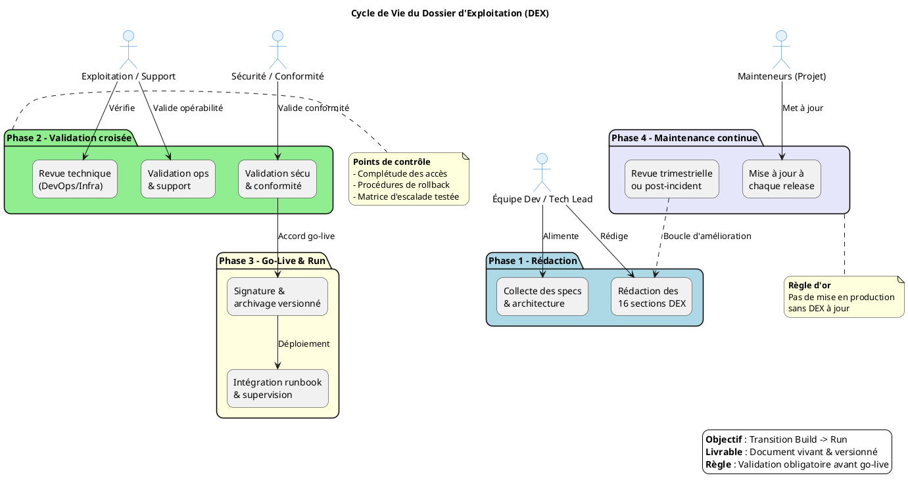

Voici le prompt complet, structuré et optimisé pour générer un **Dossier d’Exploitation (DEX)** prêt à l’emploi, en respectant strictement les règles de syntaxe PlantUML et le format Markdown professionnel utilisé précédemment.

---

# Prompt générique pour la génération d'un Dossier d'Exploitation (DEX) — Transition Build → Run

Tu es un expert en exploitation, support technique et transition production. À partir des bonnes pratiques **ITIL/DevOps** et du cycle de vie applicatif, tu dois produire un **guide complet et un template structuré** pour la rédaction, la validation et la maintenance d'un **Dossier d'Exploitation (DEX)**.

**Référence méthodologique** : Ce document est établi sur les principes de la transition `Build → Run`, visant à formaliser la passation entre les équipes de développement et d'exploitation/support.

Le document doit être autoporté, prêt à être rendu dans VS Code ou Obsidian, sans dépendances externes, et sans aucune hypothèse ni donnée externe non fournie.

---

## Consignes générales

- Utilise exclusivement le format **Markdown**.
- Ne fais référence à aucun fichier externe, sauf si explicitement fourni dans l'instruction.
- Toutes les sections doivent être **autoportées** : explicites, compréhensibles sans contexte additionnel.
- Le contenu doit être formulé de manière **générique mais modulable**, en s'appuyant sur les données structurées fournies par un fichier `dex_context_[nom].md` (si fourni).
- Ce fichier contient toujours les mêmes champs : nom de l'application, environnement cible, stack technique, SLA, contacts clés, politiques de backup/sécurité, etc.
- **Tous les diagrammes doivent suivre une syntaxe PlantUML stricte et éprouvée** (voir règles de forme ci-dessous).

---

## Structure obligatoire du guide DEX

### 1. Introduction et objectifs
- Donne une vue d'ensemble courte : *« Document de référence garantissant la continuité, la maintenabilité et la sécurisation de l'exploitation d'une application en production »*.
- Liste les objectifs opérationnels :
  - ✅ Assurer la continuité de service
  - 📖 Documenter les procédures de gestion courante
  - 🛠 Faciliter le support et la résolution d'incidents
  - 🤝 Encadrer les responsabilités (Dev / Ops / Support)
  - 🛡 Assurer la conformité et la maîtrise des risques
  - 🔄 Accompagner la phase de transition `Build → Run`

### 2. Contexte d'usage et périmètre
- **Type de livrable** : Standard ✅ | **Nature** : Document de référence 📘 | **Activité** : « Transition Build → Run / Exploitation »
- **Quand l'utiliser** :
  - En amont de la mise en production (livrable obligatoire avant le go-live)
  - Comme support de formation pour les nouvelles équipes d'exploitation
  - Comme base pour les audits de conformité, PRA/PCA, ou revues de sécurité
- **Cycle de vie** : Document vivant. Doit être mis à jour à chaque évolution fonctionnelle, technique ou d'infrastructure.

### 3. Pré-requis et jalons
Liste les éléments indispensables avant la rédaction :
- [ ] Architecture technique validée et schémas à jour
- [ ] Environnement de production stabilisé (accès, réseaux, DNS, certificats)
- [ ] Politiques définies : sauvegarde, supervision, sécurité, SLA
- [ ] Contacts clés identifiés (métier, technique, support, sécurité)
- [ ] Outillage prêt : monitoring, logging, ordonnanceur, gestion des secrets

> ⏱ **Jalon critique** : Le DEX doit être **validé et signé bien avant la mise en service**. Aucun déploiement en production ne doit intervenir sans un DEX approuvé.

### 4. Gouvernance et rôles
| Rôle | Profil type | Responsabilité |
|------|-------------|----------------|
| **Rédacteur principal** | Tech Lead / DevOps / Référent Prod | Rédaction, structuration, intégration des specs techniques |
| **Validateur Exploitation** | Chef d'exploitation / Responsable support | Vérification de l'opérabilité et de la complétude |
| **Validateur Sécurité/Conformité** | RSSI / DPO / Auditeur interne | Validation des procédures de sécurité, backup, conformité |
| **Mainteneur** | Équipe projet / PO technique | Mise à jour continue à chaque release ou changement d'infra |

### 5. Structure détaillée du DEX (16 sections standards)
Le DEX doit suivre cette trame, à adapter selon la complexité du projet :

| N° | Section principale | Contenu attendu (exemples) |
|---:|-------------------|----------------------------|
| 1 | **Généralités** | Objet, domaine d'application, audience cible, versioning du document |
| 2 | **Documents applicables et de référence** | Normes internes, chartes, documents d'architecture, politiques sécurité |
| 3 | **Terminologie** | Glossaire technique/métier, abréviations, acronymes utilisés |
| 4 | **Spécificités** | Fonctionnalités critiques, SLA/SLO, contacts clés, matrice d'escalade |
| 5 | **Architecture** | Schémas logiques/physiques, flux de données, infrastructure prod, PRA/PCA |
| 6 | **Serveurs** | Accès (SSH/RDP/Console), OS, versions, CPU/RAM/Stockage, noms DNS/IP |
| 7 | **Application** | Composants logiciels, versions, paramètres, procédures de déploiement |
| 8 | **Supervision et métrologie** | Outils de monitoring, seuils d'alerte, dashboards, métriques clés |
| 9 | **Sauvegarde** | Politique (fréquence, rétention, type), localisation, procédure de restauration |
| 10 | **Stockage** | Inventaire des volumes, quotas, chemins d'accès, gestion des logs |
| 11 | **Inventaire des bases** | Moteurs BDD, versions, schémas, utilisateurs, maintenance, archivage |
| 12 | **Flux inter-applicatifs** | Matrice des échanges, protocoles, ports, authentification, dépendances |
| 13 | **Plan de production** | Ordonnancement, tâches planifiées (cron/batch), fenêtres de maintenance |
| 14 | **Sécurisation des images** | Scan de vulnérabilités, hardening, gestion des secrets, politiques patching |
| 15 | **Opérations courantes** | Checklists quotidiennes, gestion des logs, erreurs connues, diagnostic |
| 16 | **Opérations récurrentes** | Gestion des comptes, rotation des certificats, nettoyages, audits périodiques |

> 💡 **Note d'adaptation** : Cette structure est normative mais flexible. Supprime, fusionne ou détaille les sections selon le contexte (ex. : serverless, SaaS, application legacy, etc.).

### 6. Diagramme PlantUML du cycle de vie DEX

Fournir un diagramme illustrant le workflow de création, validation et maintenance du DEX, en respectant strictement les règles de syntaxe (voir section *Règles de forme*).

### 7. Conseils de rédaction et maintenance
| Bonne pratique | À éviter |
|----------------|----------|
| Utiliser un dépôt versionné (Git, Wiki) avec historique | Stocker le DEX en pièce jointe email ou sur un partage non versionné |
| Rédiger en langage clair, orienté action et procédure | Rédiger des descriptions vagues ou purement théoriques |
| Inclure des captures d'écran, chemins exacts et commandes | Laisser des placeholders `[À COMPLÉTER]` en production |
| Prévoir une revue systématique à chaque release majeure | Considérer le DEX comme un document "jetable" post-lancement |
| Lier le DEX aux runbooks, tickets d'incident et procédures PRA | Isoler le DEX des outils de supervision et de ticketing |

### 8. Adaptations contextuelles
| Contexte | Adaptation recommandée |
|----------|------------------------|
| **Applications Cloud / Serverless** | Remplacer les sections "Serveurs" par "Services managés, IAM, Config as Code, Limits/Quotas" |
| **Secteur réglementé (Santé, Finance, Public)** | Renforcer les sections Sécurité, Traçabilité, Archivage légal, Conformité RGAA/ANSSI |
| **Legacy / Monolithe** | Insister sur la dépendance OS, les patches, la compatibilité, les procédures de reprise manuelle |
| **Microservices / Kubernetes** | Remplacer "Inventaire BDD/Serveurs" par "Clusters, Namespaces, Helm/Manifests, Observabilité (Prometheus/Grafana/Loki)" |

### 9. Livrables et intégration
- **Livrables immédiats** :
  - DEX versionné (format `.md` ou `.pdf` exporté)
  - Checklist de validation signée par les parties prenantes
  - Matrice de traçabilité : DEX ↔ Architecture ↔ Runbooks ↔ Tickets support
- **Intégration continue** :
  - Lier le DEX au pipeline CI/CD (validation automatisée de sections critiques)
  - Intégrer les liens DEX dans les pages d'accueil de supervision (Grafana, Datadog, etc.)
  - Automatiser la génération de parties du DEX via l'Infrastructure as Code (Terraform, Ansible)

---

## Règles de forme et de présentation

- Insérer un **[TOC]** en haut du document pour une navigation rapide.
- Utiliser systématiquement des **liens internes** pour la navigation (ex. : `↩ Retour au sommaire`).
- Employer des **icônes visuelles** (🎯 📘 🛠 🔄) pour scanner rapidement les sections.
- Utiliser des **tableaux** pour les rôles, structures, adaptations et conseils.
- **Règles de syntaxe PlantUML obligatoires** :
  - ✅ Utiliser `actor` pour les rôles humains (JAMAIS `participant` qui est réservé aux diagrammes de séquence)
  - ✅ Utiliser `package` et `rectangle` pour les phases et tâches
  - ✅ Utiliser `note right/bottom of ...` avec la syntaxe longue `end note` (JAMAIS `note over package`)
  - ✅ Réserver le formatage HTML (`<b>`, `<i>`, `\n`) aux `note`, `legend` et `title` uniquement
  - ✅ Appliquer les `skinparam actor...` pour le style des rôles
- Le style doit être **professionnel, concis, orienté action**, adapté à un public mixte (dev, ops, support, sécurité, management).
- Privilégier les **verbes d'action** et les **phrases courtes**.
- Inclure un **mini-glossaire** si des acronymes techniques sont utilisés (ex. : *SLA, PRA, Runbook, IAM, CI/CD*).

---

## Sortie attendue

- Un seul fichier `.md` autoporté et prêt à l'emploi.
- **Mention explicite** : "Document établi sur les principes de la transition Build → Run et des bonnes pratiques ITIL/DevOps pour l'exploitation applicative"
- **Au moins un diagramme PlantUML** complet et fonctionnel représentant le cycle de vie du DEX
- Aucune mention de fichiers sources, de prompts ou d'outils externes non standards.
- Prêt à être utilisé tel quel dans un environnement de documentation (VS Code, Obsidian, Confluence) ou exporté en PDF.
- Le document doit pouvoir être **personnalisé en 5 min** en remplaçant les éléments entre `[crochets]` par le contexte réel de l'application.

---

> 💡 **Note pour l'IA** : Si l'utilisateur fournit un fichier `dex_context_[nom].md`, utilise ses champs pour personnaliser automatiquement : la stack technique, les contacts, les politiques de backup/sécurité, et les spécificités d'infrastructure. Génère un diagramme PlantUML adapté au contexte (ex. : Kubernetes, Cloud, On-Prem). Sinon, reste générique mais actionnable avec un exemple de diagramme standard.

> 📌 **Références méthodologiques** :
> - ITIL v4 : Pratiques de gestion des services (Transition, Exploitation, Amélioration continue)
> - DevOps Handbook : Culture Build → Run, Documentation as Code, SRE principles
> - Normes internes typiques : Politique de sauvegarde, Plan de Reprise d'Activité (PRA), Matrice d'escalade support
> - Standards de documentation technique : Diátaxis framework, Documentation as Code (Markdown + Git)