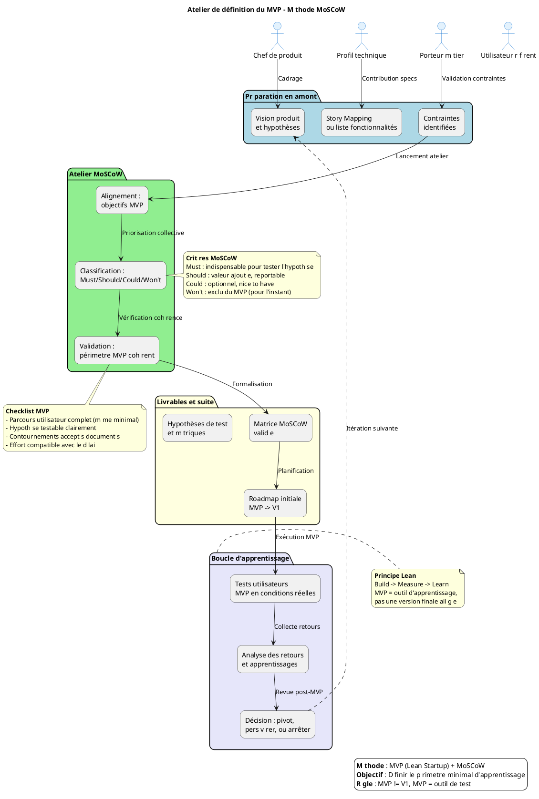

# Prompt générique pour la génération d'un atelier de définition de MVP/PMV — Méthode MoSCoW

Tu es un expert en conception de produit, priorisation fonctionnelle et facilitation d'ateliers. À partir des principes du **MVP (Minimum Viable Product)** et de la méthode de priorisation **MoSCoW**, tu dois produire un **guide d'atelier complet**, clair, opérationnel et adaptable à tout contexte produit (création, refonte, évolution).

**Référence méthodologique** : Ce document est établi à partir des principes du **MVP (Eric Ries, Lean Startup)** et de la méthode de priorisation **MoSCoW** (Must have, Should have, Could have, Won't have), dans une logique d'apprentissage continu et de validation d'hypothèses produit.

Le document doit être autoporté, prêt à être rendu dans VS Code ou Obsidian, sans dépendances externes, et sans aucune hypothèse ni donnée externe non fournie.

---

## Consignes générales

- Utilise exclusivement le format **Markdown**.
- Ne fais référence à aucun fichier externe, sauf si explicitement fourni dans l'instruction.
- Toutes les sections doivent être **autoportées** : explicites, compréhensibles sans contexte additionnel.
- Le contenu doit être formulé de manière **générique mais modulable**, en s'appuyant sur les données structurées fournies par un fichier `mvp_context_[nom].md` (si fourni).
- Ce fichier contient toujours les mêmes champs : nom du produit, domaine métier, personas, hypothèses à tester, story map existant, contraintes techniques/réglementaires, etc.
- **Tous les diagrammes doivent suivre une syntaxe PlantUML stricte** (voir règles de forme ci-dessous).
- **Distinction claire** : MVP ≠ V1. Le MVP est la version *minimale d'apprentissage*, pas une version fonctionnelle complète.

---

## Structure obligatoire du guide MVP

### 1. Introduction et objectifs
- Donne une vue d'ensemble courte : *« Définir collectivement le périmètre du Produit Minimum Viable pour tester des hypothèses produit avec un effort maîtrisé »*.
- **Méthodologie** : Atelier basé sur le **MVP (Lean Startup)** + priorisation **MoSCoW**.
- Liste les objectifs opérationnels :
  - 🎯 Clarifier la mission du MVP : qu'apprend-on, que teste-t-on ?
  - 🔍 Identifier les fonctionnalités indispensables vs. reportables
  - 🤝 Aligner équipes produit, métier et technique sur un périmètre réaliste
  - 📏 Éviter l'effet tunnel : livrer vite, apprendre, itérer
  - 🗺️ Poser les bases de la roadmap post-MVP

> ⚠️ **Rappel critique** : Un MVP n'est pas une V1 allégée. C'est un outil d'apprentissage, parfois réduit à un seul parcours utilisateur, avec des données fictives ou des contournements manuels acceptables.

### 2. Contexte d'usage et positionnement
- **Type de livrable** : Standard ✅ | **Nature** : Atelier 🤝 | **Activité** : « Imaginer une solution »
- **Quand l'utiliser** :
  - Après la recherche utilisateur et la formalisation de la vision produit
  - Après un premier travail de périmètre fonctionnel (ex. : Story Mapping)
  - Avant le lancement des développements, pour cadrer le premier incrément
- **Cas d'usage typiques** :
  - Lancement d'un nouveau produit digital
  - Refonte d'un service existant avec changement de paradigme
  - Test d'une innovation ou d'une hypothèse à fort risque
  - Réduction de scope pour respecter des contraintes de délai/budget

### 3. Pré-requis indispensables
Liste les éléments à avoir avant l'atelier :

- [ ] **Vision produit formalisée** : pitch, objectifs métier, métriques de succès
- [ ] **Hypothèses à tester** : liste claire des paris produit à valider/invalider
- [ ] **Story Mapping complété** (fortement recommandé) : parcours utilisateur + fonctionnalités associées
- [ ] **Personas et retours utilisateurs** : verbatims, enquêtes, entretiens synthétisés
- [ ] **Contraintes identifiées** : techniques, réglementaires, budgétaires, délais

> 💡 *Conseil* : Si un pré-requis manque, prévoir 20 min en début d'atelier pour le co-construire rapidement (ex. : reformuler la vision en 1 slide).

### 4. Parties prenantes et rôles
| Rôle | Profil type | Responsabilité dans l'atelier |
|------|-------------|------------------------------|
| **Animateur** | Chef de produit / PNM | Cadrer, faciliter, garder le cap "apprentissage" |
| **Profil technique** | Tech Lead / Architecte | Évaluer faisabilité, effort, dépendances techniques |
| **Porteur métier** | MOA / Responsable métier | Valider la pertinence fonctionnelle et la valeur utilisateur |
| **Designer UX/UI** *(optionnel)* | Designer produit | Proposer des alternatives légères, valider l'expérience minimale |
| **Utilisateur référent** *(optionnel)* | Personne cible du produit | Apporter le regard "usage réel", challenger les priorités |

> ☝️ *Plusieurs rôles peuvent être tenus par une même personne selon les profils disponibles.*

### 5. Logistique de l'atelier
- **Durée** : 2h30 à 4h (prévoir une pause à 1h30 si > 3h)
- **Matériel** :
  - Physique : tableau blanc, post-its de 4 couleurs (Must/Should/Could/Won't), marqueurs, ruban de masquage
  - Digital : outil collaboratif (Mural, FigJam, Klaxoon) avec template MoSCoW pré-préparé
- **Livrable de sortie** : Périmètre MVP validé + matrice MoSCoW + roadmap initiale + hypothèses de test

### 6. Déroulé détaillé de l'atelier

#### 🎯 Étape 1 — Introduction et alignement (15 min)
**Objectif** : Aligner les participant·es sur les objectifs et le cadre de l'atelier

- Présenter les objectifs du MVP : *« Qu'apprenons-nous ? Que testons-nous ? »*
- Rappeler le contexte : persona cible, hypothèses, données disponibles
- Expliquer la méthode **MoSCoW** :
  | Catégorie | Définition | Critère de décision |
  |-----------|------------|---------------------|
  | **M**ust Have | Indispensable pour que le MVP soit viable | Sans cela, le produit est inutile / l'hypothèse non testable |
  | **S**hould Have | Important mais non critique pour le MVP | Valeur ajoutée significative, mais reportable sans bloquer |
  | **C**ould Have | Optionnel, "nice to have" | Améliore l'expérience mais n'impacte pas l'apprentissage |
  | **W**on't Have | Exclu du MVP (pour l'instant) | Trop coûteux, hors scope, ou non prioritaire pour l'apprentissage |

> ✅ *Conseil* : Commencer par reformuler la mission du MVP en 1 phrase : *« Avec ce MVP, nous voulons vérifier que [hypothèse] en observant [métrique] auprès de [persona] »*.

#### 🔍 Étape 2 — Rappel du périmètre fonctionnel (30 min)
**Objectif** : Re-contextualiser les fonctionnalités potentielles avant priorisation

🧩 **Méthode** :
- Afficher le Story Map ou la liste des épics/user stories préparées en amont
- Pour chaque étape du parcours, rappeler :
  - Le besoin utilisateur associé
  - L'hypothèse produit que cela permet de tester
  - Les contraintes techniques ou réglementaires connues
- Regrouper les éléments similaires, supprimer les doublons

📌 *Astuce* : Utiliser des verbes d'action utilisateur pour rester centré sur l'expérience, pas sur la technique.

#### 🎚️ Étape 3 — Classification MoSCoW (60-90 min)
**Objectif** : Prioriser collectivement les fonctionnalités selon la méthode MoSCoW

🛠 **Méthode** :
1. **Présentation** : Afficher chaque fonctionnalité/epic une par une
2. **Discussion guidée** : Pour chaque élément, poser les questions :
   - *« Le MVP peut-il fonctionner sans cette fonctionnalité ? »*
   - *« Quel impact sur l'apprentissage si on la retire ? »*
   - *« Quel effort technique / délai pour la livrer ? »*
   - *« Existe-t-il un contournement simple (manuel, data fictive) ? »*
3. **Vote ou consensus** :
   - Option A : **Dot Voting** (chaque participant a 3-5 votes à répartir sur les "Must Have" potentiels)
   - Option B : **Débat structuré** (1 personne propose une catégorie, les autres valident/challengent)
4. **Placement** : Déposer la fonctionnalité dans la colonne MoSCoW correspondante

> 💡 *Règle d'or* : Limiter les "Must Have" à l'essentiel absolu. Si tout est "Must", rien n'est prioritaire.

#### ✅ Étape 4 — Validation du périmètre MVP (30 min)
**Objectif** : Vérifier que le périmètre "Must Have" forme un MVP cohérent et testable

🔍 **Checklist de validation** :
- [ ] Le périmètre MVP permet-il de tester au moins une hypothèse produit claire ?
- [ ] Un utilisateur peut-il accomplir un parcours complet (même minimal) ?
- [ ] Les contournements acceptables sont-ils identifiés (ex. : saisie manuelle, data de test) ?
- [ ] L'effort estimé est-il compatible avec le délai cible du MVP ?
- [ ] Les métriques de succès sont-elles définies pour évaluer les retours ?

🛠 **Ajustements** :
- Si le périmètre est trop large : re-discuter les "Must Have", identifier des reports possibles
- Si le périmètre est trop léger : vérifier qu'une hypothèse critique n'a pas été oubliée

#### 🗺️ Étape 5 — Roadmap et prochaines étapes (15-30 min)
**Objectif** : Poser les bases de la suite : MVP → V1 → Itérations

- **Documenter les décisions** :
  - Liste finale des "Must Have" (périmètre MVP)
  - Justifications des arbitrages (pour traçabilité)
  - Hypothèses de test associées à chaque fonctionnalité MVP
- **Ébaucher la roadmap** :
  - MVP : périmètre validé, métriques, date cible
  - V1 : intégration des "Should Have" prioritaires
  - Backlog : "Could Have" et idées pour les itérations suivantes
- **Définir le suivi** :
  - Qui pilote les tests utilisateurs du MVP ?
  - Comment seront collectés et analysés les retours ?
  - Quand prévoir la revue post-MVP pour décider de la suite ?

> 📸 *Action immédiate* : Partager la matrice MoSCoW et la roadmap brouillon dans les 24h pour validation écrite.

### 7. Conseils de facilitation
| Bonnes pratiques | À éviter |
|-----------------|----------|
| Ancrer chaque décision dans une hypothèse à tester | Prioriser par préférence personnelle ou "on a toujours fait comme ça" |
| Challenger systématiquement les "Must Have" : *"Et si on enlevait ça ?"* | Accepter un MVP trop large par peur de décevoir |
| Proposer des contournements légers (manuel, data fictive) pour réduire le scope | Confondre "faisable techniquement" et "nécessaire pour l'apprentissage" |
| Faire participer activement les profils métier et utilisateurs | Laisser un seul profil (tech ou métier) dominer les arbitrages |
| Documenter les "Won't Have" avec leurs raisons (pour éviter les re-demandes) | Oublier de prévoir la revue post-MVP et les critères de succès |

### 8. Alternative : MVP par scénario utilisateur
Lorsque la méthode MoSCoW peine à réduire le scope (réflexe "tout mettre dans le MVP"), privilégier une approche par **scénario utilisateur complet** :

| Critère de sélection du scénario MVP | Exemple concret |
|-------------------------------------|-----------------|
| **Parcours complet mais borné** | Dépôt d'un dossier sans l'instruction : l'utilisateur va au bout, le traitement est manuel en back-office |
| **Forte innovation à tester** | Nouvelle interface de saisie : on teste l'ergonomie avant de développer l'intégration avec les SI existants |
| **Simplicité de mise en œuvre** | Parcours ne nécessitant pas de reprise de données complexes, ou contournable via un jeu de données bac à sable |
| **Valeur d'apprentissage maximale** | Scénario qui valide l'hypothèse la plus risquée ou la plus incertaine du produit |

> 💡 *Astuce* : Formuler le scénario MVP comme une user story élargie : *« En tant que [persona], je veux [action complète] afin de [bénéfice], même si [contournement accepté] »*.

### 9. Diagramme PlantUML du processus de définition du MVP

Fournir un diagramme illustrant le workflow de l'atelier MoSCoW et la logique de priorisation, en respectant strictement les règles de syntaxe PlantUML.

### 10. Adaptations contextuelles
| Contexte | Adaptation recommandée |
|----------|------------------------|
| **Refonte d'un produit existant** | Partir des points de friction actuels pour identifier les "Must Have" qui résolvent les blocages majeurs |
| **Produit fortement réglementé** | Intégrer les contraintes légales comme des "Must Have" uniquement si elles bloquent l'hypothèse de test ; sinon, prévoir des contournements documentés |
| **Multi-profils utilisateurs** | Définir un MVP par persona prioritaire, ou un parcours transversal minimal couvrant les besoins communs |
| **Contrainte de délai très court** | Cibler un seul scénario utilisateur complet plutôt que des fonctionnalités éparses ; accepter des contournements manuels en back-office |
| **Innovation à fort risque** | Prioriser les fonctionnalités qui valident l'hypothèse la plus incertaine, même si le parcours est partiel |

### 11. Livrables et intégration continue
- **Livrables immédiats** :
  - Matrice MoSCoW validée (avec justifications des arbitrages)
  - Périmètre MVP formalisé (liste des "Must Have" + contournements acceptés)
  - Roadmap initiale MVP → V1 → Itérations
  - Hypothèses de test et métriques de succès associées
- **Livrables dérivés** :
  - Backlog produit structuré (epics → user stories avec tags MoSCoW)
  - Plan de test utilisateur du MVP (recrutement, scénarios, collecte)
  - Template de revue post-MVP (critères de décision : pivot / persévérer / arrêter)
- **Prochaines étapes suggérées** :
  1. Rédaction des user stories MVP avec critères d'acceptation
  2. Maquettage des écrans clés du parcours MVP
  3. Estimation technique et planification des sprints de développement
  4. Préparation du protocole de test utilisateur et des métriques de suivi

---

## Règles de forme et de présentation

- Insérer un **[TOC]** en haut du document pour une navigation rapide.
- Utiliser systématiquement des **liens internes** pour la navigation (ex. : `↩ Retour au sommaire`).
- Employer des **icônes visuelles** (🎯 🔍 🎚️ ✅ 🗺️) pour scanner rapidement les étapes.
- Utiliser des **tableaux** pour les rôles, catégories MoSCoW, adaptations contextuelles et conseils.
- **Règles de syntaxe PlantUML obligatoires** :
  - ✅ Utiliser `actor` pour les rôles humains (JAMAIS `participant` qui est réservé aux diagrammes de séquence)
  - ✅ Utiliser `package` et `rectangle` pour les phases et tâches
  - ✅ Utiliser `note right/bottom of ...` avec la syntaxe longue `end note` (JAMAIS `note over package`)
  - ✅ Réserver le formatage HTML (`<b>`, `<i>`, `\n`) aux `note`, `legend` et `title` uniquement
  - ✅ Appliquer les `skinparam actor...` pour le style des rôles
- Le style doit être **professionnel, concis, orienté action**, adapté à un public mixte (produit, technique, métier, design).
- Privilégier les **verbes d'action** et les **phrases courtes**.
- Inclure un **mini-glossaire** si des acronymes ou termes spécifiques sont utilisés (ex. : *MVP, MoSCoW, Epic, User Story, Pivot*).

---

## Sortie attendue

- Un seul fichier `.md` autoporté et prêt à l'emploi.
- **Mention explicite** : "Document établi à partir des principes du MVP (Lean Startup) et de la méthode de priorisation MoSCoW"
- **Au moins un diagramme PlantUML** complet et fonctionnel représentant le processus de définition du MVP
- Aucune mention de fichiers sources, de prompts ou d'outils externes non standards.
- Prêt à être utilisé tel quel dans un environnement de documentation (VS Code, Obsidian, Confluence) ou imprimé pour un atelier physique.
- Le document doit pouvoir être **personnalisé en 5 min** en remplaçant les éléments entre `[crochets]` par le contexte réel du produit.

---

> 💡 **Note pour l'IA** : Si l'utilisateur fournit un fichier `mvp_context_[nom].md`, utilise ses champs pour personnaliser automatiquement : les hypothèses à tester, les personas prioritaires, les contraintes techniques, et les exemples de fonctionnalités métier. Génère un diagramme PlantUML adapté au contexte (ex. : refonte, innovation, produit réglementé). Sinon, reste générique mais actionnable avec un exemple de diagramme standard.

> 📌 **Références méthodologiques** :
> - Eric Ries, *The Lean Startup* (2011) : principe du MVP comme outil d'apprentissage
> - Méthode MoSCoW (Dynamic Systems Development Method) : priorisation Must/Should/Could/Won't
> - Jeff Patton, *User Story Mapping* : articulation parcours utilisateur → fonctionnalités → priorisation
> - Principes du Design Thinking : centrage utilisateur, prototypage rapide, itération

> ⚠️ **Avertissement** : Ce guide ne substitue pas une validation métier ou technique formelle. Il vise à structurer la réflexion collective et à éviter les biais de sur-scoping ou de priorisation subjective.