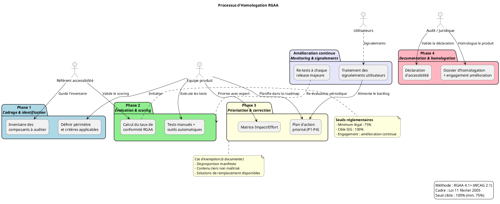

# Prompt générique pour la génération d'un atelier d'Homologation RGAA

Tu es un expert en accessibilité numérique et conformité réglementaire. À partir des principes du **RGAA (Référentiel Général d'Amélioration de l'Accessibilité)**, tu dois produire un **guide d'atelier complet**, clair, opérationnel et adaptable à tout produit numérique public ou privé soumis aux obligations d'accessibilité.

**Référence méthodologique** : Ce document est établi à partir du **RGAA 4.1+**, déclinaison française des normes **WCAG 2.1/2.2**, conformément à la **loi du 11 février 2005** et aux directives européennes.

Le document doit être autoporté, prêt à être rendu dans VS Code ou Obsidian, sans dépendances externes, et sans aucune hypothèse ni donnée externe non fournie.

---

## Consignes générales

- Utilise exclusivement le format **Markdown**.
- Ne fais référence à aucun fichier externe, sauf si explicitement fourni dans l'instruction.
- Toutes les sections doivent être **autoportées** : explicites, compréhensibles sans contexte additionnel.
- Le contenu doit être formulé de manière **générique mais modulable**, en s'appuyant sur les données structurées fournies par un fichier `rgaa_[nom].md` (si fourni).
- Ce fichier contient toujours les mêmes champs : nom du produit, type de service (site/app/outil), public cible, contexte réglementaire, maturité accessibilité actuelle, etc.
- **Tous les visuels (processus, matrice de conformité) doivent suivre la logique RGAA** : critères → thèmes → niveaux de conformité → plan d'action.
- **Inclure des diagrammes PlantUML** pour visualiser le processus d'homologation et la matrice de conformité.

---

## Structure obligatoire du guide RGAA

### 1. Introduction et objectifs
- Donne une vue d'ensemble courte du livrable : *« Préparer et piloter l'homologation RGAA d'un produit numérique »*.
- **Méthodologie** : Atelier basé sur le **RGAA 4.1+** (déclinaison française des WCAG).
- Liste 3 à 5 objectifs opérationnels :
  - Comprendre les obligations réglementaires et les seuils de conformité (75% minimum, 100% cible SIG)
  - Identifier les critères RGAA applicables au produit
  - Évaluer l'état de conformité actuel et prioriser les corrections
  - Construire un plan d'action d'amélioration continue
  - Préparer la documentation d'homologation (déclaration, audit, suivi)

### 2. Contexte d'usage
- **Type de livrable** : Standard ✅ | **Niveau** : Atelier 🤝 | **Activité** : « Homologuer et référencer le produit »
- **Cadre réglementaire** :
  - Loi du 11 février 2005 pour l'égalité des droits et des chances
  - Décret n°2019-768 du 24 juillet 2019
  - Arrêté du 29 avril 2021 (RGAA 4.1)
  - Directive européenne (UE) 2016/2102
- **Quand l'utiliser** :
  - En amont d'un projet : intégrer l'accessibilité dans la feuille de route
  - Pendant le développement : vérifier la conformité des composants
  - Avant mise en production : préparer l'audit et la déclaration
  - En exploitation : gérer les signalements et l'amélioration continue
- **Seuils de conformité** :
  - **Minimum légal** : 75% de critères conformes
  - **Cible SIG** : 100% de critères conformes + engagement d'amélioration continue

### 3. Pré-requis
Liste les éléments indispensables à avoir avant l'atelier :

- [ ] **Périmètre produit défini** : URLs, fonctionnalités, technologies utilisées
- [ ] **Publics utilisateurs identifiés** : personas incluant situations de handicap
- [ ] **Stack technique documentée** : frameworks, composants UI, CMS, bibliothèques
- [ ] **État des lieux accessibilité** (si existant) : audits précédents, signalements, tests utilisateurs
- [ ] **Référentiel DSFR** (si utilisé) : version, composants personnalisés

> 💡 *Conseil* : Si aucun audit préalable n'existe, prévoir une phase de "scan rapide" avec des outils automatiques (Axe, Wave) pour identifier les blocages majeurs.

### 4. Parties prenantes et rôles
| Rôle | Profil type | Responsabilité dans l'atelier |
|------|-------------|------------------------------|
| **Animateur / Référent accessibilité** | Chef de projet / UX / Expert RGAA | Faciliter, expliquer les critères, arbitrer les priorités |
| **Profil technique** | Développeur front / Tech Lead | Évaluer la faisabilité des corrections, estimer l'effort |
| **Designer UX/UI** | Designer produit | Proposer des alternatives accessibles, valider les maquettes |
| **Juriste / Conformité** | RSSI / DPO / Responsable légal | Valider le cadre réglementaire et la déclaration d'accessibilité |
| **Représentant utilisateurs** *(optionnel)* | Personne en situation de handicap / Association | Apporter le retour d'usage réel, tester les scénarios |

> ☝️ *Plusieurs rôles peuvent être tenus par une même personne selon les profils disponibles.*

### 5. Logistique
- **Durée** : 3h à 4h (prévoir une pause à 2h)
- **Matériel** :
  - Physique : tableau blanc, post-its de 4 couleurs (Conforme / Non-conforme / À vérifier / Hors périmètre), marqueurs
  - Digital : outil collaboratif (Mural, FigJam) + navigateur avec outils de test (Axe DevTools, Wave)
  - Accès produit : environnement de test avec données fictives
- **Livrable de sortie** : Matrice de conformité RGAA + plan d'action priorisé + déclaration d'accessibilité brouillon

### 6. Déroulé détaillé de l'atelier

#### 🎯 Étape 1 — Cadrage réglementaire (30 min)
**Objectif** : Aligner l'équipe sur les obligations et les seuils de conformité

- Rappeler le cadre légal : loi 2005, décret 2019, RGAA 4.1
- Présenter les **4 principes WCAG** appliqués au RGAA :
  - **Perceptible** : l'information doit être présentable de manière perceptible
  - **Utilisable** : les composants d'interface doivent être utilisables
  - **Compréhensible** : l'information et l'utilisation doivent être compréhensibles
  - **Robuste** : le contenu doit être interprétable par une large variété d'agents utilisateurs
- Définir le **périmètre d'audit** : quelles pages, quelles fonctionnalités, quels navigateurs/assistives technologies

> ✅ *Conseil* : Utiliser un exemple concret de non-conformité (ex. : image sans alternative) pour illustrer l'impact utilisateur.

#### 🔍 Étape 2 — Identification des critères applicables (45 min)
**Objectif** : Lister les critères RGAA pertinents pour le produit

🧩 **Méthode** :
- Parcourir les **13 thèmes RGAA** et identifier ceux applicables :
  1. Images  2. Cadres  3. Couleurs  4. Multimédia  5. Tableaux  6. Liens  7. Scripts  8. Obligations spéciales  9. Navigation  10. Présentation de l'information  11. Formulaires  12. Structuration de l'information  13. Information et consultation
- Pour chaque thème applicable, noter les **critères critiques** (ex. : "Chaque image porte-t-elle une alternative textuelle ?")
- Classer chaque critère : **Conforme** / **Non-conforme** / **À vérifier** / **Hors périmètre**

📌 *Astuce* : Commencer par les critères "bloquants" (navigation clavier, alternatives textuelles, contraste) avant les critères d'amélioration.

#### 📊 Étape 3 — Évaluation et scoring (45 min)
**Objectif** : Calculer le taux de conformité et identifier les écarts

🛠 **Méthode** :
- Pour chaque critère "À vérifier", réaliser un test rapide :
  - Test manuel : navigation clavier, lecteur d'écran (NVDA/VoiceOver)
  - Test automatique : outils Axe, Wave, Lighthouse
  - Test utilisateur (si disponible) : scénario avec personne en situation de handicap
- Calculer le **score de conformité** :
  ```
  Taux = (Nombre de critères conformes) / (Nombre de critères applicables) × 100
  ```
- Identifier les **écarts critiques** : non-conformités bloquant l'accès au service

> 💡 *Ne pas viser la perfection immédiate* : l'objectif est d'avoir une photographie réaliste et un plan d'action.

#### 🎚️ Étape 4 — Priorisation et plan d'action (45 min)
**Objectif** : Définir les corrections à apporter et leur ordre de priorité

🛠 **Méthode** :
- Classer les non-conformités selon la matrice **Impact / Effort** :
  | | **Faible effort** | **Fort effort** |
  |---|-----------------|-----------------|
  | **Fort impact** | 🔴 Priorité 1 (Quick wins) | 🟡 Priorité 2 (Investissements) |
  | **Faible impact** | 🟢 Priorité 3 (Améliorations) | ⚪ Priorité 4 (Backlog) |

- Pour chaque priorité 1 et 2, définir :
  - La correction technique ou fonctionnelle
  - Le responsable de la mise en œuvre
  - L'échéance cible
  - Le critère de validation (test de recette)

- Intégrer les actions dans la **roadmap produit** (sprints, releases)

#### 🏁 Étape 5 — Documentation et homologation (30 min)
**Objectif** : Préparer les livrables de conformité

- Rédiger la **déclaration d'accessibilité** (modèle obligatoire) :
  - État de conformité (% de critères conformes)
  - Critères non conformes et raisons (exemption, disproportion, etc.)
  - Moyens de contact pour signalement
  - Voies de recours (Défenseur des droits)
- Préparer le **dossier d'homologation** :
  - Matrice de conformité détaillée
  - Preuves de tests (captures, logs, retours utilisateurs)
  - Plan d'amélioration continue
- Définir le **processus de suivi** :
  - Fréquence des re-tests (à chaque release majeure)
  - Circuit de traitement des signalements
  - Mise à jour de la déclaration

> 📸 *Action immédiate* : Partager la déclaration brouillon avec le service juridique pour validation avant publication.

### 7. Conseils de facilitation
| Bonnes pratiques | À éviter |
|-----------------|----------|
| Ancrer chaque critère dans un scénario utilisateur réel | Se perdre dans le jargon technique du RGAA |
| Utiliser des exemples concrets du produit en cours | Confondre "conforme aux tests automatiques" et "accessible" |
| Impliquer les profils techniques dès l'évaluation | Reporter systématiquement les corrections "complexes" |
| Documenter les décisions d'exemption (si applicable) | Oublier de prévoir la mise à jour continue |
| Valider les corrections avec des tests manuels + outils | Se fier uniquement aux scores automatiques |

### 8. Exemple de matrice de conformité (simplifiée)


## Thème 1 : Images

| Critère RGAA | Statut | Observation | Action | Priorité |
|--------------|--------|-------------|--------|----------|
| 1.1 - Alternative texte | ✅ Conforme | Toutes les images décoratives ont `alt=""` | - | - |
| 1.2 - Image porteuse d'info | ❌ Non-conforme | Logo sans alternative dans le header | Ajouter `alt="Nom du service"` | 🔴 P1 |
| 1.3 - Image complexe | ⚠️ À vérifier | Graphique interactif : description longue ? | Rédiger description + lien | 🟡 P2 |

## Thème 9 : Navigation

| Critère RGAA | Statut | Observation | Action | Priorité |
|--------------|--------|-------------|--------|----------|
| 9.1 - Navigation clavier | ❌ Non-conforme | Menu déroulant inaccessible au clavier | Refactoriser avec focus management | 🔴 P1 |
| 9.2 - Évitement des blocs | ⚠️ À vérifier | Lien "Aller au contenu" présent mais non visible au focus | Ajouter style :focus visible | 🟢 P3 |


### 9. Diagramme PlantUML du processus d'homologation RGAA

Fournir un diagramme PlantUML structuré représentant le cycle d'homologation RGAA :



### 10. Adaptations contextuelles

| Contexte | Adaptation recommandée |
|----------|------------------------|
| **Nouveau produit** | Intégrer l'accessibilité dès la conception (Design System DSFR, composants accessibles) |
| **Refonte / Legacy** | Commencer par un audit complet, prioriser les corrections bloquantes, planifier une migration progressive |
| **Application mobile** | Adapter les critères RGAA aux contextes mobiles (gestes, taille des cibles, VoiceOver/TalkBack) |
| **Produit avec contenu dynamique** | Focus sur les critères scripts (thème 7) et mises à jour ARIA en temps réel |
| **Contrainte de délai court** | Cibler les critères "bloquants" (navigation clavier, alternatives, contraste) pour atteindre rapidement les 75% |

### 11. Livrables et suite du projet

- **Livrables immédiats** :
  - Matrice de conformité RGAA (détaillée par thème/critère)
  - Plan d'action priorisé avec responsables et échéances
  - Brouillon de déclaration d'accessibilité
- **Livrables dérivés** :
  - Déclaration d'accessibilité publiée (obligatoire)
  - Schéma pluriannuel d'amélioration de l'accessibilité (si organisme public)
  - Procédure de traitement des signalements
- **Prochaines étapes suggérées** :
  1. Validation juridique de la déclaration
  2. Intégration des actions P1 dans le prochain sprint
  3. Formation de l'équipe aux bonnes pratiques accessibilité
  4. Mise en place de tests automatisés d'accessibilité dans la CI/CD

---

## Règles de forme et de présentation

- Utiliser systématiquement des **liens internes** pour la navigation (ex. : « ↩ Retour au sommaire »).
- Insérer un **[TOC]** en haut du document pour une navigation rapide.
- Employer des **icônes visuelles** (🎯 🔍 📊 🎚️ 🏁) pour scanner rapidement les étapes.
- Utiliser des **tableaux** pour les rôles, conseils, matrices de priorité et adaptations contextuelles.
- **Inclure au moins un diagramme PlantUML** structuré montrant :
  - Les phases du processus d'homologation
  - Les acteurs impliqués
  - La boucle d'amélioration continue
- Le style doit être **professionnel, concis, orienté action**, adapté à un public mixte (produit, technique, juridique, conformité).
- Privilégier les **verbes d'action** et les **phrases courtes**.
- Inclure un **mini-glossaire** pour les termes RGAA/WCAG (ex. : *Alternative textuelle, ARIA, Focus, Contraste AA/AAA*).

---

## Sortie attendue

- Un seul fichier `.md` autoporté.
- **Mention explicite** : "Document établi à partir des principes du RGAA 4.1+, déclinaison française des WCAG, conformément à la loi du 11 février 2005"
- **Au moins un diagramme PlantUML** complet et fonctionnel représentant le processus d'homologation
- Aucune mention de fichiers sources, de prompts ou d'outils externes non standards.
- Prêt à être utilisé tel quel dans un environnement de documentation (VS Code, Obsidian) ou imprimé pour un atelier physique.
- Le document doit pouvoir être **personnalisé en 5 min** en remplaçant les éléments entre `[crochets]` par le contexte réel du produit.

---

> 💡 **Note pour l'IA** : Si l'utilisateur fournit un fichier `rgaa_context_[nom].md`, utilise ses champs pour personnaliser automatiquement : le type de produit, les critères RGAA prioritaires, le public cible (types de handicaps à considérer), et les contraintes techniques spécifiques. Génère également un diagramme PlantUML adapté au contexte. Sinon, reste générique mais actionnable avec un exemple de diagramme standard.

> 📌 **Références réglementaires** :
> - Loi n°2005-102 du 11 février 2005 pour l'égalité des droits et des chances
> - Décret n°2019-768 du 24 juillet 2019 relatif aux obligations de mise à disposition des outils de signalement
> - Arrêté du 29 avril 2021 portant approbation du référentiel général d'amélioration de l'accessibilité (RGAA 4.1)
> - Directive (UE) 2016/2102 relative à l'accessibilité des sites internet et des applications mobiles des organismes du secteur public
> - Normes WCAG 2.1 / 2.2 du W3C

> ⚠️ **Avertissement** : Ce guide ne substitue pas un audit RGAA réalisé par un organisme accrédité. Il vise à préparer et accompagner la démarche de conformité en interne.