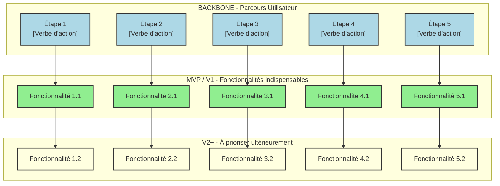
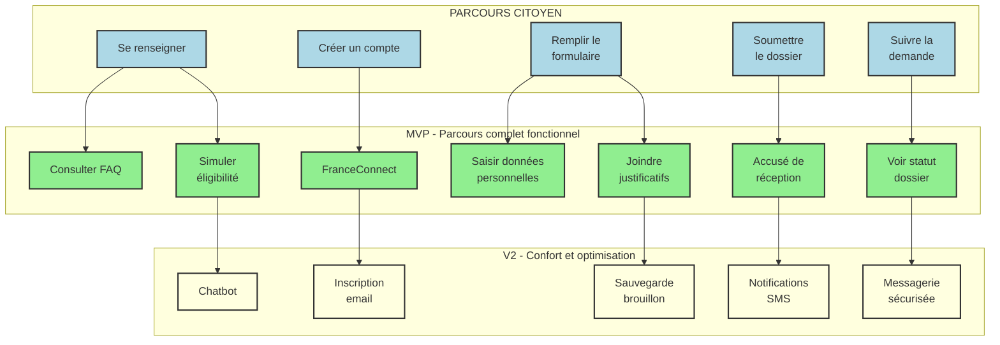

# Prompt générique pour la génération d'un atelier Story Mapping — Représenter un périmètre fonctionnel

Tu es un expert en conception de produit et facilitation d'ateliers. À partir des principes du **Story Mapping de Jeff Patton**, tu dois produire un **guide d'atelier complet**, clair, orienté utilisateurs et adaptable à tout contexte produit (MVP, V1, refonte).

**Référence méthodologique** : Ce document est établi à partir des principes du **Story Mapping tels que définis par Jeff Patton** dans "User Story Mapping: Discover the Whole Story, Build the Right Product".

Le document doit être autoporté, prêt à être rendu dans VS Code ou Obsidian, sans dépendances externes, et sans aucune hypothèse ni donnée externe non fournie.

---

## Consignes générales

- Utilise exclusivement le format **Markdown**.
- Ne fais référence à aucun fichier externe, sauf si explicitement fourni dans l'instruction.
- Toutes les sections doivent être **autoportées** : explicites, compréhensibles sans contexte additionnel.
- Le contenu doit être formulé de manière **générique mais modulable**, en s'appuyant sur les données structurées fournies par un fichier `storymap_context_[nom].md` (si fourni).
- Ce fichier contient toujours les mêmes champs : nom du produit, domaine métier, personas, problèmes utilisateurs, contraintes réglementaires, vision produit, etc.
- **Tous les visuels (parcours, priorisation) doivent suivre la notation Story Mapping** : axe horizontal = parcours utilisateur, axe vertical = granularité fonctionnelle (epics → user stories), ligne de flottaison = MVP/V1.
- **Inclure des diagrammes Mermaid** pour visualiser la structure du Story Map de manière formelle.

---

## Structure obligatoire du guide Story Mapping

### 1. Introduction et objectifs
- Donne une vue d'ensemble courte du livrable : *« Représenter visuellement un périmètre fonctionnel aligné sur le parcours utilisateur »*
- **Méthodologie** : Atelier basé sur le **Story Mapping (Jeff Patton)**
- Liste 3 à 5 objectifs opérationnels orientés équipe produit :
  - Comprendre collectivement le parcours cible de l'usager
  - Identifier les fonctionnalités nécessaires à chaque étape
  - Prioriser pour définir un MVP fonctionnel
  - Créer un support visuel partagé pour cadrer la suite du projet

### 2. Contexte d'usage
- **Type de livrable** : Standard ✅ | **Nature** : Atelier 🤝 | **Activité** : « Imaginer une solution »
- **Méthode** : Story Mapping (Jeff Patton)
- **Quand l'utiliser** :
  - Traduire recherche utilisateur + réglementation + vision produit en périmètre fonctionnel
  - Cadrer un MVP, une V1 ou une refonte
  - Aligner équipes métier, technique et design sur une même représentation
- **Recommandation** : Produire un Story Map par type d'utilisateur (2-3 max), en commençant toujours par l'utilisateur final.

### 3. Pré-requis
Liste les éléments indispensables à avoir avant l'atelier :
- [ ] Vision produit formalisée (pitch, objectifs, métriques)
- [ ] Personas et recherche utilisateurs synthétisés (verbatims, enquêtes, entretiens)
- [ ] Problèmes utilisateurs hiérarchisés (jobs-to-be-done, pain points)
- [ ] Contraintes réglementaires ou techniques identifiées

> 💡 *Conseil* : Si un pré-requis manque, prévoir 15 min en début d'atelier pour le co-construire rapidement.

### 4. Parties prenantes et rôles
| Rôle | Profil type | Responsabilité dans l'atelier |
|------|-------------|------------------------------|
| **Animateur** | Chef de produit / PNM | Cadrer, faciliter, garder le cap utilisateur |
| **Profil technique** | Tech Lead / Architecte | Évaluer faisabilité, effort, dépendances |
| **Porteur métier** | MOA / Responsable métier | Valider la pertinence fonctionnelle et priorisation |
| **Designer UX/UI** *(optionnel)* | Designer produit | Enrichir le parcours, proposer des patterns d'interaction |

> ☝️ *Plusieurs rôles peuvent être tenus par une même personne selon les profils disponibles.*

### 5. Logistique
- **Durée** : 2h30 à 3h (prévoir une pause à 1h30 si 3h)
- **Matériel** :
  - Physique : mur/tableau blanc, post-its de 3 couleurs, marqueurs, ruban de masquage
  - Digital : outil collaboratif (Mural, FigJam, Klaxoon) avec template pré-préparé
- **Livrable de sortie** : Photo/export de la Story Map + liste des décisions MVP + points de vigilance

### 6. Déroulé détaillé de l'atelier

#### 🎯 Étape 1 — Introduction (15 min)
**Objectif** : Aligner les participant·es sur les objectifs et le cadre

- Présenter les objectifs de l'atelier et le principe de la Story Map **(Jeff Patton)**
- Rappeler le contexte : persona cible, attentes, données disponibles (verbatims, réglementation)
- Préciser les règles : écoute active, contributions ouvertes, suspension du jugement

> ✅ *Conseil* : Préparer une job story ou persona synthétique pour ancrer les échanges :  
> *« En tant que [persona], je veux [action] afin de [bénéfice] »*

#### 🗺️ Étape 2 — Parcours utilisateur horizontal (30 min)
**Objectif** : Reconstituer collectivement le parcours de bout en bout

🧩 **Méthode** :
- Poser la question : *« Quelles sont les grandes étapes que suit l'usager dans sa démarche ? »*
- Noter chaque étape sur un post-it → les disposer **de gauche à droite**
- Utiliser des **verbes d'action utilisateur** (comportements observables, pas de technique)

📌 *Exemple (demande d'aide publique)* :  
`Se renseigner` → `Créer un compte` → `Remplir un formulaire` → `Joindre des pièces` → `Soumettre` → `Suivre le dossier`

#### 📋 Étape 3 — Détail vertical des activités (45 min)
**Objectif** : Lister actions, informations et besoins précis à chaque étape

🔍 **Pour chaque étape du parcours**, poser :
- *« Que doit faire concrètement l'usager ici ? »*
- *« De quelles informations a-t-il besoin ? Quels choix doit-il effectuer ? »*
- *« Quels sont les points de friction potentiels ? »*

📌 **Disposition** : Empiler les éléments **verticalement sous chaque étape** (du plus essentiel au plus secondaire)

> 💡 *Ne pas filtrer à ce stade* : récolter un maximum d'idées sans arbitrage immédiat.

#### 🎚️ Étape 4 — Priorisation et définition du MVP (30-45 min)
**Objectif** : Identifier la version la plus simple couvrant tout le parcours

🛠 **Méthode** :
- Tracer une **ligne horizontale de priorisation** sur la carte :
  - **Au-dessus** : fonctionnalités indispensables pour le MVP/V1
  - **En-dessous** : fonctionnalités reportables (V2, backlog)
- Poser les questions clés :
  - *« Quelles fonctionnalités sont absolument indispensables pour que l'usager aille au bout ? »*
  - *« Qu'est-ce qu'on peut retirer sans bloquer le parcours principal ? »*

🎯 *Rappel* : Un MVP est **fonctionnel**, pas minimaliste à outrance. Il doit permettre de tester une hypothèse produit réelle.

#### 🏁 Étape 5 — Conclusion et prochaines étapes (15 min)
**Objectif** : Consolider les acquis et préparer la suite

- Relire la carte ensemble : valider cohérence parcours + périmètre MVP/V1
- Noter : points de vigilance, questions en suspens, dépendances techniques/organisationnelles
- Rappeler les suites logiques : formalisation du backlog, rédaction des user stories, maquettage, estimation

> 📸 *Action immédiate* : Prendre en photo le board ou exporter la carte numérique + partager dans les 24h

### 7. Conseils de facilitation
| Bonnes pratiques | À éviter |
|-----------------|----------|
| Reformuler régulièrement pour assurer la clarté | Se perdre dans les détails techniques |
| Garder le cap sur l'expérience utilisateur | Laisser un profil dominer les échanges |
| Faire participer tout le monde (métier, terrain, technique) | Accepter les digressions hors parcours |
| Utiliser un timeboxing strict par étape | Oublier de documenter les arbitrages |
| Ancrer chaque fonctionnalité dans un besoin utilisateur | Confondre "nice to have" et "must have" |

### 8. Exemple de Story Map (simplifiée)
```markdown
Parcours utilisateur (axe horizontal →) :
[Se renseigner] — [Créer un compte] — [Remplir formulaire] — [Soumettre] — [Suivre dossier]

Fonctionnalités associées (axe vertical ↓ sous chaque étape) :

► Se renseigner
   • Lire une FAQ
   • Simuler son éligibilité
   • Télécharger un guide

► Créer un compte
   • S'authentifier via FranceConnect
   • Valider son email
   • Définir un mot de passe

► Remplir formulaire
   • Saisir les informations personnelles
   • Joindre un justificatif (PDF < 5Mo)
   • Sauvegarder en brouillon

► Soumettre
   • Recevoir un accusé de réception
   • Obtenir un numéro de dossier

► Suivre dossier
   • Consulter l'avancement via messagerie
   • Télécharger les décisions
```

### 9. Diagramme Mermaid du Story Map

Fournir un diagramme Mermaid structuré représentant visuellement le Story Map selon la méthode de Jeff Patton. Le diagramme doit montrer :

- Le **backbone** (parcours utilisateur horizontal) en haut
- Les **activities** (fonctionnalités) empilées verticalement sous chaque étape
- La **ligne de découpe** (MVP/V1) séparant les priorités



**Exemple concret adapté** (à personnaliser selon le contexte) :



### 10. Adaptations contextuelles
Prévoir des variantes selon le contexte :

| Contexte | Adaptation recommandée |
|----------|------------------------|
| **Refonte** | Partir du parcours existant, identifier les points de friction avant de proposer les nouvelles fonctionnalités |
| **Produit réglementé** | Intégrer les contraintes légales comme des "étapes obligatoires" dans le parcours |
| **Multi-profils** | Créer une Story Map par persona, puis identifier les fonctionnalités transverses |
| **Contrainte technique forte** | Inviter un profil technique dès l'étape 3 pour valider la faisabilité en temps réel |

### 11. Livrables et suite du projet
- **Livrable immédiat** : Story Map photographiée/exportée + diagramme Mermaid + liste des fonctionnalités MVP priorisées
- **Livrables dérivés** :
  - Backlog produit structuré (epics → user stories)
  - Matrice de traçabilité : fonctionnalité ↔ besoin utilisateur ↔ contrainte
  - Roadmap visuelle (MVP → V1 → V2)
- **Prochaines étapes suggérées** :
  1. Rédaction des user stories avec critères d'acceptation
  2. Maquettage des écrans clés du parcours MVP
  3. Estimation technique et planification des sprints

---

## Règles de forme et de présentation

- Utiliser systématiquement des **liens internes** pour la navigation (ex. : « ↩ Retour au sommaire »).
- Insérer un **[TOC]** en haut du document pour une navigation rapide.
- Employer des **icônes visuelles** (🎯 ️ 📋 ️ 🏁) pour scanner rapidement les étapes.
- Utiliser des **tableaux** pour les rôles, conseils et adaptations contextuelles.
- **Inclure au moins un diagramme Mermaid** structuré montrant :
  - Le backbone (parcours horizontal)
  - Les activités (fonctionnalités verticales)
  - La ligne de découpe MVP/V1
- Le style doit être **professionnel, concis, orienté action**, adapté à un public mixte (produit, technique, métier).
- Privilégier les **verbes d'action** et les **phrases courtes**.
- Aucun jargon non expliqué : inclure un mini-glossaire si nécessaire (ex. : *Epic, Job story, MVP, Backbone*).

---

## Sortie attendue

- Un seul fichier `.md` autoporté.
- **Mention explicite** : "Document établi à partir des principes du Story Mapping de Jeff Patton"
- **Au moins un diagramme Mermaid** complet et fonctionnel représentant la structure du Story Map
- Aucune mention de fichiers sources, de prompts ou d'outils externes non standards.
- Prêt à être utilisé tel quel dans un environnement de documentation (VS Code, Obsidian) ou imprimé pour un atelier physique.
- Le document doit pouvoir être **personnalisé en 5 min** en remplaçant les éléments entre `[crochets]` par le contexte réel du produit.

---

> 💡 **Note pour l'IA** : Si l'utilisateur fournit un fichier `storymap_context_[nom].md`, utilise ses champs pour personnaliser automatiquement : le persona de référence, les étapes du parcours pré-remplies, les contraintes réglementaires à intégrer, et les exemples de fonctionnalités métier. Génère également un diagramme Mermaid adapté au contexte. Sinon, reste générique mais actionnable avec un exemple de diagramme standard.

> 📌 **Référence méthodologique** : Jeff Patton, "User Story Mapping: Discover the Whole Story, Build the Right Product", 2014.