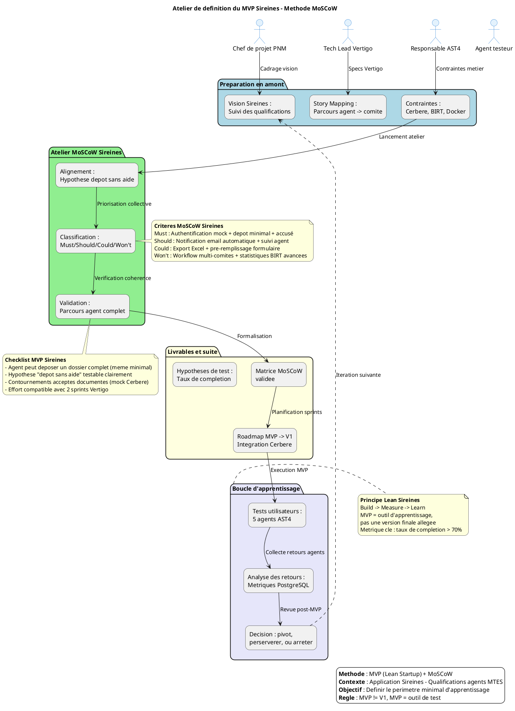

Vous avez parfaitement raison — voici le **guide d'atelier MVP personnalisé pour le projet Sireines**, en appliquant la méthode MoSCoW à votre contexte réel.

---

# 📘 Guide d'atelier : Définition du MVP Sireines — Méthode MoSCoW

> 📜 **Document établi à partir des principes du MVP (Lean Startup) et de la méthode de priorisation MoSCoW**  
> 🎯 **Contexte** : Application Sireines — Gestion des qualifications scientifiques et techniques des agents MTES

[TOC]

---

## 1. Introduction et objectifs ↩ [Retour au sommaire](#top)

**Vue d'ensemble** : Définir collectivement le périmètre du Produit Minimum Viable de **Sireines** pour tester des hypothèses produit avec un effort maîtrisé.

**🎯 Objectifs opérationnels** :
- 🎯 Clarifier la mission du MVP Sireines : *qu'apprenons-nous sur l'adoption par les comités de domaine ?*
- 🔍 Identifier les fonctionnalités indispensables vs. reportables dans le parcours de qualification
- 🤝 Aligner MOA MTES, MOE et équipes techniques sur un périmètre réaliste
- 📏 Éviter l'effet tunnel : livrer vite, apprendre, itérer
- 🗺️ Poser les bases de la roadmap post-MVP (V1, V2...)

> ⚠️ **Rappel critique** : Un MVP n'est pas une V1 allégée. C'est un outil d'apprentissage. Pour Sireines, cela peut signifier : *« Un seul parcours de dépôt de dossier fonctionnel, avec traitement manuel en back-office, suffit pour valider l'hypothèse d'adoption »*.

---

## 2. Contexte d'usage et positionnement ↩ [Retour au sommaire](#top)

- **Type de livrable** : Standard ✅ | **Nature** : Atelier 🤝 | **Activité** : « Imaginer une solution »
- **Quand l'utiliser** :
  - Après la formalisation de la vision Sireines : *« Fluidifier le suivi des qualifications par les comités de domaine »*
  - Après un premier Story Mapping du parcours agent → comité → notification
  - Avant le lancement des développements Vertigo/Java, pour cadrer le premier incrément
- **Cas d'usage typiques pour Sireines** :
  - ✅ Lancement d'une nouvelle version avec refonte du parcours de dépôt
  - ✅ Test d'une hypothèse : *« Les agents acceptent un dépôt 100% digital sans accompagnement téléphonique »*
  - ✅ Réduction de scope pour respecter une contrainte de délai (ex. : livraison recette avant échéance réglementaire)

---

## 3. Pré-requis indispensables ↩ [Retour au sommaire](#top)

Liste des éléments à avoir **avant** l'atelier Sireines :

- [ ] **Vision produit formalisée** : *« Sireines permet aux agents MTES de soumettre leur demande de qualification, suivie par les comités de domaine, avec traçabilité et notification automatique »*
- [ ] **Hypothèses à tester** :
  - *« Un agent peut déposer un dossier complet sans aide externe »*
  - *« Un comité de domaine peut instruire un dossier via l'interface sans formation préalable »*
  - *« La notification par email augmente le taux de complétion des dossiers de 30% »*
- [ ] **Story Mapping complété** : Parcours agent → dépôt → instruction → décision → notification
- [ ] **Personas et retours utilisateurs** :
  - 👤 **Agent demandeur** : besoin de simplicité, suivi clair
  - 👤 **Membre de comité** : besoin d'efficacité, accès aux pièces jointes
  - 👤 **Gestionnaire RH** : besoin de reporting, export Excel
- [ ] **Contraintes identifiées** :
  - 🔐 Intégration Cerbère (SSO) obligatoire en production
  - 📊 Compatibilité BIRT pour les extractions statistiques existantes
  - 🐳 Déploiement Docker (3 conteneurs : app, db, pgadmin)
  - 📜 Conformité RGPD pour les données personnelles des agents

> 💡 *Conseil* : Si un pré-requis manque, prévoir 20 min en début d'atelier pour le co-construire (ex. : reformuler la vision Sireines en 1 slide).

---

## 4. Parties prenantes et rôles ↩ [Retour au sommaire](#top)

| Rôle | Profil type Sireines | Responsabilité dans l'atelier |
|------|---------------------|------------------------------|
| **Animateur** | Chef de projet PNM / MOA MTES (ex. : Pascal Zemour) | Cadrer, faciliter, garder le cap "apprentissage" |
| **Profil technique** | Tech Lead Vertigo / Développeur Java | Évaluer faisabilité, effort, dépendances techniques (Vertigo, PostgreSQL, Docker) |
| **Porteur métier** | Responsable AST4 / Gestionnaire RH | Valider la pertinence fonctionnelle et la valeur utilisateur |
| **Designer UX/UI** *(optionnel)* | Designer produit | Proposer des alternatives légères pour le parcours de dépôt |
| **Utilisateur référent** *(optionnel)* | Agent ou membre de comité testeur | Apporter le regard "usage réel", challenger les priorités |

> ☝️ *Plusieurs rôles peuvent être tenus par une même personne selon les profils disponibles.*

---

## 5. Logistique de l'atelier ↩ [Retour au sommaire](#top)

- **Durée** : 2h30 à 4h (prévoir une pause à 1h30 si > 3h)
- **Matériel** :
  - 🖥️ Physique : tableau blanc, post-its de 4 couleurs (Must/Should/Could/Won't), marqueurs
  - 💻 Digital : Mural/FigJam avec template MoSCoW + capture d'écrans Sireines existants
- **Livrable de sortie** : Périmètre MVP Sireines validé + matrice MoSCoW + roadmap initiale + hypothèses de test

---

## 6. Déroulé détaillé de l'atelier ↩ [Retour au sommaire](#top)

### 🎯 Étape 1 — Introduction et alignement (15 min)
**Objectif** : Aligner les participant·es sur les objectifs et le cadre de l'atelier Sireines

- Présenter les objectifs du MVP : *« Qu'apprenons-nous sur l'adoption du nouveau parcours de dépôt ? »*
- Rappeler le contexte : persona agent, hypothèses, contraintes Cerbère/BIRT/Docker
- Expliquer la méthode **MoSCoW** appliquée à Sireines :

| Catégorie | Définition Sireines | Critère de décision |
|-----------|---------------------|---------------------|
| **M**ust Have | Indispensable pour que le MVP soit viable | Sans cela, un agent ne peut pas déposer un dossier complet |
| **S**hould Have | Important mais non critique pour le MVP | Valeur ajoutée significative (ex. : export Excel), mais reportable |
| **C**ould Have | Optionnel, "nice to have" | Améliore l'expérience (ex. : pré-remplissage), mais n'impacte pas l'apprentissage |
| **W**on't Have | Exclu du MVP (pour l'instant) | Trop coûteux (ex. : workflow multi-comités), hors scope MVP |

> ✅ *Conseil* : Reformuler la mission du MVP Sireines en 1 phrase : *« Avec ce MVP, nous voulons vérifier que les agents peuvent déposer un dossier de qualification sans aide, en observant le taux de complétion auprès des agents AST4 »*.

### 🔍 Étape 2 — Rappel du périmètre fonctionnel (30 min)
**Objectif** : Re-contextualiser les fonctionnalités Sireines avant priorisation

🧩 **Méthode** :
- Afficher le Story Map Sireines ou la liste des épics préparées :
  ```
  Parcours agent : Authentification → Sélection qualification → Saisie dossier → Pièces jointes → Soumission → Suivi
  Parcours comité : Réception → Instruction → Avis → Décision → Notification
  ```
- Pour chaque étape, rappeler :
  - Le besoin utilisateur (ex. : *« L'agent veut joindre un PDF sans limite de taille »*)
  - L'hypothèse produit (ex. : *« La pièce jointe est critique pour l'instruction »*)
  - Les contraintes techniques (ex. : *« Stockage Docker volume, limite 100 Mo »*)
- Regrouper les éléments similaires, supprimer les doublons

📌 *Astuce* : Utiliser des verbes d'action utilisateur : *« Je dépose », « Je consulte », « Je valide »* plutôt que termes techniques Vertigo.

### 🎚️ Étape 3 — Classification MoSCoW (60-90 min)
**Objectif** : Prioriser collectivement les fonctionnalités Sireines selon MoSCoW

🛠 **Méthode** :
1. **Présentation** : Afficher chaque fonctionnalité/epic Sireines une par une
2. **Discussion guidée** : Pour chaque élément, poser les questions :
   - *« Le MVP Sireines peut-il fonctionner sans cette fonctionnalité ? »*
   - *« Quel impact sur l'apprentissage si on retire la notification email ? »*
   - *« Quel effort technique pour intégrer Cerbère vs. un mock d'authentification ? »*
   - *« Existe-t-il un contournement simple (ex. : saisie manuelle en back-office) ? »*
3. **Vote ou consensus** :
   - Option A : **Dot Voting** (3-5 votes par participant sur les "Must Have" potentiels)
   - Option B : **Débat structuré** (1 personne propose une catégorie, les autres valident/challengent)
4. **Placement** : Déposer la fonctionnalité dans la colonne MoSCoW correspondante

> 💡 *Règle d'or* : Limiter les "Must Have" à l'essentiel absolu. Exemple pour Sireines MVP :
> - ✅ Must : Authentification (mock Cerbère), formulaire de dépôt minimal, sauvegarde PostgreSQL, accusé de réception
> - ❌ Won't : Workflow multi-comités, statistiques BIRT avancées, export Excel personnalisé

### ✅ Étape 4 — Validation du périmètre MVP (30 min)
**Objectif** : Vérifier que le périmètre "Must Have" forme un MVP Sireines cohérent et testable

🔍 **Checklist de validation Sireines** :
- [ ] Le périmètre MVP permet-il de tester l'hypothèse : *« Un agent peut déposer un dossier sans aide »* ?
- [ ] Un agent peut-il accomplir un parcours complet (authentification → dépôt → accusé) ?
- [ ] Les contournements acceptables sont-ils identifiés (ex. : mock Cerbère, notification manuelle) ?
- [ ] L'effort estimé est-il compatible avec le délai cible (ex. : 2 sprints Vertigo) ?
- [ ] Les métriques de succès sont-elles définies (ex. : taux de complétion > 70%) ?

🛠 **Ajustements** :
- Si le périmètre est trop large : re-discuter les "Must Have", identifier des reports possibles (ex. : reporter l'intégration BIRT)
- Si le périmètre est trop léger : vérifier qu'une hypothèse critique n'a pas été oubliée (ex. : la pièce jointe est-elle indispensable ?)

### 🗺️ Étape 5 — Roadmap et prochaines étapes (15-30 min)
**Objectif** : Poser les bases de la suite : MVP Sireines → V1 → Itérations

- **Documenter les décisions** :
  - Liste finale des "Must Have" (périmètre MVP Sireines)
  - Justifications des arbitrages (pour traçabilité GitLab)
  - Hypothèses de test associées à chaque fonctionnalité MVP
- **Ébaucher la roadmap** :
  - 🚀 MVP : Authentification mock + dépôt minimal + accusé email (date cible : J+30)
  - 🔄 V1 : Intégration Cerbère réelle + notification automatique + suivi agent
  - 📦 Backlog : Statistiques BIRT, export Excel, workflow multi-comités
- **Définir le suivi** :
  - Qui pilote les tests utilisateurs du MVP ? (ex. : Pascal Zemour + 5 agents testeurs)
  - Comment seront collectés les retours ? (ex. : formulaire Post-MVP, métriques PostgreSQL)
  - Quand prévoir la revue post-MVP ? (ex. : J+45, décision : pivot / persévérer / arrêter)

> 📸 *Action immédiate* : Partager la matrice MoSCoW et la roadmap brouillon dans les 24h pour validation écrite sur GitLab.

---

## 7. Conseils de facilitation ↩ [Retour au sommaire](#top)

| Bonnes pratiques Sireines | À éviter |
|---------------------------|----------|
| Ancrer chaque décision dans une hypothèse à tester (ex. : *« On retire BIRT car l'hypothèse porte sur le dépôt, pas le reporting »*) | Prioriser par préférence personnelle ou « on a toujours fait comme ça » |
| Challenger systématiquement les "Must Have" : *« Et si on mockait Cerbère pour le MVP ? »* | Accepter un MVP trop large par peur de décevoir la MOA |
| Proposer des contournements légers (mock, data fictive) pour réduire le scope | Confondre "faisable techniquement" et "nécessaire pour l'apprentissage" |
| Faire participer activement les profils métier (AST4) et utilisateurs (agents) | Laisser un seul profil (tech Vertigo) dominer les arbitrages |
| Documenter les "Won't Have" avec leurs raisons (pour éviter les re-demandes en recette) | Oublier de prévoir la revue post-MVP et les critères de succès |

---

## 8. Alternative : MVP par scénario utilisateur Sireines ↩ [Retour au sommaire](#top)

Lorsque la méthode MoSCoW peine à réduire le scope (réflexe "tout mettre dans le MVP"), privilégier une approche par **scénario utilisateur complet** :

| Critère de sélection du scénario MVP Sireines | Exemple concret |
|-----------------------------------------------|-----------------|
| **Parcours complet mais borné** | Dépôt d'un dossier sans instruction comité : l'agent va au bout, le traitement est manuel en back-office |
| **Forte innovation à tester** | Nouvelle interface de saisie Vertigo : on teste l'ergonomie avant de développer l'intégration avec les SI existants |
| **Simplicité de mise en œuvre** | Parcours ne nécessitant pas l'intégration Cerbère réelle, contournable via un mock d'authentification |
| **Valeur d'apprentissage maximale** | Scénario qui valide l'hypothèse la plus risquée : *« Les agents complètent un dossier sans aide téléphonique »* |

> 💡 *Astuce* : Formuler le scénario MVP comme une user story élargie : *« En tant qu'agent AST4, je veux déposer ma demande de qualification avec pièces jointes afin d'obtenir un accusé de réception, même si l'instruction comité est traitée manuellement en back-office »*.

---

## 9. Diagramme PlantUML du processus de définition du MVP Sireines ↩ [Retour au sommaire](#top)



---

## 10. Adaptations contextuelles Sireines ↩ [Retour au sommaire](#top)

| Contexte | Adaptation recommandée pour Sireines |
|----------|-------------------------------------|
| **Refonte du parcours de dépôt** | Partir des points de friction actuels (ex. : pièces jointes bloquantes) pour identifier les "Must Have" qui résolvent les blocages majeurs |
| **Intégration Cerbère obligatoire** | Intégrer l'authentification comme "Must Have" uniquement si elle bloque l'hypothèse de test ; sinon, prévoir un mock documenté pour le MVP |
| **Multi-profils utilisateurs** (agent, comité, gestionnaire) | Définir un MVP centré sur le persona prioritaire (agent demandeur), ou un parcours transversal minimal couvrant dépôt → accusé |
| **Contrainte de délai très court** (livraison recette) | Cibler un seul scénario utilisateur complet (dépôt agent) plutôt que des fonctionnalités éparses ; accepter des contournements manuels en back-office |
| **Innovation à fort risque** (nouvelle interface Vertigo) | Prioriser les fonctionnalités qui valident l'hypothèse la plus incertaine (ex. : ergonomie du formulaire), même si le parcours est partiel |

---

## 11. Livrables et intégration continue ↩ [Retour au sommaire](#top)

- **📦 Livrables immédiats Sireines** :
  - Matrice MoSCoW validée (avec justifications des arbitrages GitLab)
  - Périmètre MVP formalisé (liste des "Must Have" + contournements acceptés : mock Cerbère, notification manuelle)
  - Roadmap initiale MVP → V1 → Itérations (sprints Vertigo)
  - Hypothèses de test et métriques de succès associées (ex. : taux de complétion > 70%)
- **📂 Livrables dérivés** :
  - Backlog produit structuré (epics → user stories avec tags MoSCoW + liens GitLab)
  - Plan de test utilisateur du MVP (recrutement : 5 agents AST4, scénarios de dépôt, collecte via formulaire)
  - Template de revue post-MVP (critères de décision : pivot / persévérer / arrêter)
- **🚀 Prochaines étapes suggérées** :
  1. Rédaction des user stories MVP avec critères d'acceptation (format Vertigo)
  2. Maquettage des écrans clés du parcours MVP (Figma/Adobe XD)
  3. Estimation technique et planification des sprints de développement (Jira/Trello)
  4. Préparation du protocole de test utilisateur et des métriques de suivi (requêtes PostgreSQL)

---

## 📖 Mini-glossaire Sireines ↩ [Retour au sommaire](#top)

| Terme | Définition contextuelle |
|-------|------------------------|
| **MVP** | Version minimale de Sireines permettant de tester l'hypothèse « dépôt sans aide » avec un effort réduit et un apprentissage maximal. |
| **MoSCoW** | Méthode de priorisation catégorisant les exigences Sireines en Must (Indispensable), Should (Important), Could (Optionnel), Won't (Exclu du scope MVP). |
| **Epic Sireines** | Grande fonctionnalité métier (ex. : « Gestion du parcours de qualification »), découpée ultérieurement en user stories Vertigo. |
| **User Story Vertigo** | Description courte d'une fonctionnalité du point de vue de l'utilisateur, suivant le format *« En tant qu'agent, je veux... afin de... »* avec critères d'acceptation techniques. |
| **Pivot Sireines** | Changement stratégique de direction produit suite à l'apprentissage tiré des tests MVP (ex. : recentrage sur le persona comité si l'adoption agent est faible). |
| **Contournement (Workaround)** | Solution temporaire (mock Cerbère, notification manuelle, data fictive) permettant de valider une hypothèse sans développer la fonctionnalité complète. |
| **Cerbère** | Système d'authentification SSO du MTES, contrainte technique majeure pour Sireines en production. |
| **BIRT** | Moteur de reporting utilisé pour les extractions statistiques dans Sireines. |

---

> 💡 **Note d'utilisation** : Ce guide est prêt à être importé dans VS Code, Obsidian ou Confluence. Remplacez les éléments entre `[crochets]` par le contexte réel de votre itération Sireines. Il peut être imprimé tel quel pour un atelier physique avec l'équipe projet.

> 📌 **Références méthodologiques** :
> - Eric Ries, *The Lean Startup* (2011) : principe du MVP comme outil d'apprentissage
> - Méthode MoSCoW (DSDM) : priorisation Must/Should/Could/Won't
> - Jeff Patton, *User Story Mapping* : articulation parcours utilisateur → fonctionnalités → priorisation
> - Principes du Design Thinking : centrage utilisateur, prototypage rapide, itération

> ⚠️ **Avertissement** : Ce guide ne substitue pas une validation métier ou technique formelle. Il vise à structurer la réflexion collective de l'équipe Sireines et à éviter les biais de sur-scoping ou de priorisation subjective.

---

✅ **Prêt à l'emploi** : Copiez ce document dans un fichier `mvp_atelier_sireines.md` et personnalisez les hypothèses, personas et contraintes selon votre itération en cours.