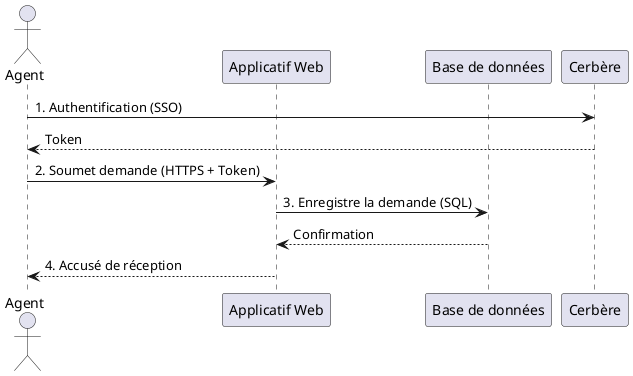

Voici le **Dossier d'Architecture Technique (DAT)** pour **SIREINES** selon le modèle **C4 (Simon Brown)**, basé uniquement sur les extraits documentaires fournis.

---

**[TOC]**

# **DAT – SIREINES**
*Base de données de suivi des demandes de qualification des agents*

---

## **1. Introduction et objectifs**
**Vue d'ensemble fonctionnelle** :
SIREINES est une base de données maintenue par la **DRI/AST4** (Mission des Compétences Scientifiques et Techniques) qui :
- Recense les **demandes de qualification** des agents par les comités de domaine.
- Suit l'**évolution** de ces demandes et coordonne leur **évaluation**.
- Informe les agents des **suites données** à leurs demandes.

**Objectifs de qualité** (orientés utilisateur) :
1. **Disponibilité** : Accès continu pour les agents et comités (objectif : 99,5% de SLA).
2. **Intégrité des données** : Traçabilité des évaluations et décisions (audit complet).
3. **Sécurité** : Accès restreint via **Cerbère** (authentification centralisée).
4. **Maintenabilité** : Architecture conteneurisée (Docker) pour des mises à jour simplifiées.
5. **Portabilité** : Déploiement possible en **local (Docker)** ou sur **IAAS** (cloud interne).

---

## **2. Niveau 1 — Vue Contexte (System Context)**
### **Diagramme C4-L1**
```plantuml
@startuml SIREINES_Context
!include https://raw.githubusercontent.com/plantuml-stdlib/C4-PlantUML/master/C4_Context.puml

title **Contexte SIREINES – Niveau C4-L1**

Person(agent, "Agent", "Demande une qualification")
Person(comite, "Comité de domaine", "Évalue les demandes")
System(cerbere, "Cerbère", "Authentification centralisée")
System_Ext(bdd_externe, "Base de données externe", "Éventuelle interconnexion (non documentée)")

System_Boundary(sireines_boundary, "SIREINES") {
    System(sireines, "SIREINES", "Base de données + Applicatif web", "PostgreSQL 14 + Docker")
}

Rel(agent, sireines, "Soumet/consulte une demande", "HTTPS")
Rel(comite, sireines, "Évalue/valide une demande", "HTTPS")
Rel(sireines, cerbere, "Authentification", "OAuth2/SSO")
@enduml
```

### **Acteurs principaux**
| Acteur          | Objectif                                                                 |
|-----------------|--------------------------------------------------------------------------|
| **Agent**       | Soumettre une demande de qualification et suivre son état.             |
| **Comité**      | Évaluer les demandes et rendre un avis (qualification/ajournement).    |
| **Administrateur** | Maintenir l'application et superviser les accès (via PgAdmin 4).      |

### **Systèmes externes**
| Système       | Rôle                                                                 |
|---------------|----------------------------------------------------------------------|
| **Cerbère**   | Service d'authentification centralisé (SSO) pour les agents.        |
| **PgAdmin 4** | Outil de gestion de la base de données (intégré en conteneur Docker). |

---

## **3. Parties prenantes**
| Rôle                     | Attente principale                                                                 |
|--------------------------|------------------------------------------------------------------------------------|
| **DRI/AST4**             | Piloter le processus de qualification et garantir la traçabilité des décisions. |
| **Agents**               | Accès simple et sécurisé à leur dossier de qualification.                        |
| **Comités de domaine**   | Interface claire pour évaluer les demandes avec historique des avis.             |
| **Équipe technique (GTI)** | Maintenance, sauvegardes et supervision de l'infrastructure.                     |

---

## **4. Contraintes**
### **Techniques**
- **Environnement** : Déploiement possible en **local (Docker Desktop)** ou sur **IAAS (OpenStack ECO4)**.
- **Stack obligatoire** :
  - **Docker** (3 conteneurs : applicatif, BDD, PgAdmin).
  - **PostgreSQL 14.1-alpine** (base de données).
  - **PgAdmin 4 v8+** (gestion BDD).
  - **Visual Studio Code** (avec extensions Docker/Dev Containers).
- **Prérequis poste de travail** :
  - WSL 2 (Windows) + `wsl-updatex64.msi`.
  - Variables d'environnement pour **Prince** (génération PDF).

### **Organisationnelles**
- **Accès restreint** : Les données sont sensibles (qualifications des agents).
- **Processus de livraison** :
  - **Recette locale** (Docker) avant déploiement sur IAAS.
  - Validation par la DRI/AST4 avant mise en production.

### **Réglementaires (D-I-C-T)**
| Exigence       | Détail                                                                 |
|----------------|------------------------------------------------------------------------|
| **Disponibilité** | Sauvegardes quotidiennes (dumps PostgreSQL cryptés en AES-256).       |
| **Intégrité**    | Journalisation des modifications (qui, quand, quoi).                  |
| **Confidentialité** | Accès limité aux comités et administrateurs (via Cerbère).          |
| **Traçabilité**  | Historique complet des demandes et décisions (audit).                |

---

## **5. Niveau 2 — Vue Conteneurs (Containers)**
### **Diagramme C4-L2**
```plantuml
@startuml SIREINES_Containers
!include https://raw.githubusercontent.com/plantuml-stdlib/C4-PlantUML/master/C4_Container.puml

title **Conteneurs SIREINES – Niveau C4-L2**

Person(agent, "Agent", "")
Person(comite, "Comité", "")

System_Boundary(sireines_boundary, "SIREINES (Docker)") {
    Container(app, "Applicatif Web", "Python/Flask (?)", "Gère les demandes et workflows")
    ContainerDb(db, "Base de données", "PostgreSQL 14.1-alpine", "Stocke les demandes et décisions")
    Container(pgadmin, "PgAdmin 4", "dpage/pgadmin4", "Interface de gestion BDD")
}

System_Ext(cerbere, "Cerbère", "Authentification")

Rel(agent, app, "Soumet/consulte", "HTTPS")
Rel(comite, app, "Évalue", "HTTPS")
Rel(app, db, "Lit/écrit", "SQL")
Rel(app, cerbere, "Authentifie", "OAuth2")
Rel(pgadmin, db, "Administer", "SQL")
@enduml
```

### **Description des conteneurs**
| Conteneur                     | Responsabilité                                                                 | Technologie               | Persistance          |
|-------------------------------|-------------------------------------------------------------------------------|---------------------------|----------------------|
| **sireines_app_usine_container** | Frontend + backend (logique métier, API).                                    | Python/Flask (?)          | Sans état            |
| **sireines_db_usine_container** | Stockage des demandes, décisions, et métadonnées.                            | PostgreSQL 14.1-alpine    | Volume Docker        |
| **sireines_pgadmin_container**  | Interface d'administration de la BDD (accès réservé aux admins).            | PgAdmin 4 (dpage/pgadmin4)| Sans état            |

### **Décisions architecturales**
- **Monolithe conteneurisé** :
  - L'applicatif et la BDD sont séparés mais déployés ensemble via Docker Compose.
  - Choix justifié par la simplicité de maintenance et la taille modeste du projet.
- **PgAdmin intégré** :
  - Conteneur dédié pour éviter d'installer PgAdmin sur chaque poste admin.
- **Authentification externalisée** :
  - Délégation à **Cerbère** pour centraliser la gestion des accès.

### **Environnement technique**
| Composant          | Version/Détail                                                                 |
|--------------------|-------------------------------------------------------------------------------|
| **Docker**         | Docker Desktop + WSL 2 (Windows) ou natif (Linux).                          |
| **Base de données**| PostgreSQL 14.1-alpine (image officielle).                                   |
| **Outils Dev**     | VS Code + extensions Docker/Dev Containers.                                   |
| **CI/CD**          | Non documenté (à compléter).                                                   |
| **Tests**          | Non documenté (à compléter).                                                   |

---

## **6. Niveau 3 — Vue Composants (Components)**
*Non applicable dans les extraits fournis.* SIREINES semble être une application simple avec :
- Un **frontend** (non détaillé) pour la saisie/consultation.
- Un **backend** (Python/Flask ?) pour la logique métier.
- Une **BDD PostgreSQL** pour le stockage.

*→ À compléter si accès au code source.*

---

## **7. Niveau 4 — Vue Code (Code)**
*Non détaillé.* Les extraits ne mentionnent pas :
- La structure du code (répertoire, classes).
- Les diagrammes de classes ou ERD.

*→ Référence possible :*
- Schéma de la BDD (tables `demandes`, `decisions`, `agents`, etc.).
- Scripts SQL dans `sireines_pgadmin/`.

---

## **8. Vue Exécution (Scénarios)**
### **Scénario 1 : Soumission d'une demande par un agent**


### **Scénario 2 : Évaluation par un comité**
1. Le comité se connecte via **Cerbère**.
2. L'applicatif liste les demandes en attente (requête SQL sur `DB`).
3. Le comité saisit une décision (qualification/ajournement).
4. La `DB` enregistre la décision avec un horodatage et l'identifiant du membre du comité.

---

## **9. Vue Déploiement**
### **Environnements**
| Environnement | Hébergement               | Serveurs                     | Réseau               | Particularités                          |
|---------------|---------------------------|------------------------------|----------------------|-----------------------------------------|
| **Développement** | Poste local (Docker)   | Docker Desktop + WSL 2       | Localhost            | Fichiers dans `C:/sireines/`           |
| **Recette**    | IAAS (OpenStack ECO4)     | Tenant `pnm3`                | VPN ministériel      | Test avant production.                  |
| **Production** | IAAS (OpenStack ECO4)     | Tenant `pnm3` (cluster Nginx)| DMZ interne          | Sauvegardes automatisées.               |

### **Diagramme C4-Déploiement**
```plantuml
@startuml SIREINES_Deployment
!include https://raw.githubusercontent.com/plantuml-stdlib/C4-PlantUML/master/C4_Deployment.puml

Deployment_Node(cloud, "Cloud ECO4 (OpenStack)", "Tenant pnm3") {
    Deployment_Node(nginx, "Nginx Cluster", "Load Balancer") {
        Container(app, "SIREINES App", "Docker", "Applicatif Web")
    }
    Deployment_Node(db_node, "Base de données", "PostgreSQL") {
        ContainerDb(db, "SIREINES DB", "PostgreSQL 14.1", "Données métier")
        Container(pgadmin, "PgAdmin 4", "Docker", "Admin BDD")
    }
}

Deployment_Node(local, "Poste de travail", "Windows/Linux + Docker") {
    Container(app_local, "SIREINES App", "Docker", "Dev/Recette locale")
    ContainerDb(db_local, "SIREINES DB", "PostgreSQL 14.1", "Données test")
    Container(pgadmin_local, "PgAdmin 4", "Docker", "Admin BDD")
}

Rel(nginx, app, "Route le trafic", "HTTP/HTTPS")
Rel(app, db, "Requêtes SQL", "JDBC")
Rel(pgadmin, db, "Administer", "SQL")
@enduml
```

### **Supervision**
- **Outils** :
  - **Portainer** (gestion des conteneurs).
  - **Prometheus/Grafana** (métriques).
  - **PSIN** (supervision ministérielle).
- **Alertes** :
  - Disponibilité de la BDD.
  - Espace disque des volumes Docker.

### **Sauvegardes**
- **Fréquence** : Quotidienne.
- **Cibles** :
  - Stockage objet **B3** (IaaS ministériel).
  - **Outscale SecNumCloud** (via GTI).
  - **Google Cloud** (via GTI).
- **Format** : Dumps PostgreSQL cryptés (AES-256).

---

## **10. Sujets transverses**
| Sujet               | Implémentation                                                                 |
|---------------------|-------------------------------------------------------------------------------|
| **Authentification** | Déléguée à **Cerbère** (SSO/OAuth2).                                         |
| **Journalisation**   | Logs applicatifs + logs PostgreSQL (centralisés via Loki ?).                |
| **Gestion des erreurs** | Pages d'erreur personnalisées + notifications aux admins.                |
| **API**             | Non documentée (à compléter).                                                 |

---

## **11. Exigences de qualité**
| Exigence          | Scénario de validation                                          |
|-------------------|-----------------------------------------------------------------|
| **Disponibilité** | Vérifier l'accessibilité 24/7 (sonde HTTP sur `/health`).      |
| **Sécurité**      | Test d'intrusion (OWASP ZAP) sur les endpoints publics.       |
| **Traçabilité**   | Auditor un cas de demande du début à la décision finale.       |

---

## **12. Risques et dettes techniques**
| Risque/Dette                     | Impact                          | Mesure corrective                     |
|---------------------------------|---------------------------------|---------------------------------------|
| **Dépendance à Cerbère**        | Indisponibilité si Cerbère tombe. | Mécanisme de fallback (auth locale). |
| **Pas de CI/CD documenté**      | Livraisons manuelles risquées.  | Automatiser avec GitLab CI.          |
| **Sauvegardes non testées**     | Perte de données en cas de panne. | Tests de restauration trimestriels. |

---

## **13. Annexes**
### **Glossaire**
| Terme          | Définition                                                                 |
|----------------|----------------------------------------------------------------------------|
| **Cerbère**    | Service d'authentification centralisé du ministère.                      |
| **Comité de domaine** | Groupe d'experts évaluant les demandes de qualification.              |
| **DRI/AST4**   | Direction des Ressources Immobilières / Mission Compétences Techniques. |

### **Décisions d'architecture (ADR)**
1. **Utilisation de Docker** :
   - *Décision* : Conteneuriser l'application pour simplifier les déploiements.
   - *Alternatives* : VM ou déploiement bare-metal (rejeté pour manque de flexibilité).

2. **Intégration de PgAdmin** :
   - *Décision* : Inclure PgAdmin dans un conteneur dédié pour éviter les installations locales.
   - *Risque* : Surface d'attaque élargie (mitigé par restriction réseau).

---
**↩ [Retour au sommaire](#dat--sireines)**

---
*Document généré à partir des extraits fournis. À compléter avec :*
- *Détails du code (backend/frontend).*
- *Schémas de la base de données.*
- *Procédures de CI/CD.*